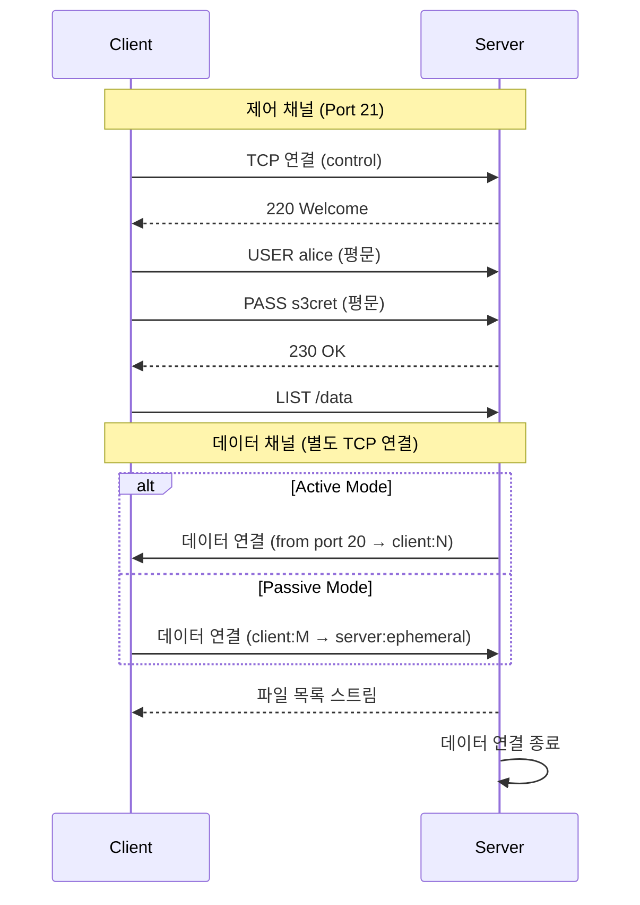
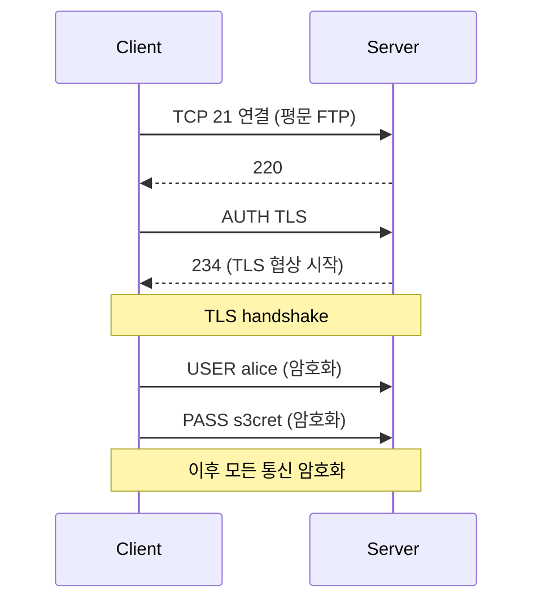
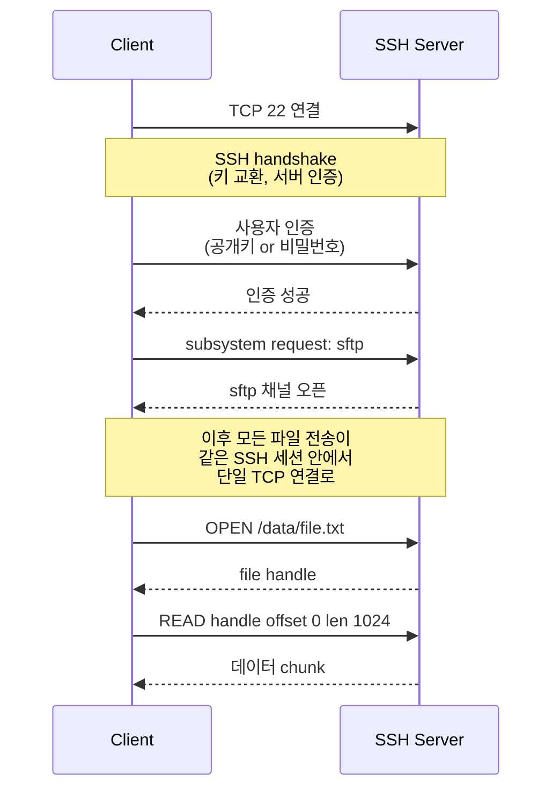

## 정의

세 가지 프로토콜 모두 *네트워크 파일 전송* 을 다루지만, 뿌리와 보안 모델이 완전히 다르다.

- **FTP** (File Transfer Protocol, [RFC 959](https://datatracker.ietf.org/doc/html/rfc959), 1985): 최초의 파일 전송 표준. 평문. **제어 채널 + 데이터 채널 이중 구조**.
- **FTPS** (FTP over TLS, [RFC 4217](https://datatracker.ietf.org/doc/html/rfc4217), 2005): FTP 를 TLS 로 감싼 형태. 인증서 기반 암호화. 여전히 이중 채널.
- **SFTP** (SSH File Transfer Protocol, SSH v2 계열): *FTP 와 무관한 별개 프로토콜*. SSH 세션 위의 파일 전송 서브시스템. **단일 채널** (포트 22).

**중요한 오해 방지**: SFTP 는 "Secure FTP" 의 약자 같지만 FTP 를 확장한 게 아니다. **완전히 다른 프로토콜**. FTPS 와 헷갈리지 말 것.

## 왜 세 개가 존재하는가

파일 전송 프로토콜의 진화:

1. **FTP (1971 - 1985)** - 인터넷 초창기에 설계. 방화벽 / NAT / 암호화 개념 자체가 없던 시절
2. **1990년대 중반** - 웹 상거래 확산 → 평문 자격증명 문제 심각화
3. **FTPS (2005)** - "기존 FTP 클라이언트/서버를 살리면서 암호화만 얹자"
4. **SFTP (2001)** - "차라리 SSH 위에 얹으면 방화벽/암호화/인증 문제가 다 해결"

FTPS 는 **하위 호환** 을 위한 진화, SFTP 는 **깨끗한 재설계**.

## FTP: 제어 + 데이터 이중 채널

### 이중 채널의 문제

**제어 채널 (Port 21)**: 로그인, 명령 (`LIST`, `RETR`, `STOR`), 응답 코드.
**데이터 채널**: 실제 파일 데이터 스트림. 별도 TCP 연결.

**Active Mode**:
- 클라이언트가 서버에게 "내 IP:포트 로 연결해라" 알림 (`PORT` 명령)
- 서버가 자기 포트 20 에서 클라이언트로 outbound 연결
- **문제**: 클라이언트가 방화벽/NAT 뒤에 있으면 서버가 도달 불가

**Passive Mode** (`PASV` / `EPSV`):
- 클라이언트가 `PASV` 로 "너 (서버) 가 대기해라" 요청
- 서버가 임의 ephemeral 포트를 열고 클라이언트에게 알림
- 클라이언트가 그 포트로 outbound 연결
- **문제**: 서버 방화벽이 ephemeral 포트 범위 (예: 30000-40000) 를 미리 열어야 함

### FTP 의 문제 (2020년대)

- **평문**: 자격증명 + 명령 + 데이터 모두 스니핑 가능
- **NAT / 방화벽 부적합**: 이중 채널, 동적 포트
- **깊이 검사 (DPI) 불가**: 암호화 후 이중 채널 추적 어려움
- **감사 어려움**: 로그 표준화 미비

**결론**: 신규 시스템은 FTP 를 쓰지 말 것. 레거시 (IoT 카메라, 낡은 POS, 과학 장비) 만 예외.

## FTPS: FTP + TLS

FTP 프로토콜을 그대로 두고 TLS 로 감쌈. 두 변종.

### Explicit FTPS (`AUTH TLS`, 표준)

- **표준 포트 21** 로 연결 후 `AUTH TLS` 명령으로 TLS 업그레이드
- 클라이언트/서버가 TLS 지원 여부 협상 가능
- 방화벽 / NAT 에서 21 만 알면 됨 (initial)

### Implicit FTPS (deprecated)

- **포트 990** 에 연결하는 순간부터 TLS (handshake 먼저)
- 협상 없음, TLS 필수
- 표준화 늦음 (RFC 아님), 지원 제한
- 신규 배포 안 함

### FTPS 의 남은 문제

FTP 문제 대부분 상속:
- **여전히 이중 채널** (제어 21 + 데이터 ephemeral)
- **여전히 방화벽 복잡** (passive 범위 열기)
- **인증서 관리** 부담 (발급, 갱신, 회전)
- **방화벽이 암호화된 제어 채널 검사 불가** → PORT/PASV 협상 추적 못함

## SFTP: SSH 파일 전송 서브시스템

전혀 다른 프로토콜. SSH v2 세션 안의 파일 전송 기능.

### SFTP 의 이점

- **단일 포트 (22)**: 방화벽 규칙 단순, NAT 문제 없음
- **암호화 필수**: SSH 자체가 암호화, 옵션 아님
- **인증서 관리 없음**: SSH 호스트 키만 관리
- **키 기반 인증** (SSH key): 공개키 pairing → 패스워드 없이 안전
- **다른 SSH 도구와 통합**: `scp`, `rsync -e ssh`, VS Code Remote SSH 등이 같은 채널 활용
- **표준 서브시스템**: sshd 만 있으면 됨 (별도 SFTP 서버 프로세스 X)

### SFTP 파일 조작 API

SFTP 는 파일시스템 수준 API 를 제공:

| 명령 | 의미 |
|:---|:---|
| `OPEN` / `CLOSE` | 파일 열기/닫기 |
| `READ` / `WRITE` (offset 기반) | 임의 위치 read/write |
| `STAT` / `LSTAT` / `FSTAT` | 파일 메타 |
| `SETSTAT` / `FSETSTAT` | 권한/타임스탬프 변경 |
| `OPENDIR` / `READDIR` | 디렉토리 리스트 |
| `MKDIR` / `RMDIR` | 디렉토리 생성/삭제 |
| `REMOVE` / `RENAME` | 파일 삭제/이름 변경 |
| `SYMLINK` / `READLINK` | 심볼릭 링크 |

FTP 는 명령이 훨씬 원시적 (`RETR`, `STOR`, `LIST` 정도). SFTP 가 훨씬 풍부.

## 3자 비교

| 축 | **FTP** | **FTPS** | **SFTP** |
|:---|:---|:---|:---|
| **기반 프로토콜** | FTP (RFC 959) | FTP + TLS | SSH v2 |
| **연도** | 1971 / 1985 | ~1997 (RFC 2228) | ~2001 |
| **암호화** | **없음** (평문) | TLS (협상) | SSH 내장 (필수) |
| **인증** | Username + password | Username + password + 서버 인증서 | Username + password 또는 **SSH 키** |
| **포트** | 21 (제어) + 20/ephemeral (데이터) | 21 + ephemeral (explicit) / 990 + 989 (implicit) | **22** (단일) |
| **채널 구조** | 이중 (제어 + 데이터) | 이중 | 단일 |
| **방화벽 친화도** | 낮음 (passive 범위 필요) | 낮음 (FTP 상속) | **높음** (단일 포트) |
| **NAT 통과** | 어려움 | 어려움 | 쉬움 |
| **인증서 관리** | 없음 | **필요** (X.509) | 없음 (SSH host key) |
| **키 기반 인증** | X | X (인증서와 별개) | **O** (표준) |
| **파일 API** | 원시 (retrieve/store) | 원시 | 풍부 (POSIX 유사) |
| **감사** | 어려움 | 어려움 | SSH 감사 도구 활용 |

## 현대 (2026) 선택 지침

| 요구 | 답 |
|:---|:---|
| **신규 프로젝트 파일 전송 표준** | **SFTP** (단일 포트, 키 인증, 어디서든 지원) |
| **파트너/벤더가 FTPS 요구** | Explicit FTPS |
| **레거시 시스템 (IoT 카메라 등) 만 지원 FTP** | Plain FTP + 격리 네트워크, 자격증명은 항상 유출 가정 |
| **HTTP 이미 사용** | HTTPS + 서명된 URL (S3 presigned 등) |
| **관리형이 필요** | AWS Transfer Family (SFTP/FTPS/FTP 모두 지원), Azure File Transfer, GCP Storage Transfer |

## AWS 에서

**AWS Transfer Family** 가 세 프로토콜 모두 관리형으로 제공:

- **SFTP endpoint** → [[aws-s3|S3]] / EFS 백엔드
- **FTPS endpoint** → 같은
- **FTP endpoint** → VPC 내부 전용 (인터넷 노출 안 하는 게 좋음)
- 사용자는 IAM / Directory Service / Cognito / Lambda 로 인증
- 파일 hooks (Lambda 트리거)

**대안**:
- **[[aws-s3|S3]] Presigned URL**: HTTPS 로 직접. 프로토콜 신경 X
- **[[aws-storage-gateway|Storage Gateway]] File Gateway**: 온프렘 NFS/SMB → S3

## 자주 나오는 실수

> [!WARNING]
> **"SFTP = Secure FTP" 오해**. SFTP 는 FTP 와 무관한 프로토콜. FTP 관련 도구 / 방화벽 규칙 / 프록시가 SFTP 에는 안 통함.

> [!CAUTION]
> **FTPS 인증서 만료 방치** = 갑자기 연결 실패. Let's Encrypt 자동 갱신이나 ACM 통합 검토.

> [!WARNING]
> **FTP passive mode 포트 범위 방화벽 열지 않음** = passive 연결 실패. 서버가 `PASV_MIN_PORT`-`PASV_MAX_PORT` 로 알려주는 범위를 통째로 방화벽에 허용해야 함.

> [!IMPORTANT]
> **SFTP 는 SSH 를 그대로 물려받음**. SSH 서버 취약점 = SFTP 취약점. OpenSSH 최신 유지 필수.

> [!CAUTION]
> **키 기반 인증 미사용 SFTP** = 그냥 패스워드 SSH. 유출 시 완전 노출. `authorized_keys` + 패스워드 인증 비활성 (`PasswordAuthentication no`).

> [!WARNING]
> **FTP 를 인터넷에 노출** = 자격증명 스니핑 위험. 격리 네트워크에서만, 그마저도 자격증명은 rotate + 최소 권한.

> [!IMPORTANT]
> **implicit FTPS (port 990) 는 사실상 deprecated**. 신규는 explicit FTPS (port 21 + `AUTH TLS`) 또는 SFTP.

## 관련 위키

- [[tcp|TCP]] - 세 프로토콜의 기반
- [[tls|TLS]] - FTPS 암호화
- [[aws-s3|AWS S3]] - Presigned URL 대안
- [[aws-storage-gateway|AWS Storage Gateway]] - 하이브리드 파일 전송
