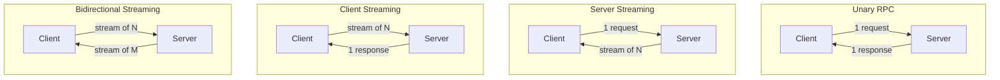
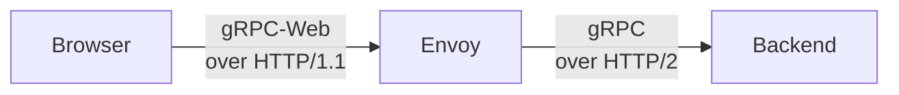
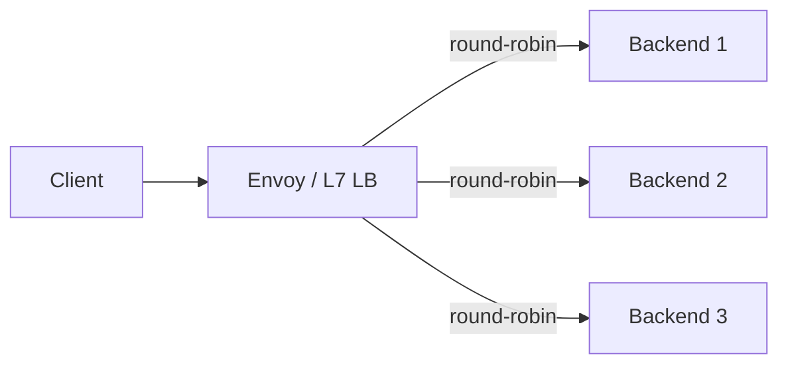

## 정의

**gRPC** 는 *HTTP/2 위에서 Protobuf 직렬화* 로 동작하는 *고성능 RPC 프레임워크*. Google 내부 *Stubby* 의 오픈소스 후계.

핵심 4가지:

1. **Protobuf**: IDL + binary 직렬화 (JSON 대비 *수배 작고 빠름*)
2. **HTTP/2**: multiplexing + binary framing
3. **Streaming 4종**: unary, server-stream, client-stream, bidi
4. **Code generation**: `.proto` → 다국어 stub 자동 생성

## Proto 정의

```protobuf
syntax = "proto3";
package shop.v1;

service Shop {
  // Unary: 1 req → 1 res
  rpc GetItem(GetItemRequest) returns (Item);

  // Server streaming: 1 req → N res
  rpc ListItems(ListRequest) returns (stream Item);

  // Client streaming: N req → 1 res
  rpc UploadEvents(stream Event) returns (UploadAck);

  // Bidirectional: N req ↔ N res
  rpc Chat(stream Message) returns (stream Message);
}

message Item {
  string id = 1;
  string name = 2;
  int32 price_cents = 3;
}
```

## 4가지 Streaming 패턴



| 패턴 | 사용 |
|---|---|
| Unary | 일반 API |
| Server stream | 라이브 피드, log tail, 실시간 시세 |
| Client stream | 파일 업로드, 이벤트 일괄 전송 |
| Bidi stream | 채팅, 게임, 협업 |

## HTTP/2 위 동작

```anim:http2-multiplexing
{}
```

```http
:method = POST
:scheme = https
:path = /shop.v1.Shop/GetItem
:authority = api.example.com
content-type = application/grpc
grpc-encoding = gzip
grpc-accept-encoding = identity,deflate,gzip
grpc-timeout = 1S

<protobuf-encoded body>
```

각 RPC = HTTP/2 *stream 하나*. *Trailers* 로 `grpc-status`, `grpc-message` 전달.

## Status Code

| 코드 | 의미 |
|---|---|
| 0 OK | 성공 |
| 1 CANCELLED | 클라이언트가 cancel |
| 2 UNKNOWN | 정체불명 에러 |
| 3 INVALID_ARGUMENT | 입력 오류 |
| 4 DEADLINE_EXCEEDED | timeout |
| 5 NOT_FOUND | 리소스 없음 |
| 6 ALREADY_EXISTS | 중복 |
| 7 PERMISSION_DENIED | 권한 |
| 8 RESOURCE_EXHAUSTED | quota 초과 |
| 9 FAILED_PRECONDITION | 사전조건 위배 |
| 10 ABORTED | 동시성 충돌 |
| 11 OUT_OF_RANGE | 범위 외 |
| 12 UNIMPLEMENTED | 구현 안됨 |
| 13 INTERNAL | 내부 에러 |
| 14 UNAVAILABLE | 일시 불가, *retry 권장* |
| 15 DATA_LOSS | 손실 |
| 16 UNAUTHENTICATED | 인증 실패 |

> [!IMPORTANT]
> *UNAVAILABLE (14)* 만 retry 안전. *DEADLINE_EXCEEDED (4)* 는 *side effect 가 발생했을 수* 있어 *idempotent operation* 만 retry.

## Deadline (timeout)

```python
# Python
response = stub.GetItem(req, timeout=1.0)  # 1초

# 또는 metadata
metadata = (("grpc-timeout", "1S"),)
```

> 클라이언트의 deadline 은 *서버에 전파 (header)*. 서버가 더 깊은 RPC 를 부르면 *남은 deadline 만 전달*. *분산 timeout chaining*.

## gRPC vs REST

| 항목 | gRPC | REST |
|---|---|---|
| Wire 포맷 | Binary (Protobuf) | Text (JSON) |
| 크기 | *수배 작음* | 크다 |
| Schema | *IDL 필수* | 옵션 (OpenAPI) |
| Streaming | *4 모드* | SSE / WebSocket 별도 |
| 브라우저 직접 호출 | grpc-web 필요 | *기본 지원* |
| Debugging | 도구 필요 | curl 가능 |
| 캐싱 | 직접 구현 | HTTP cache |
| Mobile / IoT | *유리* | OK |

> *내부 microservice 통신* → gRPC. *외부 public API* → REST/GraphQL.

## gRPC-Web

브라우저는 HTTP/2 trailer 미지원 → *Envoy / proxy* 가 *gRPC ↔ gRPC-Web* 변환:



## 흔한 함정

> [!WARNING]
> 1. **Field number 재사용** = proto 의 *tag 번호* 가 *wire format 의 identity*. 한 번 쓴 번호 *영구히 reserved*.
> 2. **`required` 필드** = proto2 의 *legacy*. proto3 는 *모든 필드가 optional 류*. *`required` 사용 금지*.
> 3. **string vs bytes** = string 은 *UTF-8 검증*. binary 데이터는 *bytes*.
> 4. **stream 의 *완료 표시*** = 클라이언트 stream 은 *반드시 half-close (closeSend)* 해야 서버가 finalize.

## Interceptor (미들웨어)

```python
# Python: 서버 interceptor, 인증 검사
class AuthInterceptor(grpc.ServerInterceptor):
    def intercept_service(self, continuation, handler_call_details):
        metadata = dict(handler_call_details.invocation_metadata)
        if metadata.get('authorization') != 'Bearer valid-token':
            def deny(request, context):
                context.abort(grpc.StatusCode.UNAUTHENTICATED, 'Invalid token')
            return grpc.unary_unary_rpc_method_handler(deny)
        return continuation(handler_call_details)
```

> *Interceptor = gRPC 의 미들웨어*. 인증, 로깅, 메트릭, retry 등 횡단 관심사 처리. 체인 가능.

## Metadata (Header 역할)

```python
# 클라이언트: metadata 전송
metadata = [
    ('request-id', 'abc-123'),
    ('x-tenant-id', 'org-1'),
]
response = stub.GetItem(req, metadata=metadata)

# 서버: metadata 수신
def GetItem(self, request, context):
    md = dict(context.invocation_metadata())
    tenant = md.get('x-tenant-id')
    ...
```

> *Metadata = HTTP 헤더 역할*. 요청마다 전달되며 Interceptor 에서도 읽기 가능.

## Health Check Protocol

```protobuf
// grpc.health.v1.Health 표준
service Health {
  rpc Check(HealthCheckRequest) returns (HealthCheckResponse);
  rpc Watch(HealthCheckRequest) returns (stream HealthCheckResponse);
}
```

```yaml
# K8s 1.24+ 네이티브 gRPC probe
livenessProbe:
  grpc:
    port: 50051
    service: shop.v1.Shop
  initialDelaySeconds: 5
```

```bash
grpc_health_probe -addr=:50051 -service=shop.v1.Shop
```

## Load Balancing



HTTP/2 multiplexing 때문에 *TCP 레벨 (L4) LB 는 단일 서버로 몰림*. L7 LB 또는 클라이언트 사이드 LB 필요.

| 방식 | 설명 | 사용 |
|---|---|---|
| 클라이언트 사이드 | DNS 조회 후 round-robin | gRPC core 기본 지원 |
| Envoy proxy | sidecar 패턴, Istio | 서비스 메시 환경 |
| K8s HeadlessService | Pod IP 직접 노출 | 클라이언트 LB 와 조합 |

## ConnectRPC (gRPC 대안)

> *ConnectRPC* (buf.build) = HTTP/1.1, HTTP/2 모두 지원. curl 로 테스트 가능. gRPC 호환. 브라우저 직접 호출 (grpc-web proxy 불필요). 2026 시점 생태계 성장 중.

## 관련 위키

- [[HTTP/2]]
- [[REST API Design]]
- [[GraphQL]]
- [[Microservices]]
- [[load-balancer]]
- [[jsonrpc-vs-grpc]]
