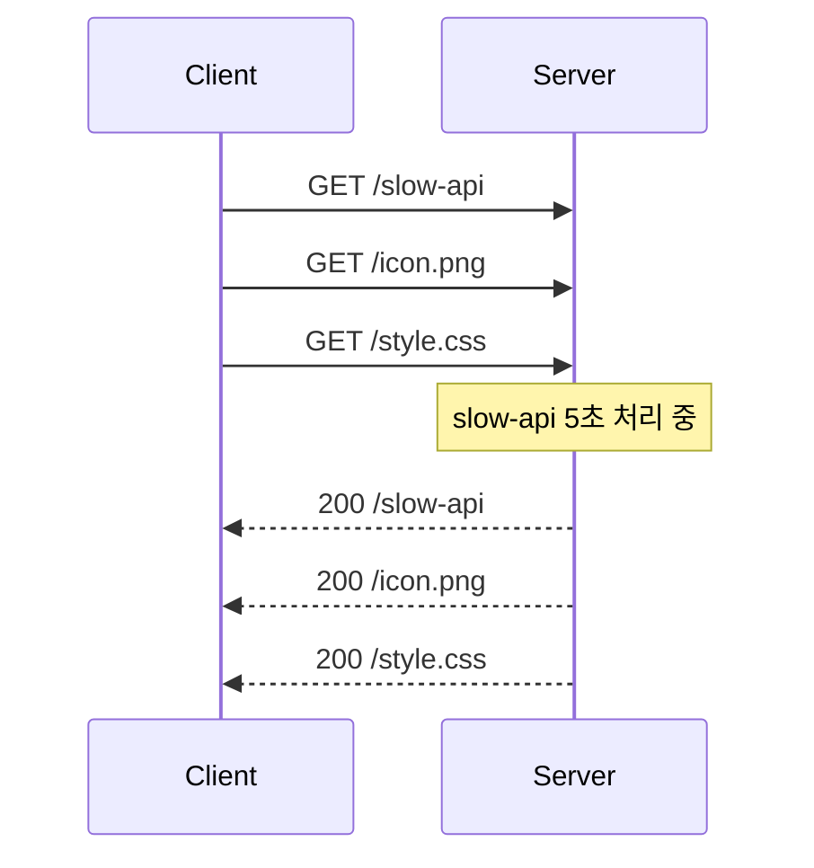
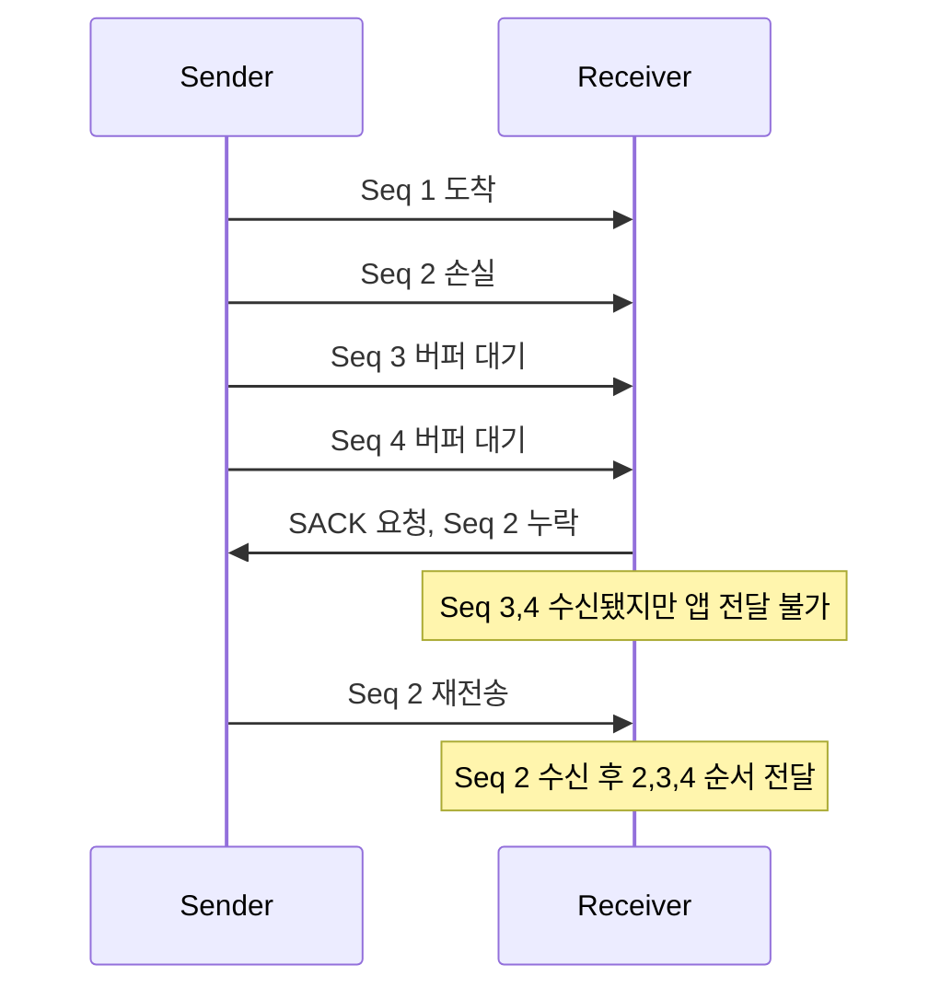
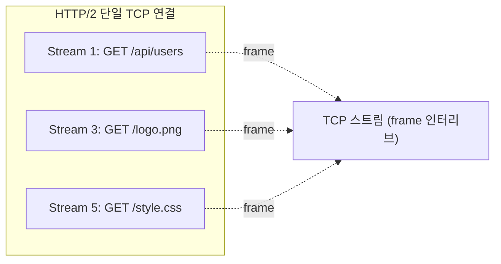
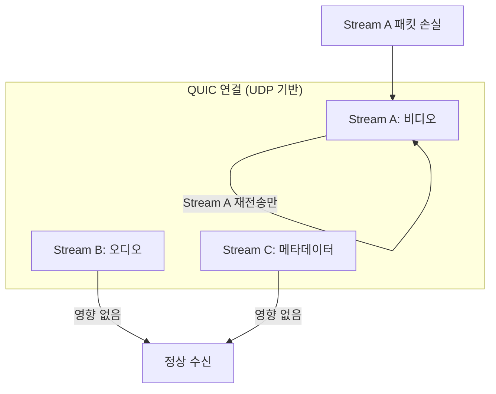

## 정의

**Head-of-Line Blocking (HOLB)** 은 처리 순서가 정해진 큐에서 **맨 앞 항목의 지연이 그 뒤 항목 전체의 지연으로 전파되는 현상**이다.

네트워크 프로토콜에서는 HTTP, TCP 두 계층 모두에서 발생할 수 있으며, HTTP 버전에 따라 해결 범위가 다르다.

## HTTP/1.1 의 HOL Blocking

HTTP/1.1 은 pipelining 을 통해 한 TCP 연결에서 여러 요청을 연속 전송할 수 있지만, 응답은 반드시 **요청 순서대로** 반환해야 한다.



`/icon.png` 와 `/style.css` 는 즉시 응답 가능해도 `/slow-api` 가 끝날 때까지 대기해야 한다.

브라우저가 도메인당 6개 TCP 연결을 병렬 유지하는 이유: HOL 영향을 연결별로 분산하기 위함.

## TCP 레벨 HOL Blocking

[[TCP]] 는 순서 보장을 위해 수신 버퍼에서 **순서대로만** 애플리케이션에 전달한다. 중간 패킷이 손실되면 이미 수신된 후속 패킷들도 버퍼에 묶인다.



TCP 재전송 타임아웃(RTO) 이 길수록, 손실율이 높은 네트워크일수록 이 대기가 길어진다.

### 재전송 큐와 버퍼 팽창

TCP 의 HOL 이 심각해지는 조건:

1. **높은 RTT 환경**: RTO = 2 x RTT 기본값. RTT 가 100ms 면 RTO 200ms 이상
2. **무선 환경 손실**: WiFi, LTE 에서 패킷 손실율 2% 이상이면 TCP HOL 체감 심화
3. **Bufferbloat**: 중간 라우터 버퍼가 과잉 증가 → 큐잉 지연이 HOL 효과를 증폭
4. **Fast Retransmit**: 3개 중복 ACK 로 RTO 없이 즉시 재전송 가능하지만 HOL 은 그대로

## HTTP/2 가 해결한 것과 해결 못한 것

HTTP/2 의 **스트림 멀티플렉싱** 은 HTTP 레벨 HOL 을 해결한다. 단일 TCP 연결에서 stream ID 로 구분된 frame 을 인터리브해 송수신한다.



그러나 **TCP 레벨의 HOL Blocking 은 여전히 남는다**. 한 TCP 패킷 손실 시, 손실된 패킷이 어느 스트림에 속하든 TCP 는 해당 연결의 모든 스트림을 블로킹한다.

| 수준 | HTTP/1.1 | HTTP/2 | HTTP/3 (QUIC) |
|:---|:---|:---|:---|
| HTTP 레벨 HOL | 있음 | **없음** | 없음 |
| TCP 레벨 HOL | 있음 | **있음** | 해당 없음 |
| 연결당 동시 스트림 | 1 (pipelining) | 다수 | 다수 |
| 손실 환경 성능 | 낮음 | **HTTP/1.1 보다 낮을 수 있음** | 높음 |

> [!WARNING]
> 패킷 손실율이 높은 환경(WiFi, 이동통신)에서는 HTTP/2 가 HTTP/1.1 여러 병렬 연결보다 **오히려 느릴 수 있다**. 단일 TCP 연결에서 HOL 이 발생하면 멀티플렉싱된 모든 스트림이 동시에 블로킹되기 때문이다.

## [[QUIC]] 가 해결한 것

QUIC 은 UDP 위에서 각 스트림이 **독립적인 전송 제어** 를 갖는다. 한 스트림의 패킷 손실은 다른 스트림에 영향을 미치지 않는다.



각 스트림은 자체 시퀀스 번호와 ACK 를 관리하므로, 스트림 간 의존성이 없다.

```
QUIC 연결 내부
  Stream 1 (seq: 0-100, ACK: 87)
    └── seq 88 손실 → Stream 1 만 재전송 대기
  Stream 2 (seq: 0-50, ACK: 50) → 계속 진행
  Stream 3 (seq: 0-30, ACK: 30) → 계속 진행
```

[[HTTP/3]] 은 QUIC 위에서 동작하며, TCP 의 HOL Blocking 을 근본적으로 해결한다.

### QUIC Connection Migration

[[QUIC]] 는 HOL 해결 외에도 Connection ID 기반으로 IP/Port 변경 시에도 기존 연결을 유지한다. 와이파이에서 셀룰러로 전환해도 TCP 처럼 연결이 끊기지 않는다.

## HOL 의 영향 측정

HOL 의 영향은 패킷 손실율과 RTT 에 따라 크게 달라진다.

### 손실율별 최대 throughput 저하 (이론적 추정)

| 패킷 손실율 | TCP 단일 연결 | HTTP/2 (30 streams) | HTTP/3 (QUIC) |
|:---|:---|:---|:---|
| 0% | 기준 | 기준 | 기준 |
| 0.1% | -5% 내외 | -15% 내외 | -1% 내외 |
| 1% | -20% 내외 | -40% 내외 | -3% 내외 |
| 2% | -40% 내외 | -60% 내외 | -5% 내외 |

HTTP/2 의 멀티플렉싱 특성상 스트림이 많을수록 HOL 에 의한 cascading 블로킹 효과가 커진다.

### 실제 관찰 지표

```bash
# 패킷 손실율 측정
ping -c 100 8.8.8.8 | tail -2

# TCP 재전송율 확인
netstat -s | grep retransmit
ss -s

# tcpdump 로 TCP retransmit 관찰
tcpdump -i eth0 'tcp[tcpflags] & tcp-push != 0' -nn
```

## 실전 예시

### 브라우저 6-연결 전략 (HTTP/1.1 시대)

Chrome 등 브라우저는 도메인당 최대 6개의 TCP 연결을 유지해 HOL 를 병렬 분산시켰다.

**Domain Sharding**: `static1.example.com`, `static2.example.com` 등 서브도메인으로 리소스를 분산해 연결 한도를 우회하는 기법. HTTP/1.1 최적화였지만 HTTP/2 이후에는 오히려 TLS 핸드셰이크 오버헤드만 키운다.

### HTTP/3 채택 현황

Cloudflare, Fastly 등 CDN:
- 클라이언트 to 엣지: HTTP/3 (QUIC) 우선 사용
- 엣지 to 오리진: HTTP/2 또는 HTTP/3

클라이언트 쪽 HOL 는 QUIC 으로 해결하고, 신뢰할 수 있는 데이터센터 네트워크에서는 HTTP/2 도 무방하다.

### 고성능 게임 / 실시간 스트리밍

TCP 기반 게임에서 패킷 손실로 전체 화면이 멈추는 현상(stutter) 이 발생할 수 있다. UDP 기반 자체 프로토콜이나 WebRTC DataChannel 로 게임 state, 오디오, 채팅을 독립 스트림으로 처리.

## 계층별 비교표

| 프로토콜 | HOL 발생 계층 | 해결 방법 | 비고 |
|:---|:---|:---|:---|
| HTTP/1.1 pipelining | HTTP + TCP 모두 | 6개 병렬 연결 | 브라우저 기본 동작 |
| HTTP/2 | TCP 레벨만 | QUIC 전환 | 손실 환경에서 취약 |
| HTTP/3 (QUIC) | 없음 | - | UDP 방화벽 차단 주의 |
| WebSocket | TCP 레벨 | - | 장기 연결이므로 영향 누적 |
| gRPC + HTTP/2 | TCP 레벨 | gRPC over QUIC | 실험적 지원 |

## SACK (Selective ACK) 으로 HOL 부분 완화

기본 TCP 는 손실 패킷 이후 모든 것을 재전송해야 했지만, **SACK (RFC 2018)** 은 수신된 비연속 구간을 명시해 실제로 손실된 것만 재전송하게 한다.

```
Without SACK:
  Sender → Receiver: 1, 2, 3, 4, 5
  2번 손실 → 2, 3, 4, 5 모두 재전송

With SACK:
  Receiver → Sender: ACK 2 요청, SACK [3-5 수신됨]
  → 2 만 재전송
```

SACK 은 HOL 을 제거하지는 않지만 **재전송 데이터양을 줄여** 블로킹 시간을 단축한다. 현대 운영체제는 기본적으로 SACK 을 활성화한다.

## 다른 사례

HOL Blocking 은 네트워크 외 일반 큐 처리 시스템에서도 발생한다.

- **데이터베이스 단일 큐 워커**: 앞 작업이 느리면 뒤 작업 전체 블로킹
- **Kafka 파티션**: 파티션 내 메시지는 순서 보장, 파티션 간은 독립 처리
- **멀티스레드 ordered 결과 병합**: 스레드 풀 결과를 순서대로 머지하는 단계에서 발생
- **데이터베이스 MVCC**: 장시간 트랜잭션이 vacuum 프로세스를 블로킹

해결책은 보통 **독립 처리 단위로 분할** (sharding, partitioning, stream 격리).

### 스위치 레벨 HOL

네트워크 스위치에서도 같은 현상이 발생한다. 입력 포트에서 출력 포트로 패킷을 전달할 때, 출력 포트가 바쁘면 그 포트로 향하는 패킷이 큐의 앞을 차지해 다른 포트로 향하는 패킷을 블로킹한다.

**Virtual Output Queue (VOQ)** 는 출력 포트별로 별도 큐를 만들어 이를 해결하는 기법이다. 고성능 스위치에서 사용된다.

## 함정

> [!CAUTION]
> 1. **HTTP/2 = HOL 완전 해결?** HTTP 레벨만 해결. 패킷 손실 환경에서는 TCP HOL 이 HTTP/1.1 다중 연결보다 더 나쁠 수 있음.
> 2. **HTTP/3 = 항상 빠름?** UDP 차단 방화벽에서는 HTTP/2 fallback 발생. 기업 네트워크에서 HTTP/3 비율이 낮은 이유.
> 3. **연결 많으면 무조건 유리?** HTTP/2 이후에는 Domain Sharding 이 TLS 핸드셰이크 오버헤드만 가중.
> 4. **TCP HOL = 패킷 손실만?** Bufferbloat (버퍼 팽창) 도 큐잉 지연을 일으켜 유사 HOL 효과를 냄.
> 5. **RTT 낮으면 HOL 무관?** RTT 가 낮아도 손실율이 높으면 HOL 재전송 대기가 반복됨.

## 브라우저에서 HOL 체험

개발자 도구 Network 탭에서 HTTP/1.1 vs HTTP/2 의 차이를 직접 확인할 수 있다.

```bash
# HTTP/1.1 강제 (curl)
curl --http1.1 -o /dev/null -s -w "%{time_total}\n" https://example.com

# HTTP/2 사용 (기본)
curl -o /dev/null -s -w "%{time_total}\n" https://example.com

# HTTP/3 시도 (지원 시)
curl --http3 -o /dev/null -s -w "%{time_total}\n" https://example.com
```

Chrome DevTools: Network 탭 → Protocol 컬럼 활성화. `h2` (HTTP/2), `h3` (HTTP/3), `http/1.1` 구분 가능.

## 관련 위키

- [[QUIC]] - 스트림 격리로 TCP HOL 해결
- [[TCP]] - HOL Blocking 의 근원 계층
- [[HTTP/2]] - HTTP 레벨 HOL 해결
- [[HTTP/3]] - QUIC 기반, 완전 해결
- [[OSI 7 Layer]] - 계층별 문제 진단 기준
- [[websocket]] - WebSocket 도 TCP 기반, 장기 HOL 영향 받음
