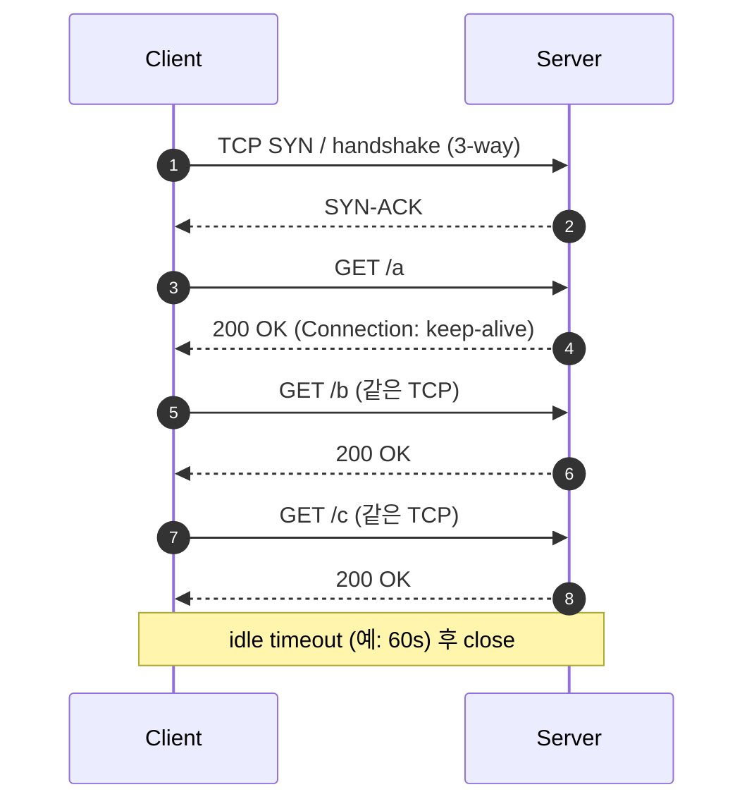
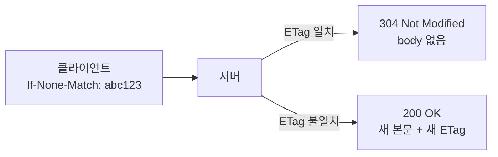

## 정의

**HTTP/1.1** (1997, [RFC 9112](https://datatracker.ietf.org/doc/html/rfc9112) 으로 재정리) 는 *텍스트 기반 stateless request/response 프로토콜*. 2026 시점에도 *대부분의 트래픽이 HTTP/1.1 + 일부 HTTP/2/3* 분포.

핵심 진화 (HTTP/1.0 대비):

| 기능 | HTTP/1.0 | HTTP/1.1 |
|---|---|---|
| 기본 연결 | *매 요청 새 TCP* | *Persistent (keep-alive)* |
| Host 헤더 | 옵션 | *필수* (가상호스팅) |
| Chunked transfer | 없음 | *있음* |
| 캐시 제어 | `Expires` | `Cache-Control` |
| 부분 요청 | 없음 | *Range / 206 Partial Content* |

## 메시지 구조

```anim:http-request
{}
```

```http
GET /api/users/42 HTTP/1.1
Host: api.example.com
User-Agent: curl/8.1
Accept: application/json

```

```http
HTTP/1.1 200 OK
Content-Type: application/json
Content-Length: 42
Connection: keep-alive

{"id":42,"name":"koa","tier":"pro"}
```

## Keep-Alive (Persistent Connection)

```anim:http1-keep-alive
{}
```

`Connection: keep-alive` 헤더로 *TCP 연결 재사용*. 한 연결에서 *여러 요청/응답*. TLS 핸드셰이크 비용 절감의 *결정적 기능*.



| 헤더 / 설정 | 의미 |
|---|---|
| `Connection: keep-alive` | 연결 재사용 (HTTP/1.1 기본) |
| `Connection: close` | 응답 후 즉시 close |
| `Keep-Alive: timeout=60, max=100` | idle 60s, max 100 요청 |

> [!TIP]
> 서버 (nginx, ELB) 의 *idle timeout* 과 클라이언트 *connection pool TTL* 의 불일치가 *간헐적 connection reset* 의 가장 흔한 원인. 보통 *클라이언트 < 서버* 로 잡는다.

## Pipelining (구현 함정)

같은 연결에서 *응답을 기다리지 않고 여러 요청 동시 전송*. *Head-of-Line Blocking* 문제 → 실전 거의 사용 안 됨.

```
요청: A → B → C → D (즉시 연속)
응답: A → B → C → D (반드시 순서대로)

문제: A 가 느리면 B/C/D 도 모두 대기
```

→ HTTP/2 의 *multiplexing* 이 이 문제를 *프레임 인터리빙* 으로 해결. 자세한 건 [[head-of-line-blocking]] / [[HTTP/2]].

## HTTP Method 의미론

| Method | 멱등 | 안전 | 용도 |
|---|---|---|---|
| `GET` | O | O | 리소스 조회 |
| `HEAD` | O | O | 헤더만 조회 (본문 없음) |
| `OPTIONS` | O | O | 허용 메서드 확인 (CORS preflight) |
| `PUT` | O | X | 리소스 전체 교체 |
| `DELETE` | O | X | 리소스 삭제 |
| `POST` | X | X | 리소스 생성 / 액션 |
| `PATCH` | X | X | 리소스 부분 수정 |

- *멱등 (idempotent)*: 같은 요청을 여러 번 보내도 결과 동일
- *안전 (safe)*: 서버 상태를 변경하지 않음

> [!IMPORTANT]
> `PUT` 은 *전체 교체*, `PATCH` 는 *부분 수정*. REST API 에서 혼용하면 클라이언트가 *누락 필드를 null 로 덮어쓰는* 버그 발생.

## Content-Length vs Chunked

본문 끝을 알리는 *두 가지 방법*:

```http
# 1. Content-Length (크기 미리 알 때)
HTTP/1.1 200 OK
Content-Length: 12345

<12345 bytes>

# 2. Transfer-Encoding: chunked (streaming)
HTTP/1.1 200 OK
Transfer-Encoding: chunked

7\r\n
Mozilla\r\n
9\r\n
Developer\r\n
0\r\n
\r\n
```

| 방식 | 동작 | 사용 |
|---|---|---|
| `Content-Length` | 정확한 바이트 수 | 정적 파일, 작은 응답 |
| `chunked` | 청크 단위 전송 | *streaming* (SSE, long-poll, 대용량 응답) |

> [!IMPORTANT]
> *동일 응답에 두 방식 모두 설정* 하면 *RFC 위반*. 일부 프록시는 chunked 우선, 일부는 Content-Length 우선 → *HTTP Request Smuggling* 공격의 토대. 항상 *하나만*.

## 상태 코드 카테고리

| 범위 | 의미 | 대표 |
|---|---|---|
| 1xx | Informational | `100 Continue`, `101 Switching Protocols` |
| 2xx | Success | `200 OK`, `201 Created`, `204 No Content`, `206 Partial Content` |
| 3xx | Redirection | `301 Moved Permanently`, `302 Found`, `304 Not Modified`, `307 Temporary Redirect`, `308 Permanent Redirect` |
| 4xx | Client Error | `400 Bad Request`, `401 Unauthorized`, `403 Forbidden`, `404 Not Found`, `409 Conflict`, `422 Unprocessable`, `429 Too Many Requests` |
| 5xx | Server Error | `500`, `502 Bad Gateway`, `503 Service Unavailable`, `504 Gateway Timeout` |

> [!NOTE]
> `307/308` vs `302/301` 의 핵심 차이: **307/308 은 HTTP method 를 보존**. `POST → 302 → GET` 의 *옛 클라이언트 동작* 이 *307 에서는 POST → POST*.

## Range Requests (206 Partial Content)

*대용량 파일 다운로드 재개, 동영상 seek* 에 사용:

```http
# 요청: 0~999 바이트
GET /video.mp4 HTTP/1.1
Range: bytes=0-999

# 응답
HTTP/1.1 206 Partial Content
Content-Range: bytes 0-999/50000000
Content-Length: 1000

<1000 bytes>
```

서버가 Range 를 지원하면 `Accept-Ranges: bytes` 헤더를 응답에 포함. 지원 안 하면 `200 OK` 로 전체 응답.

## Content Negotiation

클라이언트가 *선호 포맷 / 언어 / 인코딩* 을 헤더로 협상:

```http
Accept: application/json, text/html;q=0.9, */*;q=0.8
Accept-Language: ko-KR, ko;q=0.9, en;q=0.8
Accept-Encoding: gzip, br, deflate
```

| 헤더 | 의미 |
|---|---|
| `Accept` | 응답 MIME 타입 선호도 |
| `Accept-Language` | 언어 선호도 |
| `Accept-Encoding` | 압축 방식 (gzip, br) |
| `Content-Type` | 실제 응답 타입 |
| `Content-Encoding` | 실제 압축 방식 |

> [!TIP]
> `br` (Brotli) 는 gzip 대비 *20-30% 더 압축*. 모던 브라우저 + HTTPS 환경에서 *br 우선 설정* 권장. nginx: `brotli on; brotli_comp_level 6;`

## Cache 헤더 (HTTP/1.1 의 가장 큰 진화)

```http
Cache-Control: public, max-age=3600, must-revalidate
ETag: "abc123"
Last-Modified: Wed, 25 Jun 2026 12:00:00 GMT
```



자세한 캐시 패턴은 [[network-http-caching]] 참고.

## HTTP 인증 기초

```http
# 서버가 인증 요구
HTTP/1.1 401 Unauthorized
WWW-Authenticate: Bearer realm="api"

# 클라이언트 재요청
GET /api/me HTTP/1.1
Authorization: Bearer eyJhbGci...
```

| 스킴 | 특징 |
|---|---|
| `Basic` | Base64 인코딩 (HTTPS 필수) |
| `Bearer` | JWT / OAuth 토큰 |
| `Digest` | 해시 기반 (거의 미사용) |
| `API-Key` | 커스텀 헤더 (`X-API-Key`) |

> [!WARNING]
> `Authorization` 헤더는 *브라우저 캐시에 저장되지 않음*. 반면 쿠키는 `HttpOnly + Secure + SameSite=Strict` 설정 시 XSS / CSRF 방어.

## 흔한 함정

> [!WARNING]
> 1. **`Host` 헤더 누락** = HTTP/1.1 에서 *400 Bad Request*. 가상호스팅 때문에 필수.
> 2. **Content-Length 거짓말** = 본문이 짧으면 *클라이언트가 무한 대기*, 길면 *다음 요청과 섞임* (smuggling).
> 3. **`Connection: close` 남발** = TCP/TLS 비용 폭증. 명시적 이유 없으면 *기본 keep-alive*.
> 4. **`Cache-Control: no-cache` 와 `no-store` 혼동** = no-cache 는 *재검증 필요*, no-store 는 *저장 자체 금지*.

## 관련 위키

- [[TCP]], [[TLS]]
- [[HTTP/2]] (multiplexing 으로 HoL blocking 해결)
- [[HTTP/3]] (QUIC 위 HTTP)
- [[head-of-line-blocking]], [[hpack]]
- [[network-http-caching]] (캐시 헤더 깊게)
- [[Load Balancer]]
