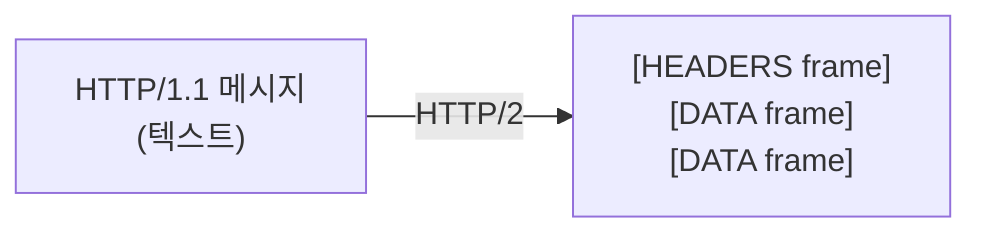
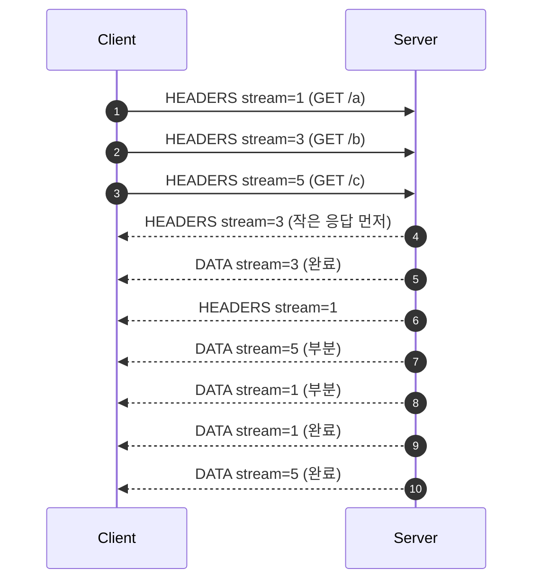
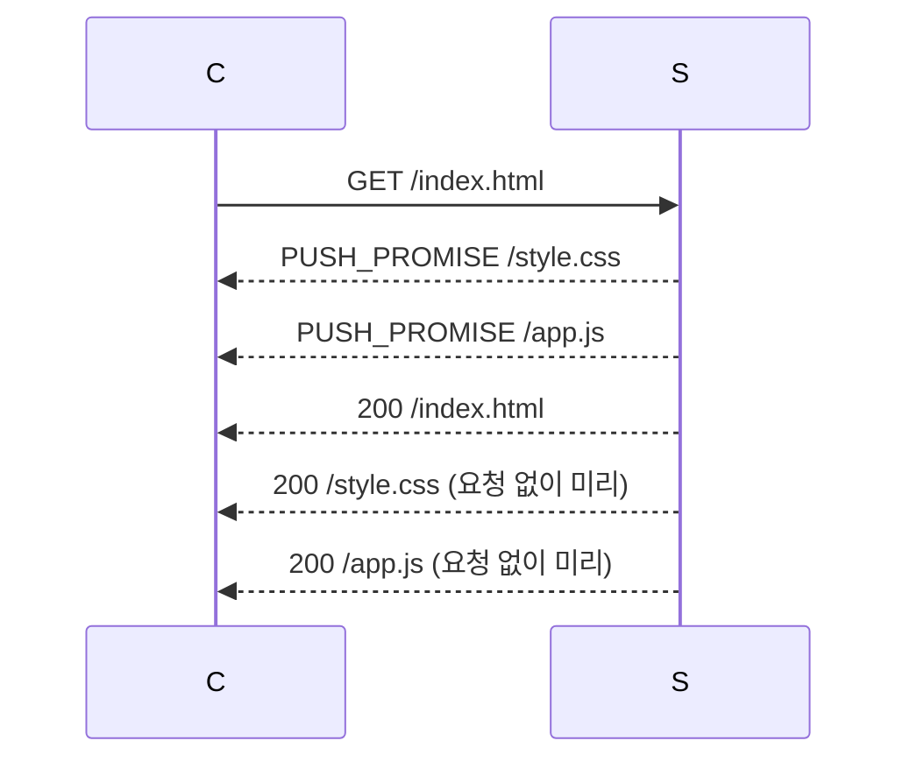
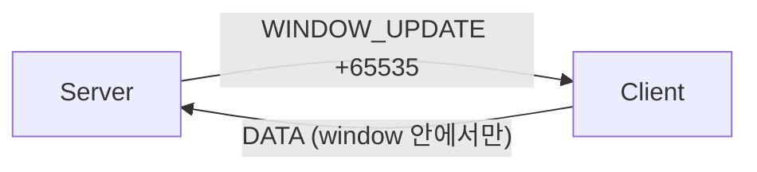

## 정의

**HTTP/2** (2015, [RFC 9113](https://datatracker.ietf.org/doc/html/rfc9113)) 는 HTTP/1.1 의 *문법은 유지하되 전송을 바이너리 + 멀티플렉싱* 으로 바꾼다. *Head-of-Line Blocking* (HTTP 레벨) 해결이 핵심.

핵심 변경 3가지:

1. **Binary framing**: 텍스트 → 바이너리. 파싱 효율 + 정확성.
2. **Stream multiplexing**: 한 TCP 연결에서 *여러 stream 병렬*.
3. **HPACK 헤더 압축**: 반복 헤더의 *압축 + 인덱싱*.

## Binary Framing

HTTP/1.1 의 *텍스트 메시지* 가 *frame* 으로 분해:

| Frame Type | 의미 |
|---|---|
| `DATA` | 본문 |
| `HEADERS` | 헤더 |
| `PRIORITY` | 스트림 우선순위 |
| `RST_STREAM` | 스트림 취소 |
| `SETTINGS` | 연결 설정 |
| `PUSH_PROMISE` | server push (대부분 비활성) |
| `PING` | keep-alive 측정 |
| `GOAWAY` | 연결 종료 |
| `WINDOW_UPDATE` | flow control |
| `CONTINUATION` | 큰 헤더 분할 |



## Multiplexing

```anim:http2-multiplexing
{}
```

한 TCP 연결에서 *여러 stream (요청/응답 쌍)* 이 *frame 인터리빙* 으로 동시 진행:



| 항목 | HTTP/1.1 | HTTP/2 |
|---|---|---|
| 동시 요청 | *N개 TCP 연결* | *1 TCP, N streams* |
| HoL Blocking (HTTP) | 있음 (pipelining) | *없음* |
| 헤더 압축 | 없음 | *HPACK* |
| Binary | 텍스트 | *binary* |

> [!IMPORTANT]
> Multiplexing 은 *HTTP 레벨의 HoL blocking* 만 해결. *TCP 패킷 손실* 이 발생하면 *그 아래 모든 stream 이 대기*. 이 한계가 *HTTP/3 (QUIC)* 의 등장 이유.

## HPACK 헤더 압축

반복되는 헤더 (`User-Agent`, `Cookie` 등) 를 *인덱스로 참조*. *Static Table (61개 미리 정의) + Dynamic Table (연결마다 갱신)* + Huffman.

```
요청 1: :method=GET, :path=/a, user-agent=Mozilla/5.0...
→ 보내고 dynamic table 에 등록 (예: index 62)

요청 2: :method=GET, :path=/b, user-agent=Mozilla/5.0...
→ index 62 만 보냄 (수십 바이트 → 1 바이트)
```

자세한 건 [[hpack]] 참고.

> [!CAUTION]
> *CRIME / BREACH 공격* 의 변형 (HPACK 압축 oracle). 일반적으로 안전하지만, *비밀 헤더 + 사용자 입력이 같은 응답* 에 들어가면 위험.

## Server Push (사실상 폐기)

`/index.html` 요청에 *서버가 미리* `/style.css`, `/app.js` 도 push:



> [!WARNING]
> **2022 Chrome 이 server push 를 제거**. *push 캐시 적중률이 낮고* *bandwidth 낭비* + *priority 충돌*. **2026 시점 server push 는 사실상 죽은 기능**. 대신 *103 Early Hints* + *`<link rel=preload>`* 패턴.

## h2 vs h2c

| 프로토콜 | 의미 |
|---|---|
| `h2` | TLS 위 HTTP/2 (대부분) |
| `h2c` | *cleartext* (내부 네트워크, gRPC mesh) |

브라우저는 `h2` 만. 서버끼리는 `h2c` 도 흔함 (TLS 종료를 가까운 sidecar/proxy 에서).

## Flow Control

스트림 / 연결마다 *window size*. `WINDOW_UPDATE` 로 *backpressure*. TCP 의 sliding window 와 별개 *application 레벨* 제어.



## 흔한 함정

> [!WARNING]
> 1. **다수 TCP 연결의 *습관*** = HTTP/2 환경에서 *6 connections per origin* 같이 옛 패턴을 유지하면 *멀티플렉싱 효과 0*.
> 2. **`Connection`, `Upgrade`, `Proxy-Connection` 헤더** = HTTP/2 에서 *금지된 헤더*. 보내면 연결 RST.
> 3. **Priority 잘못 설정** = 일부 클라이언트가 *priority frame 무시*. RFC 9218 의 *priority hints* 가 더 신뢰.
> 4. **PUSH 의존 코드** = 위 server push 폐기 때문에 *fallback* 필수.

## 관련 위키

- [[HTTP/1.1]] (이전 버전)
- [[HTTP/3]] (QUIC 위)
- [[hpack]] (헤더 압축 깊게)
- [[head-of-line-blocking]] (TCP 레벨 HoL)
- [[TCP]], [[TLS]]
- [[gRPC]] (HTTP/2 위)
