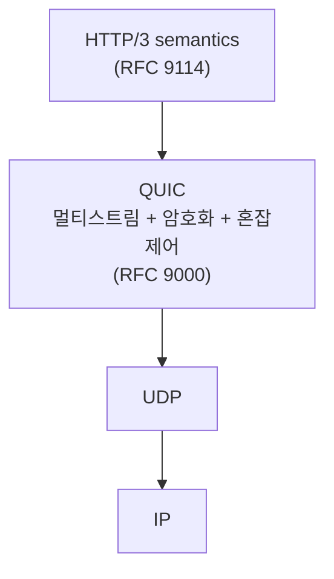
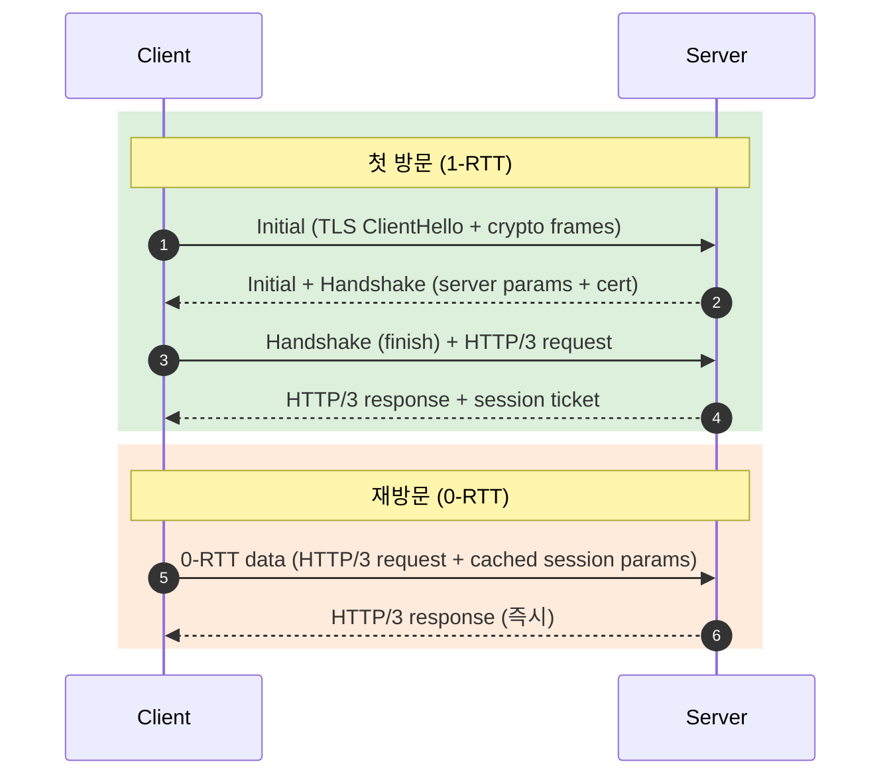
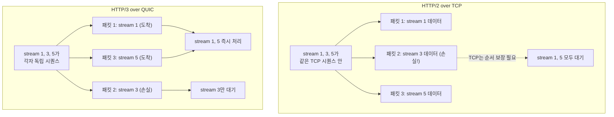
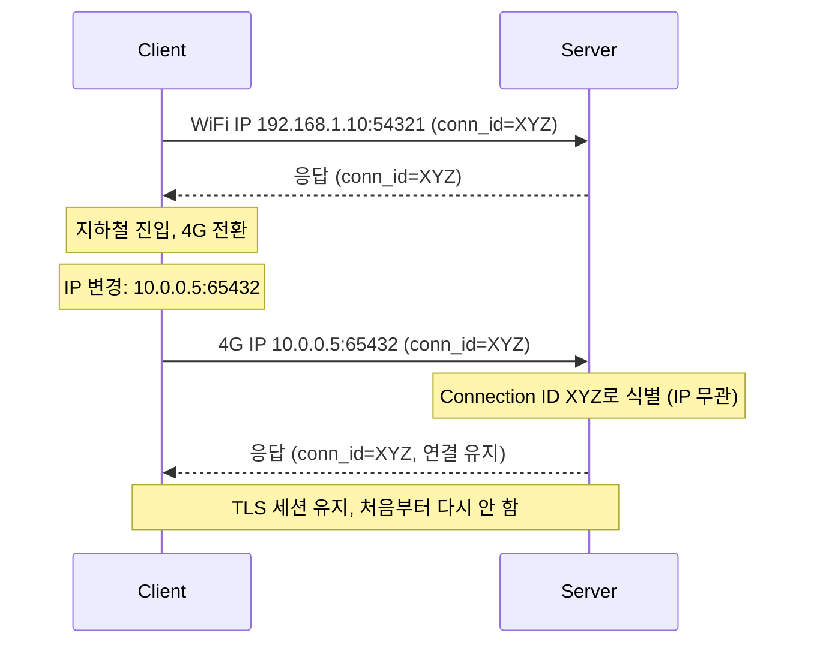
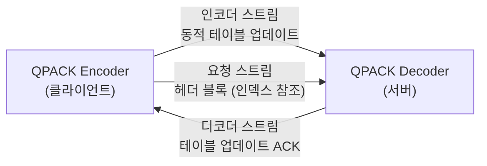

## 정의

**HTTP/3** (2022, [RFC 9114](https://datatracker.ietf.org/doc/html/rfc9114))는 HTTP의 전송 레이어를 [[tcp|TCP]] 에서 [[quic|QUIC]] 으로 교체한 버전이다. *UDP 위에 QUIC, QUIC 위에 HTTP* 구조다.

핵심 동기:
- **TCP HoL Blocking 해결**: 스트림 단위 패킷 손실 격리
- **0-RTT 핸드셰이크**: 재방문 시 연결 지연 제로
- **Connection Migration**: IP 변경 시 연결 유지



## HTTP 버전 비교

| 항목 | HTTP/1.1 | HTTP/2 | HTTP/3 |
|:---|:---|:---|:---|
| 전송 계층 | TCP | TCP | QUIC (UDP) |
| 멀티플렉싱 | 없음 (keep-alive) | TCP 스트림 내 | QUIC 독립 스트림 |
| HoL Blocking | TCP + 앱 레벨 | TCP 레벨 | 없음 |
| 핸드셰이크 | 1 RTT + TLS | 1 RTT + TLS | 1 RTT (TLS 통합) |
| 재접속 | 1 RTT | 1 RTT | 0 RTT |
| 헤더 압축 | 없음 | [[hpack|HPACK]] | QPACK |
| 서버 Push | 없음 | 있음 (사실상 폐기) | 없음 |
| Connection Migration | 불가 | 불가 | 가능 |
| 암호화 | 선택 | 선택 | 필수 (TLS 1.3 통합) |

## Handshake: 0-RTT의 마법



QUIC은 TLS 1.3 핸드셰이크를 전송 계층 협상과 통합한다. 첫 방문은 1 RTT, 이전 연결의 세션 티켓을 캐시해두면 재접속 시 0 RTT로 데이터를 즉시 전송할 수 있다.

> [!CAUTION]
> **0-RTT는 replay 공격에 취약하다**. 비멱등 요청(POST, DELETE, 결제)을 0-RTT로 보내면 중간자가 같은 요청을 반복 재생할 수 있다. GET/HEAD 같은 안전한 메서드만 0-RTT를 허용하고, 나머지는 반드시 1-RTT 이후 처리해야 한다.

## TCP HoL Blocking vs QUIC Stream 독립



HTTP/2는 TCP 레이어에서 스트림 1, 3, 5를 하나의 바이트 스트림으로 전송한다. 패킷 2가 손실되면 TCP가 재전송을 완료할 때까지 패킷 3도 애플리케이션에 전달되지 않는다. 이것이 TCP 레벨 HoL Blocking이다.

HTTP/3 QUIC은 스트림을 독립 단위로 격리한다. stream 3 패킷이 손실되어도 stream 1과 5는 즉시 애플리케이션에 전달된다.

## Connection Migration

WiFi에서 4G로 전환, NAT 재할당 등 IP가 바뀌어도 연결이 유지된다.



TCP는 (src IP, src port, dst IP, dst port) 4-tuple로 연결을 식별하므로 IP가 바뀌면 연결이 끊긴다. QUIC은 **Connection ID**로 연결을 식별하여 IP/포트 변경을 투명하게 처리한다.

## QPACK 헤더 압축

[[hpack|HPACK]]의 순서 의존성 문제를 해결한 변형이다.



| 항목 | HPACK (HTTP/2) | QPACK (HTTP/3) |
|:---|:---|:---|
| 동적 테이블 | 단일 스트림에서 인라인 업데이트 | 별도 인코더/디코더 스트림 |
| 순서 의존성 | 있음 (TCP가 보장) | 없음 (QUIC 스트림 독립) |
| HOL 블로킹 | TCP 레벨 | QPACK 레벨 동기화로 제거 |

## Alt-Svc: HTTP/3 협상 방법

브라우저는 HTTP/3를 처음부터 알 수 없다. 서버가 `Alt-Svc` 헤더로 HTTP/3 지원을 알린다.

```http
HTTP/1.1 200 OK
Alt-Svc: h3=":443"; ma=86400, h3-29=":443"; ma=86400
```

이후 브라우저는 UDP 443 포트로 QUIC 연결을 시도하고, 성공하면 HTTP/3를 사용한다. 실패하면 HTTP/2나 HTTP/1.1로 fallback한다.

## 실전: 서버 설정

### nginx (1.25+)

```nginx
server {
    listen 443 quic reuseport;   # HTTP/3 UDP
    listen 443 ssl;              # HTTP/2 TCP fallback

    ssl_certificate     /path/to/cert.pem;
    ssl_certificate_key /path/to/key.pem;
    ssl_protocols       TLSv1.3;  # QUIC은 TLS 1.3 필수

    # 브라우저에 HTTP/3 지원 알림
    add_header Alt-Svc 'h3=":443"; ma=86400';

    # QUIC 버퍼 최적화
    quic_retry on;  # QUIC Retry 패킷으로 DoS 방어
}
```

### Cloudflare Workers (HTTP/3 자동)

```javascript
// Cloudflare Workers는 HTTP/3를 자동 협상
// 별도 설정 없이 h3 지원
export default {
  async fetch(request, env) {
    // request.cf.httpProtocol 로 클라이언트 프로토콜 확인
    const proto = request.cf?.httpProtocol;  // "HTTP/3" | "HTTP/2" | "HTTP/1.1"
    return new Response(`Protocol: ${proto}`);
  },
};
```

### HTTP/3 연결 테스트

```bash
# curl로 HTTP/3 요청 (curl 7.88+, QUIC 빌드 필요)
curl --http3 https://cloudflare.com -I

# HTTP/3 협상 확인
curl -v --http3 https://example.com 2>&1 | grep -E "ALPN|http"
# * ALPN: h3

# 연결 없이 HTTP/3 즉시 시도
curl --http3-prior-knowledge https://example.com

# Python httpx로 HTTP/3
# pip install httpx[http3]
import httpx
with httpx.Client(http2=True) as client:
    response = client.get("https://example.com")
    print(response.http_version)  # HTTP/3 또는 HTTP/2
```

## 도입 현황 (2026)

| 영역 | 비중 |
|:---|:---|
| Cloudflare / Fastly / Akamai (CDN) | 기본 활성 |
| Google 서비스 | 전면 HTTP/3 |
| 모바일 앱 (iOS, Android) | 빠르게 증가 |
| 일반 웹 사이트 (브라우저 트래픽) | 약 35%+ |
| 기업 내부망 (방화벽 UDP 차단) | 더딤 |

브라우저 지원 현황: Chrome, Firefox, Safari, Edge 모두 HTTP/3를 지원한다 (2022년 이후 기본 활성).

> [!NOTE]
> 방화벽이 UDP 443 포트를 차단하면 HTTP/3 fallback이 발생해 HTTP/2 (TCP)로 내려간다. 사내망 환경에서 HTTP/3가 동작하지 않는 가장 흔한 원인이다.

## 흔한 함정

> [!WARNING]
> 1. **방화벽 UDP 차단**: 기업망, 일부 ISP에서 UDP 443을 차단한다. Alt-Svc로 광고하더라도 실제 사용률을 모니터링해야 한다.
> 2. **0-RTT replay 공격**: POST, DELETE, 결제 등 비멱등 요청을 0-RTT로 허용하면 재생 공격 가능. GET/HEAD만 0-RTT 허용.
> 3. **Connection ID 추적**: Connection ID가 식별자처럼 쓰일 수 있어 프라이버시 우려. RFC 9000은 주기적 Connection ID 변경을 권장.
> 4. **로드 밸런서 UDP 해싱 문제**: 전통적 LB는 5-tuple(IP+포트) 해싱. IP 변경 시 다른 백엔드로 라우팅될 수 있다. Connection ID 기반 라우팅 지원 LB 필요.
> 5. **세션 티켓 공유**: 다중 서버 환경에서 0-RTT를 위해 세션 티켓을 서버 간 공유해야 한다. 미공유 시 0-RTT 실패.
> 6. **CPU 비용**: QUIC의 사용자 공간 구현은 커널 바이패스 없이 암호화 비용이 TCP+TLS보다 높을 수 있다.

## 관련 위키

- [[quic|QUIC]] - HTTP/3의 전송 계층
- [[http-2|HTTP/2]] - HPACK, 멀티플렉싱 도입 (전 단계)
- [[hpack|HPACK]] - HTTP/2 헤더 압축 (HTTP/3는 QPACK)
- [[udp|UDP]] - QUIC 기반 프로토콜
- [[tls|TLS]] - QUIC에 통합된 암호화
- [[head-of-line-blocking|Head-of-Line Blocking]] - HTTP/3가 해결하는 핵심 문제
- [[load-balancer|Load Balancer]] - QUIC/HTTP3 LB 고려사항
