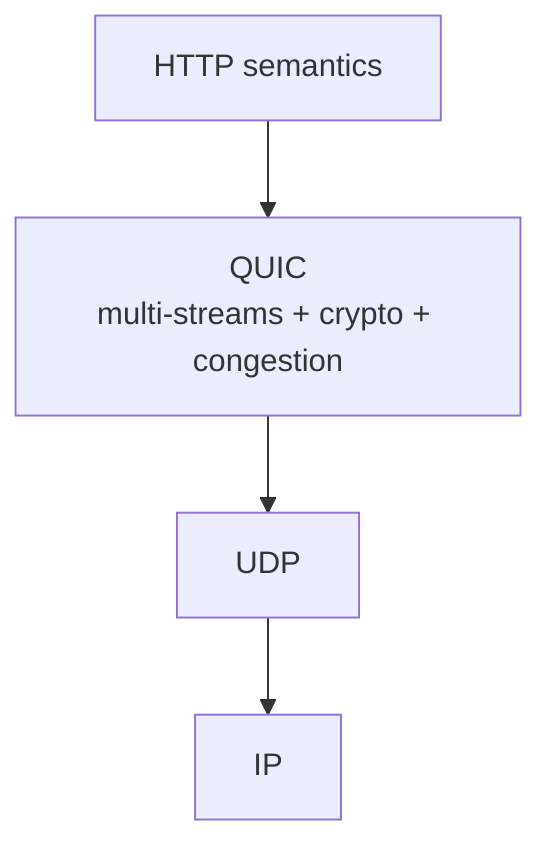
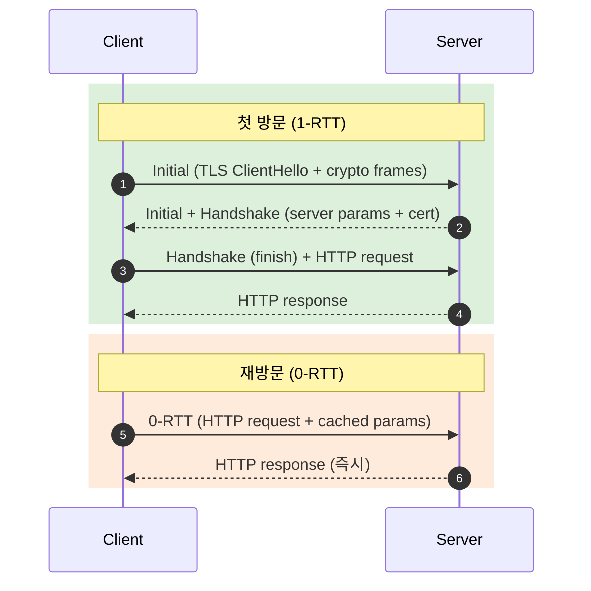
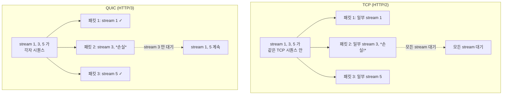
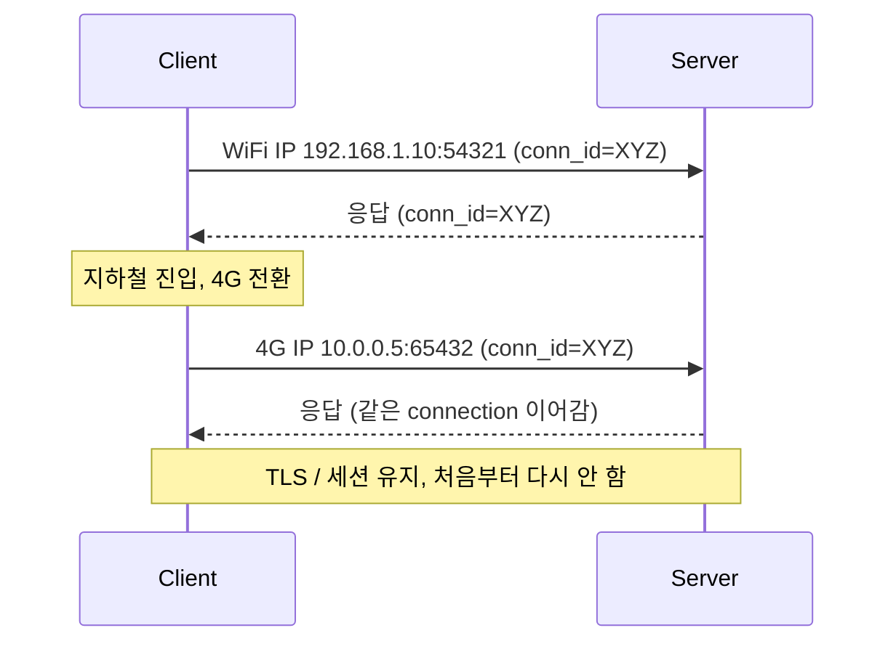

## 정의

**HTTP/3** (2022, [RFC 9114](https://datatracker.ietf.org/doc/html/rfc9114)) 는 HTTP 의 *전송 레이어를 TCP → QUIC* 으로 교체한 버전. *UDP 위에 QUIC, QUIC 위에 HTTP*.

핵심 동기: **TCP HoL blocking 해결** + **0-RTT 핸드셰이크** + **connection migration** (IP 변경 시 연결 유지).



## QUIC 의 핵심 (1분 요약)

```anim:http3-quic
{}
```

| 특성 | TCP+TLS+HTTP/2 | QUIC+HTTP/3 |
|---|---|---|
| 핸드셰이크 | 3-way + TLS = 2-3 RTT | *1 RTT* (또는 0-RTT 재방문) |
| HoL Blocking | TCP 레벨 발생 | *stream 별 독립* |
| Connection migration | 불가 | *가능* (NAT 변경, WiFi → 4G) |
| 암호화 | 옵션 | *필수* (TLS 1.3 통합) |
| 패킷 손실 영향 | 모든 stream 대기 | *해당 stream 만* |
| 구현 위치 | OS (TCP) + 라이브러리 (TLS) | *전부 user-space* (배포 빠름) |

## Handshake: 0-RTT 의 마법



> [!CAUTION]
> *0-RTT 데이터는 replay 공격에 취약*. *비멱등 요청* (POST 결제) 은 *반드시 1-RTT 후 처리*. GET / HEAD 같은 *안전한 method* 만 0-RTT 권장.

## TCP HoL vs QUIC stream 독립



## Connection Migration

WiFi → 4G 전환, NAT 재할당 시 *연결 유지*. *Connection ID* 가 *src IP/port 와 무관*.



## QPACK 헤더 압축

HPACK 의 *순서 의존성 문제* 를 해결한 변형. *encoder/decoder stream 분리*.

| HPACK | QPACK |
|---|---|
| 헤더가 *정확한 순서* | *stream 독립 디코딩* 가능 |
| 인덱스 갱신 → 모든 stream 영향 | 별도 stream 으로 동기화 |

## 도입 현황 (2026)

| 영역 | 비중 |
|---|---|
| Cloudflare / Fastly / Akamai (CDN) | *기본 활성* |
| 모바일 앱 (gRPC, 자체 클라이언트) | 빠르게 증가 |
| 일반 웹 사이트 (브라우저 트래픽) | 약 35%+ |
| 기업 내부 (방화벽 UDP 차단) | 더딤 |

> [!NOTE]
> *방화벽이 UDP 를 차단* 하면 HTTP/3 fallback → HTTP/2 (TCP). 도입의 가장 큰 *현실 장벽*.

## 흔한 함정

> [!WARNING]
> 1. **방화벽 / 미들박스의 UDP 차단** = 사내망에서 H3 가 안 되는 가장 흔한 이유.
> 2. **0-RTT 의 replay 위험** = POST / DELETE 등 비멱등은 0-RTT 거절.
> 3. **Connection ID 가 *식별자처럼* 쓰임** = 추적 / privacy 우려. RFC 가 *주기적 변경* 권장.
> 4. **부하 분산기의 *UDP 5-tuple 해싱*** = NAT 변경 시 *다른 백엔드* 로. *connection ID 기반 라우팅* 필요.

## 관련 위키

- [[HTTP/2]] (전 단계)
- [[QUIC]] (전송 레이어)
- [[UDP]]
- [[TLS]] (QUIC 내부)
- [[head-of-line-blocking]]
- [[Load Balancer]] (UDP / QUIC LB)
