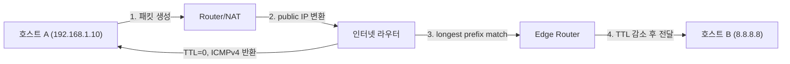

## 정의

**IP (Internet Protocol)** 는 OSI L3 (네트워크 계층) 의 핵심 프로토콜. **best-effort** delivery (재전송 없음, 순서 보장 없음, 손실 가능). 신뢰성은 TCP 같은 상위 layer 가 담당.

두 버전:
- **IPv4**: 32-bit 주소 (≈ 43억), 1981년 RFC 791
- **IPv6**: 128-bit 주소 (사실상 무한), 1998년 RFC 2460 → 2017년 RFC 8200

현재 인터넷은 듀얼 스택. 점진적 IPv6 전환 중 (구글 클라이언트 통계 약 40-50%).

## IPv4 주소

**Dotted decimal**: `192.168.1.1` = 32-bit (4 octet, 0~255 each).

| 범위 | 종류 | 예시 |
|---|---|---|
| 0.0.0.0/8 | 미지정 / "this network" | 0.0.0.0 |
| 10.0.0.0/8 | private (Class A) | 10.x.x.x |
| 127.0.0.0/8 | loopback | 127.0.0.1 |
| 169.254.0.0/16 | link-local (DHCP 실패 시) | 169.254.x.x |
| 172.16.0.0/12 | private (Class B) | 172.16-31.x.x |
| 192.168.0.0/16 | private (Class C) | 192.168.x.x |
| 224.0.0.0/4 | multicast | 224.0.0.1 |
| 255.255.255.255 | broadcast | - |

NAT 가 있는 이유: IPv4 고갈 → 사설망 안에서 private + 인터넷 진출 시 NAT 가 public IP 로 변환. [[network-nat]] 참고.

## IPv6 주소

**Colon-separated hex**: `2001:0db8:85a3:0000:0000:8a2e:0370:7334`.

축약 규칙:
- 각 그룹의 leading zero 생략: `2001:db8:85a3:0:0:8a2e:370:7334`
- 연속 0 그룹은 `::` 한 번만 사용 가능: `2001:db8:85a3::8a2e:370:7334`

특수 주소:
- `::1` : loopback (IPv4 의 `127.0.0.1`)
- `::` : 미지정 (`0.0.0.0`)
- `fe80::/10` : link-local
- `fc00::/7` : ULA (Unique Local, private)
- `2000::/3` : global unicast

IPv6 는 broadcast 없음 (multicast 만). NDP (Neighbor Discovery Protocol) 가 ARP 대체.

## IPv4 헤더 (20 byte 기본)

```
 0                   1                   2                   3
 0 1 2 3 4 5 6 7 8 9 0 1 2 3 4 5 6 7 8 9 0 1 2 3 4 5 6 7 8 9 0 1
+-------+-------+---------------+-------------------------------+
|Version|  IHL  |Type of Service|          Total Length         |
+-------+-------+---------------+-----+-------------------------+
|         Identification        |Flags|      Fragment Offset    |
+---------------+---------------+-----+-------------------------+
|  Time to Live |    Protocol   |         Header Checksum       |
+---------------+---------------+-------------------------------+
|                       Source Address                          |
+---------------------------------------------------------------+
|                    Destination Address                        |
+---------------------------------------------------------------+
|                    Options (옵션, 가변)                       |
+---------------------------------------------------------------+
```

핵심 필드:
- **Version**: 4
- **IHL**: 헤더 길이 (32-bit word 단위, 기본 5 = 20 byte)
- **Total Length**: 전체 패킷 크기 (max 65535)
- **Identification + Flags + Fragment Offset**: fragmentation 용
- **TTL**: hop 수 제한 (0 도달 시 ICMP TTL Exceeded 후 폐기)
- **Protocol**: 다음 layer (TCP=6, UDP=17, ICMP=1)
- **Source/Destination**: 32-bit IP

## IPv6 헤더 (고정 40 byte)

```
+-------+--------------+----------------------+
|Version| Traffic Class|     Flow Label       |
+-------+--------------+----------------------+
|    Payload Length    | Next Header | Hop Lim|
+----------------------+-------------+--------+
|             Source Address (128 bit)        |
+---------------------------------------------+
|          Destination Address (128 bit)      |
+---------------------------------------------+
```

IPv6 의 단순화:
- **고정 길이** (옵션은 extension header)
- **헤더 checksum 제거** (L2/L4 가 검증)
- **fragmentation 없음** (source 만, router 는 거부)
- **Flow Label**: QoS

## Fragmentation (IPv4)

**MTU (Maximum Transmission Unit)**: link 가 한 번에 전송 가능한 최대 크기.
- Ethernet: 1500 byte
- VPN tunnel: 줄어들 수 있음 (1400 등)

IP 패킷이 MTU 보다 크면 **fragmentation**:

```
원본: 4000 byte 패킷
   ↓ MTU 1500 link
fragment 1: 1500 byte (More Fragments=1)
fragment 2: 1500 byte (More Fragments=1, offset=1480)
fragment 3: 1040 byte (More Fragments=0, offset=2960)
```

목적지 host 에서 reassembly. 함정:
- 한 fragment 손실 = 전체 재전송 필요
- 보안: fragment overlap 공격
- IPv6 는 source-only fragmentation (router 는 거부 + ICMPv6 Too Big)

### PMTUD (Path MTU Discovery)

Don't Fragment (DF) flag 켜고 보내며 router 가 "Too Big" ICMP 반환하면 줄임:

```
source ─→ link 1500 ─→ tunnel 1400 ─→ destination
       ↓ DF=1, 1500
       ← ICMP "Frag needed, MTU=1400"
       ↓ retry with 1400
       ✓
```

ICMP 차단된 환경에선 PMTUD 깨짐 ("PMTUD black hole"). TCP MSS clamping 으로 회피.

## ICMP (Internet Control Message Protocol)

IP 의 control plane:
- `Echo Request/Reply`: ping
- `Destination Unreachable`: 목적지 도달 불가
- `TTL Exceeded`: traceroute 의 원리
- `Fragmentation Needed`: PMTUD
- `Redirect`: 더 좋은 route 알림 (보안상 위험)

ICMPv6 는 더 광범위 (NDP, MLD 등 통합).

## TTL (Time To Live)

각 router 통과 시 1 씩 감소. 0 도달 시 패킷 폐기 + `ICMP Time Exceeded`.

목적: 라우팅 루프 무한 폭주 방지. 일반적 OS 기본값:
- Linux: 64
- Windows: 128
- Cisco router: 255

traceroute 가 이걸 활용:

```bash
traceroute google.com
# TTL=1 보냄 → 1번째 router 가 TTL Exceeded 반환 (그 router 의 IP 노출)
# TTL=2 보냄 → 2번째 router 가 반환
# ...
```

각 hop 의 IP 와 latency 측정. [[network-cidr-subnetting]] 참고.

## 주요 함정

### 함정 1: NAT 뒤의 IP

`192.168.1.10` 에서 외부 접속 시 라우터가 SNAT → public IP. 외부에서 보면 라우터의 IP. inbound 는 port forwarding 필요.

### 함정 2: IPv6 dual-stack 의 happy eyeballs

브라우저는 IPv4 / IPv6 둘 다 시도해 빠른 쪽 사용. IPv6 라우팅이 깨졌어도 IPv4 fallback 되므로 사용자는 모름 → 진단 어려움.

### 함정 3: MTU mismatch

Docker / Kubernetes 의 overlay network 가 보통 MTU 1450 (encapsulation overhead). 호스트가 1500 으로 보내면 성능 저하 / 패킷 손실.

```bash
# 진단
ping -M do -s 1472 google.com   # 1472 + 28 (IP+ICMP) = 1500
```

### 함정 4: IPv4 exhaustion 과 CGNAT

ISP 의 Carrier-Grade NAT 환경에서 같은 IP 가 수천 명 공유. P2P / inbound 어려움. IPv6 보급 가속 이유.

## IP 라우팅 흐름



각 hop 에서 라우터 동작:
1. 목적지 IP 의 라우팅 테이블 **longest prefix match** 조회
2. 매칭 경로 없으면 **default route** (`0.0.0.0/0`) 사용
3. TTL 1 감소. 0 이면 패킷 폐기 + ICMP Time Exceeded 반환

## 서브넷 / CIDR

**CIDR (Classless Inter-Domain Routing)**: 가변 길이 prefix 로 IP 대역 표현.

```
192.168.1.0/24
          └─ prefix 24 bit → subnet mask 255.255.255.0
               → 192.168.1.0 ~ 192.168.1.255 (256개 주소)
               → 사용 가능: 192.168.1.1 ~ 192.168.1.254 (네트워크 주소/브로드캐스트 제외)
```

| Prefix | 주소 수 | 사용 가능 | 용도 |
|:---|---:|---:|:---|
| /30 | 4 | 2 | P2P 링크 |
| /29 | 8 | 6 | 소규모 |
| /24 | 256 | 254 | 일반 LAN |
| /22 | 1024 | 1022 | 중규모 |
| /16 | 65536 | 65534 | 대규모 VPC |

### Subnetting 계산

```
10.0.0.0/8 (Class A private) 를 /24 로 쪼개면:
  10.0.0.0/24, 10.0.1.0/24, ..., 10.255.255.0/24 → 65536 개 서브넷

AWS VPC 설계 예:
  10.0.0.0/16
    ├── Public:  10.0.1.0/24
    ├── Private: 10.0.2.0/24
    └── DB:      10.0.3.0/24
```

bitwise AND 로 네트워크 주소 계산:

```
IP:   192.168.1.100 = 11000000.10101000.00000001.01100100
Mask: 255.255.255.0 = 11111111.11111111.11111111.00000000
AND:  192.168.1.0   = 11000000.10101000.00000001.00000000
```

## ARP (Address Resolution Protocol)

**IPv4 에서 L3 → L2 변환**: IP 주소 → MAC 주소 결정.

```
송신: ARP Request (broadcast)  "192.168.1.1 의 MAC 주소는?"
수신: ARP Reply (unicast)       "내 MAC 은 aa:bb:cc:dd:ee:ff"
캐싱: ARP 테이블에 IP-MAC 매핑 저장 (보통 TTL ~20분)
```

```bash
# ARP 테이블 확인
arp -n

# IPv6 NDP 테이블 (Neighbor Discovery Protocol)
ip -6 neigh
```

IPv6 에서는 **NDP (Neighbor Discovery Protocol)** 가 ARP 대체. ICMPv6 기반, Solicited-Node Multicast 사용 → broadcast 불필요.

## 함정과 베스트 프랙티스

- **항상 dual-stack 고려**: IPv4 + IPv6 동시 지원
- **MTU 명시**: container / VPN 환경에서 1500 가정 위험
- **traceroute / mtr 활용**: 경로 진단의 기본
- **TTL 짧으면 우회**: anycast / CDN 에서 같은 IP 가 여러 위치
- **PMTUD 깨질 때 MSS clamping**: TCP 헤더에서 협상 가능한 최대 크기
- **private IP 충돌 회피**: 사내 다중 사이트 시 RFC 1918 범위 신중 할당
- **IPv6 ULA**: 사설망에선 `fd00::/8` 권장 (link-local 은 라우팅 안 됨)

## 관련 위키

- [[tcp]]
- [[udp]]
- [[quic]]
- [[network-cidr-subnetting]]
- [[network-dns]]
- [[head-of-line-blocking]]
