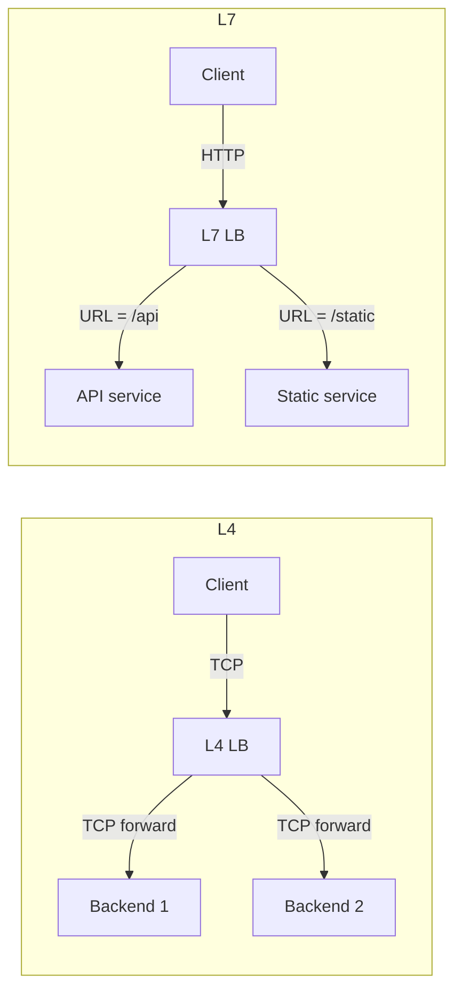
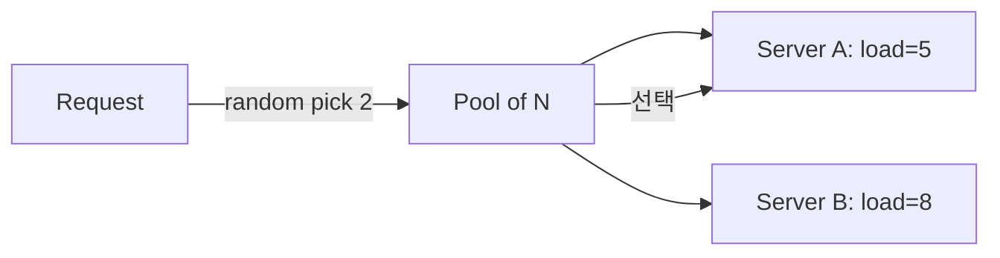
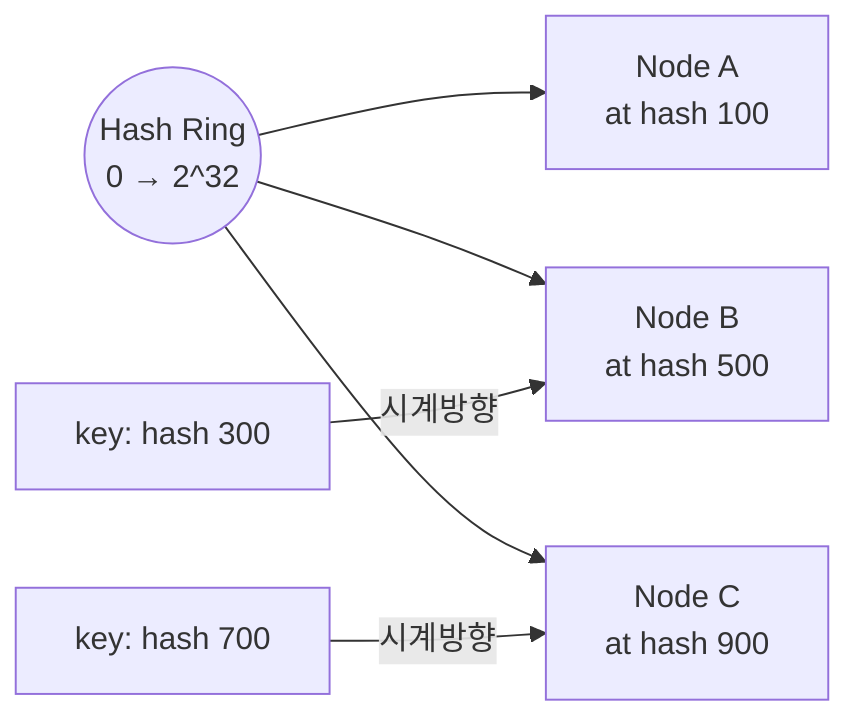
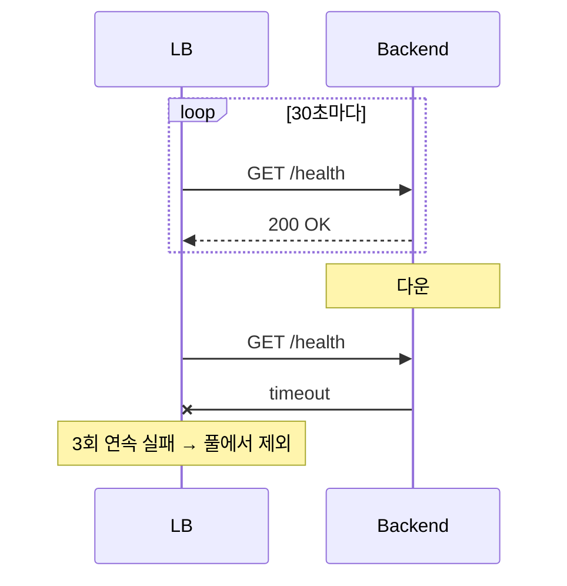
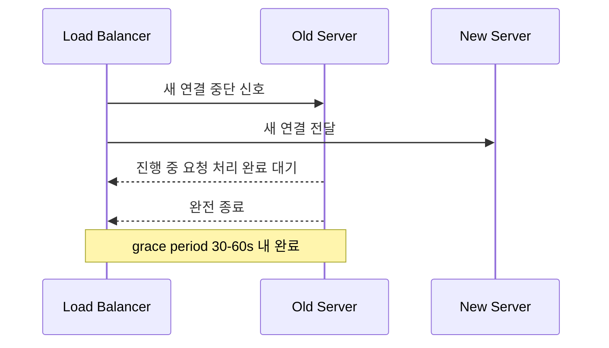
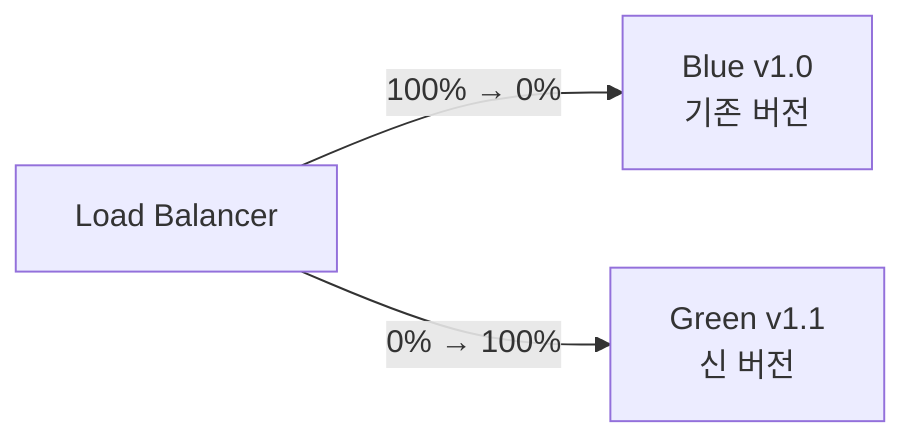
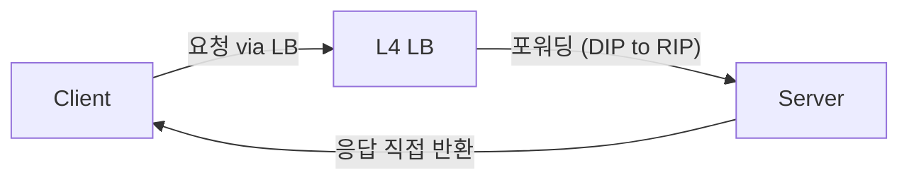
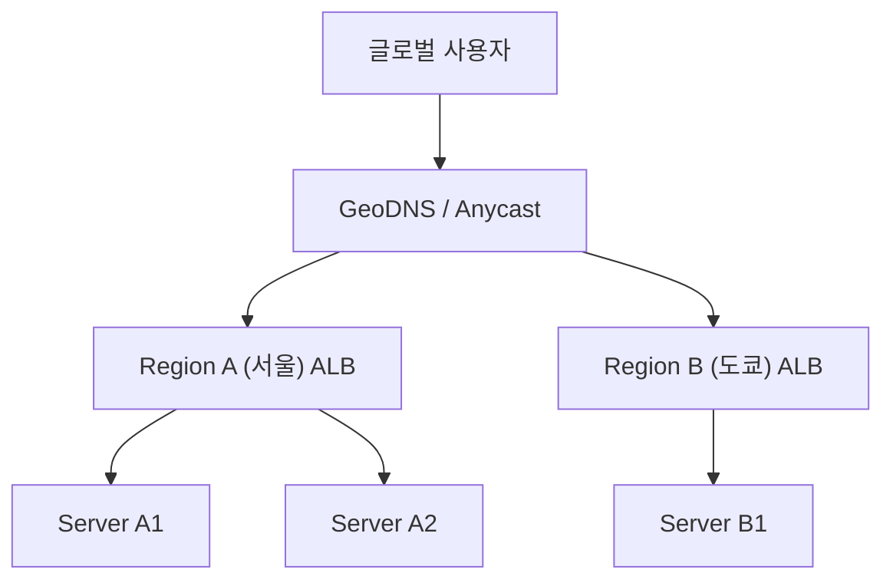

## 정의

**Load Balancer** 는 *트래픽을 여러 백엔드로 분산* 하는 인프라. *수평 확장 + 가용성 + 무중단 배포* 의 토대.

```anim:load-balancer
{}
```

## L4 vs L7

| 구분 | L4 (Transport) | L7 (Application) |
|---|---|---|
| 본 계층 | TCP/UDP | HTTP/gRPC/WebSocket |
| 보는 정보 | IP + port | URL, 헤더, 쿠키, body |
| 처리 비용 | 가벼움 | 무거움 (parse) |
| 기능 | 단순 분산 | path/header routing, rewrite, auth, rate limit |
| TLS 종료 | 옵션 (passthrough 가능) | 보통 종료 후 분배 |
| 예 | AWS NLB, HAProxy TCP, IPVS | AWS ALB, nginx, Envoy, Traefik |



## 알고리즘

| 알고리즘 | 동작 |
|---|---|
| **Round Robin** | 순서대로 |
| **Weighted RR** | 가중치 비율 |
| **Least Connections** | 현재 연결 가장 적은 백엔드 |
| **Least Response Time** | 평균 응답 시간 가장 짧은 |
| **IP Hash** | 클라이언트 IP 해시 → 같은 IP 는 같은 백엔드 |
| **Consistent Hashing** | hash 링 → 노드 추가/제거 시 *최소 재분배* |
| **Random (P2C)** | 무작위 2개 중 *덜 바쁜* |

### Power of Two Choices (P2C)



> [!TIP]
> *완전 random* 보다 좋고 *least-conn* 보다 *cheap*. Netflix, Twitter 등 *대규모 서비스의 기본*.

### Consistent Hashing

노드 추가/제거 시 *N/M 만 재분배* (vs 일반 hash 의 *전체 재분배*).



- *Sticky session*, *cache 라우팅*, *DB sharding*.
- *virtual node* (각 노드를 *수십 개 ring 점*) 로 *분포 균등화*.

## Health Check



- *Active*: LB 가 주기 ping.
- *Passive*: 실제 요청 실패율로 판단.
- *Composite*: 둘 다.

> [!CAUTION]
> Health check 가 *너무 단순* (예: 200 OK 만) 하면 *DB 다운인데 healthy* 로 판정. *deep health* (DB, cache 까지 ping) vs *shallow health* (애플리케이션만) 의 *분리*.

## Sticky Session

| 방식 | 동작 | 단점 |
|---|---|---|
| Cookie | LB 가 *쿠키 박음* | 쿠키 위변조 / 제거 시 깨짐 |
| IP Hash | 클라이언트 IP 기준 | NAT 뒤 사용자가 *같은 노드 몰림* |
| Application | 앱이 *자기 ID* 응답 헤더로 | 구현 복잡 |

자세한 건 [[Sticky Session]] 참고.

## 보안 / 옵저버빌리티

L7 LB 의 추가 능력:

- **TLS termination** (인증서 관리)
- **WAF** (SQLi, XSS 차단)
- **Rate limiting**
- **Request/response 로깅**
- **Header rewrite, redirect**
- **Path-based routing**
- **A/B testing, canary**

## 실전 LB 선택

| 도구 | L4/L7 | 사용처 |
|---|---|---|
| AWS ALB | L7 | AWS 표준 L7 |
| AWS NLB | L4 | 초저지연, gRPC, WebSocket |
| AWS CLB | L4/L7 | (legacy) |
| nginx | L7 (L4 옵션) | self-host 가장 흔함 |
| HAProxy | L4/L7 | 고성능 |
| Envoy | L7 | service mesh, gRPC |
| Traefik | L7 | K8s 친화 |
| IPVS | L4 | 커널 모듈, 극저지연 |
| Caddy | L7 | 자동 TLS |

## 흔한 함정

> [!WARNING]
> 1. **WebSocket 의 *idle timeout*** = ALB 60s default 가 silent close. *ping/pong* 으로.
> 2. **gRPC 의 *long-lived HTTP/2 연결*** = L4 LB 의 *connection 단위 분산* 때문에 *불균등 분포*. *gRPC 자체 load balancing* (Envoy, GRPC client-side LB) 필요.
> 3. **Health check 의 *서버 자살*** = HC 자체가 부하 → 서버 다운. *분리된 endpoint* + *경량 응답*.
> 4. **Sticky session + auto-scaling** = scale-in 시 *stuck* 사용자 세션 손실. *세션을 *외부 store* (Redis)* 로 옮기는 게 정통.

## Connection Draining (드레이닝)

배포/유지보수 시 서버를 *안전하게 풀에서 제거*하는 과정.



- AWS ALB: *deregistration delay* (default 300s, 조정 가능)
- Kubernetes: `terminationGracePeriodSeconds` + readiness probe 제거
- 드레이닝 없이 *즉시 종료* = 진행 중 요청 손실.

## Blue-Green 배포 / Canary 배포

LB 는 *무중단 배포*의 핵심 인프라.



| 전략 | 설명 | 롤백 속도 |
|---|---|---|
| Blue-Green | 동시 운영, 트래픽 전환 | 즉시 |
| Canary | 소수 % 부터 점진 증가 | 비율 감소 |
| Rolling | 순차 교체 (구/신 혼재) | 느림 |
| Shadow | 복제 트래픽, 결과 비교 | 없음 |

> [!TIP]
> *Canary* 기준 지표: 에러율, P99 지연, 비즈니스 메트릭. 이상 감지 시 자동 롤백 (Argo Rollouts, Flagger).

## DSR (Direct Server Return)

트래픽 *반환 경로*를 LB 를 거치지 않고 *서버에서 클라이언트로 직접* 전달.



- *응답 트래픽* (보통 요청 대비 10x 이상) 이 LB 를 우회 → *LB 처리량 병목 해소*.
- 주로 *L4 LB* (IPVS, HAProxy) 에서 구현.
- 서버가 *VIP (Virtual IP)* 를 loopback 에 설정해야 함.

## Global LB vs Regional LB

| 구분 | Global LB | Regional LB |
|---|---|---|
| 역할 | DNS 기반 지역 선택 | 지역 내 서버 분산 |
| 지연 최적화 | GeoDNS + anycast | 지역 내 최적 |
| 예 | AWS Route 53, Cloudflare | AWS ALB, nginx |
| 페일오버 단위 | 지역 전체 이전 | 서버 단위 |



> [!CAUTION]
> *DNS TTL* 이 길면 지역 이전 시 *일부 사용자가 오래된 IP* 를 캐시. TTL 60-120s 권장. *Active-Active* 구성에서 데이터 동기화 전략 필수.

## 클라이언트 사이드 LB

인프라 LB 대신 *클라이언트가 서버 목록을 직접 관리*하여 선택.

| 구분 | 서버 사이드 LB | 클라이언트 사이드 LB |
|---|---|---|
| 예 | AWS ALB, nginx | gRPC, Ribbon (Netflix) |
| 장점 | 투명, 단순 | 레이턴시 1 hop 감소 |
| 단점 | 중앙 병목 가능 | 클라이언트 복잡도 |
| 서버 목록 | LB 가 관리 | 서비스 레지스트리 (Consul, etcd) |

> [!NOTE]
> 마이크로서비스 환경에서 *gRPC 는 기본 클라이언트 사이드 LB* (round-robin, pick-first). Kubernetes headless service 와 함께 사용.

## 실전 LB 설정 패턴

| 상황 | 권장 설정 |
|---|---|
| WebSocket | idle timeout 조정 (>60s), `proxy_read_timeout` 증가 |
| gRPC | HTTP/2 지원 LB, keepalive 설정 |
| Auto-scaling | Connection Draining 활성화, Health check 간격 단축 |
| 무중단 배포 | Blue-Green 또는 Canary + draining |
| 세션 유지 필요 | Sticky session (단, Redis 세션 스토어 권장) |
| 초저지연 | DSR 고려 (L4), IPVS |

## 관련 위키

- [[Sticky Session]]
- [[HTTP/2]] (long-lived 연결과 LB)
- [[Redis Pub Sub vs Streams]] (분산 fan-out)
- [[Kubernetes Service]] (K8s LB)
- [[AWS ALB NLB]]
