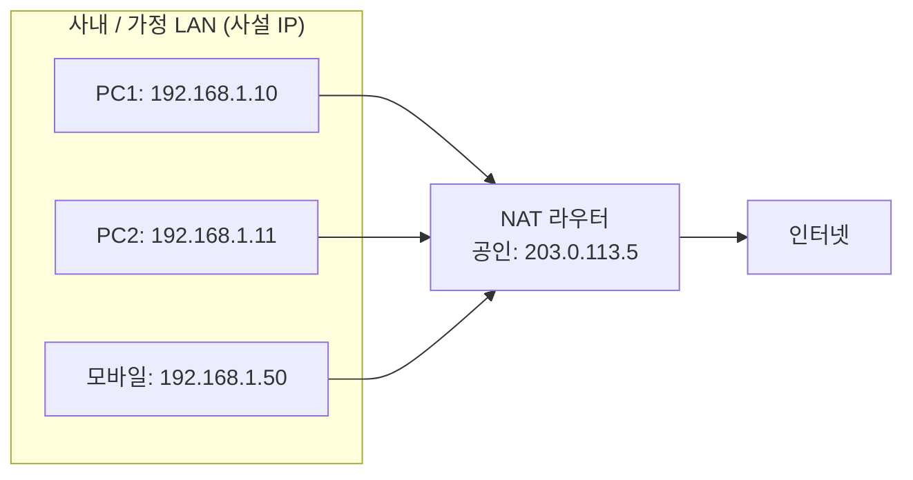
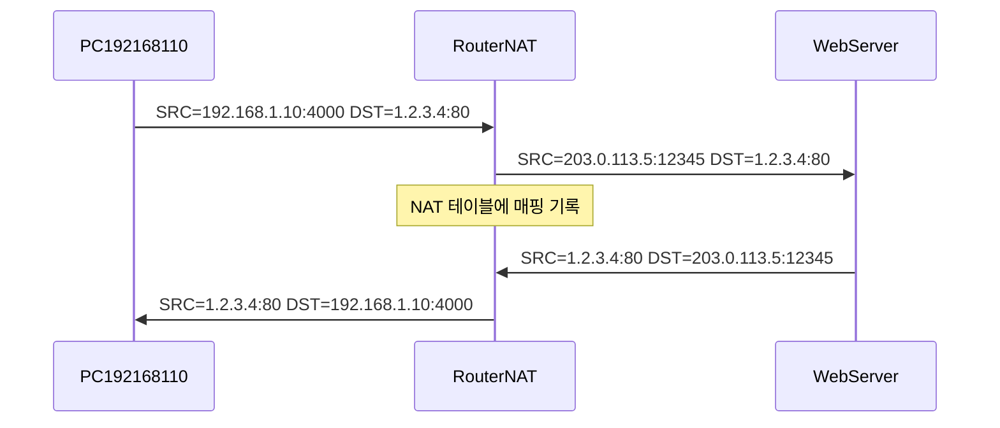
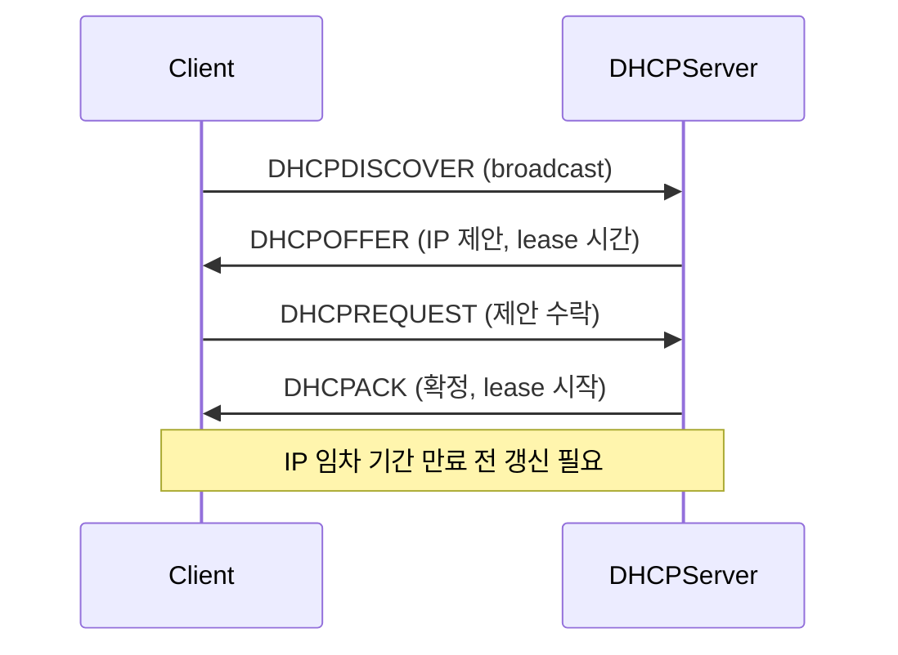

## 정의

**IP (Internet Protocol) 주소** 는 인터넷에서 노드를 식별하는 논리 주소다. IPv4 (32bit) 와 IPv6 (128bit) 두 버전이 현재 병존한다.

IP 는 [[OSI 7 Layer]] 의 L3 (Network Layer) 에서 동작하며, 라우터가 패킷을 목적지까지 전달하는 기반이 된다.

## IPv4

**4 개 8bit 옥텟**: `192.168.1.1`. 총 2^32 (약 43억 개), 이미 고갈 상태.

### 주소 구조 (CIDR)

```
IP:      192  .  168  .   1   .   1
Binary: 11000000.10101000.00000001.00000001
        |<--- 네트워크 부분 (prefix) --->| 호스트|
```

`192.168.1.0/24` 표기에서 `/24` 는 앞 24 bit 가 네트워크 식별자, 뒤 8 bit 가 호스트 주소임을 의미한다.

### 특수 주소 범위

| 범위 | CIDR | 용도 |
|:---|:---|:---|
| 사설 A | 10.0.0.0/8 | 대규모 사내망 |
| 사설 B | 172.16.0.0/12 | 중규모 네트워크 |
| 사설 C | 192.168.0.0/16 | 홈 라우터 기본 |
| 루프백 | 127.0.0.0/8 | localhost |
| 링크 로컬 | 169.254.0.0/16 | APIPA (DHCP 실패 시 자동 할당) |
| 멀티캐스트 | 224.0.0.0/4 | 그룹 전송 |
| 브로드캐스트 | 255.255.255.255/32 | 서브넷 전체 전송 |

### CIDR 서브넷 계산

| CIDR | 서브넷 마스크 | 호스트 수 | 용도 |
|:---|:---|:---|:---|
| /8 | 255.0.0.0 | 16,777,214 | 대형 사내망 (Class A) |
| /16 | 255.255.0.0 | 65,534 | 중형 사내망 (Class B) |
| /24 | 255.255.255.0 | 254 | 일반 서브넷 (Class C) |
| /28 | 255.255.255.240 | 14 | 소형 서브넷 |
| /30 | 255.255.255.252 | 2 | P2P 링크 |
| /32 | 255.255.255.255 | 1 | 단일 호스트 |

> [!IMPORTANT]
> `/24` 서브넷에서 256개 IP 중 254개만 사용 가능하다. 첫 주소(`192.168.1.0`)는 네트워크 주소, 마지막 주소(`192.168.1.255`)는 브로드캐스트 주소로 예약된다.

### 서브넷 계산 예시

```
VPC 10.0.0.0/16 분할:
  Public subnet:  10.0.1.0/24   → 254 호스트
  Private subnet: 10.0.2.0/24   → 254 호스트
  DB subnet:      10.0.3.0/24   → 254 호스트
  Reserved:       10.0.4.0/24 ~ 10.0.255.0/24
```

## IPv6

**128bit** 주소, 16진수 8 그룹으로 표기: `2001:0db8:85a3:0000:0000:8a2e:0370:7334`

연속된 0 그룹 축약: `2001:db8:85a3::8a2e:370:7334`

### IPv4 vs IPv6 비교

| 특성 | IPv4 | IPv6 |
|:---|:---|:---|
| 비트 수 | 32 | 128 |
| 주소 수 | 약 43억 | 약 3.4 x 10^38 |
| 표기 | 점 표기 `192.168.1.1` | 콜론 16진수 `::1` |
| 헤더 크기 | 20 byte (가변) | 40 byte (고정) |
| NAT 필요 | 필수 (주소 부족) | 불필요 |
| 서브넷 기본 | 가변 | /64 (LAN 하나) |
| 체크섬 | 헤더에 포함 | 제거됨 (상위 계층 위임) |

### IPv6 특수 주소

| 주소 | 의미 |
|:---|:---|
| `::1` | loopback (IPv4 의 `127.0.0.1`) |
| `fe80::/10` | link-local (라우터를 넘지 않음) |
| `fc00::/7` | unique local (사설 주소, IPv4 의 `10.0.0.0/8` 유사) |
| `ff00::/8` | 멀티캐스트 |
| `2000::/3` | 글로벌 유니캐스트 (공인 주소) |

## Public vs Private



**Public IP**: 인터넷에서 직접 라우팅 가능. ISP 가 할당.

**Private IP**: 로컬 네트워크 전용. 외부에서 직접 접근 불가. NAT 를 통해 공인 IP 와 매핑.

## NAT (Network Address Translation)

IPv4 고갈 문제를 보완하기 위해 라우터가 내부 사설 주소를 외부 공인 주소로 변환한다.



NAT 는 연결 추적(connection tracking) 이 필요하며, [[stateful-vs-stateless-firewall|Stateful Firewall]] 과 함께 동작한다.

자세한 내용: [[network-nat|NAT]].

## DHCP

동적 IP 할당 프로토콜. 4단계 DORA 플로우:



- **Discover**: 클라이언트가 브로드캐스트로 DHCP 서버 탐색
- **Offer**: 서버가 사용 가능한 IP 와 임차 기간 제안
- **Request**: 클라이언트가 특정 IP 를 요청
- **Acknowledge**: 서버가 IP 할당 확정

## IP 패킷 구조 (IPv4)

```
 0       4       8      16      24      32 bit
 +-------+-------+-------+-------+-------+
 |Version|  IHL  |  ToS  |    Total Len  |
 +-------+-------+-------+---------------+
 |     Identification    |Flags|Frag Offs|
 +-------+-------+-------+-------+-------+
 |   TTL |Protocol|    Header Checksum   |
 +-------+-------+-------+-------+-------+
 |           Source Address              |
 +-------+-------+-------+-------+-------+
 |        Destination Address            |
 +-------+-------+-------+-------+-------+
 |         Options (optional)            |
 +-------+-------+-------+-------+-------+
```

주요 필드:
- **TTL** (Time to Live): 라우터 통과 시마다 1 감소. 0 이 되면 패킷 폐기하고 ICMP Time Exceeded 전송 (루프 방지, traceroute 원리)
- **Protocol**: 상위 계층 식별 (TCP=6, UDP=17, ICMP=1)
- **Flags + Fragment Offset**: MTU 초과 패킷을 단편화 (분할) 하기 위한 필드

## 실전 예시

### AWS VPC 서브넷 설계

```
VPC:            10.0.0.0/16       (65,534 개 IP)
  Public AZ-a:  10.0.1.0/24       (254 개, 인터넷 게이트웨이)
  Public AZ-b:  10.0.2.0/24       (254 개, 인터넷 게이트웨이)
  Private AZ-a: 10.0.11.0/24      (254 개, NAT 게이트웨이)
  Private AZ-b: 10.0.12.0/24      (254 개, NAT 게이트웨이)
  DB AZ-a:      10.0.21.0/24      (254 개, 외부 접근 불가)
  DB AZ-b:      10.0.22.0/24      (254 개, 외부 접근 불가)
```

### IPv4/IPv6 이중 스택 (Dual Stack)

현재 인터넷은 IPv4 와 IPv6 를 동시 운용한다. 서버는 두 주소 모두 수신하고, 클라이언트는 **Happy Eyeballs** (RFC 8305) 로 더 빠른 쪽을 선택한다.

```bash
# 서버 측 이중 스택 리슨 확인
ss -tn -l '( sport = :80 or sport = :443 )'
# IPv6 형식으로 IPv4 도 포함: ::ffff:0.0.0.0

# IPv6 연결 확인
curl -6 https://ipv6.google.com
```

### 네트워크 디버깅 커맨드

```bash
# IP 주소 확인
ip addr show           # Linux
ifconfig               # macOS / 구형

# 라우팅 테이블
ip route show
route -n               # 구형

# ICMP ping (L3 연결성)
ping 1.1.1.1
ping6 2606:4700:4700::1111   # IPv6

# 경로 추적 (TTL 활용)
traceroute 1.1.1.1
```

## 함정

> [!WARNING]
> 1. **/24 = 256개 호스트?** 네트워크 주소와 브로드캐스트 주소를 빼면 254개.
> 2. **Private IP = 보안?** NAT 뒤라도 내부 네트워크에서는 직접 접근 가능. 방화벽 별도 필수.
> 3. **IPv6 에는 NAT 불필요 = 모든 디바이스가 공인 IP.** 기존 NAT 기반 보안 정책을 IPv6 에 그대로 적용하면 외부 노출 위험.
> 4. **/32 는 단일 호스트**, /0 은 모든 IP. 라우팅 테이블이나 ACL 작성 시 혼동 주의.
> 5. **172.16.0.0/12 = 172.16.0.0 ~ 172.31.255.255.** 12bit prefix 라 172.16~172.31 범위. 직관적이지 않으므로 주의.

## 참고

- [[network-nat|NAT]]
- [[network-cidr-subnetting|CIDR / 서브네팅]]
- [[network-dns|DNS]]
- [[TCP]], [[UDP]]

## 관련 위키

- [[network-nat|NAT]] - 사설 IP 의 인터넷 연결 방법
- [[network-cidr-subnetting|CIDR / 서브네팅]] - 서브넷 분할 상세
- [[network-dns|DNS]] - 도메인 to IP 매핑
- [[TCP]], [[UDP]] - IP 위 전송 계층
- [[OSI 7 Layer]] - L3 Network 계층 맥락
