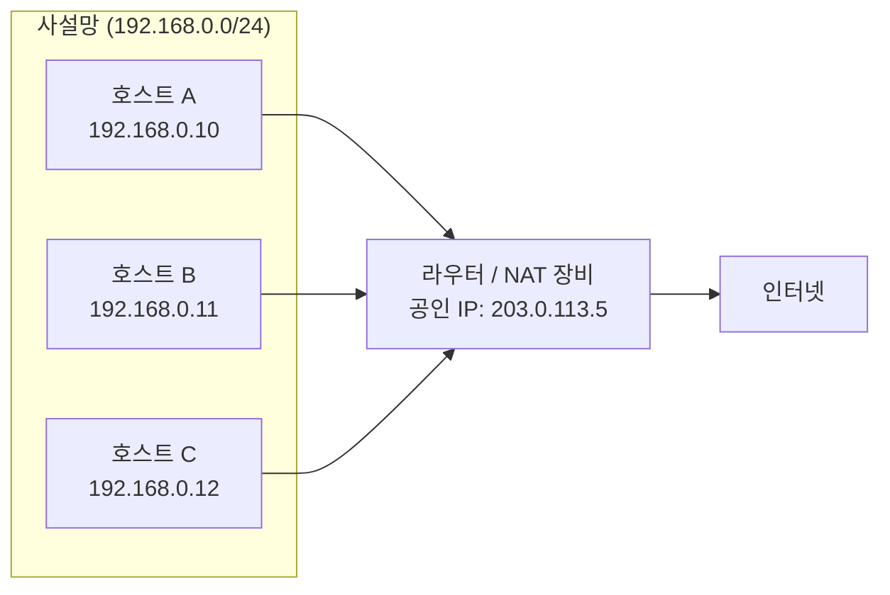
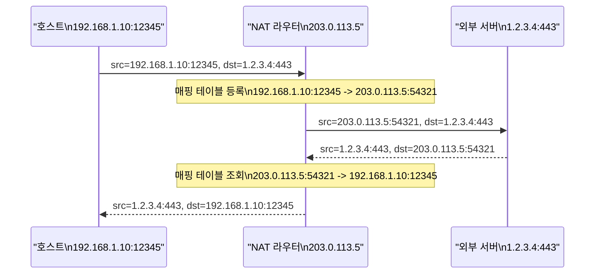
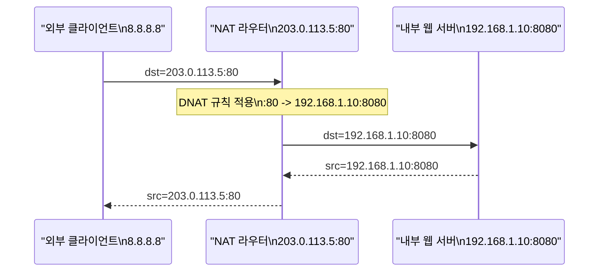
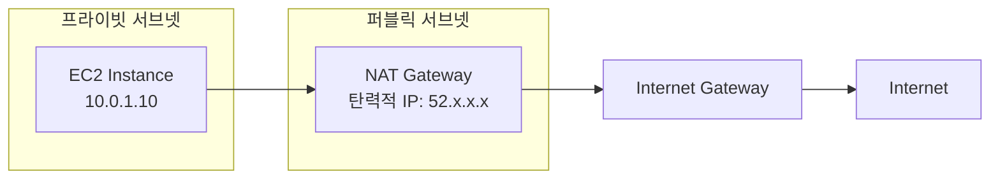
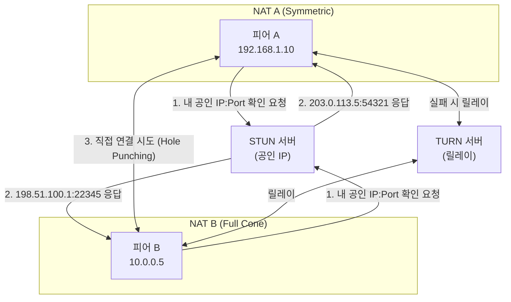

## 정의

**NAT (Network Address Translation)** 는 IP 패킷의 헤더에서 소스 또는 목적지 IP 주소(포트 포함)를 변환하는 기법이다. 주로 사설 IP와 공인 IP 간 매핑에 사용된다.

## 왜 필요한가



- **IPv4 주소 고갈**: 전 세계 IPv4 주소는 약 43억 개뿐이다. 사내 100대 호스트가 공인 IP 1개를 공유하면 99개를 절약한다.
- **보안**: 내부 호스트의 실제 IP를 외부에 노출하지 않는다.
- **정책 제어**: 특정 내부 서비스만 선택적으로 외부에 노출할 수 있다.

## 종류

### SNAT (Source NAT)

**아웃바운드** 트래픽의 소스 IP/포트를 공인 IP로 변경한다. 홈 라우터나 AWS NAT Gateway의 기본 동작이다.



### DNAT (Destination NAT)

**인바운드** 트래픽의 목적지 IP/포트를 내부 서버로 변경한다. 포트 포워딩이 대표적인 예시다.



사용 예:
- 웹 서버 포트 포워딩 (공인 `:80` -> 내부 `:8080`)
- 쿠버네티스 NodePort
- 로드 밸런서의 VIP(Virtual IP) 처리

### PAT (Port Address Translation, NAPT)

포트까지 포함한 매핑으로 한 공인 IP를 여러 내부 호스트가 공유한다. 실제로 대부분의 NAT는 PAT를 의미한다.

| 내부 주소 | 공인 주소 매핑 |
|:---|:---|
| 192.168.1.10:12345 | 203.0.113.5:1001 |
| 192.168.1.11:12345 | 203.0.113.5:1002 |
| 192.168.1.10:12346 | 203.0.113.5:1003 |

포트 번호 공간은 65535개이므로 한 공인 IP로 수만 개의 동시 연결을 처리할 수 있다. 단, 연결이 많아지면 포트 고갈이 발생한다.

## NAT 매핑 테이블

```
NAT 매핑 테이블 (PAT 예시)

| Proto | 내부 IP         | 내부 Port | 외부 IP         | 외부 Port | 상태     | 타임아웃 |
|-------|-----------------|-----------|-----------------|-----------|----------|----------|
| TCP   | 192.168.1.10    | 12345     | 203.0.113.5     | 1001      | ESTABLISHED | 300s  |
| TCP   | 192.168.1.11    | 12345     | 203.0.113.5     | 1002      | TIME_WAIT   | 30s   |
| UDP   | 192.168.1.10    | 54321     | 203.0.113.5     | 2001      | ACTIVE      | 60s   |
```

- **TCP**: 연결 상태(SYN/ESTABLISHED/FIN)를 추적해 매핑 유지
- **UDP**: stateless이므로 마지막 패킷 이후 일정 시간 후 만료 (보통 60-300초)
- **ICMP**: echo id 기반 매핑

## NAT 종류별 동작 차이 (RFC 3489 분류)

| 타입 | 설명 | P2P 적합성 |
|:---|:---|:---|
| Full Cone NAT | 내부 IP:Port가 외부 IP:Port에 고정 매핑. 누구나 외부 포트로 연결 가능 | 가장 좋음 |
| Restricted Cone NAT | 내부에서 먼저 통신한 외부 IP만 접근 허용 | 중간 |
| Port Restricted Cone NAT | 외부 IP + 포트까지 제한 | 어려움 |
| Symmetric NAT | 목적지마다 다른 포트 할당. 가장 엄격 | 매우 어려움 |

## 클라우드에서의 NAT

### AWS



- **NAT Gateway**: AWS 관리형 서비스. 고가용성, 자동 확장. 시간당 + 데이터 전송량 과금.
- **NAT Instance**: 직접 관리하는 EC2. 비용 절감 가능하지만 단일 장애점.

실무에서는 NAT Gateway를 권장하며, 비용 절감 시 VPC Endpoint로 S3/DynamoDB 트래픽을 NAT 없이 직접 연결한다.

### iptables로 Linux NAT 직접 구성

```bash
# SNAT: 내부망 아웃바운드 트래픽을 eth0 IP로 변환
iptables -t nat -A POSTROUTING -s 192.168.1.0/24 -o eth0 -j MASQUERADE

# DNAT: 80 포트를 내부 8080으로 포워딩
iptables -t nat -A PREROUTING -i eth0 -p tcp --dport 80 -j DNAT \
  --to-destination 192.168.1.10:8080

# 포워딩 활성화
echo 1 > /proc/sys/net/ipv4/ip_forward

# 현재 NAT 테이블 확인
iptables -t nat -L -n -v
```

## NAT Traversal

P2P 통신 (WebRTC, 게임, VoIP)에서 NAT 뒤에 있는 피어끼리 직접 연결을 맺으려면 NAT를 뚫어야 한다.



### STUN (Session Traversal Utilities for NAT)

자신의 공인 IP:포트를 발견하고 NAT 타입을 파악한다. 두 피어가 서로 공인 주소를 교환하고 동시에 패킷을 보내 NAT에 홀을 뚫는다 (**UDP Hole Punching**). Symmetric NAT 환경에서는 실패할 수 있다.

### TURN (Traversal Using Relays around NAT)

STUN으로 직접 연결이 불가능할 때 모든 트래픽을 릴레이 서버를 통해 전달한다. 항상 동작하지만 서버 대역폭 비용이 발생하며 지연이 증가한다.

### ICE (Interactive Connectivity Establishment)

[[webrtc|WebRTC]]에서 사용하는 프레임워크. STUN/TURN을 조합해 최적 경로를 자동 선택한다.

```
ICE Candidate 우선순위:
1. host candidate (직접 연결)
2. server reflexive candidate (STUN을 통한 공인 IP)
3. relay candidate (TURN 릴레이)
```

## 실전 예시: AWS VPC NAT 구성

```bash
# AWS CLI로 NAT Gateway 생성
# 1. EIP (Elastic IP) 할당
EIP=$(aws ec2 allocate-address --domain vpc --query AllocationId --output text)

# 2. 퍼블릭 서브넷에 NAT Gateway 생성
NATGW=$(aws ec2 create-nat-gateway \
  --subnet-id subnet-public-xxx \
  --allocation-id $EIP \
  --query NatGateway.NatGatewayId --output text)

# 3. 프라이빗 서브넷 라우트 테이블에 NAT Gateway 경로 추가
aws ec2 create-route \
  --route-table-id rtb-private-xxx \
  --destination-cidr-block 0.0.0.0/0 \
  --nat-gateway-id $NATGW
```

비용 최적화: S3, DynamoDB 트래픽은 VPC Endpoint를 통해 NAT 없이 직접 연결하면 NAT Gateway 비용을 줄일 수 있다.

```bash
# S3 VPC Endpoint 생성 (NAT 없이 S3 접근)
aws ec2 create-vpc-endpoint \
  --vpc-id vpc-xxx \
  --service-name com.amazonaws.ap-northeast-2.s3 \
  --route-table-ids rtb-private-xxx
```

## 함정

> [!WARNING]
> 1. **NAT 매핑 만료**: UDP 연결은 마지막 패킷 후 60-300초면 매핑이 만료된다. WebSocket, 게임 소켓 등 장기 연결은 주기적으로 keep-alive 패킷을 전송해야 한다.
> 2. **Hairpin NAT 미지원**: 내부 호스트가 자기 공인 IP로 접근하면 일부 NAT 장비가 처리 못한다. `192.168.1.10`이 `203.0.113.5:80`에 접근하려 할 때 반환 경로가 없어 실패한다.
> 3. **Symmetric NAT와 STUN 조합 불가**: 모바일 LTE 망은 Symmetric NAT가 많아 UDP Hole Punching이 실패한다. TURN 릴레이가 필요하다.
> 4. **포트 고갈 (Port Exhaustion)**: 대규모 NAT Gateway에서 연결 수가 포트 수 (65535) 를 초과하면 새 연결이 거부된다. AWS NAT Gateway는 IP당 55000개 동시 연결을 권고한다.
> 5. **NAT + IPSec 충돌**: ESP 프로토콜은 포트가 없어 PAT가 다중 연결을 구분하지 못한다. NAT-T (UDP 캡슐화)로 우회한다.

## 관련 위키

- [[network-ip|IP]] - IP 주소 체계
- [[network-cidr-subnetting|CIDR / 서브네팅]] - 서브넷 설계
- [[webrtc|WebRTC]] - NAT Traversal을 활용하는 대표 프로토콜
- [[tls|TLS]] - NAT 뒤에서도 종단간 암호화
- [[quic|QUIC]] - Connection ID로 NAT 재바인딩을 자연스럽게 처리
