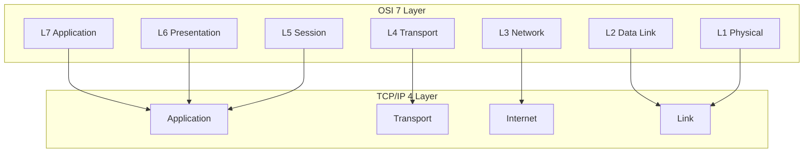
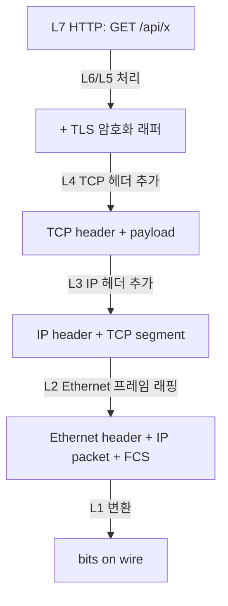
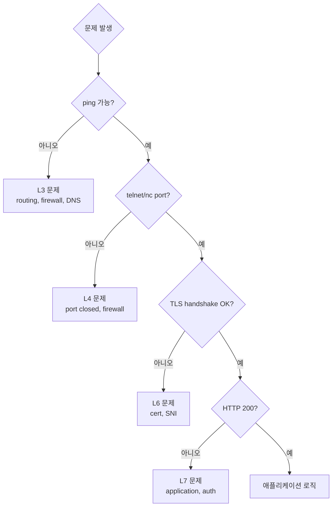
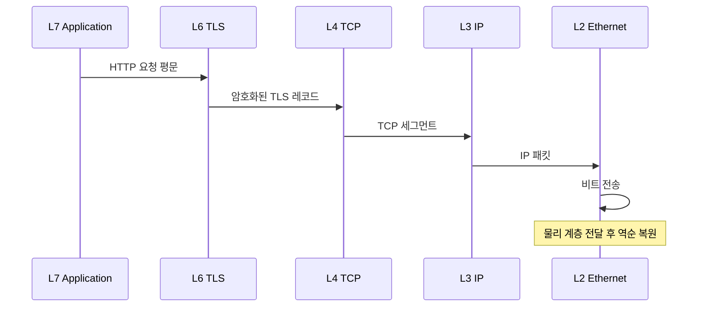

## 정의

**OSI 7 Layer 모델** 은 *네트워크 통신을 7 계층으로 추상화* 한 ITU-T 표준 (1984). 실제 인터넷은 *TCP/IP 4-5 계층* 이지만, OSI 의 *개념적 분리* 가 *디버깅 / 도구 분류* 의 토대가 된다.

```anim:osi-7-layer
{}
```

## 7 Layer 매트릭스

| Layer | 이름 | PDU (단위) | 주요 프로토콜 | 도구 |
|---|---|---|---|---|
| **L7** | Application | message | HTTP, gRPC, DNS, SMTP, MQTT, SSH | curl, postman |
| **L6** | Presentation | data | TLS, JSON, Protobuf, MIME, gzip | openssl |
| **L5** | Session | session | NetBIOS, RPC, *대부분 통합* | - |
| **L4** | Transport | segment | TCP, UDP, QUIC, SCTP | netstat, ss, tcpdump |
| **L3** | Network | packet | IP, ICMP, BGP, OSPF | traceroute, ping |
| **L2** | Data Link | frame | Ethernet, WiFi, ARP, MAC | arp, wireshark |
| **L1** | Physical | bit | 케이블, 무선 신호, 전기/광 신호 | - |

## TCP/IP 와의 매핑

실제 인터넷은 *4-5 계층* 의 TCP/IP. OSI 의 5/6/7 이 *Application* 으로 통합:



## 각 계층 깊게

### L7 Application

*사용자 의도와 가장 가까운 계층*. 응용 프로그램이 직접 사용하는 프로토콜.

| 프로토콜 | 포트 | 설명 |
|:---|:---|:---|
| HTTP/1.1 | 80 | 텍스트 기반 웹 요청/응답 |
| HTTPS | 443 | HTTP + TLS |
| HTTP/2 | 443 | 멀티플렉싱, 헤더 압축 |
| HTTP/3 | 443 (UDP) | QUIC 기반 |
| DNS | 53 (UDP/TCP) | 도메인 → IP 변환 |
| SMTP | 25 / 465 (TLS) | 이메일 전송 |
| SSH | 22 | 암호화 원격 셸 |
| gRPC | 443 | HTTP/2 위 RPC 프레임워크 |

예시:
```
GET /api/users HTTP/1.1
Host: example.com
Authorization: Bearer eyJhbGci...
```

자세한 건 [[HTTP/1.1]], [[HTTP/2]], [[HTTP/3]], [[gRPC]], [[network-dns]].

### L6 Presentation

*데이터 표현 변환 계층*. 직렬화, 압축, 암호화.

| 역할 | 예 |
|:---|:---|
| 암호화 / 복호화 | TLS (실제로는 L4-L7 사이) |
| 직렬화 | JSON, Protobuf, MessagePack, CBOR |
| 압축 | gzip, deflate, brotli, zstd |
| 문자 인코딩 | UTF-8, MIME Base64 |

현대 프로토콜에서는 L5/L6 경계가 모호하고, 응용 계층(L7) 과 통합되는 경우가 많다.

### L5 Session

*세션 관리 계층*. 대화의 시작/유지/종료.

현대에서는 *L7 의 일부* 또는 *애플리케이션 자체* 가 담당한다.

- HTTP cookie: 상태 없는 HTTP 위에서 세션 유지
- JWT: 토큰 기반 세션 상태 관리
- WebSocket: HTTP Upgrade 후 지속 세션 유지

### L4 Transport

*end-to-end 신뢰성 + 흐름 제어*. 포트 번호로 프로세스 식별.

| 프로토콜 | 신뢰성 | 순서 보장 | 흐름제어 | 주요 사용 |
|---|---|---|---|---|
| TCP | O | O | O | HTTP, SSH, DB 연결 |
| UDP | X | X | X | DNS, VoIP, 게임, QUIC |
| QUIC | O | O (stream 별) | O | HTTP/3 |
| SCTP | O | 옵션 | O | WebRTC DataChannel |

포트 범위:
- **Well-known (0-1023)**: HTTP(80), HTTPS(443), SSH(22), DNS(53)
- **Registered (1024-49151)**: 애플리케이션 공식 등록
- **Dynamic/Ephemeral (49152-65535)**: 클라이언트 임시 포트

자세한 건 [[TCP]], [[UDP]], [[QUIC]].

### L3 Network

*IP 라우팅*. 패킷이 목적지까지 어떤 경로로 갈지 결정. 라우터의 영역.

| 프로토콜 | 역할 |
|:---|:---|
| IPv4 / IPv6 | 주소 지정 및 패킷 전달 |
| ICMP | 제어 메시지 (ping, traceroute, TTL Exceeded) |
| BGP | 인터넷 AS 간 경로 교환 (인터넷의 뼈대) |
| OSPF / IS-IS | AS 내부 링크 상태 라우팅 |
| ARP | IP → MAC 주소 매핑 (L2/L3 경계) |

TTL (Time to Live): 각 라우터 통과 시 1 감소, 0 이 되면 폐기. traceroute 는 TTL 을 1씩 증가시키며 각 라우터의 ICMP TTL Exceeded 응답을 수집.

자세한 건 [[IP]].

### L2 Data Link

*같은 LAN 안* 의 *MAC 주소* 기반 통신. 스위치, WiFi AP 의 영역.

| 프로토콜 | 설명 |
|:---|:---|
| Ethernet (IEEE 802.3) | 유선 LAN 표준, 최대 1500 byte MTU |
| WiFi (IEEE 802.11) | 무선 LAN, 802.11ax (WiFi 6) |
| ARP | IP 주소를 MAC 주소로 변환 |
| VLAN (802.1Q) | 하나의 물리 스위치를 논리적으로 분리 |
| PPP | 점대점 링크 (WAN, DSL) |

Ethernet 프레임 구조:
```
[Dest MAC (6B)][Src MAC (6B)][EtherType (2B)][Payload][FCS (4B)]
```

### L1 Physical

*실제 전기 / 광 신호*. 비트를 물리적 신호로 변환.

- **유선**: Cat5e/Cat6 (1Gbps), Cat7/Cat8 (10Gbps), 광섬유 (SM/MM)
- **무선**: 2.4GHz / 5GHz / 6GHz 대역
- **장비**: 허브, 리피터, NIC (Network Interface Card)

## 패킷의 캡슐화

송신 측이 데이터를 아래 계층으로 내려보낼 때 각 계층이 헤더를 추가(캡슐화). 수신 측은 역순으로 헤더를 제거(역캡슐화).



각 계층이 자기 *헤더* 를 *덧붙임*. 수신 측은 *역순으로 벗겨* 올라간다.

### 실제 패킷 크기 예시

```
HTTP 요청 200 byte
  + TLS 레코드 헤더: 5 byte
  = TLS payload: 205 byte
    + TCP 헤더: 20 byte
    = TCP segment: 225 byte
      + IP 헤더: 20 byte
      = IP packet: 245 byte
        + Ethernet 헤더: 14 byte
        + Ethernet FCS: 4 byte
        = Ethernet frame: 263 byte
```

## 실전: 어디서 무엇이 깨졌나?

문제 진단의 *층 별 도구*:



| 도구 | 담당 계층 | 용도 |
|---|---|---|
| `ping` | L3 (ICMP) | 기본 연결성 확인 |
| `traceroute` / `tracert` | L3 | 경로 추적, 지연 구간 식별 |
| `nc / telnet host port` | L4 | 포트 개방 여부 확인 |
| `nmap` | L4 | 포트 스캔 |
| `openssl s_client` | L6 (TLS) | TLS 핸드셰이크 확인 |
| `curl -v` | L7 (HTTP) | HTTP 요청/응답 전체 확인 |
| `dig / nslookup` | L7 (DNS) | 도메인 → IP 조회 |
| `tcpdump / wireshark` | L2-L7 (raw) | 패킷 캡처 및 분석 |
| `ss / netstat` | L4 | 소켓 연결 상태 확인 |

### 실전 디버깅 시나리오

서비스가 갑자기 응답 없을 때:

```bash
# 1. L3: 기본 연결성
ping api.example.com

# 2. L3: 경로 추적
traceroute api.example.com

# 3. L4: 포트 접근
nc -zv api.example.com 443

# 4. L6: TLS 핸드셰이크
openssl s_client -connect api.example.com:443 -servername api.example.com

# 5. L7: HTTP 요청
curl -v https://api.example.com/health
```

## 계층 간 상호작용 예시

HTTP/1.1 GET 요청이 서버에 도달하기까지:



## 흔한 함정

> [!WARNING]
> 1. **"L7 문제"로 단정**: 실제는 L4 timeout 일 수 있다. *계층별로 위에서 아래로 분리 진단*.
> 2. **TLS 가 L4 라는 오해**: TLS 는 L5/L6 사이. L4 (TCP/UDP) 위에서 동작.
> 3. **HTTPS 인증서 문제를 방화벽 탓으로**: `openssl s_client` 로 핸드셰이크 만 따로 확인.
> 4. **DNS 가 L7 인지 L3 인지 혼동**: DNS 는 L7 (애플리케이션). UDP/TCP 53 위에서 동작.
> 5. **QUIC 은 L4?**: QUIC 은 L3 (IP/UDP) 위에서 L4+L5+L6 역할을 모두 수행. 기존 OSI 모델로 정확히 분류 어려움.

## 관련 위키

- [[TCP]], [[UDP]], [[QUIC]]
- [[IP]], [[TLS]]
- [[HTTP/1.1]], [[HTTP/2]], [[HTTP/3]]
- [[network-cidr-subnetting]]
- [[network-dns]]
