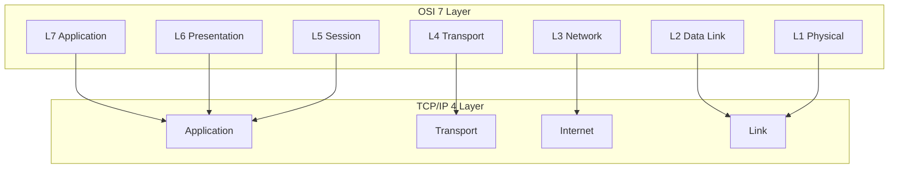
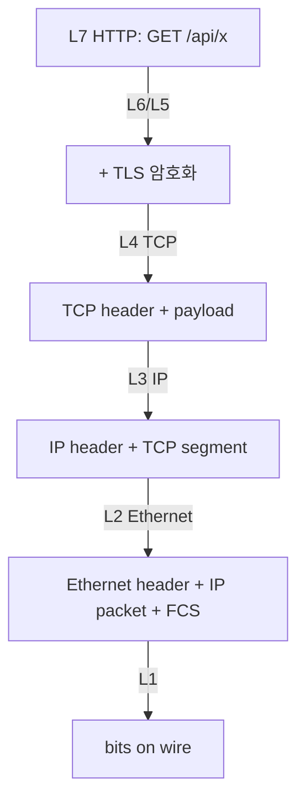
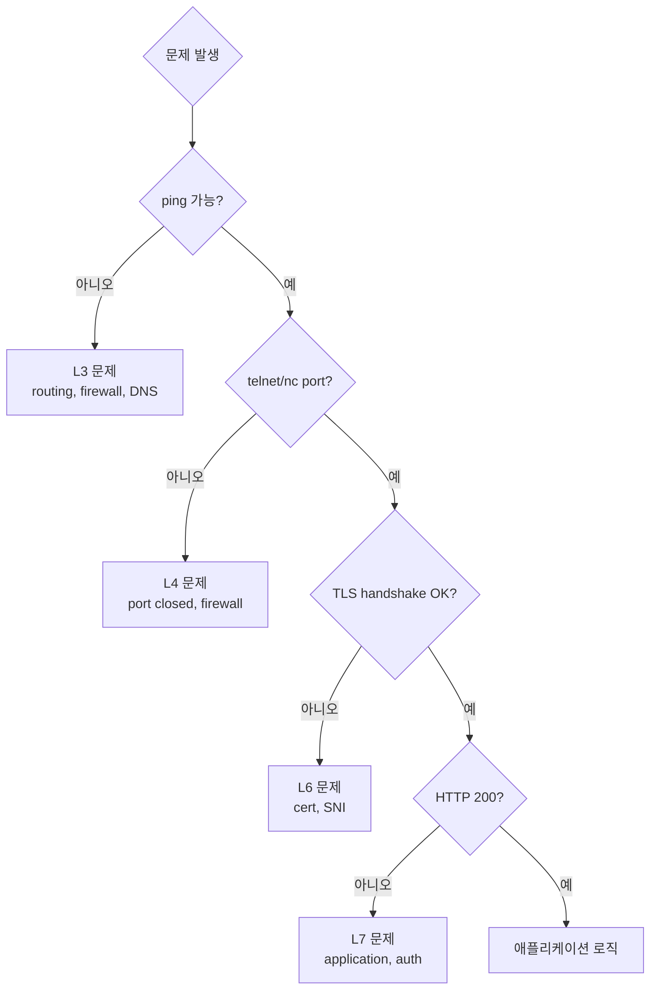

## 정의

**OSI 7 Layer 모델** 은 *네트워크 통신을 7 계층으로 추상화* 한 ITU-T 표준 (1984). 실제 인터넷은 *TCP/IP 4-5 계층* 이지만, OSI 의 *개념적 분리* 가 *디버깅 / 도구 분류* 의 토대.

```anim:osi-7-layer
{}
```

## 7 Layer 매트릭스

| Layer | 이름 | 단위 | 예 | 도구 |
|---|---|---|---|---|
| **L7** | Application | message | HTTP, gRPC, DNS, SMTP, MQTT, SSH | curl, postman |
| **L6** | Presentation | data | TLS, JSON, Protobuf, MIME, gzip | openssl |
| **L5** | Session | session | NetBIOS, RPC, *대부분 통합* | - |
| **L4** | Transport | segment | TCP, UDP, QUIC | netstat, ss, tcpdump |
| **L3** | Network | packet | IP, ICMP, BGP, OSPF | traceroute, ping |
| **L2** | Data Link | frame | Ethernet, WiFi, ARP, MAC | arp, wireshark |
| **L1** | Physical | bit | 케이블, 무선 신호, 전기/광 신호 | - |

## TCP/IP 와의 매핑

실제 인터넷은 *4-5 계층* 의 TCP/IP. OSI 의 5/6/7 이 *Application* 으로 통합:



## 각 계층 깊게

### L7 Application

*사용자 의도와 가장 가까운 계층*. HTTP, gRPC, DNS, SMTP, SSH.

- HTTP: `GET /api/users HTTP/1.1`
- DNS: `A example.com → 93.184.216.34`
- gRPC: `/shop.Shop/GetItem` over HTTP/2

> 자세한 건 [[HTTP/1.1]], [[HTTP/2]], [[HTTP/3]], [[gRPC]], [[network-dns]].

### L6 Presentation

*데이터 표현 변환*. 직렬화, 압축, 암호화.

- TLS (실제로는 L4-L7 사이)
- JSON, Protobuf, MessagePack
- gzip, deflate

### L5 Session

*세션 관리*. 현대에서는 *L7 의 일부* 또는 *애플리케이션 자체* 가 담당. (HTTP cookie, JWT 등)

### L4 Transport

*end-to-end 신뢰성 + flow control*.

| 프로토콜 | 신뢰성 | 순서 | 흐름제어 | 사용 |
|---|---|---|---|---|
| TCP | O | O | O | HTTP, FTP, SSH |
| UDP | X | X | X | DNS, VoIP, 게임, QUIC |
| QUIC | O | O (stream 별) | O | HTTP/3 |
| SCTP | O | 옵션 | O | WebRTC DataChannel |

자세한 건 [[TCP]], [[UDP]], [[QUIC]].

### L3 Network

*IP 라우팅*. *어떤 경로로 패킷이 갈지*. 라우터의 영역.

- IPv4, IPv6
- ICMP (ping, traceroute)
- BGP (인터넷 라우팅 프로토콜)
- OSPF, IS-IS (내부 라우팅)

자세한 건 [[IP]].

### L2 Data Link

*같은 LAN 안* 의 *MAC 주소* 기반 통신. Switch, WiFi AP.

- Ethernet (IEEE 802.3)
- WiFi (IEEE 802.11)
- ARP (IP → MAC 매핑)
- VLAN (Virtual LAN)

### L1 Physical

*실제 전기 / 광 신호*. 케이블, 무선, 광섬유.

## 패킷의 캡슐화



각 계층이 자기 *header* 를 *덧붙임*. 수신 측은 *역순으로 벗겨* 올라간다.

## 실전: 어디서 무엇이 깨졌나?

문제 진단의 *층 별 도구*:



| 도구 | 본 계층 |
|---|---|
| `ping` | L3 (ICMP) |
| `traceroute` | L3 |
| `nc / telnet host port` | L4 |
| `nmap` | L4 |
| `openssl s_client` | L6 (TLS) |
| `curl -v` | L7 (HTTP) |
| `dig / nslookup` | L7 (DNS) |
| `tcpdump / wireshark` | L2-L7 (raw) |

## 흔한 함정

> [!WARNING]
> 1. ***"L7 문제"* 라고 단정** = 실제는 L4 timeout 일 수 있다. *층별로 위에서 아래로 분리 진단*.
> 2. **TLS 가 *L4 라는 오해*** = TLS 는 *L5/L6 사이*. L4 (TCP/UDP) 위에서 동작.
> 3. **HTTPS 인증서 문제를 *방화벽 탓*** = `openssl s_client` 로 *handshake* 만 따로 확인.
> 4. **DNS 가 *L7 인지 L3 인지 헷갈림*** = *L7 (애플리케이션)*. UDP/TCP 53 위에서.

## 관련 위키

- [[TCP]], [[UDP]], [[QUIC]]
- [[IP]], [[TLS]]
- [[HTTP/1.1]], [[HTTP/2]], [[HTTP/3]]
- [[network-cidr-subnetting]]
- [[network-dns]]
