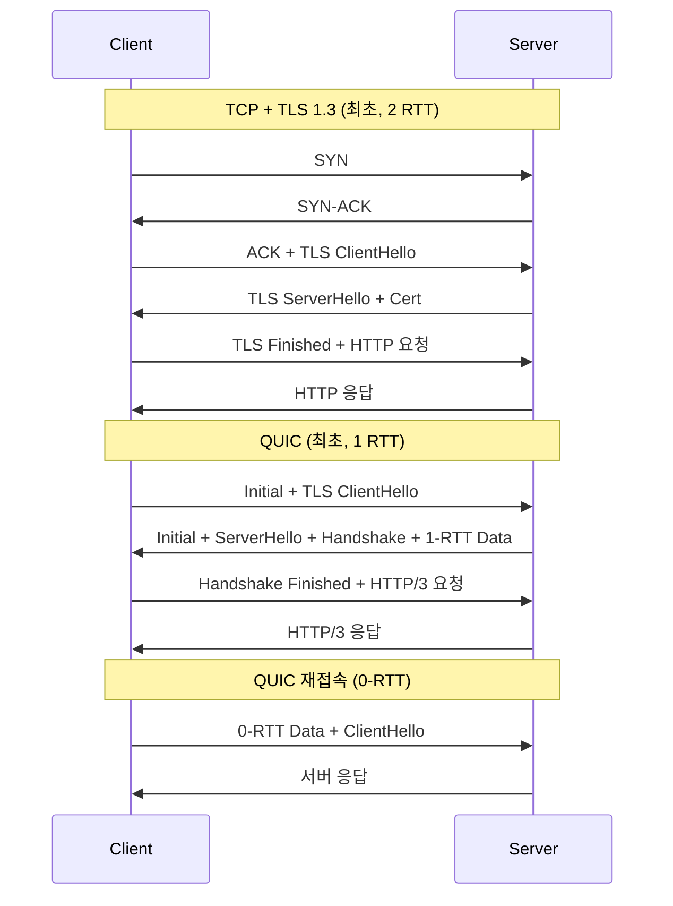
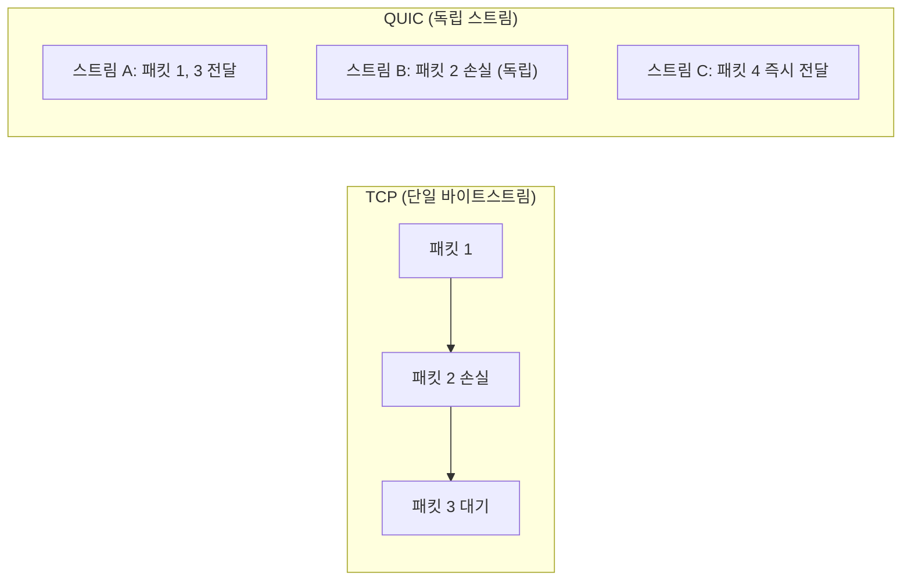
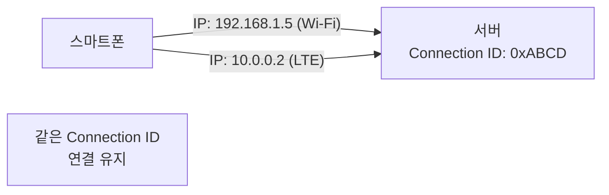

## 정의

**QUIC** (Quick UDP Internet Connections)은 Google이 2012년 처음 제안하고 2021년 [RFC 9000](https://datatracker.ietf.org/doc/html/rfc9000)으로 표준화된 [[udp|UDP]] 기반 전송 프로토콜이다. [[http-3|HTTP/3]]의 기반이 된다.

기존 [[tcp|TCP]]가 가지는 문제들을 OS 커널 수정 없이, 사용자 영역에서 해결하기 위해 [[udp|UDP]] 위에 구현되었다.

## 언제 쓰이나

- **HTTP/3**: 브라우저와 서버 간 최신 웹 전송 (Google, Cloudflare, Facebook 기본 활성)
- **WebTransport**: 브라우저에서 양방향 스트림 (WebSocket 대체 후보)
- **게임 / 실시간 미디어**: 저지연 + 패킷 손실 내성
- **모바일 앱**: Wi-Fi / 셀룰러 전환 시 연결 유지 (Connection Migration)

## TCP vs QUIC 핸드셰이크



QUIC 은 TLS 1.3 핸드셰이크를 전송 계층 협상과 통합했다. 최초 연결은 1 RTT, 세션 티켓을 캐시해 두면 재접속은 0-RTT 로 데이터를 즉시 전송할 수 있다.

## 핵심 특성

### 1. Stream 격리와 HOL Blocking 해결

[[head-of-line-blocking|Head-of-Line Blocking]]: TCP 의 bytestream 모델에서 한 패킷 손실이 그 이후 모든 데이터를 막는다. QUIC 은 스트림을 독립 단위로 격리해, 한 스트림의 패킷 손실이 다른 스트림에 영향을 주지 않는다.



### 2. TLS 1.3 통합

전송과 암호화 협상이 분리되어 있지 않다. QUIC 패킷은 헤더를 제외하고 **항상 암호화**된다. 중간 네트워크 장비가 내부를 들여다볼 수 없어 이후 프로토콜 확장도 방화벽에 차단될 우려가 없다.

### 3. Connection ID 와 Connection Migration

TCP 는 (소스 IP, 소스 포트, 목적지 IP, 목적지 포트) 4-tuple 로 연결을 식별한다. 모바일 환경에서 Wi-Fi 에서 셀룰러로 전환하면 IP 가 바뀌어 연결이 끊긴다.

QUIC 은 별도의 **Connection ID** 로 연결을 식별한다. IP 나 포트가 바뀌어도 같은 Connection ID 로 연결을 유지한다.



### 4. 사용자 영역 구현

TCP 는 OS 커널에 구현되어 있어 변경 배포가 느리다. QUIC 은 브라우저와 서버 라이브러리가 구현해 OS 업데이트 없이 새 기능을 배포할 수 있다.

## TCP 대비 정리

| 항목 | TCP | QUIC |
|:---|:---|:---|
| 기반 | OS 커널 | 사용자 영역 라이브러리 |
| HOL Blocking | 있음 | 스트림 단위 격리 |
| 최초 핸드셰이크 | 2-3 RTT | 1 RTT |
| 재접속 | 1 RTT | 0 RTT |
| 연결 식별 | IP + Port 4-tuple | Connection ID |
| IP 변경 시 | 연결 끊김 | Migration 유지 |
| 암호화 | TLS 별도 계층 | 항상 암호화 (TLS 통합) |
| 헤더 압축 | HTTP/2 [[hpack|HPACK]] | HTTP/3 QPACK |

## 실전: HTTP/3 서버 설정 (nginx)

```nginx
# nginx 1.25+ 기준 HTTP/3 + QUIC 설정
server {
    listen 443 quic reuseport;
    listen 443 ssl;

    ssl_certificate     /path/to/cert.pem;
    ssl_certificate_key /path/to/key.pem;
    ssl_protocols       TLSv1.3;

    # Alt-Svc 헤더로 브라우저에 QUIC 지원 알림
    add_header Alt-Svc 'h3=":443"; ma=86400';
}
```

## 실전: QUIC 연결 확인

```bash
# curl 로 HTTP/3 요청 (curl 7.88+ + QUIC 빌드 필요)
curl --http3 https://cloudflare.com -I

# HTTP/3 협상 확인
curl -v --http3 https://example.com 2>&1 | grep "ALPN"
# ALPN: h3

# Python (aioquic 라이브러리)
# pip install aioquic
```

```python
import asyncio
from aioquic.asyncio import connect
from aioquic.quic.configuration import QuicConfiguration

async def quic_client():
    config = QuicConfiguration(is_client=True)
    async with connect("example.com", 443, configuration=config) as conn:
        # QUIC 연결 위에서 HTTP/3 스트림 열기
        reader, writer = await conn.create_stream()
        writer.write(b"GET / HTTP/3\r\n\r\n")
        data = await reader.read(4096)
        print(data)

asyncio.run(quic_client())
```

## QUIC 패킷 구조

```
QUIC 패킷 (UDP 페이로드)
+------------------+------------------+
| Header (암호화)  | Payload (암호화) |
+------------------+------------------+
| Packet Type      | STREAM Frame     |
| Connection ID    | ACK Frame        |
| Packet Number    | CRYPTO Frame     |
+------------------+------------------+
```

TCP 와 달리 QUIC 패킷은 **헤더 일부를 제외하고 전부 암호화**된다. 중간 장비 (라우터, 방화벽) 는 Connection ID 와 패킷 번호 정도만 볼 수 있다.

## 약점 및 주의점

> [!WARNING]
> **UDP 차단 방화벽**: 기업망, 일부 ISP 에서 UDP 포트 443 을 차단하거나 throttling 한다. HTTP/3 클라이언트는 TCP 기반 HTTP/2 fallback 을 반드시 구현해야 한다. 실제로 전체 트래픽의 5-10% 는 fallback 이 발생한다.

> [!CAUTION]
> **0-RTT 재전송 공격**: 0-RTT 데이터는 서버가 재생(replay) 을 방지하기 어렵다. 멱등하지 않은 요청 (POST, 결제 등) 을 0-RTT 로 보내면 replay 공격 위험이 있다. RFC 9000 §8.1 참조.

| 약점 | 상세 |
|:---|:---|
| UDP 차단 | 기업 방화벽, ISP throttling |
| CPU 비용 | 커널 바이패스 없이 암호화 비용이 TCP+TLS 보다 높을 수 있음 |
| NAT rebinding | Connection Migration 과 NAT 동작 충돌 가능 |
| 생태계 | TCP 에 비해 라이브러리/디버거 성숙도 낮음 |
| 패킷 캡처 | WireShark 등 도구에서 내부 분석이 어려움 |

## QUIC 구현체

| 구현체 | 언어 | 비고 |
|:---|:---|:---|
| **quiche** (Cloudflare) | Rust | 고성능, nginx/curl 에서 사용 |
| **ngtcp2** | C | libev 기반, 범용 |
| **msquic** (Microsoft) | C | Windows 내장, .NET 지원 |
| **quic-go** | Go | 순수 Go, HTTP/3 서버 구현에 자주 사용 |
| **aioquic** | Python | 연구/테스트 목적 |
| **MsQuic + NGINX** | C/C++ | 기업 배포 표준 |

### WebTransport

QUIC 위에서 브라우저가 양방향 스트림을 직접 열 수 있는 API. WebSocket 과 달리 HTTP 프록시를 거치지 않고 다중 독립 스트림을 사용할 수 있다.

```javascript
// WebTransport (Chrome 97+, HTTP/3 기반)
const transport = new WebTransport("https://example.com/transport");
await transport.ready;

const stream = await transport.createBidirectionalStream();
const writer = stream.writable.getWriter();
await writer.write(new TextEncoder().encode("hello"));

const reader = stream.readable.getReader();
const { value } = await reader.read();
console.log(new TextDecoder().decode(value));
```

## 도입 현황 (2026 기준)

| 도입 사례 | 상세 |
|:---|:---|
| Google | 검색, YouTube, Gmail 기본 QUIC |
| Cloudflare | 모든 CDN 트래픽 |
| Meta | 자사 서비스 대부분 |
| Apple | iOS 네트워킹 스택 내장 |
| 주요 브라우저 | Chrome, Firefox, Safari, Edge 모두 지원 |

## TCP 에서 QUIC 으로 마이그레이션 체크리스트

실제 서비스에 HTTP/3 (QUIC) 을 도입할 때 확인해야 할 사항:

1. **UDP 허용 확인**: 서버 방화벽, 로드 밸런서, CDN 이 443/UDP 를 허용하는가
2. **Alt-Svc 헤더**: 브라우저에 HTTP/3 엔드포인트를 알리는 헤더 추가
3. **Fallback 보장**: UDP 차단 환경에서 자동으로 TCP/HTTP2 로 내려가는가
4. **인증서 TLS 1.3**: QUIC 은 TLS 1.3 필수. 1.2 이하는 불가
5. **성능 모니터링**: QUIC 연결 비율, fallback 비율, 지연시간을 분리 측정
6. **로드 밸런서**: QUIC Connection ID 기반 라우팅을 지원하는 LB 선택 (ngx_quic_lb 등)
7. **세션 티켓 공유**: 다중 서버 환경에서 0-RTT 재접속을 위해 세션 티켓을 공유해야 함

## QUIC 버전

| 버전 | 상태 | 비고 |
|:---|:---|:---|
| gQUIC | Google 내부 | 표준화 이전 구버전, 점진 폐기 |
| QUIC v1 | RFC 9000 (2021) | 현재 표준, HTTP/3 기반 |
| QUIC v2 | RFC 9369 (2023) | 암호화 개선, 마이그레이션 신호 보강 |

## 관련 위키

- [[udp|UDP]] - QUIC 의 기반 프로토콜
- [[tcp|TCP]] - QUIC 이 대체하려는 프로토콜
- [[head-of-line-blocking|Head-of-Line Blocking]] - QUIC 이 해결하는 문제
- [[http-3|HTTP/3]] - QUIC 위의 애플리케이션 계층
- [[tls|TLS]] - QUIC 에 통합된 암호화
- [[hpack|HPACK]] - HTTP/2 헤더 압축 (HTTP/3 는 QPACK)
- [[webrtc|WebRTC]] - 또 다른 UDP 기반 실시간 프로토콜
