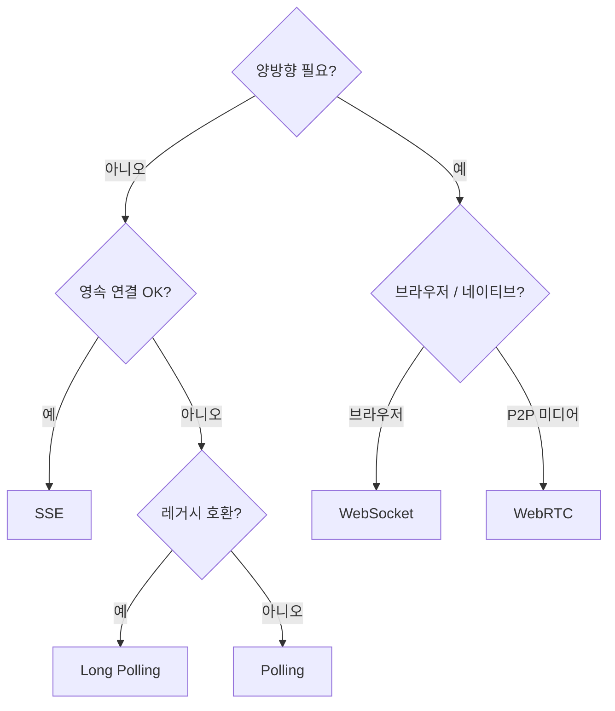
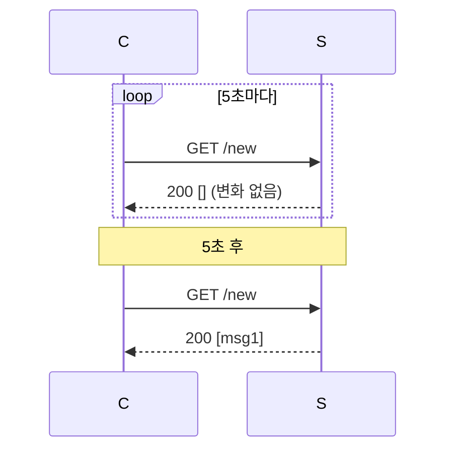
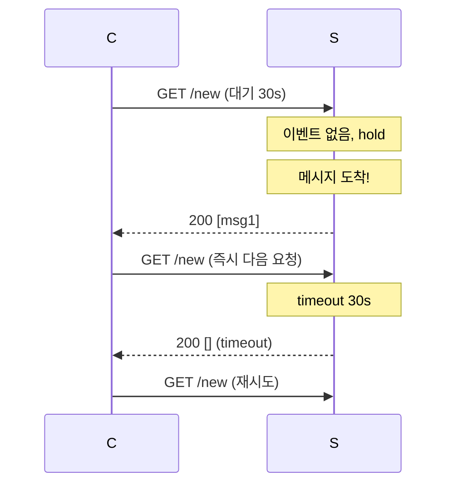
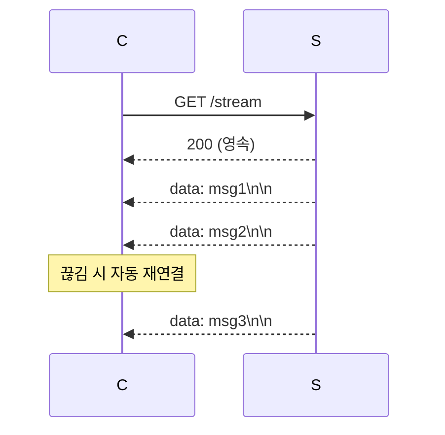
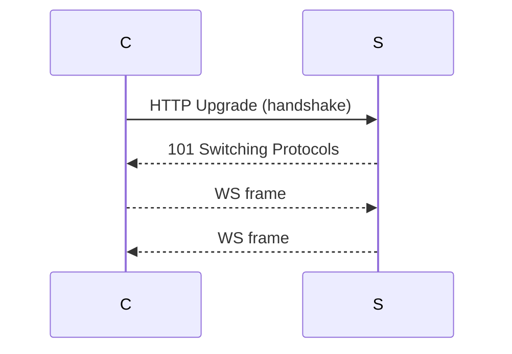

## 정의

*실시간 (서버 → 클라이언트) 데이터 전송* 의 7가지 패턴 비교.

```anim:realtime-comparison
{}
```

## 결정 트리



## 7가지 비교

| 패턴 | 방향 | 영속 | 프로토콜 | 사용 |
|---|---|---|---|---|
| **Short Polling** | C → S | 짧음 | HTTP | 단순 / legacy |
| **Long Polling** | C → S | 짧음 (hold) | HTTP | legacy fallback |
| **HTTP/2 server push** | S → C | (폐기) | HTTP/2 | (deprecated) |
| **SSE** | S → C | 영속 | HTTP | 알림, 라이브 피드 |
| **WebSocket** | 양방향 | 영속 | RFC 6455 | 채팅, 게임 |
| **WebTransport** | 양방향 (datagrams) | 영속 | HTTP/3 + QUIC | 차세대 (실험적) |
| **WebRTC DataChannel** | 양방향 (P2P) | 영속 | DTLS + SCTP | 게임 P2P, 파일 |

## Polling



- 가장 단순. 가장 *비효율적*.
- 평균 지연 = *polling 간격 / 2*.
- 메시지 없어도 *매 요청 발생* → 서버 부담.

> [!CAUTION]
> 자주 polling = 서버 부담. 드물게 polling = 지연 큼. *둘 다 안 좋음*.

## Long Polling



- *적은 빈도, 낮은 지연*.
- *legacy 환경* (옛 IE, 일부 프록시) 의 fallback.
- *connection 점유* 가 polling 보다 길다 → 서버 connection pool 압박.

## SSE (단방향 영속)

자세한 건 [[SSE]] 참고.



- *서버 → 클라이언트 일방향* 충분하면 *제일 단순*.
- 자동 재연결 + Last-Event-ID 재개.
- *프록시 / 방화벽 친화* (HTTP).

## WebSocket (양방향 영속)

자세한 건 [[WebSocket]] 참고.



- *양방향 + 영속*. 채팅 / 게임 / 협업 / 트레이딩.
- HTTP 위에서 시작하지만 *별도 프레임 프로토콜*.

## WebTransport (실험적, 차세대)

HTTP/3 (QUIC) 위 양방향 + *unreliable datagram* + *bidirectional streams*. *WebSocket + UDP datagram* 의 결합.

- 2026 시점 *모던 브라우저 지원 진입*.
- 게임 + 라이브 영상 + AR/VR.
- 아직 *대중적 도입 전*.

## WebRTC DataChannel (P2P)

```anim:webrtc-flow
{}
```

- 클라이언트 *↔* 클라이언트 *직접*. 서버는 *signaling 만*.
- DTLS + SCTP 위.
- P2P 게임, 파일 전송, 영상통화 보조.
- *NAT traversal* (STUN/TURN) 복잡도.

## 처리량 vs 지연 vs 복잡도

<ChartJs
  client:visible
  type="scatter"
  title="실시간 패턴: 처리량 vs 지연 (가상 직관)"
  caption="WebSocket / WebTransport 가 처리량+지연 모두 우수. SSE 는 단방향이지만 그만큼 단순."
  height="320px"
  data={{
    datasets: [
      { label: 'Short Polling', data: [{ x: 100, y: 5000 }], backgroundColor: '#ef4444', pointRadius: 8 },
      { label: 'Long Polling', data: [{ x: 500, y: 500 }], backgroundColor: '#f59e0b', pointRadius: 8 },
      { label: 'SSE', data: [{ x: 5000, y: 20 }], backgroundColor: '#a78bfa', pointRadius: 8 },
      { label: 'WebSocket', data: [{ x: 10000, y: 10 }], backgroundColor: '#22c55e', pointRadius: 8 },
      { label: 'WebRTC DC', data: [{ x: 15000, y: 5 }], backgroundColor: '#3b82f6', pointRadius: 8 },
    ],
  }}
  options={{
    scales: {
      x: { title: { display: true, text: '처리량 (msg/s, log)' }, type: 'logarithmic' },
      y: { title: { display: true, text: '평균 지연 (ms, log)' }, type: 'logarithmic' },
    },
  }}
/>

## 관련 위키

- [[SSE]], [[WebSocket]]
- [[HTTP/2]], [[HTTP/3]]
- [[Sticky Session]]
- [[Redis Pub Sub vs Streams]]
