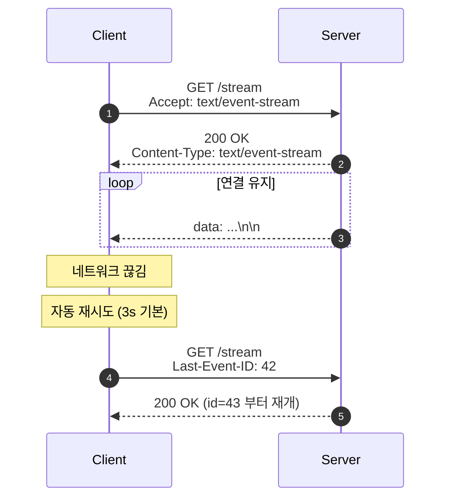
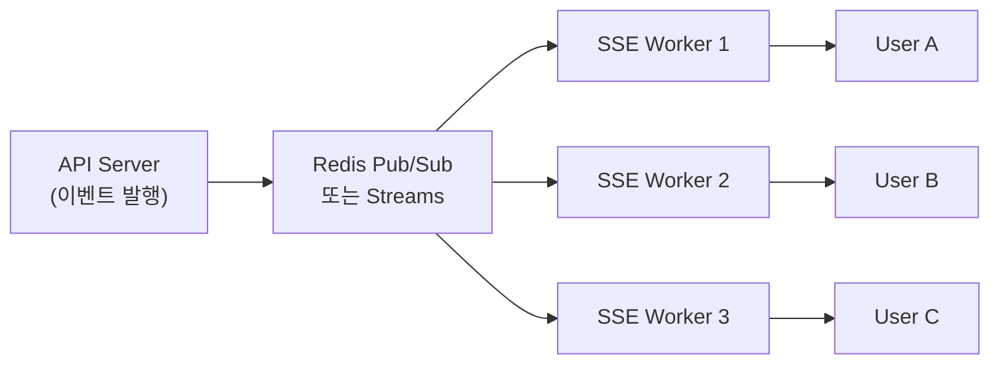

## 정의

**Server-Sent Events (SSE)** 는 *HTTP 위 단방향 (서버 → 클라이언트) 영속 스트림*. `text/event-stream` MIME + 클라이언트의 `EventSource` API.

장점: *HTTP/1.1 위에서 동작*, *자동 재연결*, *브라우저 native*, *프록시/방화벽 친화*.

## 메시지 포맷

```
data: hello\n
\n

data: line 1\n
data: line 2\n
\n

event: ping\n
data: {"t":1234}\n
\n

id: 42\n
data: msg\n
retry: 5000\n
\n
```

| 필드 | 의미 |
|---|---|
| `data:` | 본문 (여러 줄 가능, JOIN 으로 합쳐짐) |
| `event:` | 커스텀 이벤트 이름 (없으면 `message`) |
| `id:` | 메시지 ID. 재연결 시 `Last-Event-ID` 헤더로 보냄 |
| `retry:` | 재연결 간격 (ms) |
| `\n\n` | 메시지 끝 구분 |

## 서버 응답

```http
HTTP/1.1 200 OK
Content-Type: text/event-stream
Cache-Control: no-cache
Connection: keep-alive

data: {"price":42000}\n
\n

data: {"price":42100}\n
\n
```

## 클라이언트 (브라우저)

```js
const es = new EventSource('/api/prices/stream');

es.onopen = () => console.log('open');

es.onmessage = (e) => {
  const data = JSON.parse(e.data);
  console.log('price', data.price);
};

es.addEventListener('ping', (e) => {
  console.log('ping', e.data);
});

es.onerror = (e) => {
  // 자동 재연결 (브라우저가 처리)
  console.log('error', e);
};

// 명시 종료
es.close();
```

## 동작 흐름



> [!TIP]
> *서버는 `Last-Event-ID` 헤더를 검증하고 *그 ID 이후 이벤트* 만 보내야* 완벽한 재개. 보통 이벤트 ID 를 *DB 또는 Redis Stream offset* 으로.

## 백엔드 구현 (Node)

```js
app.get('/stream', (req, res) => {
  res.writeHead(200, {
    'Content-Type': 'text/event-stream',
    'Cache-Control': 'no-cache',
    'Connection': 'keep-alive',
  });

  const lastId = req.headers['last-event-id'];
  const startFrom = lastId ? +lastId + 1 : 0;

  let id = startFrom;
  const t = setInterval(() => {
    res.write(`id: ${id}\n`);
    res.write(`data: ${JSON.stringify({ t: Date.now() })}\n\n`);
    id++;
  }, 1000);

  req.on('close', () => clearInterval(t));
});
```

## 백엔드 구현 (Python / FastAPI)

```python
from fastapi import FastAPI
from fastapi.responses import StreamingResponse
import asyncio, json, time

app = FastAPI()

async def event_generator(last_event_id: int = 0):
    event_id = last_event_id + 1
    while True:
        payload = json.dumps({"t": time.time(), "id": event_id})
        yield f"id: {event_id}\ndata: {payload}\n\n"
        event_id += 1
        await asyncio.sleep(1)

@app.get("/stream")
async def stream(last_event_id: int = 0):
    return StreamingResponse(
        event_generator(last_event_id),
        media_type="text/event-stream",
        headers={
            "Cache-Control": "no-cache",
            "X-Accel-Buffering": "no",   # nginx proxy buffering 비활성화
        },
    )
```

> [!TIP]
> FastAPI / Starlette 는 `StreamingResponse` 로 SSE 를 쉽게 구현. `X-Accel-Buffering: no` 헤더로 *nginx 버퍼링 비활성화* 필수.

## SSE vs WebSocket vs Polling

| 항목 | SSE | WebSocket | Long Polling |
|---|---|---|---|
| 방향 | 서버 → 클라이언트 | 양방향 | 양방향 |
| 프로토콜 | HTTP/1.1 (또는 H2/H3) | 자체 (RFC 6455) | HTTP |
| 자동 재연결 | *내장* | 직접 구현 | 직접 |
| 텍스트 / 바이너리 | *텍스트만* (UTF-8) | 둘 다 | 텍스트 |
| 프록시 / 방화벽 친화 | *최고* | 보통 | 최고 |
| 브라우저 호환 | 모던 OK | 모던 OK | 모두 |
| 서버 자원 (idle 연결) | 가벼움 | 가벼움 | *무거움* (반복 연결) |

> [!IMPORTANT]
> *서버 → 클라이언트 일방향 푸시* (알림, 라이브 피드, 진행률) 면 *SSE 가 거의 항상 더 단순*. 양방향이 *진짜 필요할 때만* WebSocket.

## HTTP/2 위 SSE

HTTP/2 에서는 *multiplexing* 으로 *여러 SSE stream + 일반 요청* 한 연결에서. *HTTP/1.1 의 6 connection limit* 문제 해결.

## Fan-out / Scale-out 아키텍처

SSE 서버가 여러 인스턴스로 수평 확장될 때, *이벤트를 모든 인스턴스에 전파*하는 fan-out 레이어가 필요:



- *API Server* 가 이벤트를 Redis Pub/Sub 채널에 발행
- 각 *SSE Worker* 가 채널을 구독, 연결된 클라이언트에 전달
- 클라이언트는 *어느 Worker 에 연결되든* 동일 이벤트 수신

> [!IMPORTANT]
> *Sticky session 없이* 수평 확장 가능. 단 *Redis 가 SPOF* 가 되므로 Redis Cluster 또는 Sentinel 구성 권장.

## 인증 패턴

`EventSource` 는 *커스텀 헤더 (Authorization) 를 지원하지 않음*. 대안:

| 방법 | 구현 | 보안 |
|---|---|---|
| *쿠키* | 브라우저 자동 전송 | HttpOnly + SameSite=Strict |
| *URL 쿼리 파라미터* | `?token=xxx` | HTTPS 필수, 로그 노출 주의 |
| *초기 핸드셰이크 토큰* | REST 로 단기 토큰 발급 후 SSE URL 에 포함 | 권장 패턴 |

```js
// 초기 핸드셰이크 패턴
const { streamToken } = await fetch('/api/stream-token', {
  headers: { Authorization: `Bearer ${jwt}` },
}).then(r => r.json());

const es = new EventSource(`/api/stream?token=${streamToken}`);
```

## 활용

1. **알림 / 토스트**: 새 알림이 도착했을 때 push
2. **라이브 대시보드**: 메트릭 실시간
3. **AI Streaming (LLM 응답)**: OpenAI / Anthropic SDK 의 *streaming* 이 SSE 위에서
4. **빌드 / 배포 로그 tail**
5. **주식 / 코인 시세** (단방향 충분)
6. **진행률 표시**: 파일 업로드, 배치 작업 진행 상황

## 흔한 함정

> [!WARNING]
> 1. **PROXY 의 *response buffering*** = nginx 의 `proxy_buffering on` 이 *모든 데이터를 모아 보냄*. SSE 는 *즉시 flush* 필요. `proxy_buffering off` + `X-Accel-Buffering: no` 헤더.
> 2. **HTTP/1.1 의 6 connection limit** = 한 도메인에 *6개 이상* SSE 불가. HTTP/2 로 해결.
> 3. **`EventSource` 가 *재연결 시 자동* 인데 *지수 백오프 없음*** = 서버 과부하 위험. *서버에서 `retry:` 헤더로 조정*.
> 4. **CORS preflight + EventSource** = EventSource 는 *기본 헤더만* 지원. 커스텀 헤더 (Authorization) 가 필요하면 *URL 쿼리* 또는 *쿠키*.

## 관련 위키

- [[WebSocket]] (양방향)
- [[realtime-comparison]]
- [[HTTP/1.1]], [[HTTP/2]]
- [[Redis Pub Sub vs Streams]] (fan-out)
