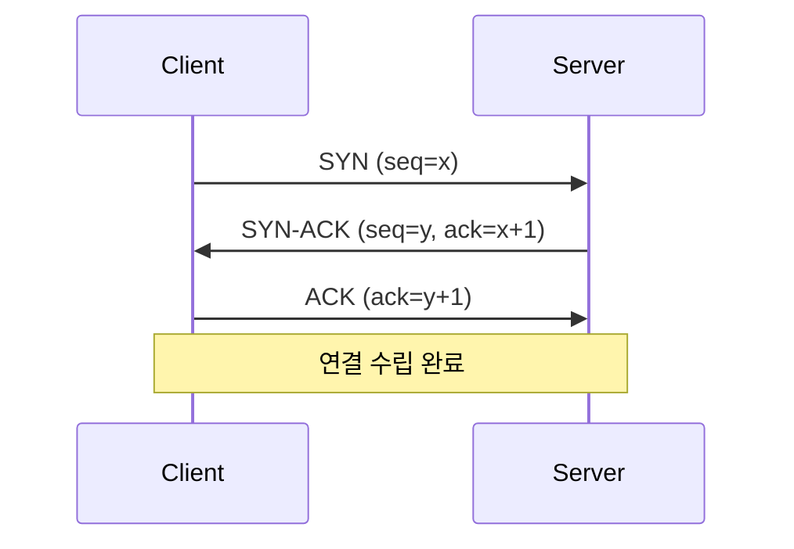
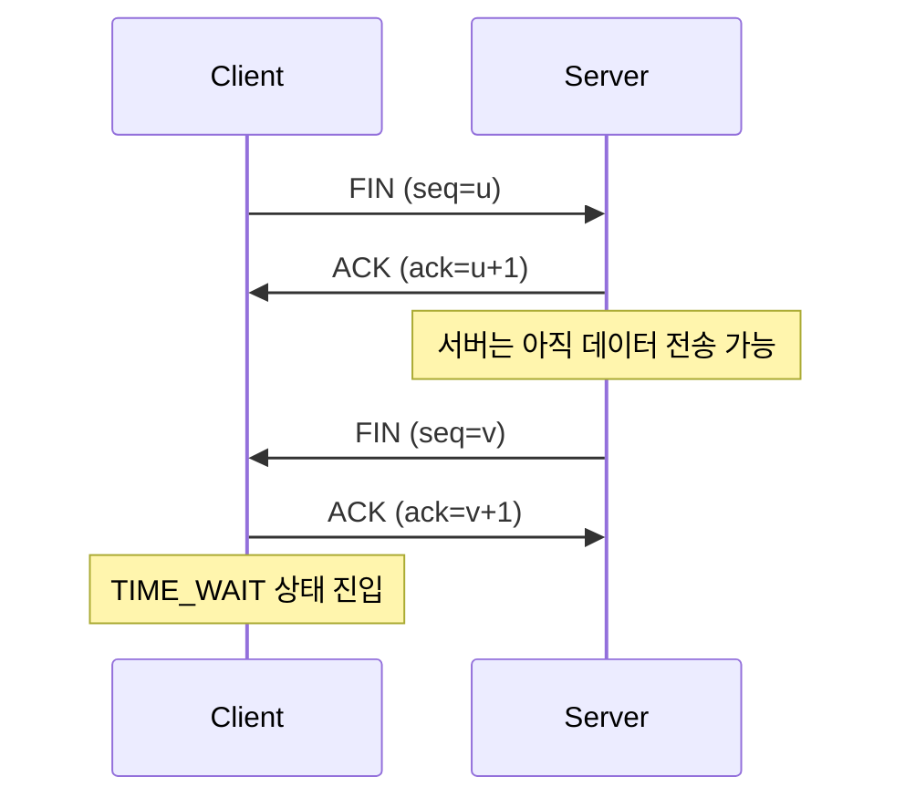
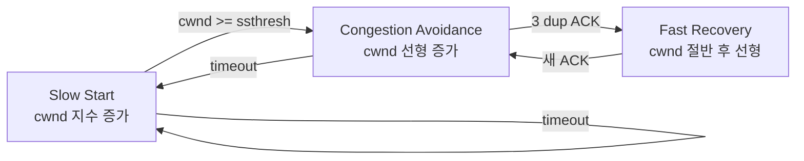
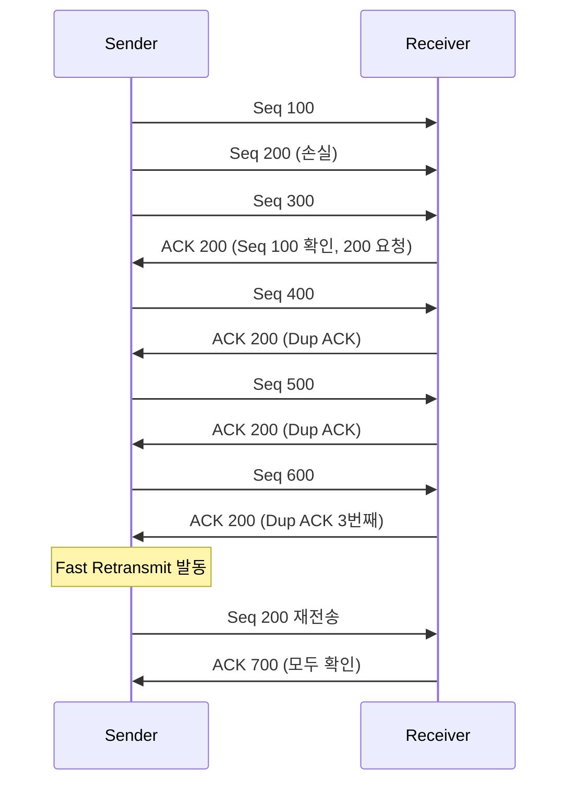

## 정의

**TCP** (Transmission Control Protocol) 는 신뢰성 있는 연결 지향 전송 계층 프로토콜이다. [RFC 9293](https://datatracker.ietf.org/doc/html/rfc9293) 으로 정의되어 있다. HTTP/1.1·2, SMTP, SSH, FTP 등 인터넷의 대부분 응용 프로토콜이 TCP 위에서 동작한다.

[[UDP]] 와 대비된다. UDP 가 "보내고 잊는" 방식이라면 TCP 는 "확실히 도착한, 순서대로 전달".

## 핵심 특성

- **연결 지향 (Connection-oriented)**: 통신 전에 3-way handshake 로 연결 확립
- **순서 보장 (In-order delivery)**: 패킷에 sequence number 부여, 수신측에서 재정렬
- **신뢰성 (Reliable)**: ACK 미수신 시 재전송, 손실 자동 복구
- **흐름 제어 (Flow Control)**: receiver window 로 수신측 처리 속도 맞춤
- **혼잡 제어 (Congestion Control)**: 네트워크 혼잡 시 송신 속도 조절 (Reno, Cubic, BBR 등)

## TCP 헤더 구조

```
 0         1         2         3
 0 1 2 3 4 5 6 7 0 1 2 3 4 5 6 7 0 1 2 3 4 5 6 7 0 1 2 3 4 5 6 7
+-+-+-+-+-+-+-+-+-+-+-+-+-+-+-+-+-+-+-+-+-+-+-+-+-+-+-+-+-+-+-+-+
|          Source Port          |       Destination Port        |
+-+-+-+-+-+-+-+-+-+-+-+-+-+-+-+-+-+-+-+-+-+-+-+-+-+-+-+-+-+-+-+-+
|                        Sequence Number                        |
+-+-+-+-+-+-+-+-+-+-+-+-+-+-+-+-+-+-+-+-+-+-+-+-+-+-+-+-+-+-+-+-+
|                    Acknowledgment Number                      |
+-+-+-+-+-+-+-+-+-+-+-+-+-+-+-+-+-+-+-+-+-+-+-+-+-+-+-+-+-+-+-+-+
|DataOff|Rsvd |U|A|P|R|S|F|          Window Size              |
+-+-+-+-+-+-+-+-+-+-+-+-+-+-+-+-+-+-+-+-+-+-+-+-+-+-+-+-+-+-+-+-+
|           Checksum            |         Urgent Pointer        |
+-+-+-+-+-+-+-+-+-+-+-+-+-+-+-+-+-+-+-+-+-+-+-+-+-+-+-+-+-+-+-+-+
```

주요 필드:
- **Sequence Number**: 이 세그먼트 첫 바이트의 스트림 내 위치
- **Acknowledgment Number**: 다음으로 기대하는 바이트 번호
- **Window Size**: 수신 버퍼의 남은 공간 (흐름 제어)
- **Flags**: SYN (연결 시작), ACK (확인), FIN (종료), RST (강제 종료), PSH (즉시 전달)

## 3-way Handshake (연결 수립)

```anim:tcp-handshake
{}
```



- **SYN**: "내 시작 번호는 x, 연결하겠다"
- **SYN-ACK**: "OK, 내 시작 번호는 y, 너의 x+1 번째를 기다린다"
- **ACK**: "알겠어, 너의 y+1 번째를 기다린다"

1 RTT 소요. [[TLS]] 까지 추가하면 보통 2-3 RTT.

> [!IMPORTANT]
> **SYN Flood 공격**: 악의적인 클라이언트가 SYN 만 보내고 ACK 를 보내지 않아 서버의 SYN 백로그 큐를 소진시킨다. `SYN Cookies` 로 서버 측 상태 저장 없이 방어 가능.

## 4-way Handshake (연결 종료)

```anim:tcp-fin-handshake
{}
```



각 방향(C→S, S→C) 을 독립적으로 종료하므로 4단계가 필요. 마지막 ACK 를 보낸 클라이언트는 **TIME_WAIT** 상태로 `2 x MSL` (Maximum Segment Lifetime, 보통 60s~4min) 동안 대기한다. 지연 도착 패킷이 새 연결을 오염시키는 것을 방지하기 위함.

## 흐름 제어 (Flow Control)

수신측이 처리 가능한 속도보다 빠르게 데이터가 들어오는 것을 방지.

```
Sender                                        Receiver
  │── Data (3000 bytes) ─────────────────────→ │ rwnd=65535
  │ ←── ACK, rwnd=30000 ────────────────────── │
  │── Data (10000 bytes) ───────────────────→ │ rwnd=30000
  │ ←── ACK, rwnd=20000 ────────────────────── │
  │── Data (20000 bytes) ───────────────────→ │
  │ ←── ACK, rwnd=0 (Zero Window) ─────────── │ 수신 버퍼 꽉 참
  │   [전송 중단, Zero Window Probe 대기]       │
  │ ←── ACK, rwnd=32768 ────────────────────── │ 버퍼 비워짐
  │── Data 재개 ────────────────────────────→ │
```

- **Receive Window (rwnd)**: 수신 버퍼의 남은 공간
- **Zero Window**: rwnd=0 이면 송신 중단. 주기적으로 Zero Window Probe 전송
- **Window Scaling** (RFC 7323): 16bit 윈도우를 최대 30bit (1GB) 로 확장. 대역폭 지연 곱이 큰 네트워크에서 필요

## 혼잡 제어 (Congestion Control)

네트워크 혼잡을 감지하고 송신 속도를 조절하는 TCP 의 핵심 메커니즘.

### 상태 전환



- **Slow Start**: cwnd (Congestion Window) 를 1 MSS 에서 시작, ACK 마다 1 MSS 증가 (지수 증가)
- **Congestion Avoidance**: ssthresh 도달 후, RTT 마다 1 MSS 씩 선형 증가
- **Fast Recovery**: 3개 중복 ACK 수신 시 ssthresh = cwnd/2, cwnd = ssthresh + 3. 타임아웃과 달리 Slow Start 로 돌아가지 않음

### 알고리즘 비교

| 알고리즘 | 손실 감지 | 장점 | 단점 | 사용처 |
|:---|:---|:---|:---|:---|
| Reno | 패킷 손실 | 단순, 범용 | 고 BDP 에서 대역폭 낭비 | 범용 |
| Cubic | 손실 + 시간 함수 | Reno 대비 처리량 개선 | 손실 기반 한계 | Linux 기본 |
| BBR | 대역폭-지연 모델 | 버퍼 팽창 없이 최대 처리량 | 구현 복잡, 공정성 이슈 | Google, Cloudflare |

**BBR** (Bottleneck Bandwidth and RTT): 패킷 손실 대신 RTT 와 대역폭을 직접 측정해 최적 전송 속도를 산출한다. Bufferbloat 방지 효과도 있다.

## 재전송 (Retransmission)

ACK 가 오지 않으면 재전송. 두 가지 트리거:

1. **RTO (Retransmission Timeout)**: 타이머 만료 시 재전송. 초기 RTO = 1s, 지수 백오프 적용
2. **Fast Retransmit**: 3개의 중복 ACK (Duplicate ACK) 수신 시 즉시 재전송



**SACK (Selective ACK)**: 수신된 비연속 구간을 명시해, 실제 손실된 것만 재전송 가능.

```
Without SACK: 200 손실 → 200, 300, 400, 500, 600 모두 재전송
With SACK:    200 손실 → 200 만 재전송 (300-600 수신 확인)
```

## TCP 의 한계

| 문제 | 설명 | 해결 시도 |
|:---|:---|:---|
| 연결 비용 | 매번 3-way handshake (1 RTT) | HTTP keep-alive, [[QUIC]] |
| [[Head-of-Line Blocking]] | 한 패킷 손실이 같은 연결의 모든 스트림 영향 | [[QUIC]] 가 스트림 격리로 완전 해결 |
| 연결 변경 시 끊김 | IP/Port 바뀌면 새 연결 수립 필요 | [[QUIC]] Connection Migration |
| 커널 종속 | OS 업데이트 없이는 개선 불가 | [[QUIC]] 사용자 영역 구현 |

## 실전 예시

### TCP 연결 상태 확인

```bash
# 확립된 연결 목록
ss -tn state established

# TIME_WAIT 상태 확인
ss -tn state time-wait | wc -l

# 포트별 연결 수
ss -tn | awk 'NR>1 {print $5}' | cut -d: -f2 | sort | uniq -c | sort -rn
```

### TIME_WAIT 과다 문제

대량의 단기 HTTP/1.0 요청 또는 특정 로드 밸런서 구성에서 TIME_WAIT 소켓이 포트를 점유해 `EADDRINUSE` 발생.

```bash
# TIME_WAIT 소켓 재사용 허용 (클라이언트 측)
sysctl net.ipv4.tcp_tw_reuse=1

# FIN_WAIT2 대기 시간 축소
sysctl net.ipv4.tcp_fin_timeout=15
```

### Nagle 알고리즘

작은 패킷을 모아 하나로 전송해 네트워크 효율을 높인다. SSH, 텔넷, 게임처럼 낮은 지연이 중요한 경우 `TCP_NODELAY` 옵션으로 비활성화.

```python
import socket
sock = socket.socket()
sock.setsockopt(socket.IPPROTO_TCP, socket.TCP_NODELAY, 1)
```

## 함정

> [!WARNING]
> 1. **HTTP keep-alive 와 TIME_WAIT 혼동**: HTTP keep-alive 는 응용 계층(TCP 연결 유지), TIME_WAIT 는 TCP 계층(종료 후 대기). 별개 개념.
> 2. **RTT = 네트워크 거리만?** RTT 에는 패킷 왕복 시간 외에 큐잉 지연, 처리 지연도 포함된다.
> 3. **Nagle 알고리즘 방치**: 낮은 지연이 중요한 서비스 (채팅, 게임) 에서 Nagle 이 활성화된 채로 소량 메시지를 반복 전송하면 지연 누적.
> 4. **TCP_NODELAY 와 TCP_CORK 혼동**: NODELAY 는 소량 패킷 즉시 전송, CORK 는 패킷 모아서 전송 (반대 효과).

## 사용처

- HTTP/1.1, HTTP/2 (HTTPS 포함)
- WebSocket (HTTP Upgrade 후 TCP 그대로)
- SSH, SMTP, FTP
- 데이터베이스 프로토콜 대부분 (PostgreSQL, MySQL wire protocol)

## 관련 위키

- [[QUIC]] - UDP 기반 대안, HOL 해결
- [[TLS]] - TCP 위 암호화 프로토콜
- [[UDP]] - 비연결형 경량 대안
- [[Head-of-Line Blocking]] - TCP 의 HOL 문제
- [[OSI 7 Layer]] - L4 Transport 계층
