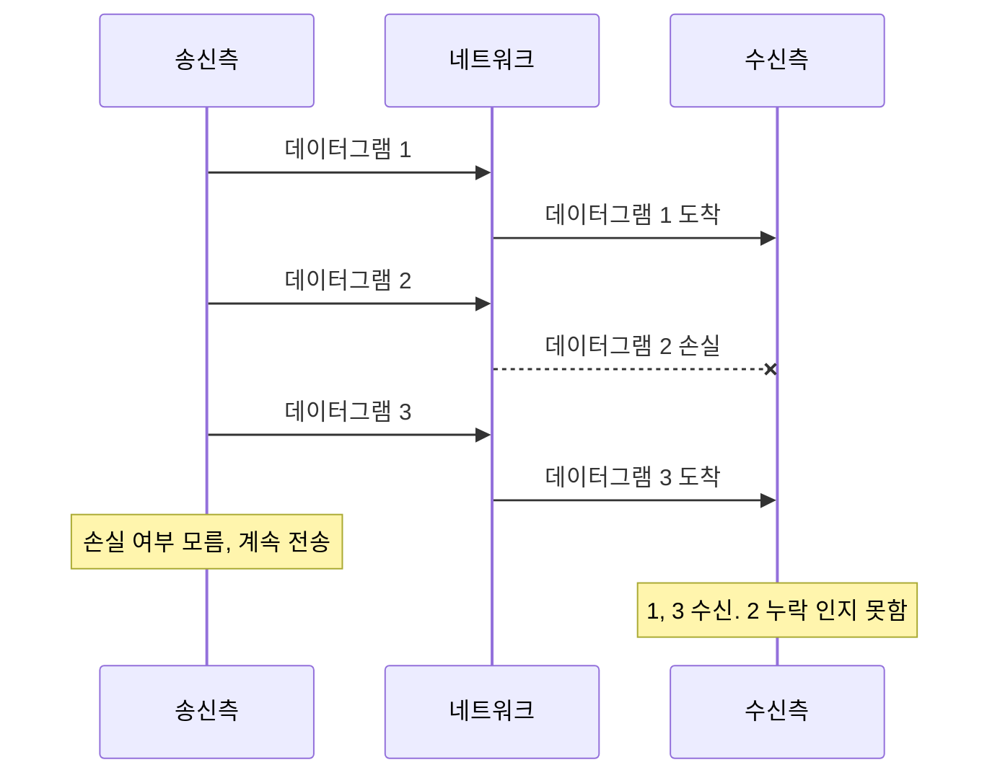
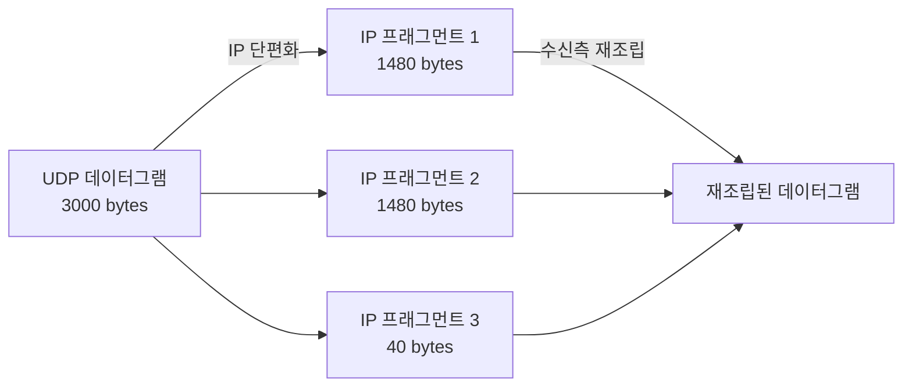
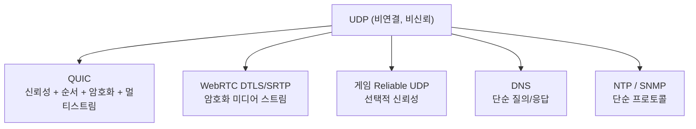

## 정의

**UDP** (User Datagram Protocol)는 비연결·비신뢰 전송 계층 프로토콜이다. [RFC 768](https://datatracker.ietf.org/doc/html/rfc768) (1980) 로 정의되었다. [[tcp|TCP]] 와 대비된다.

"보내고 잊는다(fire-and-forget)", 송신측은 패킷을 던지고 끝, 받았는지 안 받았는지 확인하지 않는다.

## 언제 쓰이나

신뢰성보다 **저지연·저오버헤드**가 더 중요할 때.

- **DNS**: 작은 질의·응답, 응답 안 오면 재시도하면 됨
- **실시간 미디어**: 비디오 통화에서 1 프레임 손실은 재전송할 시간이 없음, 다음 프레임이 더 중요
- **게임**: 위치 업데이트가 1 패킷 잃어도 다음 패킷이 곧 옴
- **DHCP, NTP, SNMP**: 단순한 요청·응답
- **[[quic|QUIC]]** / [[http-3|HTTP/3]]: UDP 위에서 신뢰성·순서 보장을 사용자 영역에서 직접 구현

## 헤더 구조

UDP 패킷 헤더는 총 **8 bytes** (TCP 의 20+ bytes 와 대비).

```anim:udp-packet-structure
{}
```

| 필드 | 크기 | 설명 |
|:---|:---:|:---|
| Source Port | 2 bytes | 송신측 포트 |
| Destination Port | 2 bytes | 수신측 포트 |
| Length | 2 bytes | 헤더 + 데이터 길이 |
| Checksum | 2 bytes | 무결성 검증 |

TCP 헤더 (20 bytes 이상, 옵션 포함 시 최대 60 bytes) 와 비교하면, UDP 헤더는 응용에 필요한 최소 정보만 담는다. 흐름 제어, 혼잡 제어, 재전송 등 모든 신뢰성 메커니즘을 제거한 결과다.

## 전송 방식, Fire-and-Forget

```anim:udp-transmission
{}
```



UDP 는 핸드셰이크 없이 즉시 송신한다. ACK 없음, 손실되어도 송신측은 알 수 없다.

## TCP 와 비교

| 항목 | TCP | UDP |
|:---|:---|:---|
| 연결 | 3-way handshake 필요 | 연결 없음 |
| 신뢰성 | 손실 재전송 | 없음 |
| 순서 | 보장 | 보장 안 함 |
| 흐름 제어 | 있음 | 없음 |
| 혼잡 제어 | 있음 | 없음 |
| 헤더 크기 | 20-60 bytes | 8 bytes |
| 지연시간 | 높음 | 낮음 |
| 브로드캐스트/멀티캐스트 | 불가 | 가능 |

## MTU 와 단편화

**MTU (Maximum Transmission Unit)**: 이더넷 표준 1500 bytes. IP 헤더 20 bytes + UDP 헤더 8 bytes = 실데이터 최대 **1472 bytes** (이더넷 기준).

이보다 큰 데이터그램은 IP 계층에서 **단편화(fragmentation)** 된다.



> [!WARNING]
> 단편화는 성능 저하 + 재조립 실패 위험이 있다. 중간 라우터에서 한 조각만 잃어도 전체 데이터그램을 드롭한다. 실전에서는 Path MTU Discovery 로 경로 MTU 를 알아낸 뒤 그 이하로 전송한다.

```
최적 페이로드 크기 = Path MTU - IP 헤더 - UDP 헤더
이더넷 기준: 1500 - 20 - 8 = 1472 bytes
```

## 브로드캐스트 / 멀티캐스트

UDP 는 1:N 전송을 지원한다. TCP 는 1:1 연결만 가능.

| 전송 방식 | 설명 | UDP | TCP |
|:---|:---|:---:|:---:|
| 유니캐스트 | 1:1 | O | O |
| 브로드캐스트 | 1:네트워크 전체 | O | X |
| 멀티캐스트 | 1:그룹 구독자 | O | X |

- **DHCP**: 브로드캐스트로 서버 탐색
- **mDNS / DNS-SD**: 로컬 서비스 발견 (Bonjour)
- **IPTV**: 멀티캐스트로 동일 스트림을 여러 수신자에 전달

## "UDP 위에 신뢰성을 다시 만든다"는 역설

[[quic|QUIC]], [[webrtc|WebRTC]] DTLS/SRTP, 게임 엔진의 reliable UDP 가 모두 UDP 위에서 TCP 와 유사한 기능을 직접 구현한다. 왜?

- **TCP 의 한계를 우회**: OS 커널 의존, [[head-of-line-blocking|Head-of-Line Blocking]], 연결 변경 시 끊김
- **선택적 신뢰성**: 메시지마다 "ordered / unordered, reliable / unreliable" 선택 가능
- **빠른 진화**: 사용자 영역 구현이라 OS 업데이트 없이 개선



UDP 의 "단순함"은 양날의 검, 직접 구현해야 하지만 그만큼 유연하다.

## 실전 예시

### DNS 질의 (Python)

```python
import socket
import struct

def build_dns_query(hostname: str) -> bytes:
    """간이 DNS A 레코드 요청 패킷"""
    transaction_id = b"\xab\xcd"
    flags = b"\x01\x00"   # 표준 질의
    questions = b"\x00\x01"
    answers = rrcount = additional = b"\x00\x00"
    
    # QNAME 인코딩
    qname = b""
    for part in hostname.split("."):
        qname += bytes([len(part)]) + part.encode()
    qname += b"\x00"
    
    qtype = b"\x00\x01"   # A 레코드
    qclass = b"\x00\x01"  # IN (인터넷)
    return transaction_id + flags + questions + answers + rrcount + additional + qname + qtype + qclass


def dns_lookup(hostname: str) -> bytes:
    sock = socket.socket(socket.AF_INET, socket.SOCK_DGRAM)  # SOCK_DGRAM = UDP
    sock.settimeout(2.0)
    
    query = build_dns_query(hostname)
    sock.sendto(query, ("8.8.8.8", 53))  # Google Public DNS
    
    # 응답이 없으면 timeout 예외 -> 재시도 (애플리케이션 레벨 신뢰성)
    response, _ = sock.recvfrom(512)
    sock.close()
    return response
```

### 실시간 게임 위치 동기화

```python
import socket
import struct
import time

sock = socket.socket(socket.AF_INET, socket.SOCK_DGRAM)

def send_position(x: float, y: float, seq: int, server: tuple):
    # 패킷: seq(4B) + x(4B) + y(4B) = 12 bytes
    payload = struct.pack("!Iff", seq, x, y)
    sock.sendto(payload, server)
    # ACK 없음: 손실된 위치는 무시, 다음 패킷이 곧 도착

SERVER = ("game.example.com", 7777)
seq = 0
while True:
    send_position(player.x, player.y, seq, SERVER)
    seq += 1
    time.sleep(0.05)  # 20 Hz 업데이트
```

### UDP 서버 (에코 서버)

```python
import socket

def udp_echo_server(port: int = 9999):
    sock = socket.socket(socket.AF_INET, socket.SOCK_DGRAM)
    sock.bind(("0.0.0.0", port))
    print(f"UDP Echo Server on port {port}")

    while True:
        data, addr = sock.recvfrom(1024)
        print(f"Received {len(data)} bytes from {addr}")
        sock.sendto(data, addr)  # 에코 (연결 없이 즉시 응답)
```

## 함정

> [!WARNING]
> **NAT 는 UDP 를 잘 모른다.** TCP 는 SYN/FIN 으로 상태를 추적하지만 UDP 는 상태가 없어 NAT 테이블 타임아웃이 짧다 (보통 30초). 장시간 UDP 세션이 필요하면 keepalive 패킷으로 NAT 테이블을 유지해야 한다.

> [!CAUTION]
> **UDP 증폭 공격 (DRDoS)**: 요청 패킷은 작고 응답이 매우 클 수 있는 DNS, NTP, SSDP 등에서 소스 IP 를 위조한 UDP 요청으로 증폭 공격이 발생한다. 공개 UDP 서비스는 응답 크기 제한 + 소스 IP 검증 필수.

> [!IMPORTANT]
> **체크섬은 IPv4 에서 선택 사항이었다.** 하지만 현대 OS 는 기본적으로 체크섬을 계산한다. IPv6 에서는 UDP 체크섬이 필수다. 체크섬은 내용 변조 감지는 하지만 재전송을 보장하지는 않는다.

## UDP 포트 번호 주요 사례

잘 알려진 UDP 포트 (Well-Known Ports):

| 포트 | 프로토콜 | 설명 |
|:---:|:---|:---|
| 53 | DNS | 도메인 이름 조회 |
| 67/68 | DHCP | IP 주소 자동 할당 |
| 123 | NTP | 시간 동기화 |
| 161/162 | SNMP | 네트워크 장비 관리 |
| 443 | QUIC | HTTP/3 (TLS over UDP) |
| 5353 | mDNS | 로컬 서비스 발견 |
| 5004 | RTP | 실시간 미디어 전송 |

## 관련 위키

- [[tcp|TCP]] - 신뢰성 있는 대안 프로토콜
- [[quic|QUIC]] - UDP 위에 구현된 차세대 전송 계층
- [[http-3|HTTP/3]] - QUIC 기반 HTTP
- [[head-of-line-blocking|Head-of-Line Blocking]] - TCP 의 단점
- [[dtls|DTLS]] - UDP 기반 TLS
- [[webrtc|WebRTC]] - UDP 기반 실시간 미디어
- [[osi-7-layer|OSI 7계층]] - 전송 계층 (Layer 4) 컨텍스트
