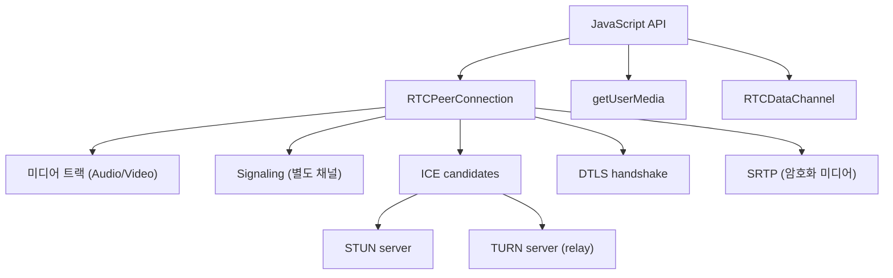
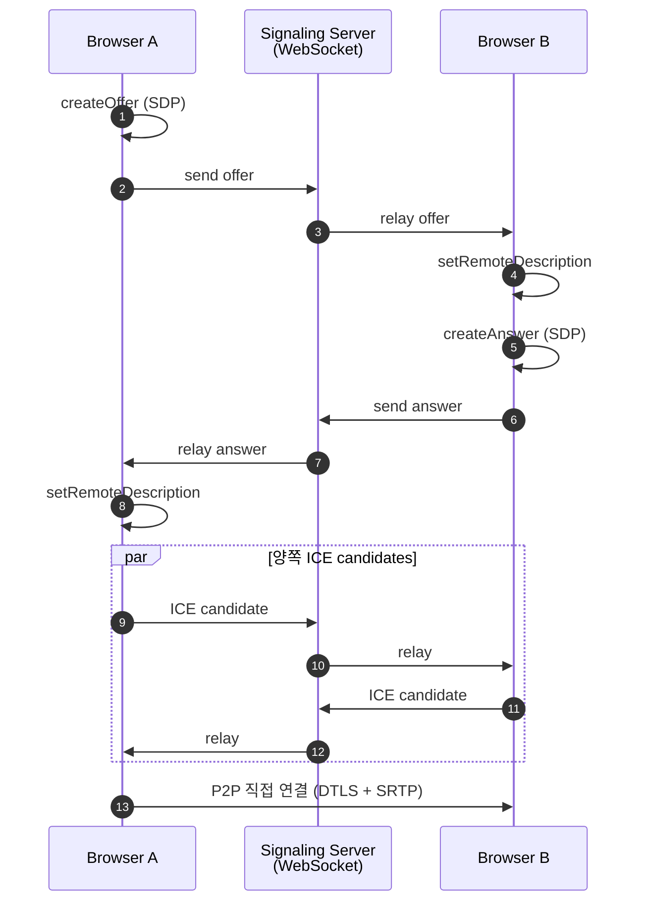
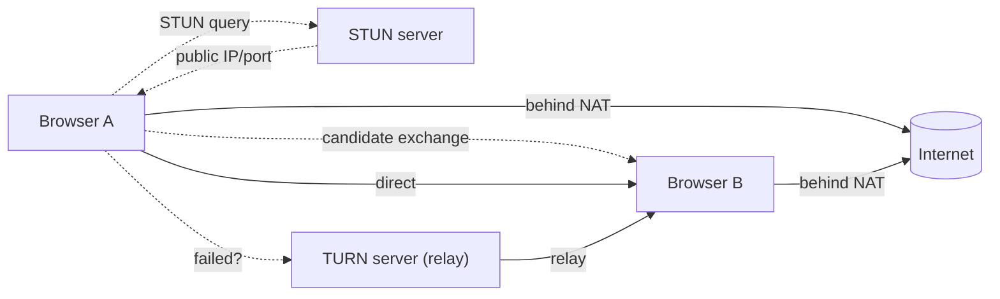
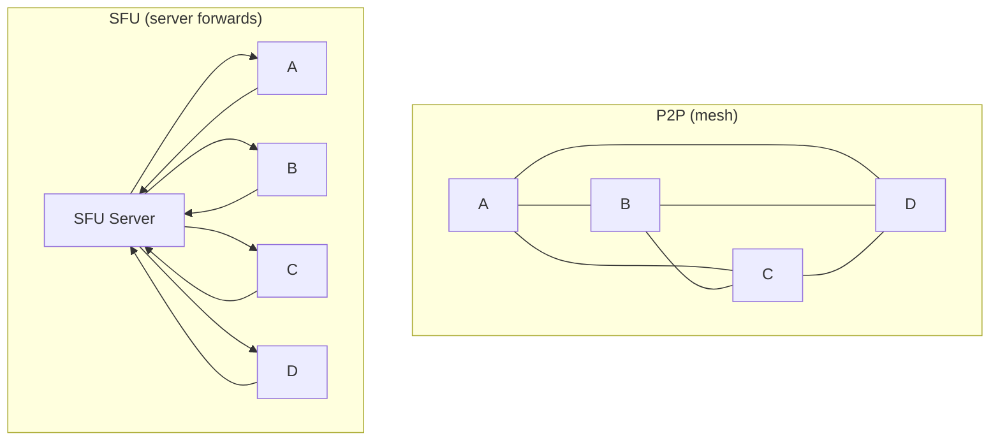
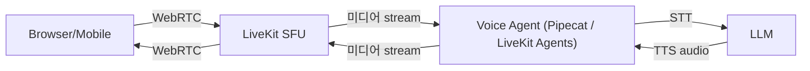

## 정의

**WebRTC** = 브라우저 / 모바일 *P2P 실시간 미디어 + 데이터* 표준. 음성, 비디오, 데이터 채널. 2026 시점 *voice agent + 영상 통화 + 화면 공유* 의 표준.

## 동작 직관

```anim:webrtc-flow
{}
```

## 핵심 컴포넌트



| API | 역할 |
|---|---|
| `getUserMedia` | 마이크 / 카메라 접근 |
| `RTCPeerConnection` | P2P 연결 |
| `RTCDataChannel` | 임의 데이터 |
| `RTCRtpSender/Receiver` | 미디어 송수신 제어 |

## Signaling (WebRTC 가 *직접* 다루지 않음)



> *Signaling 은 WebRTC 표준 외부*. WebSocket / HTTP 폴링 등 *자유*.

## SDP (Session Description Protocol)

```
v=0
o=- 1719318060 2 IN IP4 127.0.0.1
s=-
t=0 0
m=audio 9 UDP/TLS/RTP/SAVPF 111 103 104
a=rtpmap:111 opus/48000/2
a=rtpmap:103 ISAC/16000
a=fmtp:111 minptime=10;useinbandfec=1
a=setup:actpass
a=fingerprint:sha-256 AC:8D:...
...
```

> 코덱 / 포맷 / 보안 / ICE 후보 등. *offer/answer 모델*.

## ICE / STUN / TURN



| | STUN | TURN |
|---|---|---|
| 역할 | *내 공용 IP/Port 알려줌* | 미디어 *중계* (P2P 실패 시) |
| 부하 | 낮음 | *높음* (모든 미디어 흐름) |
| 비용 | 거의 0 | *비쌈* (대역폭) |
| 예 | `stun:stun.l.google.com:19302` | coturn (self-host) |

> 약 20% 의 사용자가 *symmetric NAT / 방화벽* 때문에 *TURN 필요*. coturn 운영 필수.

## DataChannel (임의 데이터)

```javascript
const dc = pc.createDataChannel('chat', { ordered: true });
dc.onopen = () => dc.send('hello');
dc.onmessage = (e) => console.log(e.data);
```

| 모드 | 의미 |
|---|---|
| ordered + reliable | TCP 같은 (기본) |
| unordered + unreliable | UDP 같은 (게임) |
| reliable + maxPacketLifeTime | 시간 한도 |

## SFU (Selective Forwarding Unit)

P2P 는 *N 명 → N×(N-1)/2 연결*. 4명 = 6 연결, 10명 = 45 연결. 폭발.



| | P2P (mesh) | SFU | MCU |
|---|---|---|---|
| 적합 | 1:1 / 작은 그룹 | *5-100 명* | TV/대규모 |
| 클라이언트 부하 | N-1 stream | 1 publish + 멀티 download | 1 stream |
| 서버 비용 | 0 | *중간 (forwarding)* | *높음 (transcoding)* |
| 예 | 일반 WebRTC | LiveKit, mediasoup, Janus | Jitsi Videobridge |

## 음성 에이전트 + WebRTC



자세한 건 [[pipecat-livekit]].

## WebRTC vs WebSocket vs HTTP/3 (voice)

| 항목 | WebRTC | WebSocket | HTTP/3 |
|---|---|---|---|
| Latency | *최저* (UDP) | 중간 (TCP) | 중간 |
| Packet loss | *FEC + loss concealment* | TCP 재전송 (HoL) | QUIC stream 별 |
| Echo cancel | *내장 (browser)* | 직접 | 직접 |
| NAT 통과 | ICE | TCP/HTTP 기본 OK | UDP 차단 위험 |
| 코덱 | Opus, VP8/9, H264 | 직접 | 직접 |
| 사용 | voice / video | 일반 | 차세대 |

> *voice agent = WebRTC 가 거의 정답*. 단 *방화벽 UDP 차단 환경* 은 WebSocket fallback.

## 흔한 함정

> [!WARNING]
> 1. **STUN 만 + TURN 없음** = 20% 사용자 연결 실패. *coturn 운영* 필수.
> 2. **에코 (사용자 음성 마이크로 다시)** = `getUserMedia({ audio: { echoCancellation: true } })`. AEC 필수.
> 3. **Signaling = WebSocket 권장** = HTTP long-polling 은 *느리고 깨짐 잦음*.
> 4. **mesh 4명+ 운영** = N² 폭발. SFU 로 *반드시* 전환.
> 5. **SDP 직접 편집** = browser 버전마다 다름. *libwebrtc / SFU lib 활용*.

## 관련 위키

- [[voice-agent-architecture]]
- [[pipecat-livekit]]
- [[WebSocket]]
- [[UDP]]
- [[TLS]] (DTLS 기반)
