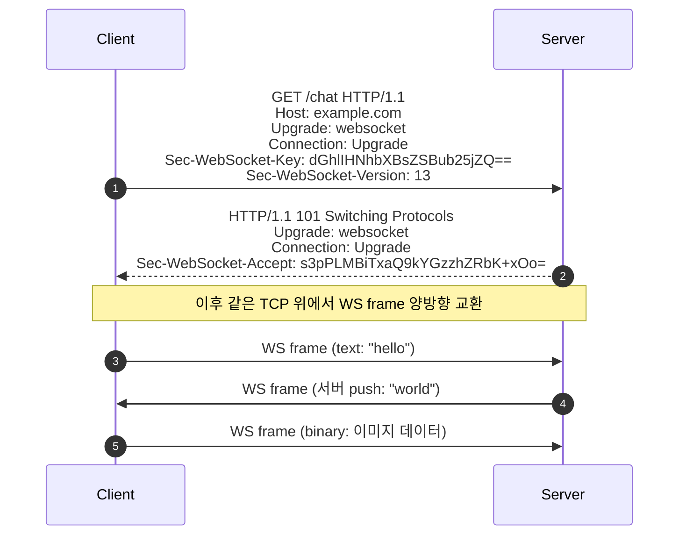
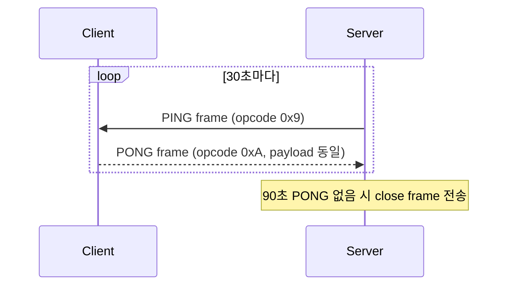
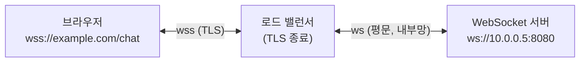
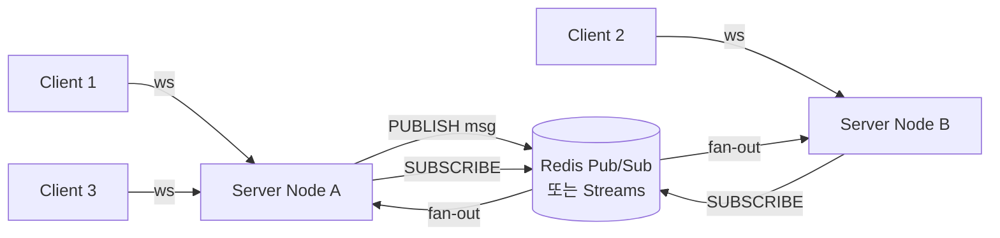
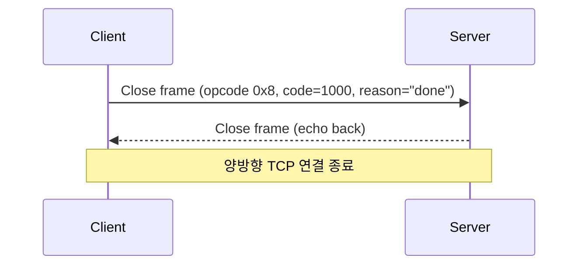

## 정의

**WebSocket** ([RFC 6455](https://datatracker.ietf.org/doc/html/rfc6455))은 HTTP/1.1 Upgrade로 시작하는 양방향 영속 메시지 채널이다. 하나의 [[tcp|TCP]] 연결 위에서 서버와 클라이언트가 임의 시점에 메시지를 push할 수 있다.

HTTP는 클라이언트가 요청해야 서버가 응답하는 단방향 구조다. WebSocket은 이 제약을 제거해 서버가 먼저 메시지를 보낼 수 있게 한다.

**주요 활용**: 실시간 채팅, 트레이딩 시세, 멀티플레이어 게임, 알림 시스템, 공동 편집, 라이브 대시보드.

## Handshake: HTTP Upgrade



`Sec-WebSocket-Accept`는 클라이언트가 보낸 key와 고정 GUID를 결합한 SHA-1 해시의 Base64 인코딩이다:

```
Accept = Base64(SHA-1(Sec-WebSocket-Key + "258EAFA5-E914-47DA-95CA-C5AB0DC85B11"))
```

이 절차는 프로토콜 착각(평범한 HTTP 응답으로 오해)을 방지하기 위한 핸드셰이크 무결성 검증이다.

## Frame 구조

```
 0                   1                   2                   3
 0 1 2 3 4 5 6 7 8 9 0 1 2 3 4 5 6 7 8 9 0 1 2 3 4 5 6 7 8 9 0 1
+-+-+-+-+-------+-+-------------+-------------------------------+
|F|R|R|R| opcode|M| Payload len |    Extended payload length    |
|I|S|S|S|  (4)  |A|     (7)     |             (16/64)           |
|N|V|V|V|       |S|             |   (if payload len == 126/127) |
| |1|2|3|       |K|             |                               |
+-+-+-+-+-------+-+-------------+-------------------------------+
|     Extended payload length continued, if payload len == 127  |
+ - - - - - - - - - - - - - - - +-------------------------------+
|                               |Masking-key, if MASK set to 1  |
+-------------------------------+-------------------------------+
|    Masking-key (continued)    |          Payload Data         |
+-------------------------------- - - - - - - - - - - - - - - - +
:                     Payload Data continued ...                :
+---------------------------------------------------------------+
```

| 필드 | 크기 | 설명 |
|:---|:---|:---|
| FIN | 1 bit | 마지막 fragment이면 1 |
| RSV1-3 | 각 1 bit | 확장에 예약 (압축 확장은 RSV1 사용) |
| opcode | 4 bit | 메시지 타입 |
| MASK | 1 bit | 페이로드 마스킹 여부 |
| Payload len | 7 bit | 125 이하면 직접 길이, 126이면 다음 2 bytes, 127이면 다음 8 bytes |
| Masking-key | 4 bytes | MASK=1일 때만 존재 |
| Payload Data | 가변 | 실제 데이터 (마스킹된 경우 XOR 복호화) |

### Opcode 목록

| opcode | 의미 |
|:---|:---|
| 0x0 | Continuation (이전 frame 이어짐) |
| 0x1 | Text (UTF-8 인코딩) |
| 0x2 | Binary |
| 0x8 | Close |
| 0x9 | Ping |
| 0xA | Pong |

> [!IMPORTANT]
> **클라이언트 발 frame은 반드시 MASK 처리** (XOR with 4-byte masking key). 캐시 포이즈닝 공격 방지 목적이다. 서버 발 frame은 unmask. 이를 위반하면 서버는 연결을 즉시 닫아야 한다.

## Ping / Pong (keep-alive)



Ping/Pong의 목적:
- **NAT 매핑 유지**: NAT 장비는 유휴 UDP/TCP 연결을 일정 시간 후 만료. 주기적 ping으로 방지
- **프록시 idle close 방지**: nginx, ALB 같은 중간 장비의 idle timeout 초과 방지
- **연결 생존 확인**: 상대방이 살아있는지 확인 (silent disconnect 감지)

> [!TIP]
> NAT 일반 idle timeout은 약 60-300초다. Ping 간격은 30-60초가 권장값이다. AWS ALB의 기본 idle timeout은 60초이므로 30초 이하 ping을 사용해야 한다.

## Subprotocol

```http
Sec-WebSocket-Protocol: chat, soap
```

클라이언트가 지원하는 서브프로토콜 목록을 전송하면, 서버는 그 중 하나를 선택해 응답 헤더에 반환한다.

```http
HTTP/1.1 101 Switching Protocols
Sec-WebSocket-Protocol: chat
```

서브프로토콜로 흔히 사용하는 것:
- **STOMP** (Simple Text Oriented Messaging Protocol): Spring WebSocket에서 주로 사용
- **MQTT over WebSocket**: IoT 브로커 연결
- **GraphQL over WebSocket** (graphql-ws, subscriptions-transport-ws)
- **WAMP** (Web Application Messaging Protocol)

## WSS (WebSocket Secure)

`wss://`는 WebSocket over TLS다. 운영 환경에서는 사실상 필수다:

- `ws://` 는 일부 ISP와 프록시가 차단 또는 내용 변조 가능
- `https://` 페이지에서 `ws://` 연결은 브라우저가 mixed content로 거부
- 대부분의 WAF와 로드 밸런서가 WSS에 최적화



실무에서는 로드 밸런서가 TLS를 종료하고 내부에서 평문 ws://로 전달하는 구성이 일반적이다.

## 실전 예시

### Node.js (ws 라이브러리)

```javascript
const WebSocket = require("ws");

// 서버
const wss = new WebSocket.Server({ port: 8080 });

wss.on("connection", (ws, req) => {
  console.log(`클라이언트 연결: ${req.socket.remoteAddress}`);

  // 30초마다 ping
  const pingInterval = setInterval(() => {
    if (ws.readyState === WebSocket.OPEN) {
      ws.ping();
    }
  }, 30000);

  ws.on("pong", () => {
    console.log("pong 수신, 연결 살아있음");
  });

  ws.on("message", (data) => {
    const message = data.toString();
    console.log(`수신: ${message}`);
    // 같은 채널 모든 클라이언트에게 broadcast
    wss.clients.forEach((client) => {
      if (client.readyState === WebSocket.OPEN) {
        client.send(JSON.stringify({ text: message }));
      }
    });
  });

  ws.on("close", (code, reason) => {
    clearInterval(pingInterval);
    console.log(`연결 종료: ${code} ${reason}`);
  });
});
```

### Python (websockets)

```python
import asyncio
import websockets

async def handler(websocket, path):
    try:
        async for message in websocket:
            print(f"수신: {message}")
            await websocket.send(f"echo: {message}")
    except websockets.exceptions.ConnectionClosed:
        print("연결 종료")

async def main():
    # ping_interval=20: 20초마다 ping, ping_timeout=10: 10초 응답 없으면 close
    async with websockets.serve(handler, "localhost", 8080,
                                 ping_interval=20, ping_timeout=10):
        await asyncio.Future()  # 영원히 실행

asyncio.run(main())
```

### 브라우저 클라이언트

```javascript
const ws = new WebSocket("wss://example.com/chat", ["chat"]); // 서브프로토콜 지정

ws.onopen = (event) => {
  console.log("연결됨, 서브프로토콜:", ws.protocol);
  ws.send(JSON.stringify({ type: "join", room: "general" }));
};

ws.onmessage = (event) => {
  const data = JSON.parse(event.data);
  console.log("수신:", data);
};

ws.onclose = (event) => {
  console.log(`종료: code=${event.code}, reason=${event.reason}, clean=${event.wasClean}`);
  // 자동 재연결 (exponential backoff)
  setTimeout(() => reconnect(), 1000);
};

ws.onerror = (error) => {
  console.error("WebSocket 오류:", error);
};

// 명시적 종료 (1000: 정상 종료)
// ws.close(1000, "사용자 로그아웃");
```

## 패턴: 채팅 Fan-out



단일 서버는 in-memory로 fan-out 가능하지만, 다중 서버 환경에서는 Redis Pub/Sub 또는 Streams로 노드 간 메시지를 전달해야 한다.

## 닫기 핸드셰이크



Close 코드:
- `1000`: 정상 종료
- `1001`: Going Away (탭 닫기, 서버 재시작)
- `1008`: Policy Violation
- `1011`: Unexpected Error
- `4000-4999`: 애플리케이션 정의 코드 (사용자 정의)

## 대안 비교

| 기술 | 방향 | 영속성 | 주요 용도 |
|:---|:---|:---|:---|
| WebSocket | 양방향 | 영속 | 채팅, 게임, 트레이딩 |
| SSE | 서버 -> 클라이언트 | 영속 | 알림, 라이브 피드 |
| Long Polling | 양방향 (서버 hold) | 짧음 | 레거시 fallback |
| HTTP/2 Push | 단방향 (폐기됨) | - | - |
| WebRTC DataChannel | P2P 양방향 | 영속 | 게임, 파일 공유 |
| WebTransport | 양방향 다중스트림 | 영속 | WebSocket 차세대 대안 |

자세한 비교는 [[realtime-comparison|실시간 기술 비교]] 참고.

## 함정

> [!WARNING]
> 1. **Idle timeout 사고**: AWS ALB, nginx의 기본 idle timeout은 60초다. PING/PONG 간격이 60초 이상이면 연결이 silent close된다. 반드시 idle timeout보다 짧은 ping 간격 설정 필요.
> 2. **Backpressure 부재**: 서버가 빠르게 send하면 클라이언트 수신 버퍼가 가득 찬다. 애플리케이션 레벨 flow control (ACK/credit 방식) 이 필요하다.
> 3. **Sticky Session 필요**: 같은 사용자의 WebSocket 요청이 같은 서버 노드에 라우팅되어야 한다. LB cookie 또는 IP hash를 사용하거나, Redis pub/sub으로 모든 노드에 fan-out.
> 4. **CORS가 WebSocket에 적용 안 됨**: `Origin` 헤더는 브라우저가 자동 설정하지만 서버가 수동으로 검증해야 한다. 미검증 시 CSRF 공격에 취약. `ws.upgradeReq.headers.origin` 를 허용 목록과 대조.
> 5. **메모리 leak**: 연결이 close될 때 이벤트 리스너, 타이머, 방 구독을 모두 해제해야 한다. `ws.on("close")` 핸들러에서 clearInterval, 구독 해제 필수.
> 6. **대용량 이진 데이터**: WebSocket 위에서 파일 전송 시 단편화(fragmentation)가 발생하면 조각을 합쳐야 한다. FIN 비트로 마지막 fragment 판단.

## 관련 위키

- [[http-1-1|HTTP/1.1]] - WebSocket upgrade handshake의 기반
- [[tcp|TCP]] - WebSocket의 영속 연결 토대
- [[tls|TLS]] - WSS 암호화
- [[realtime-comparison|실시간 기술 비교]] - WebSocket vs SSE vs Long Polling
- [[sse-server-sent-events|SSE]] - 서버 단방향 영속 스트림
- [[webrtc|WebRTC]] - P2P 데이터 채널 (DTLS 기반)
