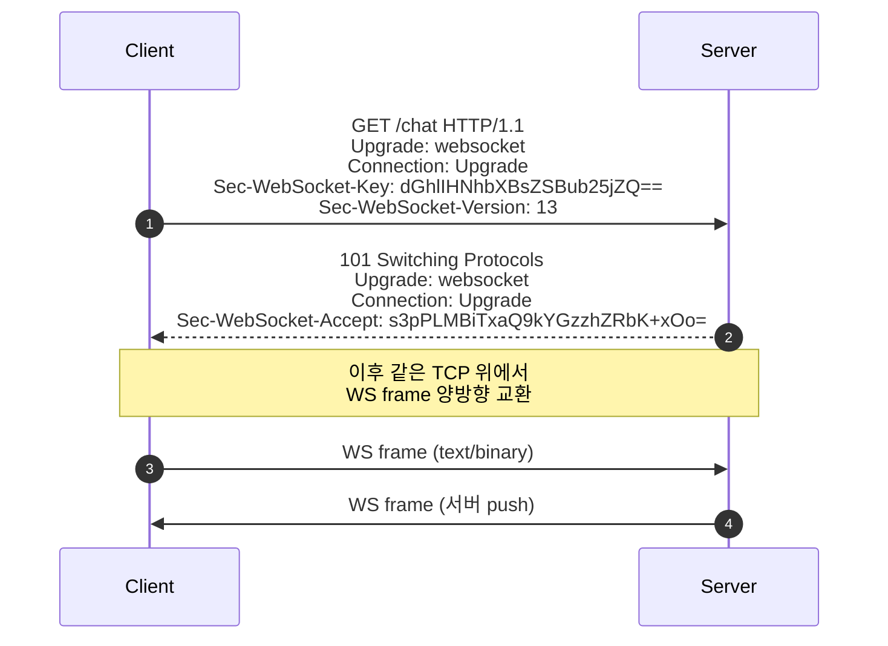
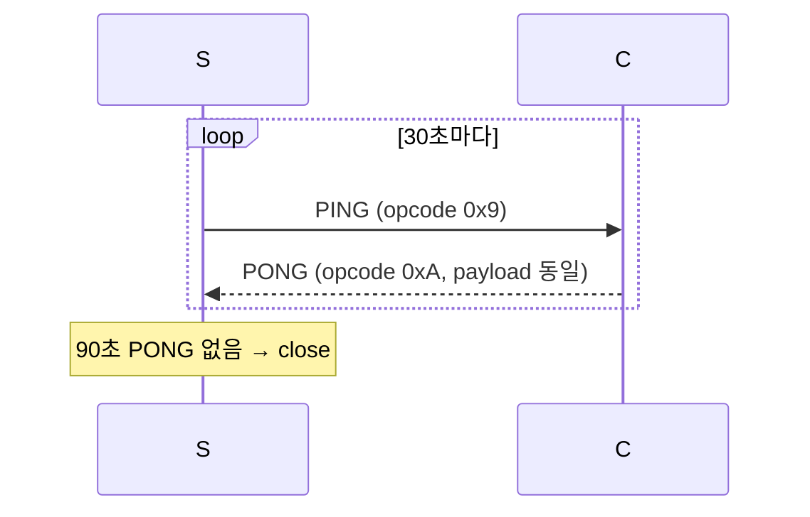
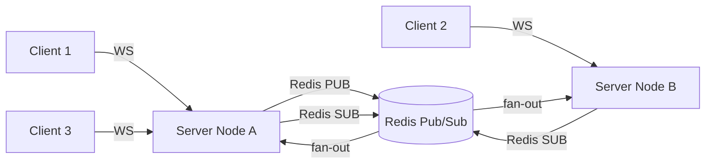

## 정의

**WebSocket** ([RFC 6455](https://datatracker.ietf.org/doc/html/rfc6455)) 은 *HTTP/1.1 upgrade 로 시작* 하는 *양방향 영속 메시지 채널*. 한 TCP 위에서 *서버 ↔ 클라이언트 임의 시점 push* 가능.

활용: 실시간 채팅, 트레이딩 시세, 게임, 알림, 공동 편집, 라이브 대시보드.

## Handshake: HTTP Upgrade



`Sec-WebSocket-Accept` = base64(SHA-1(key + "258EAFA5-E914-47DA-95CA-C5AB0DC85B11")). *handshake 무결성 검증*.

## Frame 구조

```
 0                   1                   2                   3
 0 1 2 3 4 5 6 7 8 9 0 1 2 3 4 5 6 7 8 9 0 1 2 3 4 5 6 7 8 9 0 1
+-+-+-+-+-------+-+-------------+-------------------------------+
|F|R|R|R| opcode|M| Payload len |    Extended payload length    |
|I|S|S|S|  (4)  |A|     (7)     |             (16/64)           |
|N|V|V|V|       |S|             |   (if payload len == 126/127) |
| |1|2|3|       |K|             |                               |
+-+-+-+-+-------+-+-------------+ - - - - - - - - - - - - - - - +
|     Extended payload length continued, if payload len == 127  |
+ - - - - - - - - - - - - - - - +-------------------------------+
|                               |Masking-key, if MASK set to 1  |
+-------------------------------+-------------------------------+
|    Masking-key (continued)    |          Payload Data         |
+-------------------------------- - - - - - - - - - - - - - - - +
:                     Payload Data continued ...                :
+ - - - - - - - - - - - - - - - - - - - - - - - - - - - - - - - +
|                     Payload Data continued ...                |
+---------------------------------------------------------------+
```

| opcode | 의미 |
|---|---|
| 0x0 | Continuation (다음 frame 이어짐) |
| 0x1 | Text (UTF-8) |
| 0x2 | Binary |
| 0x8 | Close |
| 0x9 | Ping |
| 0xA | Pong |

> [!IMPORTANT]
> *클라이언트 → 서버 frame 은 반드시 MASK* (XOR with 4-byte key). cache poisoning 방지 목적. 서버 → 클라이언트 는 unmask.

## Ping / Pong (keep-alive)



> [!TIP]
> *NAT timeout* 또는 *프록시 idle close* 를 방지. 보통 30~60초 간격. *NAT 일반 idle timeout 이 60s* 이므로.

## Subprotocol

```http
Sec-WebSocket-Protocol: chat, soap
```

서버가 *선택해서* 응답 헤더에 같은 것 반환. 클라이언트가 *프로토콜 분기* (예: GraphQL over WS, MQTT over WS).

## WSS (WebSocket Secure)

`wss://` = WebSocket over TLS. 운영에서는 *거의 필수*:

- 일부 ISP / 프록시가 *ws://* 를 차단
- mixed content (https 페이지에서 ws://) 브라우저 거부
- *대부분의 WAF / LB* 가 wss 에 최적화

## 흔한 함정

> [!WARNING]
> 1. **Idle timeout 사고** = ALB/nginx 의 60초 default 가 silent close. PING/PONG 간격 < idle timeout 필수.
> 2. **Backpressure 부재** = 서버가 빠르게 send → 클라이언트 buffer 폭발. *application 레벨 flow control* (ACK / credit) 필요.
> 3. **Sticky session 필요** = 같은 사용자가 같은 노드. LB cookie 또는 IP hash. 또는 *connection ID + Redis pub/sub* 으로 fan-out.
> 4. **CORS 가 WebSocket 에 *그대로* 적용 안 됨** = `Origin` 헤더는 *수동 검증*. 미검증 시 CSRF.

## 패턴: 채팅 fan-out



자세한 fan-out 은 [[Redis Pub Sub vs Streams]] 참고.

## 대안 비교

| 기술 | 방향 | 영속성 | 사용 |
|---|---|---|---|
| WebSocket | 양방향 | 영속 | 채팅, 게임, 트레이딩 |
| SSE | 서버 → 클라이언트 | 영속 | 알림, 라이브 피드 |
| Long polling | 양방향 (서버에서 hold) | 짧음 | legacy fallback |
| HTTP/2 server push | 폐기 | - | - |
| WebRTC DataChannel | 양방향 P2P | 영속 | 게임, 파일 |

자세한 건 [[realtime-comparison]] 참고.

## 관련 위키

- [[HTTP/1.1]] (upgrade handshake)
- [[TCP]] (영속 연결의 토대)
- [[realtime-comparison]] (대안 비교)
- [[SSE]] (단방향 영속)
- [[Redis Pub Sub vs Streams]] (fan-out 패턴)
- [[Sticky Session]]
