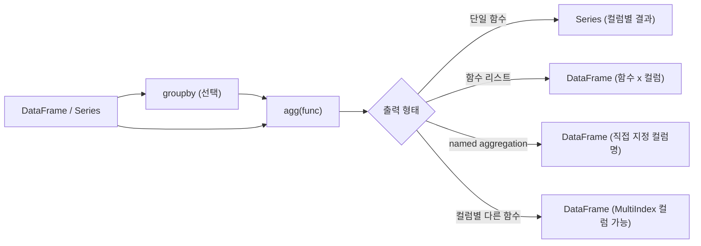

## 정의

**`agg(func)`** 는 **여러 집계 함수를 한 번에 적용** 한다. `GroupBy`, `DataFrame`, `Series` 모두에서 사용 가능. `aggregate` 는 같은 함수의 별칭.

## agg 처리 흐름



## 사용 상황

| 상황 | 패턴 |
|:---|:---|
| 전체 DataFrame 요약 통계 | `df.agg(['mean', 'std', 'min', 'max'])` |
| 그룹별 여러 지표 | `df.groupby(...).agg(...)` |
| 컬럼마다 다른 집계 | `df.agg({'col1': 'sum', 'col2': 'mean'})` |
| 결과 컬럼명 제어 | named aggregation: `agg(alias=('col', func))` |
| 커스텀 통계 | 람다 / 사용자 함수 |

## 다양한 형태

### 단일 함수

```python
df.agg('mean')                 # 모든 컬럼에 mean
df['col'].agg('sum')
```

### 함수 리스트

```python
df.agg(['mean', 'sum', 'std'])  # 각 컬럼에 여러 함수
```

<CodeWithOutput
  language="python"
  outputLanguage="text"
  code={`import pandas as pd
df = pd.DataFrame({'a': [1,2,3,4,5], 'b': [10,20,30,40,50]})
print(df.agg(['mean', 'std', 'min', 'max']))`}
  output={`        a          b
mean  3.000000  30.000000
std   1.581139  15.811388
min   1.000000  10.000000
max   5.000000  50.000000`}
/>

|   | a | b |
|---|---|---|
| mean | 3.0 | 30.0 |
| std | 1.58 | 15.81 |
| min | 1 | 10 |
| max | 5 | 50 |

### 컬럼별 다른 함수

```python
df.agg({
    'salary': ['mean', 'sum'],
    'age': ['min', 'max'],
})
```

### groupby + agg

```python
df.groupby('city').agg({
    'salary': ['mean', 'max'],
    'age': 'mean',
})
```

결과는 MultiIndex 컬럼.

### named aggregation (이름 있는 집계)

```python
df.groupby('city').agg(
    avg_salary=('salary', 'mean'),
    max_salary=('salary', 'max'),
    avg_age=('age', 'mean'),
)
```

<CodeWithOutput
  language="python"
  outputLanguage="text"
  code={`import pandas as pd
df = pd.DataFrame({
    'city': ['Seoul', 'Busan', 'Seoul', 'Busan'],
    'salary': [3000, 4000, 5000, 4500],
    'age': [25, 30, 35, 40],
})
result = df.groupby('city').agg(
    avg_sal=('salary', 'mean'),
    max_sal=('salary', 'max'),
    avg_age=('age', 'mean'),
)
print(result)`}
  output={`       avg_sal  max_sal  avg_age
city
Busan   4250.0     4500     35.0
Seoul   4000.0     5000     30.0`}
/>

| city  | avg_sal | max_sal | avg_age |
|-------|---------|---------|---------|
| Busan | 4250    | 4500    | 35.0    |
| Seoul | 4000    | 5000    | 30.0    |

**가장 깔끔한 권장 패턴**, 컬럼 이름이 명확.

## 람다 / 사용자 함수

```python
df.groupby('city').agg(
    median_sal=('salary', lambda s: s.median()),
    range_sal=('salary', lambda s: s.max() - s.min()),
    cv_sal=('salary', lambda s: s.std() / s.mean()),  # 변동계수
)
```

람다의 단점: 함수명이 `<lambda>` 로 표시. named aggregation 으로 보완.

## DataFrame vs GroupBy agg 비교

```python
import pandas as pd

df = pd.DataFrame({'a': [1, 2, 3], 'b': [10, 20, 30]})

# DataFrame.agg: 전체 컬럼에 집계
print(df.agg(['mean', 'sum']))
# 출력: 2행 (mean, sum) x 2열 (a, b)

# Series.agg: 단일 컬럼
print(df['a'].agg(['mean', 'sum']))
# 출력: 2행 Series

# GroupBy.agg: 그룹별
print(df.assign(g=['x', 'x', 'y']).groupby('g').agg(['mean', 'sum']))
# 출력: 2행 (x, y) x 4열 (a-mean, a-sum, b-mean, b-sum)
```

## transform 과의 차이

| 특성 | `agg` | `transform` |
|:---|:---|:---|
| 출력 shape | 축소 (n행 → 1행) | 원본 유지 (n행 → n행) |
| 사용 목적 | 그룹 요약 | 그룹 값을 원본에 맞춰 붙이기 |
| 결과 index | 그룹 key | 원본 index |

```python
# agg: 요약
df.groupby('city')['salary'].agg('mean')
# city
# Busan    4250.0
# Seoul    4000.0

# transform: 원본 길이 유지 (join 없이 붙이기)
df['city_avg'] = df.groupby('city')['salary'].transform('mean')
# 각 행의 도시 평균이 그 행에 붙음
```

## 자주 쓰는 집계 함수 모음

| 함수 | 의미 |
|:---|:---|
| `'mean'`, `'sum'`, `'std'`, `'var'` | 기본 통계 |
| `'min'`, `'max'`, `'median'` | 분포 |
| `'count'` | non-null 개수 |
| `'size'` | 전체 개수 (NaN 포함) |
| `'first'`, `'last'` | 그룹 내 위치 |
| `'nunique'` | 고유값 개수 |
| `'quantile'` | 분위수 (default 0.5 = median) |
| `'idxmin'`, `'idxmax'` | 최소/최대 위치 |
| `'mode'` | 최빈값 (Series of mode) |
| `'sem'` | 표준 오차 |
| `'skew'` | 왜도 |
| `'kurt'` | 첨도 |

## 실전 패턴

### 기술 통계 한 번에

```python
df.agg({
    'revenue': ['sum', 'mean', 'std', 'min', 'max'],
    'qty': ['sum', 'mean'],
    'user_id': 'nunique',
})
```

### 보고용 요약 (named agg)

```python
summary = df.groupby(['region', 'channel']).agg(
    total_revenue=('revenue', 'sum'),
    avg_order=('revenue', 'mean'),
    order_count=('order_id', 'count'),
    unique_users=('user_id', 'nunique'),
    p90_revenue=('revenue', lambda s: s.quantile(0.9)),
)
```

### 여러 quantile 동시

```python
import numpy as np
df.groupby('group')['value'].agg([
    ('p25', lambda s: s.quantile(0.25)),
    ('p50', lambda s: s.quantile(0.50)),
    ('p75', lambda s: s.quantile(0.75)),
    ('p99', lambda s: s.quantile(0.99)),
])
```

### pandas 2.x: as_index 와 reset_index

```python
# as_index=False: 그룹 key 를 컬럼으로
df.groupby('city', as_index=False).agg(
    avg_sal=('salary', 'mean'),
)
# as_index=True (기본) + reset_index() 와 같은 효과
```

## 함정

### 1. MultiIndex 컬럼

```python
df.groupby('city').agg({'salary': ['mean', 'max']})
# 컬럼이 ('salary', 'mean'), ('salary', 'max') MultiIndex
# 평탄화: df.columns = ['_'.join(c) for c in df.columns]
```

named aggregation 이 이를 자연스럽게 회피.

### 2. 함수 이름의 충돌

```python
import numpy as np
df.agg(['mean', 'sum', np.mean])    # mean 이 두 번 → 컬럼 충돌
```

### 3. groupby + agg 의 dropna

```python
df.groupby('city', dropna=False).agg(...)
# city 가 NaN 인 그룹도 포함 (기본은 제외)
```

### 4. count vs size

```python
df.groupby('city').agg({'salary': 'count', 'bonus': 'size'})
# count: NaN 제외, size: NaN 포함
# size 는 컬럼과 무관하게 그룹 크기
```

### 5. pandas 2.x observed 경고

```python
# Categorical 컬럼으로 groupby 할 때
df.groupby('cat_col', observed=True).agg(...)   # 등장한 카테고리만
df.groupby('cat_col', observed=False).agg(...)  # 모든 카테고리 포함
# pandas 2.x 에서 명시 안 하면 FutureWarning
```

## 관련 위키

- [[Pandas groupby]]
- [[Pandas transform / apply]]
- [[Pandas pivot_table]]
- [[Pandas DataFrame]]
- [[Pandas Series]]
