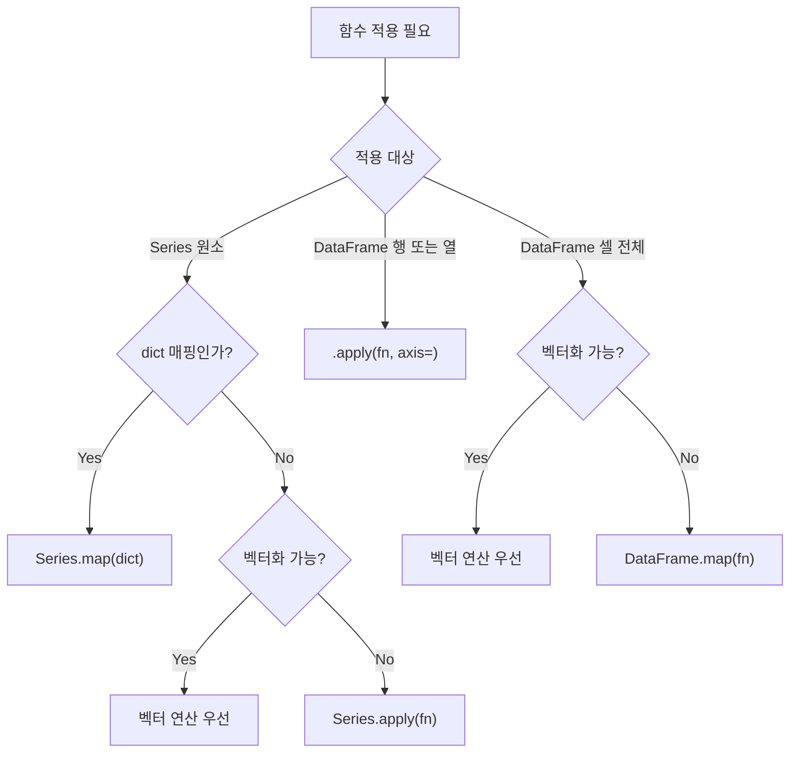

## 정의

- **`Series.map(func)`** : 각 **원소** 에 함수 적용 (또는 dict 매핑)
- **`Series.apply(func)`** : 각 **원소** 에 함수 적용 (map 과 유사, 추가 인자 가능)
- **`DataFrame.apply(func, axis=)`** : 각 **행 또는 열** 에 함수 적용
- **`DataFrame.map(func)`** (pandas 2.1+) : 각 **셀** 에 함수 적용 (구 `applymap`)

## 사용 상황

| 상황 | 권장 방법 | 비고 |
|:---|:---|:---|
| 값 치환 (dict 기반) | `Series.map(dict)` | 없는 키는 NaN |
| 원소별 변환 | `Series.apply(fn)` 또는 벡터 연산 | 벡터화 가능하면 우선 |
| 행/열 집계 또는 변환 | `DataFrame.apply(fn, axis=)` | `agg`, `transform` 검토 |
| 전체 셀 변환 | `DataFrame.map(fn)` | 셀 하나씩 호출, 느림 |
| 조건부 분기 | `np.where` / `np.select` | apply 보다 빠름 |

## 어떤 메서드를 쓸지 결정 흐름



## Series.map (가장 흔함)

```python
# dict 매핑: 없는 키는 NaN
s.map({'A': 1, 'B': 2, 'C': 3})

# 함수 적용
s.map(lambda x: x * 2)
s.map(str)
```

<CodeWithOutput
  language="python"
  outputLanguage="text"
  code={`import pandas as pd
s = pd.Series(['cat', 'dog', 'bird', 'cat'])
mapping = {'cat': '고양이', 'dog': '강아지', 'bird': '새'}
print(s.map(mapping).tolist())`}
  output={`['고양이', '강아지', '새', '고양이']`}
/>

map 과 dict: 매핑 없는 값은 NaN 처리.

```python
s = pd.Series(['A', 'B', 'Z'])
s.map({'A': 1, 'B': 2})          # [1, 2, NaN]
s.map({'A': 1, 'B': 2}, na_action='ignore')   # NaN 원소 건너뜀
```

## Series.apply

```python
s.apply(lambda x: x ** 2)              # 같은 길이의 Series
s.apply(some_func)
```

`map` 과 거의 같지만 `apply` 는 함수에 추가 인자를 줄 수 있다.

```python
s.apply(round, ndigits=2)

def clip(x, lo, hi):
    return max(lo, min(hi, x))

s.apply(clip, lo=0, hi=100)
```

## DataFrame.apply (행/열 단위)

```python
df.apply(sum, axis=0)        # 각 열에 sum (default)
df.apply(sum, axis=1)        # 각 행에 sum

# 행 단위 람다
df.apply(lambda r: r['a'] + r['b'], axis=1)
```

<CodeWithOutput
  language="python"
  outputLanguage="text"
  code={`import pandas as pd
df = pd.DataFrame({'a': [1,2,3], 'b': [10,20,30]})
print(df.apply(sum))                    # 각 열
print('---')
print(df.apply(lambda r: r['a']+r['b'], axis=1))    # 각 행`}
  output={`a     6
b    60
dtype: int64
---
0    11
1    22
2    33
dtype: int64`}
/>

### result_type 파라미터

```python
# 함수가 리스트/Series 반환할 때 결과 형태 제어
def expand(row):
    return [row['a'] * 2, row['b'] * 2]

df.apply(expand, axis=1, result_type='expand')   # DataFrame 반환
df.apply(expand, axis=1, result_type='reduce')   # Series 반환 (flatten)
df.apply(expand, axis=1, result_type='broadcast') # 원본 df 형태 유지
```

## DataFrame.map (셀 단위, pandas 2.1+)

```python
df.map(lambda x: x * 2)        # 모든 셀에 x*2
df.map(str)                     # 모든 셀을 str 로

# NaN 건너뜀 옵션
df.map(lambda x: x ** 0.5, na_action='ignore')
```

구 `applymap` 의 새 이름. pandas 2.1 미만에서는 `applymap` 사용.

## 벡터 연산이 항상 우선

```python
# ❌ apply: 행마다 호출, 느림
df['c'] = df.apply(lambda r: r['a'] + r['b'], axis=1)

# ✓ 벡터 연산: 수십~수백 배 빠름
df['c'] = df['a'] + df['b']

# ❌ apply 로 문자열 붙이기
df['full_name'] = df.apply(lambda r: r['first'] + ' ' + r['last'], axis=1)

# ✓ 벡터 연산
df['full_name'] = df['first'] + ' ' + df['last']
```

## np.where 패턴

```python
import numpy as np

# ❌ apply: 느림
df['cat'] = df['age'].apply(lambda x: 'adult' if x >= 18 else 'minor')

# ✓ np.where: 빠름
df['cat'] = np.where(df['age'] >= 18, 'adult', 'minor')

# 더 많은 분기: np.select
conditions = [df['age'] < 13, df['age'] < 20, df['age'] < 65]
choices    = ['child', 'teen', 'adult']
df['cat']  = np.select(conditions, choices, default='senior')
```

## 그룹별 변환: transform 과의 차이

```python
# apply: 그룹별 결과를 집계 (크기가 달라질 수 있음)
df.groupby('city')['salary'].apply(lambda s: s.nlargest(3))

# transform: 그룹별 통계를 원본 크기로 브로드캐스트
df['city_avg'] = df.groupby('city')['salary'].transform('mean')
```

`[[Pandas transform / apply]]` 참고.

## map vs apply 차이

| 메서드 | 대상 | dict 매핑 | 추가 인자 | 성능 |
|:---|:---|:---:|:---:|:---:|
| `Series.map` | 원소 | ✅ | ❌ | 빠름 |
| `Series.apply` | 원소 | ❌ | ✅ | 비슷 |
| `DataFrame.apply` | 행/열 | ❌ | ✅ | 보통 |
| `DataFrame.map` | 셀 | ❌ | ✅ | 느림 |

## 성능

| 방법 | 상대 속도 | 설명 |
|:---|:---:|:---|
| 벡터 연산 (`+`, `*`, `np.where`) | 1x (기준) | C 레벨 연산 |
| `Series.map(dict)` | ~3x 느림 | hash lookup |
| `Series.apply(fn)` | ~10x 느림 | Python 루프 |
| `DataFrame.apply(fn, axis=1)` | ~100x 느림 | 행마다 Python 호출 |
| `DataFrame.map(fn)` | ~500x 느림 | 셀마다 Python 호출 |

```python
import pandas as pd
import numpy as np
import time

df = pd.DataFrame({'a': np.random.randn(100_000),
                   'b': np.random.randn(100_000)})

# 벡터 연산
t0 = time.time()
_ = df['a'] + df['b']
print(f'벡터: {time.time()-t0:.3f}s')

# apply (axis=1)
t0 = time.time()
_ = df.apply(lambda r: r['a'] + r['b'], axis=1)
print(f'apply: {time.time()-t0:.3f}s')
```

> [!WARNING]
> `DataFrame.apply(fn, axis=1)` 는 100,000 행에서도 수 초가 걸릴 수 있다. 가능하면 벡터화 연산이나 `np.where` / `np.select` 로 대체한다.

## 함정

### 1. apply 의 속도

```python
# 1,000 행 × 10 컬럼 → 10,000 호출
df.apply(complex_function, axis=1)    # 수초
df.map(complex_function)              # 더 느림 (셀마다 호출)
# 벡터화 가능하면 그게 훨씬 빠름
```

### 2. axis 0 vs 1 의 의미

```python
df.apply(fn, axis=0)    # 각 열에 fn (기본값)
df.apply(fn, axis=1)    # 각 행에 fn
```

`axis=0` 은 "행을 collapse" 하여 열별 결과, `axis=1` 은 "열을 collapse" 하여 행별 결과. 헷갈리기 쉽다.

### 3. 결과 타입 추론

```python
result = df.apply(some_func, axis=1)
# 함수 반환이 scalar 면 Series, dict/Series 면 DataFrame
# 일관성 없는 반환 타입은 예외 발생
```

복잡한 함수에서 결과 타입이 불일치하면 예외가 난다. `result_type` 파라미터로 명시.

### 4. map 의 NaN 처리

```python
# dict map: 없는 키는 NaN 으로 채워짐
s = pd.Series(['A', 'B', 'X'])
s.map({'A': 1, 'B': 2})    # [1, 2, NaN]
```

의도치 않은 NaN 이 생길 수 있으니 매핑 dict 에 모든 값이 들어 있는지 확인.

### 5. applymap 이름 변경 (pandas 2.1)

```python
# pandas < 2.1
df.applymap(fn)

# pandas >= 2.1
df.map(fn)        # applymap 은 FutureWarning
```

## 관련 위키

- [[Pandas Series]]
- [[Pandas DataFrame]]
- [[Pandas transform / apply]]
- [[Pandas groupby]]
- [[Pandas 성능 / 메모리 최적화]]
