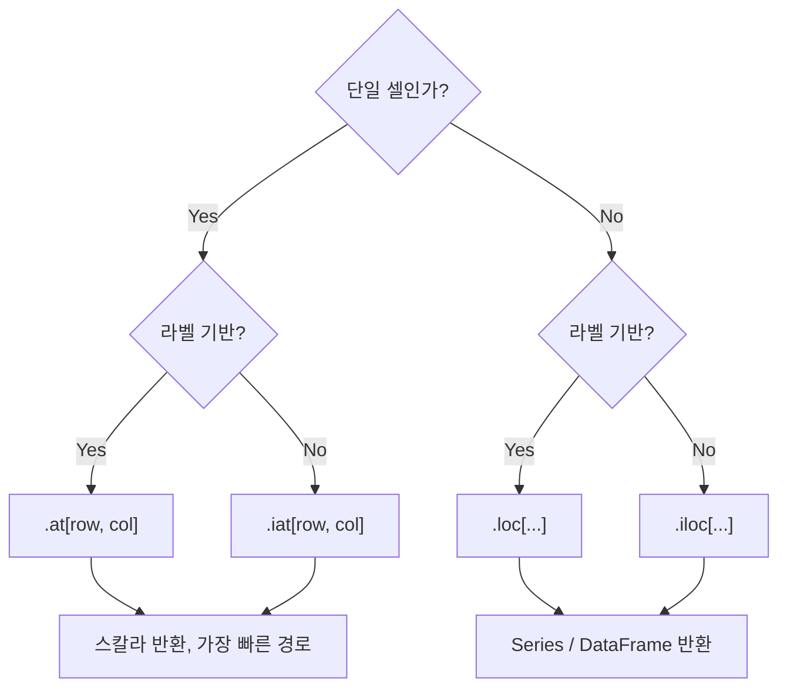

## 정의

- **`.at[]`** : 단일 스칼라 (한 행, 한 열) 의 **라벨 기반** 접근
- **`.iat[]`** : 단일 스칼라의 **정수 위치 기반** 접근

[[Pandas .loc / .iloc]] 의 **단일 셀 전용 빠른 버전**. 내부 검증 단계를 단순화해 가장 빠른 셀 접근을 제공.

## loc/iloc 의 fast path 원리

`.loc` 와 `.iloc` 는 슬라이스, 리스트, boolean mask 등 다양한 입력 형태를 처리하는 **범용 indexer** 다. 그 내부에서 입력 타입을 판별하고 분기 처리하는 비용이 있다.

`.at` / `.iat` 는 "행 하나 + 열 하나" 만 처리하는 **전용 경로** 로, 내부 분기 없이 직접 배열에 접근한다. 루프 안에서 단일 셀을 반복 읽거나 쓸 때 이 차이가 누적된다.

## 시각화: indexer 선택 흐름



## 사용

```python
import pandas as pd
df = pd.DataFrame(
    {'age': [25, 30], 'salary': [3000, 4500]},
    index=['Alice', 'Bob']
)

# 읽기
df.at['Alice', 'age']     # 25, 라벨 기반
df.iat[0, 0]               # 25, 위치 기반

# 쓰기
df.at['Alice', 'age'] = 99
df.iat[0, 0] = 99
```

## .loc / .iloc 와의 차이

| 항목 | `.loc` / `.iloc` | `.at` / `.iat` |
|:---|:---|:---|
| 슬라이스 | ✓ | ✗ (단일 셀만) |
| 리스트 | ✓ | ✗ |
| boolean mask | ✓ (loc만) | ✗ |
| 단일 셀 속도 | 보통 | **더 빠름** |
| 반환 타입 | 가변 | 항상 스칼라 |

루프 안에서 셀을 자주 읽는다면 `.at` / `.iat` 이 유의미하게 빠르다.

## 성능 비교

<CodeWithOutput
  language="python"
  outputLanguage="text"
  code={`import pandas as pd
import time

df = pd.DataFrame({'x': range(100_000)})

t1 = time.time()
total = 0
for i in range(100_000):
    total += df.iloc[i, 0]
print(f'iloc loop: {time.time()-t1:.2f}s')

t2 = time.time()
total = 0
for i in range(100_000):
    total += df.iat[i, 0]
print(f'iat loop:  {time.time()-t2:.2f}s')

t3 = time.time()
total = df['x'].sum()
print(f'sum():     {time.time()-t3:.4f}s')`}
  output={`iloc loop: 2.31s
iat loop:  1.12s
sum():     0.0008s`}
/>

`.iat` 가 `.iloc` 보다 약 2배 빠르지만, **루프 자체가 비싸다**. 벡터 연산 (`df['x'].sum()`) 이 압도적으로 빠르다.

## 성능 계층


> [!IMPORTANT]
> **`.at` / `.iat` 가 `.loc` / `.iloc` 보다 빠른 건 사실** 이지만, 그래도 pandas 의 정답은 **루프 회피, 벡터 연산**. 루프가 정말 필요한 경우에만 `.at`/`.iat` 의 미세 최적화가 의미 있다. [[Pandas rolling]] 이나 `cumsum`, `shift`, `apply` 로 대체 가능한지 먼저 검토.

## Series 에서 .at

`.at` 은 DataFrame 뿐 아니라 **Series 에도 사용** 가능. Series 에서는 행 라벨만 지정한다.

```python
s = pd.Series([10, 20, 30], index=['a', 'b', 'c'])

s.at['b']       # 20 (라벨 기반)
s.iat[1]        # 20 (위치 기반)

s.at['b'] = 99  # 단일 값 변경
```

## MultiIndex 에서 .at

MultiIndex 에서도 `.at` 을 쓸 수 있으나, **튜플 라벨** 을 사용해야 한다.

```python
import pandas as pd

mi = pd.MultiIndex.from_tuples(
    [('Seoul', 'A'), ('Seoul', 'B'), ('Busan', 'A')],
    names=['city', 'dept']
)
df = pd.DataFrame({'sales': [100, 200, 150]}, index=mi)

df.at[('Seoul', 'A'), 'sales']        # 100
df.at[('Seoul', 'B'), 'sales'] = 250  # 변경
```

일반 `.loc` 와 같은 외부 level 단독 접근 (`df.loc['Seoul']`) 은 `.at` 으로는 불가. `.at` 은 항상 정확히 하나의 스칼라를 지정해야 한다.

## 실전 패턴

### 타임스탬프 / 상태 업데이트

```python
# 사용자 로그인 기록 업데이트
df.at[user_id, 'last_login'] = pd.Timestamp.now()
df.at[user_id, 'status'] = 'active'
df.at[user_id, 'login_count'] = df.at[user_id, 'login_count'] + 1
```

이런 단발성 갱신은 `.loc` 보다 `.at` 이 더 가볍다.

### 마지막 행의 특정 컬럼

```python
# iat 에는 컬럼 이름을 직접 쓸 수 없으므로 get_loc 활용
last_val = df.iat[-1, df.columns.get_loc('value')]
df.iat[-1, df.columns.get_loc('status')] = 'DONE'
```

### get_loc 활용: 루프 내 위치 캐싱

열 이름은 알고 있으나 위치 기반 접근이 필요할 때, 열 위치를 루프 밖에서 한 번 구해두면 루프 안에서 `get_loc` 를 반복 호출하지 않아도 된다.

```python
col_pos = df.columns.get_loc('price')  # 1회만 호출

for i in range(len(df)):
    df.iat[i, col_pos] = transform(df.iat[i, col_pos])
```

### 루프 내 순차 의존 계산

벡터화가 불가능한 순차 의존 계산:

```python
col_pos = df.columns.get_loc('price')
factor = 0.95

for i in range(1, len(df)):
    prev = df.iat[i - 1, col_pos]
    df.iat[i, col_pos] = prev * factor
```

### 조건에 따른 단일 셀 분기 처리

```python
score_col = df.columns.get_loc('score')
grade_col = df.columns.get_loc('grade')

for i in range(len(df)):
    s = df.iat[i, score_col]
    if s >= 90:
        df.iat[i, grade_col] = 'A'
    elif s >= 80:
        df.iat[i, grade_col] = 'B'
    else:
        df.iat[i, grade_col] = 'C'
```

이 패턴도 `pd.cut` 이나 `np.select` 로 벡터화 가능하면 그 편이 낫다.

## 함정

### 1. 슬라이스 / 리스트 불가

```python
df.at['Alice':'Bob', 'age']    # TypeError
df.loc['Alice':'Bob', 'age']   # ✓
```

여러 셀이 필요하면 `.loc` / `.iloc` 를 사용.

### 2. 존재하지 않는 라벨 → KeyError

```python
df.at['Unknown', 'age']    # KeyError
```

존재 여부를 먼저 확인하거나 `try/except KeyError` 로 처리:

```python
if 'Unknown' in df.index:
    val = df.at['Unknown', 'age']
else:
    val = None
```

### 3. dtype 변경

```python
df.iat[0, 0] = 'hello'  # int 컬럼에 str 할당 → 컬럼 dtype 이 object 로 변경
```

dtype 이 다른 값을 할당하면 pandas 가 컬럼 전체를 object 로 upcasting 한다. 의도하지 않은 dtype 변환을 주의.

### 4. pandas 2.x CoW (Copy-on-Write)

pandas 2.0 이후 CoW 가 기본이지만, `.at` / `.iat` 로 **원본 DataFrame 을 직접 수정하는 것은 정상 동작** 한다. 체이닝 인덱싱 (`df[...][...] = val`) 만 CoW 로 인해 원본에 반영되지 않는다.

```python
# 안전: 원본 직접 수정
df.at['Alice', 'age'] = 99          # CoW 무관하게 원본 변경

# 위험: 체이닝 인덱싱
df[df['city'] == 'Seoul']['age'] = 99   # CoW 에서 원본 미변경, 경고 발생
```

자세히는 [[SettingWithCopyWarning]] 참고.

## 관련 위키

- [[Pandas .loc / .iloc]]
- [[Pandas DataFrame]]
- [[Pandas 컬럼 선택]]
- [[Pandas MultiIndex]]
- [[SettingWithCopyWarning]]
- [[Pandas performance]]
- [[Pandas iterrows|pandas 행 순회]]
