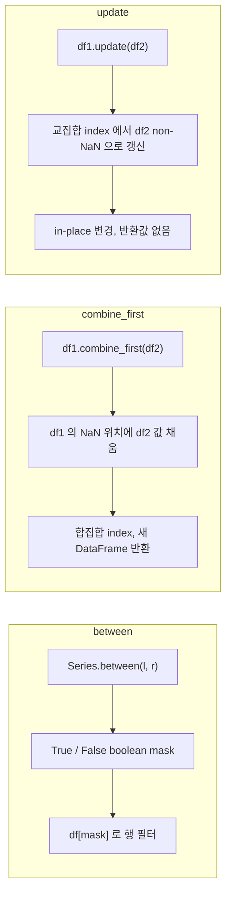

## 정의

이 페이지는 세 가지 개념을 함께 다룬다.

- **`Series.between(left, right)`** : 두 값 사이인지 검사 (SQL `BETWEEN`)
- **`DataFrame.combine_first(other)`** : 누락 값을 다른 DataFrame 으로 채움 (우선순위 있는 합치기)
- **`DataFrame.update(other)`** : 다른 DataFrame 의 값으로 자신을 in-place 갱신 (NaN 제외)

## 개념 시각화



## between 기본

```python
df[df['age'].between(20, 30)]                          # 20 <= age <= 30 (양쪽 포함, 기본)
df[df['age'].between(20, 30, inclusive='left')]        # [20, 30)
df[df['age'].between(20, 30, inclusive='right')]       # (20, 30]
df[df['age'].between(20, 30, inclusive='neither')]     # (20, 30)
```

<CodeWithOutput
  language="python"
  outputLanguage="text"
  code={`import pandas as pd
df = pd.DataFrame({'name': ['A', 'B', 'C', 'D'], 'age': [18, 25, 30, 45]})
print(df[df['age'].between(20, 30)])
print('---')
print(df[df['age'].between(20, 30, inclusive='neither')])`}
  output={`  name  age
1    B   25
2    C   30
---
  name  age
1    B   25`}
/>

## 다중 조건 조합

```python
# AND
df[(df['age'] > 25) & (df['city'] == 'Seoul')]

# OR
df[(df['city'] == 'Seoul') | (df['city'] == 'Busan')]

# NOT
df[~(df['city'] == 'Seoul')]

# 복잡한 조합
df[((df['age'] > 25) & (df['city'] == 'Seoul')) | (df['salary'] > 5000)]
```

> [!IMPORTANT]
> **각 조건은 괄호로 감싼다.** `&`, `|` 의 우선순위가 비교 연산자보다 높아서 괄호 없으면 잘못 평가된다.

## 가독성을 위한 변수 분리

긴 조건은 변수로 쪼개라.

```python
is_adult = df['age'] >= 18
is_capital = df['city'].isin(['Seoul', 'Tokyo', 'Beijing'])
has_premium = df['plan'] == 'premium'

df[is_adult & is_capital & has_premium]
```

[[Pandas query]] 도 가독성 대안.

```python
df.query("age >= 18 and city in ['Seoul', 'Tokyo', 'Beijing'] and plan == 'premium'")
```

## any / all

여러 조건 중 하나라도 / 모두 만족하는지를 axis 기준으로 집계.

```python
conditions = pd.concat([
    df['age'] > 30,
    df['salary'] > 5000,
    df['city'] == 'Seoul'
], axis=1)

df[conditions.any(axis=1)]    # 하나라도 True
df[conditions.all(axis=1)]    # 모두 True
```

## combine_first

**`DataFrame.combine_first(other)`** 는 `self` 의 NaN 위치를 `other` 의 값으로 채운다. index 는 합집합이 된다.

```python
import pandas as pd

df1 = pd.DataFrame({
    'A': [1.0, None, 3.0],
    'B': [None, 2.0, 3.0],
}, index=[0, 1, 2])

df2 = pd.DataFrame({
    'A': [10.0, 20.0, 30.0],
    'B': [100.0, 200.0, 300.0],
}, index=[1, 2, 3])

result = df1.combine_first(df2)
print(result)
```

출력:

```text
     A      B
0    1.0    NaN
1   20.0    2.0
2    3.0    3.0
3   30.0  300.0
```

정리:
- `df1` 값 우선 (NaN 아니면 유지)
- `df1` 이 NaN 이면 `df2` 값 사용
- `df1` 에 없는 index 는 `df2` 에서 추가

### 실전 패턴: 보완 데이터 소스 통합

```python
# 메인 데이터에 결측이 있고, 보완 데이터로 채울 때
main = df_main.combine_first(df_fallback)
```

SQL 의 `COALESCE(main.col, fallback.col)` 과 비슷하지만 DataFrame 전체에 적용.

### Series 에서 combine_first

```python
s1 = pd.Series([1.0, None, 3.0], index=[0, 1, 2])
s2 = pd.Series([10.0, 20.0], index=[1, 3])

s1.combine_first(s2)
# 0     1.0
# 1    20.0   <- s1[1]=NaN 이라 s2[1]=20.0 채움
# 2     3.0
# 3    20.0   <- s1 에 없는 index, s2 에서 추가 (s2[3]=20.0)
```

## update

**`DataFrame.update(other)`** 는 `self` 의 값을 `other` 의 non-NaN 값으로 **in-place** 갱신한다. 교집합 index 만 갱신한다.

```python
import pandas as pd

df1 = pd.DataFrame({
    'A': [1, 2, 3],
    'B': [4, 5, 6],
}, index=[0, 1, 2])

df2 = pd.DataFrame({
    'A': [10, None],
    'B': [40, 50],
}, index=[0, 1])

df1.update(df2)   # in-place, 반환값 없음
print(df1)
```

출력:

```text
    A   B
0  10  40
1   2  50
2   3   6
```

정리:
- `other` 의 non-NaN 값만 갱신
- `other` 에 없는 index 는 변경 없음
- **반환값 없음** (in-place)

### 실전 패턴: 부분 갱신

```python
# 특정 행만 업데이트 (전체 replace 가 아닌 부분 갱신)
corrections = pd.DataFrame({
    'price': [99.0, 149.0]
}, index=[5, 12])   # 5번, 12번 행만

df.update(corrections)   # df[5,'price'], df[12,'price'] 만 변경
```

여러 행을 한꺼번에 부분 갱신할 때 `update` 가 loop + `.at` 보다 간결하다.

## combine_first vs update 비교

| 항목 | `combine_first` | `update` |
|:---|:---|:---|
| 수정 방식 | 새 DataFrame 반환 | in-place |
| NaN 처리 | self 의 NaN 에 other 채움 | other 의 non-NaN 으로 self 갱신 |
| index 범위 | 합집합 (행 추가 가능) | 교집합 (행 추가 없음) |
| 기존 non-NaN | 유지 | other 값으로 덮어씀 |
| 반환값 | 새 DataFrame | None |

## between 함정

### 1. NaN 처리

```python
df['age'].between(20, 30)
# NaN 인 행은 False 반환
```

NaN 도 포함하려면 `isna()` 와 조합:

```python
df['age'].between(20, 30) | df['age'].isna()
```

### 2. 문자열도 between 가능

```python
df['name'].between('A', 'C')    # 알파벳 순서로 'A' <= name <= 'C'
```

사전순 비교. 한글은 유니코드 순.

### 3. inclusive 의 string 값 (pandas 2.x)

pandas 1.x: `inclusive=True/False`, 2.x: `inclusive='both' / 'left' / 'right' / 'neither'`.

```python
df['age'].between(20, 30, inclusive='both')   # 권장 (명시적)
```

## combine_first / update 함정

### 1. update 는 반환값 없음

```python
result = df1.update(df2)   # None 반환!
print(result)               # None
```

`update` 는 항상 `None` 을 반환하고 `df1` 을 직접 수정한다. `combine_first` 처럼 `result = ` 로 받으면 안 된다.

> [!WARNING]
> `df1.update(df2)` 의 결과를 변수에 담으면 `None` 이 된다. 반드시 `df1.update(df2)` 만 호출하고 이후 `df1` 을 사용.

### 2. 컬럼 불일치

```python
df1 = pd.DataFrame({'A': [1, 2], 'B': [3, 4]})
df2 = pd.DataFrame({'A': [10, 20], 'C': [30, 40]})

df1.update(df2)           # 'A' 만 갱신, 'C' 는 df1 에 없으니 무시
df1.combine_first(df2)    # 'A', 'B', 'C' 모두 포함한 결과 반환
```

### 3. combine_first 의 dtype 변환

```python
df1 = pd.DataFrame({'A': [1, None, 3]})   # float (NaN 때문에)
df2 = pd.DataFrame({'A': [10, 20, 30]})

result = df1.combine_first(df2)
# result['A'] 는 float (NaN 이 있었으므로)
```

정수 컬럼에 NaN 이 있으면 float 으로 변환된다. [[Pandas nullable]] 타입 (`Int64`) 을 쓰면 정수 NaN 을 유지할 수 있다.

## 다중 조건의 성능

대규모 데이터에서 boolean mask 가 누적되는 비용. 가장 selective 한 조건을 먼저 적용하면 불필요한 비교를 줄일 수 있다.

```python
result = df[df['rare_value'] == 'X']      # 작은 결과로 줄임
result = result[result['common'] > 100]   # 그 다음 필터
```

[[Pandas query]] 는 numexpr 가속으로 큰 DataFrame 에서 종종 더 빠르다.

## 관련 위키

- [[Pandas Boolean Indexing]]
- [[Pandas isin / isna]]
- [[Pandas query]]
- [[Pandas dropna / fillna]]
- [[Pandas merge]]
- [[Pandas concat]]
