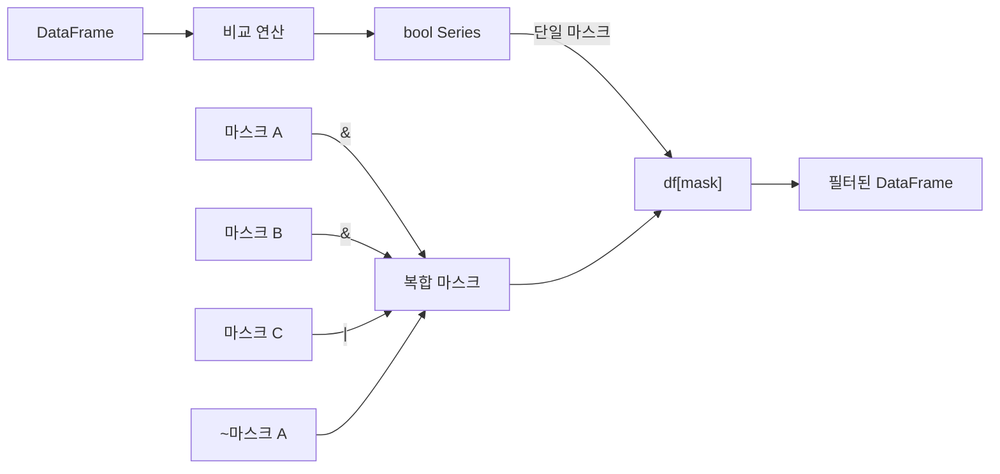

## 정의

**Boolean Indexing** 은 **True/False 의 Series 를 인덱서로 전달** 해 행을 선택하는 패턴. pandas 의 가장 흔한 필터링 방법.

```python
mask = df['age'] > 30      # bool Series
df[mask]                    # True 인 행만
df.loc[mask]                # 동등
```

## 마스크 생성과 적용 흐름



## 기본

<CodeWithOutput
  language="python"
  outputLanguage="text"
  code={`import pandas as pd
df = pd.DataFrame({
    'name': ['Alice', 'Bob', 'Charlie', 'Dave'],
    'age': [25, 30, 35, 40],
})

mask = df['age'] >= 30
print(mask.tolist())
print(df[mask])`}
  output={`[False, True, True, True]
      name  age
1      Bob   30
2  Charlie   35
3     Dave   40`}
/>

|   | name    | age |
|---|---------|-----|
| 1 | Bob     | 30  |
| 2 | Charlie | 35  |
| 3 | Dave    | 40  |

## 복합 조건

```python
df[(df['age'] > 25) & (df['age'] < 40)]    # AND
df[(df['city'] == 'Seoul') | (df['city'] == 'Busan')]    # OR
df[~(df['city'] == 'Seoul')]               # NOT
```

> [!IMPORTANT]
> **`and` / `or` / `not` 대신 `&` / `|` / `~`** 를 써야 한다. Python 키워드는 single boolean 만 처리, pandas 는 array 비교라 비트연산자를 사용. **각 조건은 괄호로 감싼다** (연산자 우선순위 때문).

## `&` vs `and`, `|` vs `or`, `~` vs `not` 심화

### 왜 `and` / `or` 가 안 되는가?

```python
# Python 의 and 는 두 값 중 하나를 통째로 반환
True and False    # → False (스칼라)

# pandas Series 에는 진리값이 없음
bool(df['age'] > 30)  # ValueError: ambiguous truth value
```

`bool()` 로 변환할 때 Series 원소가 여러 개라 단일 bool 을 확정할 수 없다.

| 연산자 | 동작 | pandas 에서 |
|:---|:---|:---|
| `and` | 단일 bool 반환 | `ValueError` |
| `&` | 원소별 비트 AND | 작동 ✅ |
| `or` | 단일 bool 반환 | `ValueError` |
| `\|` | 원소별 비트 OR | 작동 ✅ |
| `not` | 단일 bool 반환 | `ValueError` |
| `~` | 원소별 비트 NOT | 작동 ✅ |

### 우선순위 함정

비트 연산자 `&` 는 비교 연산자 `>`, `<`, `==` 보다 **우선순위가 높다**.

```python
# ❌ 잘못된 코드: 1 & df['b'] 가 먼저 계산됨
df[df['a'] > 1 & df['b'] > 2]

# ✓ 올바른 코드: 각 조건을 괄호로 묶는다
df[(df['a'] > 1) & (df['b'] > 2)]
```

## isin / isna / notna / between

```python
df[df['city'].isin(['Seoul', 'Busan'])]
df[df['age'].notna()]
df[df['age'].isna()]
df[df['age'].between(25, 35)]      # 양쪽 inclusive
df[df['age'].between(25, 35, inclusive='left')]   # [25, 35)
```

[[Pandas isin / isna]] 참고.

## 행 + 컬럼 동시 필터

```python
df.loc[df['age'] > 30, 'salary']                 # Series
df.loc[df['age'] > 30, ['name', 'salary']]       # DataFrame
df.loc[df['age'] > 30, 'salary'] = df.loc[df['age'] > 30, 'salary'] * 1.1
```

## 조건부 갱신 (where / mask)

```python
df['salary'] = df['salary'].where(df['age'] > 30, df['salary'] * 0.9)
# age > 30 이면 그대로, 아니면 * 0.9

df['salary'] = df['salary'].mask(df['age'] < 25, 0)
# age < 25 인 경우 0 으로
```

`.where` 는 **조건이 True 면 유지, False 면 치환**. `.mask` 는 반대.

## numpy.where 패턴

```python
import numpy as np
df['category'] = np.where(df['age'] > 30, 'senior', 'junior')
```

벡터화된 if-else, 빠르다.

## query() 대안

`query()` 는 문자열 표현식으로 필터링. 복잡한 `&`/`|` 체인보다 가독성이 좋을 때 유용.

```python
# 동등한 표현
df[(df['age'] > 25) & (df['city'] == 'Seoul')]
df.query("age > 25 and city == 'Seoul'")

# 변수 참조는 @ 접두사
threshold = 30
df.query("age > @threshold")

# 여러 조건
df.query("age > 25 and city in ['Seoul', 'Busan'] and salary < 5000")
```

> [!TIP]
> `query()` 는 내부적으로 `numexpr` 를 사용 가능해 대용량 DataFrame 에서 더 빠를 수 있다. 단, 복잡한 Python 함수 호출이나 메서드 체인은 지원 안 함.

### query() vs Boolean Indexing 비교

| 항목 | Boolean Indexing | `query()` |
|:---|:---|:---|
| 가독성 | 복잡 조건 시 장황 | 간결 |
| 성능 | 기본 | numexpr 활용 시 더 빠름 |
| 컬럼명 | 제한 없음 | 예약어 컬럼명에 backtick 필요 |
| 외부 변수 | 직접 참조 | `@var` 필요 |
| 복잡한 메서드 | `.str.contains()` 사용 가능 | 제한적 |

```python
# 컬럼명이 예약어인 경우 backtick 사용
df.query("`class` == 'A'")

# str 메서드는 boolean indexing 이 편함
df[df['name'].str.startswith('A')]
```

## 실전 패턴

### 여러 조건 분기 처리 (np.select)

```python
import numpy as np

conditions = [
    (df['age'] < 18),
    (df['age'] >= 18) & (df['age'] < 65),
    (df['age'] >= 65),
]
choices = ['미성년', '성인', '노인']
df['age_group'] = np.select(conditions, choices, default='알수없음')
```

### 문자열 패턴 필터

```python
df[df['email'].str.endswith('@company.com')]
df[df['name'].str.contains(r'^[A-Z]', regex=True)]
df[df['code'].str.match(r'\d{4}-[A-Z]{2}')]
```

### 여러 컬럼 동시 조건

```python
# 상위 10% AND 특정 카테고리
top10_threshold = df['score'].quantile(0.9)
mask = (df['score'] >= top10_threshold) & (df['category'] == 'premium')
df[mask]
```

### 마스크 미리 만들어 재사용

```python
# 여러 곳에서 같은 필터 재사용
active_mask  = df['status'] == 'active'
adult_mask   = df['age'] >= 18

df[active_mask]                          # active 유저
df[active_mask & adult_mask]             # active + 성인
df.loc[active_mask, 'last_login'] = ...  # active 에만 업데이트
```

## 성능 특성

| 방법 | 속도 | 비고 |
|:---|:---:|:---|
| Boolean Indexing | 빠름 | 벡터 연산, pandas 기본 |
| `query()` | 빠름/더 빠름 | numexpr 있으면 대용량 유리 |
| `loc[mask]` | 동등 | `df[mask]` 와 동일 |
| Python `for` 루프 | 매우 느림 | 절대 피할 것 |

```python
# 대용량 DataFrame에서 query()가 더 빠른 경우
import pandas as pd
df = pd.DataFrame({'a': range(1_000_000), 'b': range(1_000_000)})

# 내부적으로 numexpr 사용 (설치된 경우)
df.query("a > 500000 and b < 800000")
```

## 함정

### 1. `and` / `or` 사용

```python
df[df['age'] > 25 and df['age'] < 40]    # ❌ ValueError
df[(df['age'] > 25) & (df['age'] < 40)]  # ✓
```

### 2. 괄호 빠뜨림

```python
df[df['a'] > 1 & df['b'] > 2]            # ❌ `1 & df['b']` 가 먼저 평가됨
df[(df['a'] > 1) & (df['b'] > 2)]        # ✓
```

`&` 가 `>` 보다 우선순위가 높아서 사고가 자주 난다.

### 3. SettingWithCopyWarning

```python
sub = df[df['age'] > 30]
sub['new'] = 1     # ⚠️ Warning (pandas 2.x: CoW 도입)
# 해법
sub = df[df['age'] > 30].copy()
sub['new'] = 1
```

pandas 2.x 부터 Copy-on-Write(CoW) 가 도입되어 경고 대신 에러로 바뀌는 방향. 명시적 `.copy()` 가 안전.

### 4. NaN 의 boolean 처리

```python
mask = df['age'] > 30
# age 가 NaN 인 행 → mask 도 NaN (Falsy 가 아님!)
# 명시적 처리
mask = (df['age'] > 30) & df['age'].notna()
```

### 5. 체이닝 비교 불가

```python
# Python 은 10 < age < 40 이 동작하지만 pandas 에서는 안 됨
df[10 < df['age'] < 40]   # ❌
df[(df['age'] > 10) & (df['age'] < 40)]  # ✓
df[df['age'].between(10, 40)]             # ✓ 간결
```

## 관련 위키

- [[Pandas DataFrame]]
- [[Pandas .loc / .iloc]]
- [[Pandas query]]
- [[Pandas isin / isna]]
- [[SettingWithCopyWarning]]
- [[Pandas 성능 / 메모리 최적화]]
