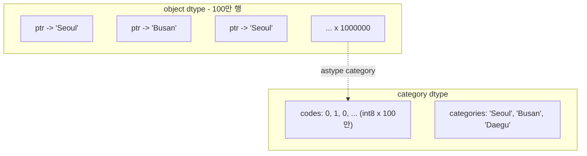

## 정의

**Categorical** 은 **제한된 고유값** 만 가질 수 있는 dtype. 내부적으로 정수 코드로 저장되어 **메모리 절약** 과 **속도 향상** 을 동시에 달성한다.

고유값 수가 적고(low-cardinality) 반복이 많은 열에 적합하다. 예: 도시, 등급, 상태 코드.

## 내부 구조

`object` dtype 은 각 셀이 Python str 객체를 직접 가리키는 포인터 배열이다. `category` dtype 은 고유값 사전(categories) 과 정수 코드 배열(codes) 두 가지로 분리한다.



- `object`: 포인터 1개 = 8 bytes, str 객체 자체 = 50+ bytes, 총 100만 개
- `category`: int8 코드 1 byte x 100만 + 문자열 3개만 저장

## 기본 사용

```python
df['city'] = df['city'].astype('category')

# 정렬 가능한 카테고리
df['grade'] = pd.Categorical(df['grade'], categories=['F','D','C','B','A'], ordered=True)
```

<CodeWithOutput
  language="python"
  outputLanguage="text"
  code={`import pandas as pd
import numpy as np
np.random.seed(0)
cities = np.random.choice(['Seoul', 'Busan', 'Daegu'], size=100_000)
df = pd.DataFrame({'city': cities})

mem_object = df.memory_usage(deep=True).sum()
df['city'] = df['city'].astype('category')
mem_cat = df.memory_usage(deep=True).sum()
print(f'object  : {mem_object:>10,} bytes')
print(f'category: {mem_cat:>10,} bytes')
print(f'절감    : {(1 - mem_cat/mem_object)*100:.1f}%')`}
  output={`object  :  6,300,128 bytes
category:    100,468 bytes
절감    : 98.4%`}
/>

## 언제 유리한가

| 상황 | 이유 |
|:---|:---|
| 고유값이 적고 반복이 많음 | 코드 배열로 압축 (98%+ 절감 가능) |
| groupby / merge / sort | 정수 비교가 문자열 비교보다 빠름 |
| 명시적 순서가 필요한 등급 | `ordered=True` 로 비교 연산 가능 |
| Parquet / Feather 저장 | dtype 그대로 직렬화 |

## 언제 비효율적인가

- 거의 모든 값이 unique (ID, free-form text) → 코드 압축 효과 없음
- 자주 새 카테고리가 추가됨 → `add_categories` 오버헤드
- 산술 연산이 필요한 수치형 데이터 → `category` 는 산술 불가

## ordered categorical

```python
grades = pd.Categorical(
    df['grade'],
    categories=['F', 'D', 'C', 'B', 'A'],
    ordered=True,
)
df['grade'] = grades

# 비교 연산 가능 (사전순이 아니라 정의 순서 기준)
df[df['grade'] > 'C']        # B, A 행만

# min, max 도 순서 기반
df['grade'].min()   # 'F'
df['grade'].max()   # 'A'
```

> [!IMPORTANT]
> `ordered=True` 없이 `>`, `<` 비교를 하면 `TypeError` 가 발생한다. 등급, 우선순위처럼 순서가 의미 있는 데이터에만 `ordered=True` 사용.

## CategoricalDtype

재사용 가능한 dtype 객체를 정의해 여러 컬럼이나 DataFrame 에 적용할 수 있다.

```python
from pandas import CategoricalDtype

size_type = CategoricalDtype(
    categories=['XS', 'S', 'M', 'L', 'XL'],
    ordered=True,
)

df['size'] = df['size'].astype(size_type)

# read_csv 에서 바로 적용
df = pd.read_csv('data.csv', dtype={'size': size_type})
```

## .cat accessor

```python
s = pd.Series(['low', 'high', 'med'], dtype='category')

s.cat.categories                          # Index(['high', 'low', 'med'])
s.cat.codes                               # 정수 코드 [1, 0, 2]
s.cat.ordered                             # False

s.cat.rename_categories({'low': 'L', 'high': 'H', 'med': 'M'})
s.cat.add_categories(['extra'])           # 새 카테고리 추가
s.cat.remove_categories(['low'])          # 카테고리 제거 (해당 값은 NaN)
s.cat.remove_unused_categories()          # 실제로 등장하지 않는 카테고리 정리
s.cat.set_categories(['L', 'M', 'H'], ordered=True)
s.cat.reorder_categories(['H', 'M', 'L'], ordered=True)
```

## pd.cut / pd.qcut 과의 연계

`pd.cut` 과 `pd.qcut` 은 기본적으로 `category` dtype 을 반환한다.

```python
df['age_group'] = pd.cut(
    df['age'],
    bins=[0, 20, 40, 60, 100],
    labels=['10대', '30대', '50대', '70대+'],
    ordered=True,
)
# dtype: category (ordered)
# 직접 groupby 가능
df.groupby('age_group')['revenue'].sum()
```

```python
# qcut: 분위수 기반 분할
df['quartile'] = pd.qcut(df['score'], q=4, labels=['Q1', 'Q2', 'Q3', 'Q4'])
```

## groupby 성능

```python
import time

df_large = pd.DataFrame({'city': np.random.choice(['Seoul','Busan','Daegu'], 1_000_000)})
df_large['amount'] = np.random.randn(1_000_000)

# object dtype
t = time.perf_counter()
df_large.groupby('city')['amount'].sum()
print(f'object  : {time.perf_counter()-t:.4f}s')

df_large['city_cat'] = df_large['city'].astype('category')
t = time.perf_counter()
df_large.groupby('city_cat')['amount'].sum()
print(f'category: {time.perf_counter()-t:.4f}s')
```

- `object`: 매번 문자열 해싱 + 비교
- `category`: 정수 코드 기반 그룹화, 훨씬 빠름

## downcasting 전략

`object` 열을 일괄 `category` 로 변환하는 패턴.

```python
def downcast_object_columns(df: pd.DataFrame, threshold: float = 0.5) -> pd.DataFrame:
    """고유값 비율이 threshold 미만인 object 컬럼을 category 로 변환."""
    for col in df.select_dtypes('object').columns:
        ratio = df[col].nunique() / len(df)
        if ratio < threshold:
            df[col] = df[col].astype('category')
    return df

df = downcast_object_columns(df)
```

## 함정

### 1. category 에서 산술 연산 불가

```python
s = pd.Series([1, 2, 3], dtype='category')
s + 10        # ❌ TypeError
s.astype(int) + 10    # ✓
```

수치형 데이터는 `category` 로 변환하지 않는다. `category` 는 **저-cardinality 라벨** 전용.

### 2. 새 값 할당 시 에러

```python
df['city'] = df['city'].astype('category')
df.loc[0, 'city'] = 'Incheon'    # ❌ categories 에 없는 값

# 해법: add_categories 먼저
df['city'] = df['city'].cat.add_categories('Incheon')
df.loc[0, 'city'] = 'Incheon'    # ✓
```

### 3. CSV 저장 시 dtype 소실

```python
df.to_csv('out.csv')
# read_csv 로 다시 읽으면 object 로 돌아옴

# 해법 A: 명시적 dtype 지정
pd.read_csv('out.csv', dtype={'city': 'category'})

# 해법 B: Parquet 사용 (dtype 보존)
df.to_parquet('out.parquet')
pd.read_parquet('out.parquet')   # category dtype 그대로
```

### 4. merge 시 카테고리 불일치

```python
df1['grade'] = pd.Categorical(['A','B'], categories=['A','B','C'])
df2['grade'] = pd.Categorical(['B','C'], categories=['B','C','D'])

pd.merge(df1, df2, on='grade')
# categories 가 달라도 merge 는 되지만 결과 dtype 이 달라질 수 있음
# 정확한 동작을 원하면 merge 전 astype('str') 후 re-cast
```

> [!WARNING]
> 두 DataFrame 의 같은 컬럼이 서로 다른 `categories` 집합을 가지면, `merge` 나 `concat` 후 예상치 못한 NaN 이 생길 수 있다. 합치기 전에 `union_categoricals` 또는 `astype(str)` 로 정규화하라.

## 관련 위키

- [[Pandas DataFrame]]
- [[Pandas cut / qcut]]
- [[Pandas groupby]]
- [[Pandas 성능 / 메모리 최적화]]
- [[Pandas nullable types]]
- [[Pandas replace / astype]]
