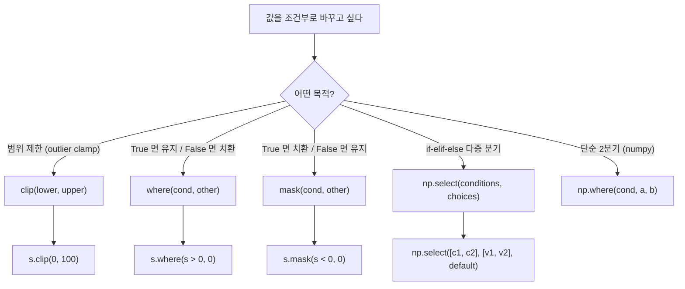

## 정의

- **`clip(lower, upper)`** : 범위 밖 값을 경계로 자르기 (outlier 처리)
- **`where(cond, other)`** : cond 가 True 면 유지, False 면 other 로 치환
- **`mask(cond, other)`** : where 의 반대 (cond True 가 치환)

## 어떤 것을 쓸까



## 사용 상황

| 상황 | 도구 |
|:---|:---|
| 음수 값을 0 으로 고정 | `s.clip(lower=0)` |
| 백분위 기준 이상치 제거 | `s.clip(q1, q99)` |
| 조건 불만족 행 NaN 처리 | `s.where(cond)` |
| 특정 조건 행을 다른 값으로 | `s.mask(cond, replacement)` |
| 여러 조건 분기 (연령대 분류 등) | `np.select` |

## clip

```python
s.clip(lower=0)               # 0 미만 → 0
s.clip(upper=100)              # 100 초과 → 100
s.clip(lower=0, upper=100)     # [0, 100] 범위로
```

<CodeWithOutput
  language="python"
  outputLanguage="text"
  code={`import pandas as pd
s = pd.Series([-5, 0, 50, 150, 200])
print(s.clip(0, 100).tolist())`}
  output={`[0, 0, 50, 100, 100]`}
/>

| original | clipped (0, 100) |
|---|---|
| -5 | 0 |
| 0 | 0 |
| 50 | 50 |
| 150 | 100 |
| 200 | 100 |

### 컬럼별 다른 경계

```python
df.clip(lower={'a': 0, 'b': -10}, upper={'a': 100, 'b': 10})
```

### 분위수 기반 clip

```python
lower = df['amount'].quantile(0.01)
upper = df['amount'].quantile(0.99)
df['amount_clipped'] = df['amount'].clip(lower, upper)
```

실무에서 outlier 처리 패턴으로 자주 쓰인다.

## where

```python
s.where(cond, other)        # cond True 면 그대로, False 면 other
```

> [!IMPORTANT]
> `s.where(cond, other)` 는 **cond 가 True 일 때 그대로 유지**. numpy 의 `np.where(cond, a, b)` 와 의미가 정반대다.

<CodeWithOutput
  language="python"
  outputLanguage="text"
  code={`import pandas as pd
s = pd.Series([10, 20, 30, 40])
print(s.where(s > 20, 0).tolist())`}
  output={`[0, 0, 30, 40]`}
/>

`s > 20` 이 False 인 위치 (10, 20) 가 0 으로 치환됨.

### where 의 함수 형태

```python
s.where(lambda x: x > 0, 0)              # cond 도 callable
s.where(s > 0, lambda x: -x)             # other 도 callable
```

### where 로 NaN 마킹

```python
# 조건 불만족 행을 NaN 으로
df['score'] = df['score'].where(df['score'] >= 0)
# other 생략 시 기본값 NaN
```

## mask

```python
s.mask(cond, other)         # where 의 반대
```

`cond True 인 곳을 치환`. 의미가 더 직관적인 경우가 많다.

```python
# salary 가 100k 이상이면 'high', 아니면 원본 유지
df['salary_label'] = df['salary'].mask(df['salary'] >= 100_000, 'high')
```

### mask 로 이상치 NaN 처리

```python
df['amount'] = df['amount'].mask(
    (df['amount'] < 0) | (df['amount'] > 10_000),
    other=pd.NA,
)
```

## np.where 와의 비교

```python
import numpy as np
np.where(s > 20, s, 0)        # cond True → s, False → 0
s.where(s > 20, 0)             # cond True → s, False → 0 (같음)
```

같은 결과지만 pandas API 는 **`other` 가 cond False 일 때**, numpy 는 **`x` 가 True 일 때**.

## np.select (다중 분기)

```python
import numpy as np
conditions = [df['age'] < 13, df['age'] < 20, df['age'] < 65]
choices = ['child', 'teen', 'adult']
df['stage'] = np.select(conditions, choices, default='senior')
```

여러 if-elif-else 를 벡터화.

```python
# 실무 예: 매출 등급 분류
conditions = [
    df['revenue'] < 1_000,
    df['revenue'] < 10_000,
    df['revenue'] < 100_000,
]
choices = ['bronze', 'silver', 'gold']
df['tier'] = np.select(conditions, choices, default='platinum')
```

## 실전 패턴

### outlier 처리

```python
# 1, 99 percentile 로 clip
lower = df['amount'].quantile(0.01)
upper = df['amount'].quantile(0.99)
df['amount_clipped'] = df['amount'].clip(lower, upper)
```

### 조건부 컬럼 생성

```python
df['discount'] = df['price'].where(df['vip'], df['price'] * 0.9)
# vip 이면 그대로, 아니면 10% 할인
```

### 연속 mask 체인

```python
df['value'] = (
    df['value']
    .where(df['value'] >= 0, 0)         # 음수 → 0
    .where(df['value'] <= 1_000, 1_000) # 1000 초과 → 1000
)
# 또는 clip 으로 동일하게:
df['value'] = df['value'].clip(0, 1_000)
```

### pandas 2.x CoW 와 where / mask

```python
# pandas 2.x Copy-on-Write 환경
# where / mask 는 항상 새 Series 반환 → 원본 불변
s2 = s.where(s > 0, 0)    # s 는 그대로, s2 가 변경된 버전
s.where(s > 0, 0, inplace=True)   # inplace: 원본 수정 (CoW 에서 경고 가능)
```

### DataFrame.where (축 방향)

```python
df.where(df > 0)             # 모든 셀: 0 이하 → NaN
df.where(df.notna(), -999)   # NaN 인 셀 → -999
df.mask(df < 0, 0)           # 음수 셀 → 0
```

## 함정

### 1. where / mask 의 의미 헷갈림

기억법: **w**here 는 **w**hen True 유지. **m**ask 는 **m**asks True (가린다).

### 2. cond 의 shape 일치

```python
df.where(some_bool_df)        # 같은 shape DataFrame
df.where(df['x'] > 0)         # broadcast (행 단위)
```

### 3. other 의 dtype 강등

```python
s = pd.Series([1, 2, 3], dtype='int64')
s.where(s > 1, 'small')       # dtype 이 object 로 강등
# 의도했으면 괜찮지만, 수치 연산 이후 예상치 못한 결과 가능
```

### 4. np.where 의미 혼동

```python
# np.where(cond, x, y): cond True → x, False → y
# s.where(cond, other): cond True → s 그대로, False → other
# 반대처럼 보이지만 실제로는 동일한 결과

s.where(s > 0, -1)            # 양수 유지, 나머지 -1
np.where(s > 0, s, -1)        # 동일한 결과
```

### 5. clip 과 where 의 NA 처리

```python
s = pd.Series([pd.NA, 5, 10], dtype='Int64')
s.clip(0, 8)      # [<NA>, 5, 8]  (NA 는 그대로)
s.where(s <= 8)   # [<NA>, 5, 8]  (NA 는 False 처리 → 치환)
# NA 에 대한 동작이 다름. clip 은 NA 보존, where 는 NA 를 False 로
```

### 6. inplace 와 체이닝

```python
# ❌ 체이닝 중 inplace
df['col'].where(cond, 0, inplace=True)   # SettingWithCopyWarning 가능

# ✓ 직접 할당
df['col'] = df['col'].where(cond, 0)
```

## 관련 위키

- [[Pandas Boolean Indexing]]
- [[Pandas replace / astype]]
- [[Pandas .loc / .iloc]]
- [[Pandas dropna / fillna]]
- [[Pandas cut / qcut]]
