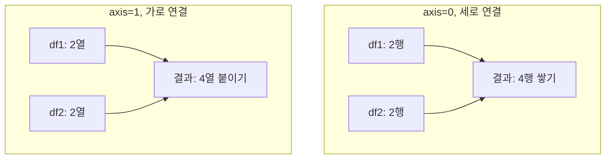
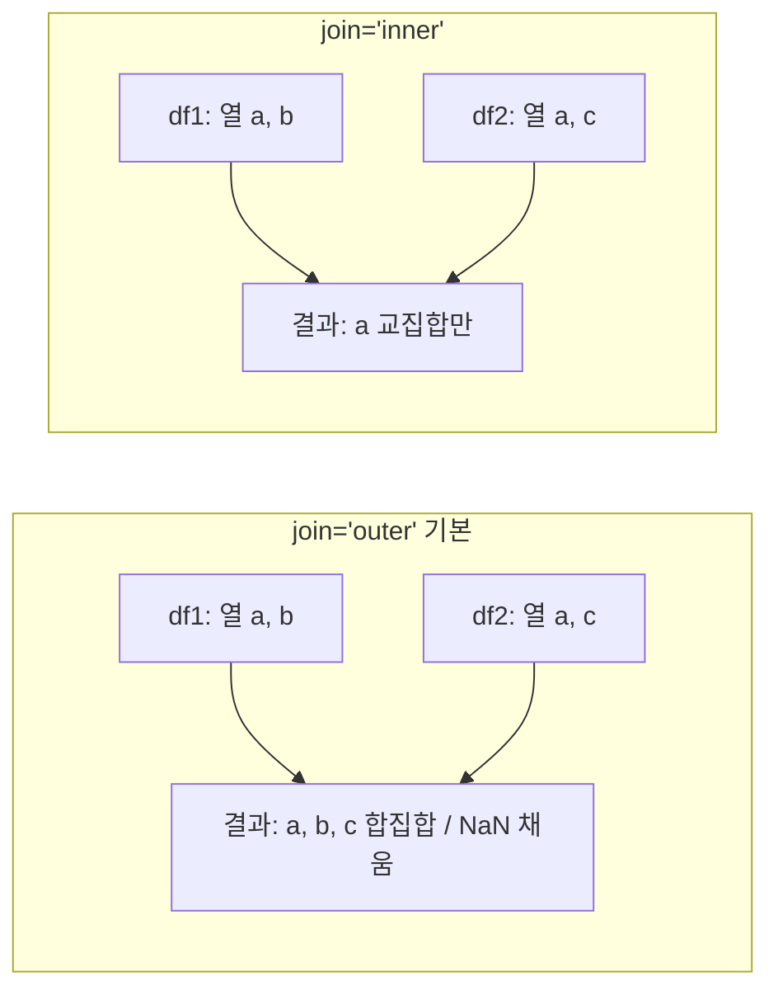

## 정의

**`pd.concat(objs, axis=0)`** 는 여러 DataFrame/Series 를 **세로 (axis=0) 또는 가로 (axis=1)** 로 단순 연결. SQL 의 `UNION` (axis=0) 또는 column-level concatenation (axis=1).

key 매칭이 아닌 **위치 기반 결합** 이라 [[Pandas merge]] / [[Pandas join]] 과 구분된다.

## 사용 상황

- **행 단위 쌓기**: 같은 구조의 DataFrame 여러 개를 하나로 합칠 때
- **가로 붙이기**: 같은 index 를 공유하는 feature 그룹을 열 방향으로 결합할 때
- **계층 라벨 부여**: 시기/그룹별 데이터를 묶어 [[Pandas MultiIndex]] 로 분석할 때
- **df.append 대체**: pandas 2.0 에서 `append` 가 제거됨, `pd.concat` 으로 완전 대체

`merge` / `join` 과 달리 key 매칭이 없으므로, 스키마가 같거나 의도적으로 다른 경우에 쓴다.

## axis 동작 시각화



## join 파라미터 시각화



## 세로 연결 (axis=0, 기본)

```python
result = pd.concat([df1, df2])
```

<CodeWithOutput
  language="python"
  outputLanguage="text"
  code={`import pandas as pd
df1 = pd.DataFrame({'name':['A','B'], 'age':[10,20]})
df2 = pd.DataFrame({'name':['C','D'], 'age':[30,40]})
print(pd.concat([df1, df2]))`}
  output={`  name  age
0    A   10
1    B   20
0    C   30
1    D   40`}
/>

index 가 중복됨 (0, 1, 0, 1). `ignore_index=True` 로 재설정:

```python
pd.concat([df1, df2], ignore_index=True)
# index: 0, 1, 2, 3
```

## 가로 연결 (axis=1)

```python
pd.concat([df1, df2], axis=1)
# 컬럼이 옆으로 붙음, index 기준 정렬
```

<CodeWithOutput
  language="python"
  outputLanguage="text"
  code={`import pandas as pd
left = pd.DataFrame({'a': [1, 2, 3]}, index=[0, 1, 2])
right = pd.DataFrame({'b': [10, 20, 30]}, index=[0, 1, 2])
print(pd.concat([left, right], axis=1))`}
  output={`   a   b
0  1  10
1  2  20
2  3  30`}
/>

index 가 다르면 NaN 이 생긴다:

```python
left = pd.DataFrame({'a': [1, 2]}, index=[0, 1])
right = pd.DataFrame({'b': [10, 20]}, index=[1, 2])
pd.concat([left, right], axis=1)
#     a     b
# 0  1.0   NaN
# 1  2.0  10.0
# 2  NaN  20.0
```

## 컬럼이 다를 때

```python
df1 = pd.DataFrame({'a': [1,2], 'b': [3,4]})
df2 = pd.DataFrame({'a': [5,6], 'c': [7,8]})

pd.concat([df1, df2])
# a: 1,2,5,6
# b: 3,4,NaN,NaN
# c: NaN,NaN,7,8
```

기본 `join='outer'`, 합집합. `join='inner'` 면 교집합 컬럼만:

```python
pd.concat([df1, df2], join='inner')
# 공통 컬럼 a 만 남음
```

## keys (계층적 라벨)

```python
pd.concat([df1, df2], keys=['Q1', 'Q2'])
# 결과의 index 가 MultiIndex: (Q1, 0), (Q1, 1), (Q2, 0), (Q2, 1)
```

여러 시기/그룹의 데이터를 한 번에 모아 분석할 때 유용:

```python
combined = pd.concat([q1, q2, q3], keys=['Q1', 'Q2', 'Q3'])

# 특정 분기만 추출
combined.loc['Q2']

# 분기별 집계
combined.groupby(level=0).sum()
```

`names` 파라미터로 MultiIndex 레벨 이름도 지정:

```python
pd.concat(
    [df_2024, df_2025],
    keys=[2024, 2025],
    names=['year', 'original_idx'],
)
```

## 자주 쓰는 패턴

### 여러 파일을 하나로

```python
import glob
dfs = [pd.read_csv(f) for f in glob.glob('data/*.csv')]
big = pd.concat(dfs, ignore_index=True)
```

### 새 행 추가 (pandas 2.x)

```python
# pandas 1.x 의 df.append 는 pandas 2.0 에서 제거됨
new_row = pd.DataFrame([{'name': 'E', 'age': 50}])
df = pd.concat([df, new_row], ignore_index=True)
```

### 컬럼 추가 (가로 결합)

```python
features = compute_features(df)  # 별도 feature DataFrame
result = pd.concat([df, features], axis=1)
```

### 딕셔너리에서 concat

```python
frames = {'train': df_train, 'val': df_val, 'test': df_test}
combined = pd.concat(frames)
# MultiIndex: ('train', 0), ('val', 0), ...
combined.loc['train']   # 학습 데이터만 추출
```

### 조건부 분기 처리 후 재결합

```python
premium = df[df['tier'] == 'premium'].copy()
standard = df[df['tier'] != 'premium'].copy()
premium['discount'] = 0.2
standard['discount'] = 0.05
result = pd.concat([premium, standard]).sort_index()
```

### Nullable dtype 유지 (pandas 2.x)

```python
# int 컬럼에 NaN 이 섞여도 float 강등을 방지
df1 = pd.DataFrame({'count': pd.array([1, 2], dtype='Int64')})
df2 = pd.DataFrame({'count': pd.array([None, 4], dtype='Int64')})
pd.concat([df1, df2], ignore_index=True)
# count 컬럼: Int64 (nullable) 유지
```

## 성능

`concat` 은 **전체 결과 메모리를 미리 할당** 한 뒤 복사. 큰 데이터를 루프 안에서 반복 concat 하면 O(n²) 비용 가능.

```python
# 느림: 루프 안에서 반복 concat
result = pd.DataFrame()
for df in dfs:
    result = pd.concat([result, df])

# 빠름: 한 번에 리스트 전달
result = pd.concat(dfs, ignore_index=True)
```

대용량 concat 에서 dtype 을 미리 지정하면 메모리 절약:

```python
dtypes = {'id': 'int32', 'value': 'float32', 'label': 'category'}
dfs = [pd.read_csv(f, dtype=dtypes) for f in files]
result = pd.concat(dfs, ignore_index=True)
```

> [!TIP]
> pandas 2.x 에서는 `pd.concat` 결과가 항상 새 메모리를 할당한다. 임시 리스트를 concat 직후 `del dfs` 로 해제하면 피크 메모리를 줄일 수 있다.

## pandas 2.x 변경점

| 항목 | pandas 1.x | pandas 2.x |
|:---|:---|:---|
| `df.append` | 지원 | 제거됨 (`pd.concat` 으로 대체) |
| `sort` 기본값 | `False` | `False` (유지) |
| Copy-on-Write | 미지원 | 기본 활성화 |
| Nullable int + NaN concat | float 강등 | `Int64` 유지 가능 |

## merge / join / concat 비교

| 동작 | 함수 |
|:---|:---|
| key 매칭 | `merge` |
| index 매칭 | `join` |
| 단순 연결 (위/옆) | `concat` |

## 함정

### 1. index 중복

```python
pd.concat([df1, df2])
# 0, 1, 0, 1 -> .loc[0] 이 두 행 반환
# 해법: ignore_index=True 또는 reset_index(drop=True)
```

### 2. dtype 강등

```python
# a 가 int 인 df1 에 NaN 이 포함된 df2 를 concat 하면 float 으로 강등
# 해법: Nullable dtype 사용
df1 = pd.DataFrame({'a': pd.array([1, 2], dtype='Int64')})
df2 = pd.DataFrame({'a': pd.array([None], dtype='Int64')})
pd.concat([df1, df2])  # Int64 유지
```

### 3. 컬럼 순서

```python
# 합집합이지만 순서는 첫 DataFrame 우선
# df1 의 컬럼 + df2 의 새 컬럼 (뒤에 추가)
# 의도치 않은 순서를 원하면 .reindex(columns=원하는_순서) 로 정렬
```

### 4. axis=1 에서 index 불일치

```python
left = pd.DataFrame({'a': [1, 2]}, index=[0, 1])
right = pd.DataFrame({'b': [10]}, index=[0])
pd.concat([left, right], axis=1)
# NaN 생성: right.b 의 index 1 은 NaN
```

> [!WARNING]
> `axis=1` concat 시 두 DataFrame 의 index 가 완전히 일치하지 않으면 NaN 이 생긴다. `join='inner'` 로 교집합 index 만 유지하거나, 사전에 index 를 정렬/재설정하라.

### 5. df.append() 제거 (pandas 2.0)

```python
# AttributeError
df = df.append(new_row)

# 대체
df = pd.concat([df, new_row], ignore_index=True)
```

### 6. sort 파라미터

```python
# pandas 2.x 기본: sort=False (첫 DataFrame 컬럼 순서 유지)
# sort=True 하면 알파벳 정렬
pd.concat([df1, df2], sort=False)
```

## 관련 위키

- [[Pandas merge]]
- [[Pandas join]]
- [[Pandas DataFrame]]
- [[Pandas MultiIndex]]
- [[Pandas groupby]]
- [[Pandas read_csv]]
- [[Pandas .loc / .iloc]]
- [[Pandas Nullable Types]]
