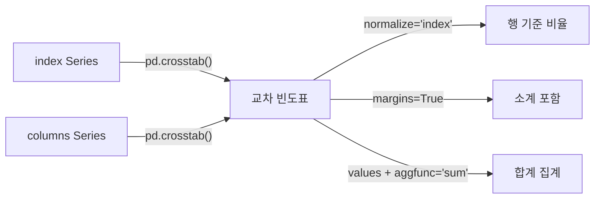

## 정의

**`pd.crosstab(index, columns)`** 는 두 (또는 그 이상의) Series 로 **교차 빈도표 (contingency table)** 를 만든다. SQL 의 PIVOT 또는 Excel 의 피벗 테이블과 비슷.

```python
pd.crosstab(df['gender'], df['plan'])
```

## 사용 상황

- **범주형 변수 간 분포 탐색**: 성별 x 구독 플랜, 지역 x 연령대 등 교차 분포 파악
- **비율 분석**: `normalize='index'` 로 행 기준 비율, `normalize='all'` 로 전체 비율
- **데이터 검증**: 특정 조합의 존재 여부, 결측 조합 탐지
- **집계 보고서**: `values + aggfunc` 로 빠른 요약 테이블 생성

`pivot_table` 과 기능이 비슷하지만, 입력이 DataFrame 컬럼명이 아닌 **Series 직접 전달**이라는 점이 다르다.

## 분석 흐름 시각화



## 기본 (count)

<CodeWithOutput
  language="python"
  outputLanguage="text"
  code={`import pandas as pd
df = pd.DataFrame({
    'gender': ['M','F','M','F','M','F'],
    'plan': ['basic','pro','basic','basic','pro','pro'],
})
print(pd.crosstab(df['gender'], df['plan']))`}
  output={`plan    basic  pro
gender
F           1    2
M           2    1`}
/>

| gender \ plan | basic | pro |
|---|---|---|
| F | 1 | 2 |
| M | 2 | 1 |

## margins (소계 / 총계 행)

```python
pd.crosstab(df['gender'], df['plan'], margins=True, margins_name='Total')
```

<CodeWithOutput
  language="python"
  outputLanguage="text"
  code={`import pandas as pd
df = pd.DataFrame({
    'gender': ['M','F','M','F','M','F'],
    'plan': ['basic','pro','basic','basic','pro','pro'],
})
print(pd.crosstab(df['gender'], df['plan'], margins=True))`}
  output={`plan    basic  pro  All
gender
F           1    2    3
M           2    1    3
All         3    3    6`}
/>

## normalize (비율)

```python
pd.crosstab(df['gender'], df['plan'], normalize='index')    # 행 기준 비율
pd.crosstab(df['gender'], df['plan'], normalize='columns')  # 열 기준
pd.crosstab(df['gender'], df['plan'], normalize='all')      # 전체
```

<CodeWithOutput
  language="python"
  outputLanguage="text"
  code={`import pandas as pd
df = pd.DataFrame({
    'gender': ['M','F','M','F','M','F'],
    'plan': ['basic','pro','basic','basic','pro','pro'],
})
print(pd.crosstab(df['gender'], df['plan'], normalize='index'))`}
  output={`plan       basic       pro
gender
F       0.333333  0.666667
M       0.666667  0.333333`}
/>

각 행 합이 1. 행 기준 분포를 보여준다.

## values + aggfunc (합계, 평균 등)

```python
pd.crosstab(
    df['gender'],
    df['plan'],
    values=df['amount'],
    aggfunc='sum',
)
```

count 가 아닌 sum/mean 등의 집계. 사실상 [[Pandas pivot_table]] 과 같다.

## 다중 index / 다중 columns

```python
pd.crosstab(
    [df['gender'], df['region']],
    df['plan']
)
# MultiIndex 행

pd.crosstab(
    df['gender'],
    [df['plan'], df['region']]
)
# MultiIndex 컬럼
```

## crosstab vs pivot_table

| 항목 | crosstab | pivot_table |
|:---|:---|:---|
| 입력 | Series (또는 array) | DataFrame + 컬럼명 |
| 기본 aggfunc | count | mean |
| margins | `margins=` | `margins=` |
| 다중 그룹 | list 전달 | list 전달 |
| normalize | `normalize=` | 없음 (수동 계산) |

```python
# 같은 결과
pd.crosstab(df['gender'], df['plan'])
df.pivot_table(index='gender', columns='plan', aggfunc='size')
```

## 실전 패턴

### EDA: 범주형 변수 간 관계 탐색

```python
import pandas as pd

df = pd.read_csv('customers.csv')

# 성별 x 구독 플랜 분포
ct = pd.crosstab(df['gender'], df['plan'])
print(ct)

# 행 기준 비율로 패턴 파악
ct_pct = pd.crosstab(df['gender'], df['plan'], normalize='index')
print(ct_pct.round(2))
```

### 결측 조합 탐지

```python
# 특정 조합이 존재하는지 확인
ct = pd.crosstab(df['region'], df['product_code'])
# 0 인 셀: 해당 지역에 그 제품 주문 없음
missing_combos = (ct == 0).stack()
missing_combos[missing_combos].reset_index()[['region', 'product_code']]
```

### 고급 집계: 여러 aggfunc 동시 적용

```python
# crosstab 자체는 단일 aggfunc 만 지원
# 여러 집계가 필요하면 pivot_table 사용
summary = df.pivot_table(
    index='gender',
    columns='plan',
    values='amount',
    aggfunc=['sum', 'mean', 'count'],
)
# MultiIndex 컬럼: ('sum', 'basic'), ('sum', 'pro'), ...
```

### 비율 히트맵 시각화 준비

```python
import pandas as pd

ct_pct = pd.crosstab(
    df['age_group'],
    df['plan'],
    normalize='index'
).round(3)

# 시각화 (matplotlib / seaborn)
# import seaborn as sns
# sns.heatmap(ct_pct, annot=True, fmt='.1%', cmap='Blues')
```

### 다중 레벨 교차표 + margins

```python
ct = pd.crosstab(
    [df['region'], df['gender']],
    df['plan'],
    values=df['revenue'],
    aggfunc='sum',
    margins=True,
    margins_name='합계',
)
```

## 성능

| 상황 | 권장 |
|:---|:---|
| 단순 count | `pd.crosstab()` 간결, 빠름 |
| count + normalize | `pd.crosstab(normalize=...)` 한 번에 |
| 다중 집계 | `pivot_table(aggfunc=['sum', 'mean'])` |
| 대용량 + 다중 그룹 | `groupby().unstack()` 이 더 빠를 수 있음 |
| 범주형 컬럼 | `Categorical` dtype 으로 변환 후 crosstab -> 속도 향상 |

```python
# 대용량: groupby + unstack 이 더 빠를 수 있음
result = (
    df.groupby(['gender', 'plan'])
    .size()
    .unstack('plan', fill_value=0)
)

# Categorical 변환으로 속도 향상
df['plan'] = pd.Categorical(df['plan'], categories=['basic', 'pro', 'enterprise'])
pd.crosstab(df['gender'], df['plan'])
# 카테고리 순서 보장 + 속도 향상
```

## 자주 만나는 함정

### 1. 합산 vs 카운트

```python
pd.crosstab(df['gender'], df['plan'])                                            # count
pd.crosstab(df['gender'], df['plan'], values=df['amount'], aggfunc='sum')        # sum
```

`values` 와 `aggfunc` 를 같이 줘야 합산 가능. 어느 하나만 주면 에러.

### 2. 결측치

```python
pd.crosstab(df['gender'], df['plan'], dropna=False)
# NaN 도 그룹으로 포함
```

기본으로 `dropna=True` 라 NaN 카테고리가 보이지 않는다. 데이터 품질 검증 시 `dropna=False` 권장.

### 3. normalize 의 유효값

`'index'` / `'columns'` / `'all'` / `True` / `False` 만 유효. `True` 는 `'all'` 과 같다.

### 4. 다중 aggfunc 불가

```python
# ❌ crosstab 은 단일 aggfunc 만 허용
pd.crosstab(..., aggfunc=['sum', 'mean'])  # TypeError

# ✓ pivot_table 사용
df.pivot_table(..., aggfunc={'amount': ['sum', 'mean']})
```

> [!WARNING]
> `crosstab` 은 `normalize` 와 `values + aggfunc` 를 동시에 사용할 수 없다. 비율 집계가 필요하면 수동으로 나눠야 한다.

## 관련 위키

- [[Pandas groupby]]
- [[Pandas pivot]]
- [[Pandas pivot_table]]
- [[Pandas MultiIndex]]
- [[Pandas DataFrame]]
- [[Pandas 성능 / 메모리 최적화]]
