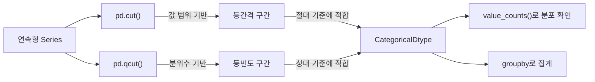

## 정의

- **`pd.cut(s, bins)`** : **값 기반 binning** (구간을 직접 지정)
- **`pd.qcut(s, q)`** : **빈도 기반 binning** (분위수로 같은 크기)

연속형 변수를 범주형으로 변환. ML 의 feature engineering, 통계 보고서에 자주 사용.

## 등간격 vs 등빈도 binning



## cut, 값 기반

```python
pd.cut(s, bins=[0, 18, 30, 50, 100])
pd.cut(s, bins=4)                      # 같은 간격 4 구간 자동
pd.cut(s, bins=[0,18,30,50,100], labels=['child','young','adult','senior'])
```

<CodeWithOutput
  language="python"
  outputLanguage="text"
  code={`import pandas as pd
ages = pd.Series([5, 17, 25, 35, 55, 80])
print(pd.cut(ages, bins=[0, 18, 30, 50, 100],
    labels=['child','young','adult','senior']).tolist())`}
  output={`['child', 'child', 'young', 'adult', 'senior', 'senior']`}
/>

| age | bin |
|---|---|
| 5 | child |
| 17 | child |
| 25 | young |
| 35 | adult |
| 55 | senior |
| 80 | senior |

## qcut, 빈도 기반

```python
pd.qcut(s, q=4)                       # 4분위 (각 25%)
pd.qcut(s, q=10, labels=False)        # 십분위, 정수 라벨
pd.qcut(s, q=[0, 0.5, 0.9, 1.0])      # 사용자 지정 quantile
```

<CodeWithOutput
  language="python"
  outputLanguage="text"
  code={`import pandas as pd
scores = pd.Series([60, 65, 70, 75, 80, 85, 90, 95])
print(pd.qcut(scores, q=4, labels=['Q1','Q2','Q3','Q4']).tolist())`}
  output={`['Q1', 'Q1', 'Q2', 'Q2', 'Q3', 'Q3', 'Q4', 'Q4']`}
/>

각 그룹에 같은 수의 원소.

## cut vs qcut 비교

| 항목 | cut | qcut |
|:---|:---|:---|
| 분할 기준 | 값 (예: 0~18, 18~30) | 빈도 (각 25%) |
| 그룹 크기 | 다를 수 있음 | 같음 (대략) |
| 적합 | 절대 기준 (나이, 가격대) | 상대 기준 (분위수, 등급) |
| NaN 처리 | NaN 그대로 | NaN 그대로 |
| 중복 경계 | 해당 없음 | `duplicates='drop'` 필요 |

## right / include_lowest

```python
pd.cut(s, bins=[0, 18, 30], right=True)        # (left, right]
pd.cut(s, bins=[0, 18, 30], right=False)       # [left, right)
pd.cut(s, bins=[0, 18, 30], include_lowest=True)   # 가장 작은 구간이 [0, ...]
```

기본 `right=True` → `(0, 18]`. 경계값이 어느 쪽에 들어가는지 명확히.

## retbins (bin 경계도 반환)

```python
bins_arr, edges = pd.qcut(s, q=4, retbins=True)
# 새 데이터에 같은 경계 적용 가능
pd.cut(new_s, bins=edges)
```

## 결과 활용

```python
# 카테고리 dtype 반환
result = pd.cut(s, bins=[0, 18, 30, 50])
result.dtype                  # CategoricalDtype
result.value_counts()         # 각 구간의 빈도

# 정수 라벨이 필요하면
pd.cut(s, bins=4, labels=False)    # 0, 1, 2, 3
```

## IntervalIndex

`pd.cut` / `pd.qcut` 의 결과는 `Categorical` 이고, categories 가 `IntervalIndex` 다.

```python
import pandas as pd
s = pd.Series([5, 17, 25, 35, 55])
result = pd.cut(s, bins=[0, 18, 30, 50, 100])

# 각 구간의 IntervalIndex 확인
print(result.cat.categories)
# IntervalIndex([(0, 18], (18, 30], (30, 50], (50, 100]], dtype='interval[int64, right]')

# 구간 객체에서 left, right 추출
cats = result.cat.categories
print(cats[0].left, cats[0].right)   # 0, 18

# 직접 IntervalIndex 생성
intervals = pd.IntervalIndex.from_breaks([0, 18, 30, 50, 100], closed='right')
pd.cut(s, bins=intervals)
```

### IntervalIndex 로 새 데이터 적용

```python
# 훈련 데이터에서 bin 경계 학습
train_result, edges = pd.qcut(train['age'], q=5, retbins=True)

# 테스트 데이터에 같은 경계 적용
test_result = pd.cut(test['age'], bins=edges, labels=False)
```

ML 파이프라인에서 train/test 일관성 유지에 필수 패턴.

## 자주 쓰는 패턴

### 연령대별 통계

```python
df['age_group'] = pd.cut(df['age'], bins=[0, 18, 30, 50, 100],
    labels=['미성년','청년','중년','노년'])
df.groupby('age_group', observed=True)['spending'].mean()
```

> [!TIP]
> pandas 2.0 에서 `groupby(observed=True)` 를 명시하지 않으면 빈 카테고리도 포함해 집계한다는 경고가 발생한다. Categorical 컬럼을 groupby 할 때는 `observed=True` 권장.

### 동일 빈도 분위수 등급

```python
df['percentile'] = pd.qcut(df['score'], q=10, labels=False)
# 0 ~ 9 의 십분위 라벨
```

### 사용자 정의 quantile

```python
pd.qcut(df['price'], q=[0, 0.25, 0.5, 0.75, 0.9, 1.0],
    labels=['cheap','low','mid','high','luxury'])
```

### ML feature engineering

```python
import pandas as pd

# 연속형 피처 → 범주형 변환
df['age_bin'] = pd.cut(df['age'], bins=5, labels=False)  # 0-4 정수 라벨

# OneHot 인코딩 전처리
dummies = pd.get_dummies(df['age_bin'], prefix='age_bin')
df = pd.concat([df, dummies], axis=1)
```

### 구간별 분포 시각화

```python
result = pd.cut(df['salary'], bins=10)
result.value_counts().sort_index().plot(kind='bar')
# 각 구간별 빈도 막대 그래프
```

## 성능 특성

| 항목 | 내용 |
|:---|:---|
| 반환 타입 | `Categorical` (메모리 효율적) |
| 내부 저장 | 정수 codes + categories 배열 |
| 메모리 | object 대비 1/3~1/10 수준 |
| 연산 속도 | groupby, value_counts 에서 빠름 |

```python
# Categorical 이 object 보다 메모리 효율적인 이유
s_obj = pd.Series(['child', 'adult', 'senior'] * 1_000_000)  # object
s_cat = s_obj.astype('category')                              # category

print(s_obj.memory_usage(deep=True))   # 약 192 MB
print(s_cat.memory_usage(deep=True))   # 약 3 MB (codes + categories)
```

## 함정

### 1. NaN 처리

```python
pd.cut(s, bins=...)
# NaN 은 NaN 카테고리로 유지
```

### 2. duplicates (qcut)

```python
pd.qcut(s, q=4)
# 데이터가 한 값에 몰려 있으면 quantile 경계 중복 → ValueError
pd.qcut(s, q=4, duplicates='drop')   # 중복 경계 자동 제거
```

데이터가 편향된 경우 `qcut` 이 실패할 수 있다. `duplicates='drop'` 으로 우선 처리 후 결과를 확인하라.

### 3. labels 의 길이

```python
pd.cut(s, bins=[0, 18, 30, 50], labels=['a','b','c'])
# bins n+1 개, labels n 개
# 잘못 맞추면 ValueError
```

### 4. 새 데이터에 훈련 경계 미적용

```python
# ❌ 잘못된 패턴: 훈련/테스트에 각각 qcut 적용
train['bin'] = pd.qcut(train['age'], q=4)  # 훈련 기준 경계
test['bin']  = pd.qcut(test['age'], q=4)   # 테스트 기준 경계 (다름!)

# ✓ 올바른 패턴: 훈련에서 edges 추출 후 test 에 cut 으로 적용
_, edges = pd.qcut(train['age'], q=4, retbins=True)
train['bin'] = pd.cut(train['age'], bins=edges, labels=False)
test['bin']  = pd.cut(test['age'],  bins=edges, labels=False)
```

### 5. groupby observed 경고 (pandas 2.0)

```python
# ⚠️ FutureWarning: The default value of observed
df.groupby('age_group')['value'].sum()

# ✓ 명시적으로 지정
df.groupby('age_group', observed=True)['value'].sum()
```

## 관련 위키

- [[Pandas value_counts]]
- [[Pandas Categorical]]
- [[Pandas groupby]]
- [[Pandas get_dummies]]
- [[Pandas DataFrame]]
