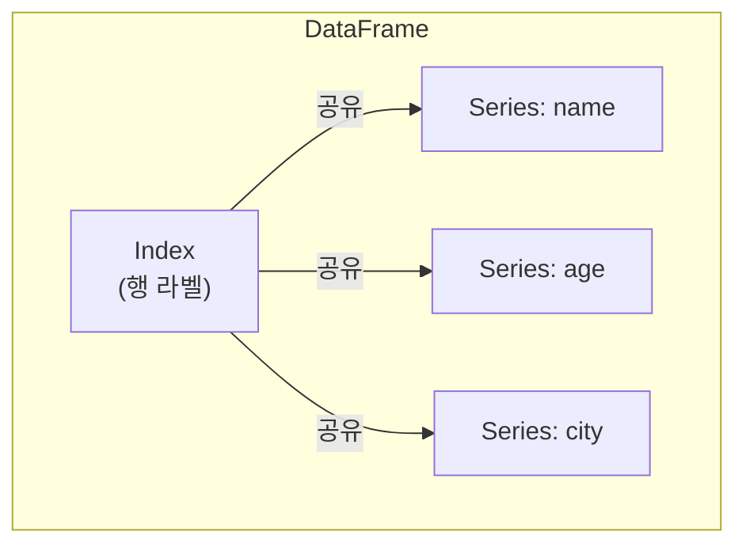
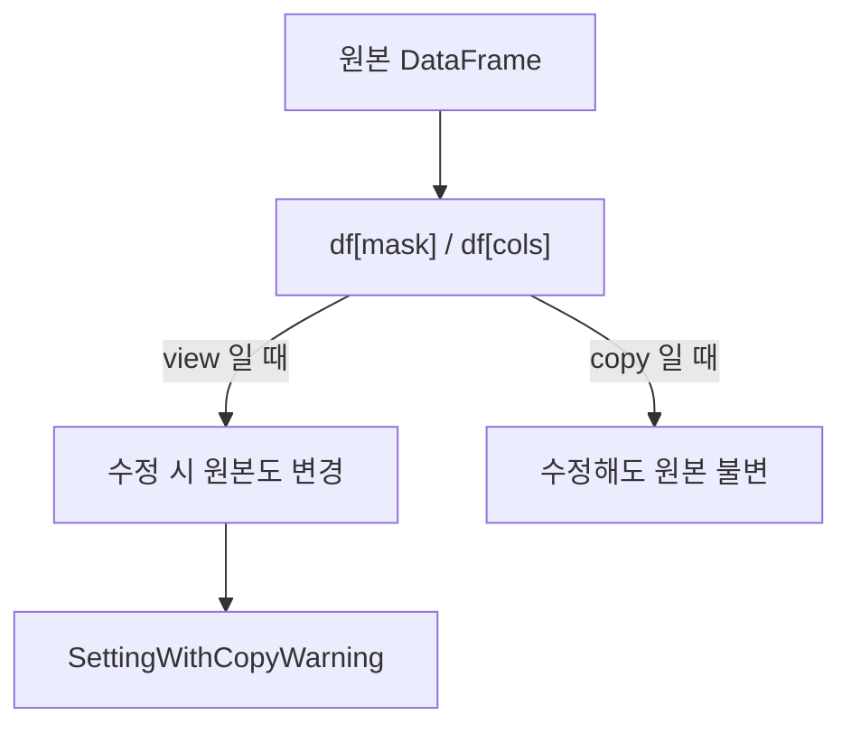

## 정의

**`pandas.DataFrame`** 은 2차원 레이블 테이블. **각 열이 [[Pandas Series]]**, 모든 열이 같은 [[Pandas Index]] (행 라벨) 를 공유. SQL 테이블 / Excel 시트 / R data.frame 의 Python 대응체.

## 구조 시각화



각 열(column)은 독립적인 [[Pandas Series]] 이고, 모든 Series 가 동일한 Index 를 공유한다. 열마다 dtype 이 달라도 된다.

## 생성

<CodeWithOutput
  language="python"
  outputLanguage="text"
  code={`import pandas as pd

# 1. dict of lists (가장 흔함)
df = pd.DataFrame({
    'name': ['Alice', 'Bob', 'Charlie'],
    'age': [30, 25, 35],
    'city': ['Seoul', 'Busan', 'Seoul'],
})
print(df)`}
  output={`      name  age   city
0    Alice   30  Seoul
1      Bob   25  Busan
2  Charlie   35  Seoul`}
/>

## 다른 생성 방식

```python
# list of dicts
pd.DataFrame([{'a': 1, 'b': 2}, {'a': 3, 'b': 4}])

# 2D array + columns
pd.DataFrame([[1, 2], [3, 4]], columns=['a', 'b'])

# from records
pd.DataFrame.from_records([(1, 'A'), (2, 'B')], columns=['id', 'name'])

# CSV 등 파일
pd.read_csv('data.csv')

# SQL 쿼리 결과 (pandas 2.x)
pd.read_sql("SELECT * FROM users", con=engine)
```

## 핵심 속성

| 속성 | 의미 |
|:---|:---|
| `df.shape` | `(n_rows, n_cols)` |
| `df.columns` | Index 객체 (열 이름) |
| `df.index` | Index 객체 (행 라벨) |
| `df.dtypes` | 각 열의 타입 |
| `df.values` | 2D numpy array |
| `df.size` | 원소 총 개수 |
| `df.T` | 전치 (transpose) |
| `df.ndim` | 차원 수 (항상 2) |
| `df.empty` | 원소가 없으면 True |
| `df.memory_usage()` | 열별 메모리 사용량 (bytes) |

## 빠른 탐색 메서드

```python
df.head()         # 상위 5개
df.tail(3)
df.info()         # 메모리, dtype, null 개수
df.describe()     # 수치형 통계
df.sample(5)      # 무작위 5개
df.value_counts() # Series 만, 빈도
```

<CodeWithOutput
  language="python"
  outputLanguage="text"
  code={`df = pd.DataFrame({
    'age': [25, 30, 35, 40, 45],
    'salary': [3000, 4500, 6000, 7500, 9000],
})
print(df.describe())`}
  output={`             age       salary
count   5.000000     5.000000
mean   35.000000  6000.000000
std     7.905694  2371.708245
min    25.000000  3000.000000
25%    30.000000  4500.000000
50%    35.000000  6000.000000
75%    40.000000  7500.000000
max    45.000000  9000.000000`}
/>

## 열 추가 / 수정 / 삭제

```python
df['bmi'] = df['weight'] / (df['height']/100) ** 2   # 새 열
df['age'] = df['age'] + 1                            # 수정
df['constant'] = 100                                  # broadcast
df.drop(columns=['bmi'], inplace=False)              # 삭제 (사본 반환)

# assign 으로 method chain
df_new = (
    df
    .assign(bmi=lambda d: d['weight'] / (d['height']/100)**2)
    .assign(category=lambda d: pd.cut(d['bmi'], bins=[0, 18.5, 25, 30, 100]))
)
```

## 행 추가

```python
# Modern pandas 2.x
new_row = pd.DataFrame([{'name': 'Dave', 'age': 28}])
df = pd.concat([df, new_row], ignore_index=True)

# (pandas 1.x 의 df.append 는 deprecated)
```

## 자주 쓰는 변환

```python
df.rename(columns={'old': 'new'})
df.astype({'age': 'int64', 'city': 'category'})
df.set_index('name')
df.reset_index()
df.sort_values('age')
df.sort_index()
```

## DataFrame vs Series 의 관계

```python
df['name']           # Series
df[['name', 'age']]  # DataFrame (대괄호 2개)
df.iloc[0]           # Series (한 행)
df.iloc[[0]]         # DataFrame (한 행이지만 2D)
```

대괄호 개수 / iloc 단일 vs 리스트 가 반환 타입을 결정.

## Copy vs View

pandas 의 가장 흔한 혼란 중 하나. 슬라이싱 결과가 원본의 **뷰(view)** 인지 **복사본(copy)** 인지 불명확하다.



```python
# pandas 2.0 CoW (Copy-on-Write) 이전
sub = df[df['age'] > 30]          # view 일 수도, copy 일 수도
sub['new'] = 1                     # ⚠️ SettingWithCopyWarning

# 올바른 방법: 명시적 .copy()
sub = df[df['age'] > 30].copy()
sub['new'] = 1                     # 원본 안전

# pandas 2.0+ CoW: 항상 copy 처럼 동작 (view 수정 불가)
```

> [!WARNING]
> pandas 2.0 부터 Copy-on-Write (CoW) 가 기본 도입됐다. `df[...]` 로 선택한 결과에 대입하면 `ChainedAssignmentError`. 조건부 수정은 반드시 `.loc[행, 열] =` 한 번에.

## 성능 팁

```python
# dtype 을 명시해 메모리 절약
df = pd.DataFrame({
    'age': pd.array([25, 30, 35], dtype='int8'),     # int64 대신 1/8 메모리
    'city': pd.Categorical(['Seoul', 'Busan', 'Seoul']),  # category 타입
})

# 컬럼 많을 때 필요한 것만 read_csv
df = pd.read_csv('data.csv', usecols=['name', 'age'])

# inplace 는 메모리 절약 아님 (사본 생성 후 교체)
df.sort_values('age', inplace=True)   # 권장 안 함
df = df.sort_values('age')            # 더 명확
```

자세히는 [[Pandas 성능 / 메모리 최적화]].

## 함정

### 1. SettingWithCopyWarning

```python
sub = df[df['age'] > 20]
sub['new'] = 1      # ⚠️ view 인지 copy 인지 모름

# 해법: .loc 한 번에 처리
df.loc[df['age'] > 20, 'new'] = 1    # ✓
```

### 2. inplace 의 오해

```python
df.drop(columns=['a'], inplace=True)
# inplace 는 내부적으로 복사 후 교체, 메모리 절약 없음
# 그리고 method chain 불가, 디버깅 어려움
# 반환값 None 이라 실수 유발
```

> [!CAUTION]
> `inplace=True` 는 실질적 이점이 없다. 반환값이 `None` 이라 `df = df.sort_values(...)` 처럼 쓰려다 데이터를 잃을 수 있다.

### 3. dtypes 혼용

```python
df = pd.DataFrame({'a': [1, 2, None]})
df.dtypes    # float64 (int + None → float)

# pandas 2.0 nullable int
df = pd.DataFrame({'a': pd.array([1, 2, None], dtype='Int64')})
df.dtypes    # Int64 (nullable)
```

### 4. 빈 DataFrame 생성 후 루프 append

```python
# ❌ 매우 느림
results = pd.DataFrame()
for row in data:
    results = pd.concat([results, pd.DataFrame([row])])

# ✓ 리스트에 모아 한 번에
rows = []
for row in data:
    rows.append(row)
df = pd.DataFrame(rows)
```

## 관련 위키

- [[Pandas Overview]]
- [[Pandas Series]]
- [[Pandas Index]]
- [[Pandas .loc / .iloc]]
- [[Pandas 컬럼 선택]]
- [[Pandas Boolean Indexing]]
- [[SettingWithCopyWarning]]
- [[Pandas 성능 / 메모리 최적화]]
- [[Pandas read_csv]]
