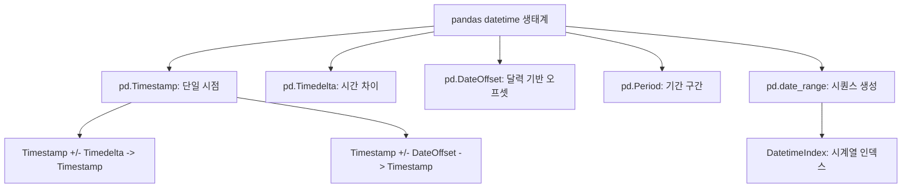
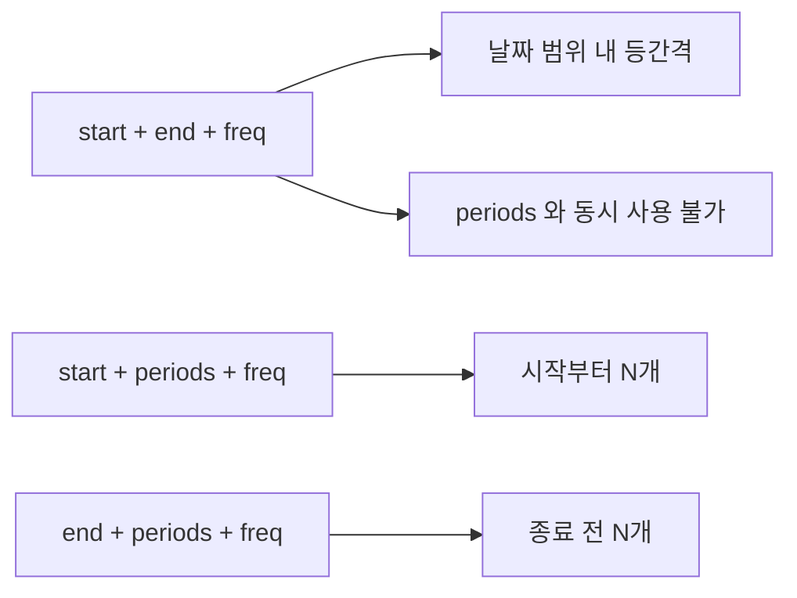

## 정의

- **`pd.date_range`** : 정해진 시작/끝/간격으로 datetime 시퀀스 생성
- **`pd.Timestamp`** : pandas 의 단일 datetime 객체
- **`pd.Timedelta`** : 시간 차이

## 사용 상황

| 상황 | 사용 API |
|:---|:---|
| 보고 기간 목록 생성 | `pd.date_range('2024-01', '2024-12', freq='MS')` |
| DataFrame 의 누락 날짜 채우기 | `.reindex(date_range, fill_value=0)` |
| 두 날짜의 차이 계산 | `Timestamp - Timestamp` -> `Timedelta` |
| 영업일 목록 추출 | `pd.date_range(start, end, freq='B')` |
| 월 단위 더하기 | `Timestamp + DateOffset(months=3)` |
| DatetimeIndex 용 인덱스 생성 | `pd.date_range(...)` -> `.set_index(...)` |

## 시각화

pandas 의 datetime 타입 계층:



date_range 파라미터 조합:



## date_range

```python
pd.date_range(start='2024-01-01', end='2024-01-31', freq='D')
pd.date_range(start='2024-01-01', periods=10, freq='D')
pd.date_range(end='2024-01-31', periods=10, freq='D')
```

`start`, `end`, `periods`, `freq` 중 **3 개** 만 지정.

<CodeWithOutput
  language="python"
  outputLanguage="text"
  code={`import pandas as pd
idx = pd.date_range('2024-01-01', periods=5, freq='D')
print(idx)
print('---')
print(pd.date_range('2024-01-01', '2024-01-31', freq='W'))`}
  output={`DatetimeIndex(['2024-01-01', '2024-01-02', '2024-01-03', '2024-01-04',
               '2024-01-05'],
              dtype='datetime64[ns]', freq='D')
---
DatetimeIndex(['2024-01-07', '2024-01-14', '2024-01-21', '2024-01-28'], dtype='datetime64[ns]', freq='W-SUN')`}
/>

## freq 옵션 (대표)

| freq | 의미 |
|:---|:---|
| `D` | 매일 |
| `B` | 영업일 |
| `W`, `W-MON` | 매주 (요일 지정 가능) |
| `MS`, `ME` | 월초/월말 |
| `QS`, `QE` | 분기초/분기말 |
| `YS`, `YE` | 연초/연말 |
| `h`, `30min`, `15s` | 시간 단위 (숫자 prefix 가능) |
| `2D`, `3W` | 곱셈 |

## tz 지정

```python
pd.date_range('2024-01-01', periods=10, freq='D', tz='Asia/Seoul')
pd.date_range('2024-01-01', periods=10, freq='D', tz='UTC')
```

## Timestamp 생성

```python
pd.Timestamp('2024-01-15')
pd.Timestamp('2024-01-15 14:30:00', tz='Asia/Seoul')
pd.Timestamp(year=2024, month=1, day=15)
pd.Timestamp.now()
pd.Timestamp.today()      # 같음 (now 와 거의 동일)
```

### 연산

```python
ts = pd.Timestamp('2024-01-15')
ts + pd.Timedelta(days=10)         # 2024-01-25
ts + pd.DateOffset(months=1)       # 2024-02-15 (월 단위)
ts - pd.Timestamp('2023-12-25')    # Timedelta('21 days')
```

`Timedelta` 는 정해진 시간, `DateOffset` 은 달력 단위 (월 길이 다름 고려).

## Timedelta

```python
pd.Timedelta(days=5, hours=3)
pd.Timedelta('1 days 02:00:00')
pd.to_timedelta(['1d', '2h', '30min'])
```

## period (기간)

```python
p = pd.Period('2024-01', freq='M')
p.start_time, p.end_time
p + 1                                # 2024-02
```

```python
pd.period_range('2024-01', periods=12, freq='M')   # 12 개월
```

`Timestamp` 는 한 순간, `Period` 는 구간 (시작-끝).

## DatetimeIndex 의 슬라이싱

```python
df = pd.DataFrame(..., index=pd.date_range('2024-01-01', periods=100))
df['2024-02']
df['2024-02-15':'2024-03-15']
df.loc['2024-02-15':'2024-03-15']
```

## 자주 쓰는 패턴

### 보고 기간 생성

```python
report_dates = pd.date_range('2024-01-01', '2024-12-31', freq='MS')
for d in report_dates:
    run_monthly_report(d)
```

### 누락된 날짜 채우기

```python
full_range = pd.date_range(df.index.min(), df.index.max(), freq='D')
df = df.reindex(full_range, fill_value=0)
```

### 영업일 계산

```python
pd.date_range('2024-01-01', '2024-01-31', freq='B')   # 영업일만
```

### 특정 요일의 날짜만

```python
# 매주 월요일
pd.date_range('2024-01-01', '2024-03-31', freq='W-MON')

# 매월 마지막 영업일
pd.date_range('2024-01-01', '2024-12-31', freq='BME')
```

### DataFrame 에 날짜 인덱스 붙이기

```python
idx = pd.date_range('2024-01-01', periods=len(df), freq='D')
df.index = idx
```

### 두 날짜 사이 영업일 수

```python
bdays = pd.bdate_range('2024-01-01', '2024-01-31')
print(f"영업일 수: {len(bdays)}")
```

## 날짜 오프셋 종류

| 오프셋 | 의미 |
|:---|:---|
| `DateOffset(days=n)` | n일 후 |
| `DateOffset(months=n)` | n개월 후 (달력 기준) |
| `DateOffset(years=n)` | n년 후 |
| `BDay(n)` | n 영업일 후 |
| `MonthEnd(n)` | n번째 월말 |
| `MonthBegin(n)` | n번째 월초 |
| `BusinessMonthEnd(n)` | n번째 영업 월말 |

```python
from pandas.tseries.offsets import MonthEnd, BDay

ts = pd.Timestamp('2024-01-15')
ts + MonthEnd(1)    # 2024-01-31 (이번 달 말일)
ts + MonthEnd(2)    # 2024-02-29 (다음 달 말일)
ts + BDay(5)        # 5 영업일 후
```

## 함정

### 1. freq 가 정해지지 않은 경우

```python
pd.DatetimeIndex(['2024-01-01', '2024-01-15', '2024-01-30'])
# freq=None, resample 등 일부 동작이 제한
```

명시적 freq 가 필요하면 `.asfreq('D')`.

### 2. DateOffset vs Timedelta

```python
pd.Timestamp('2024-01-31') + pd.Timedelta(days=30)     # 2024-03-01
pd.Timestamp('2024-01-31') + pd.DateOffset(months=1)   # 2024-02-29 (윤년)
```

월/년 단위는 `DateOffset`, 절대 시간은 `Timedelta`.

### 3. periods 계산

```python
pd.date_range('2024-01-01', '2024-01-31', freq='D')
# 31 개 (양쪽 inclusive)
```

### 4. naive vs tz-aware 혼합

```python
ts_naive = pd.Timestamp('2024-01-01')
ts_aware = pd.Timestamp('2024-01-01', tz='UTC')

ts_naive + ts_aware   # TypeError: cannot mix tz-naive and tz-aware
```

> [!WARNING]
> tz-naive 와 tz-aware Timestamp 는 더하거나 비교할 수 없다. 처음부터 통일하거나 `tz_localize` / `tz_convert` 로 변환 후 사용.

### 5. Timedelta 와 DateOffset 의 차이

```python
ts = pd.Timestamp('2024-01-31')

ts + pd.Timedelta(days=30)          # 2024-03-01 (정확히 30일)
ts + pd.DateOffset(months=1)        # 2024-02-29 (1개월 후 = 2월 말)
```

월/년 단위 이동에는 반드시 `DateOffset`. `Timedelta` 는 절대 시간 단위라 달력 의미가 없다.

## 관련 위키

- [[Pandas to_datetime]]
- [[Pandas dt accessor]]
- [[Pandas resample]]
- [[Pandas rolling]]
- [[Pandas groupby]]
