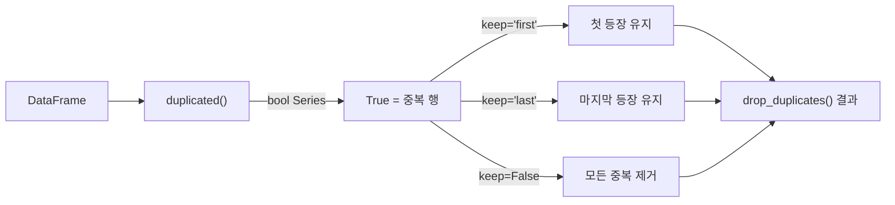
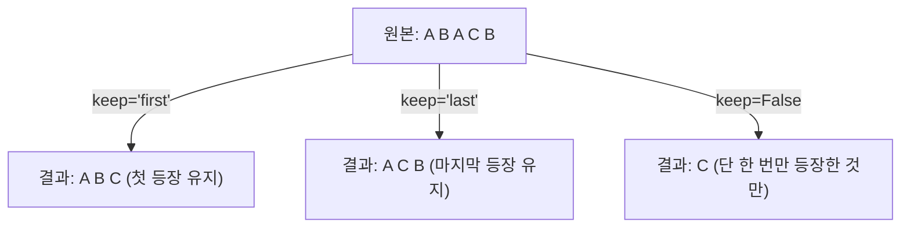

## 정의

- **`duplicated()`** : 각 행이 중복인지 boolean Series 반환
- **`drop_duplicates()`** : 중복 행 제거 후 DataFrame 반환

[[Pandas unique / nunique]] 와는 다르다. 그건 Series 의 고유값 추출, 이건 **행 단위** 처리.

## 사용 상황

- 데이터 수집 시 동일 레코드가 중복 삽입된 경우
- 각 사용자/상품의 가장 최근 이벤트만 남길 때
- `DISTINCT` 에 해당하는 SQL 연산을 pandas 로 구현할 때
- 중복 여부를 boolean 컬럼으로 표시해 감사(audit) 할 때

## 동작 흐름



## 기본 사용법

<CodeWithOutput
  language="python"
  outputLanguage="text"
  code={`import pandas as pd
df = pd.DataFrame({
    'name': ['Alice', 'Bob', 'Alice', 'Charlie', 'Bob'],
    'age':  [30, 25, 30, 35, 25],
})
print(df.duplicated().tolist())
print('---')
print(df.drop_duplicates())`}
  output={`[False, False, True, False, True]
---
      name  age
0    Alice   30
1      Bob   25
3  Charlie   35`}
/>

## subset: 특정 컬럼만 기준으로

```python
df.drop_duplicates(subset=['email'])           # email 기준 중복
df.drop_duplicates(subset=['name', 'phone'])   # 두 컬럼 조합 기준
```

subset 을 지정하면 해당 컬럼 조합이 같은 행을 중복으로 판단한다. 나머지 컬럼 값은 무시.

```python
df = pd.DataFrame({
    'user_id': [1, 1, 2, 3],
    'event':   ['login', 'login', 'purchase', 'login'],
    'ts':      ['09:00', '09:05', '10:00', '11:00'],
})
# user_id + event 조합 기준 중복 제거
df.drop_duplicates(subset=['user_id', 'event'])
```

## keep: 어느 행을 남길지

| keep | 동작 |
|:---|:---|
| `'first'` (기본) | 첫 등장 유지, 이후 중복 제거 |
| `'last'` | 마지막 등장 유지, 이전 중복 제거 |
| `False` | **모든** 중복 제거 (단 한 번만 나오는 행만 남김) |

```python
df.drop_duplicates(keep='first')   # 기본
df.drop_duplicates(keep='last')
df.drop_duplicates(keep=False)     # 단 한 번만 나오는 행만
```

<CodeWithOutput
  language="python"
  outputLanguage="text"
  code={`import pandas as pd
df = pd.DataFrame({'name': ['A', 'B', 'A', 'C', 'B']})
print(df.drop_duplicates(keep=False))   # A, B 가 모두 제거됨`}
  output={`  name
3    C`}
/>

## keep 옵션 비교

데이터 `['A', 'B', 'A', 'C', 'B']` 에서 각 keep 옵션 결과:



| 인덱스 | 값 | `keep='first'` | `keep='last'` | `keep=False` |
|:---|:---|:---:|:---:|:---:|
| 0 | A | 유지 | - | - |
| 1 | B | 유지 | - | - |
| 2 | A | - | 유지 | - |
| 3 | C | 유지 | 유지 | 유지 |
| 4 | B | - | 유지 | - |

## duplicated() 활용

```python
df[df.duplicated()]                    # 중복 행만 (keep='first' 기준)
df[df.duplicated(keep=False)]          # 중복된 모든 행 (원본 포함)
df['is_dup'] = df.duplicated('email')  # boolean 컬럼 추가
df.duplicated().sum()                  # 중복 행 개수
df.duplicated().mean()                 # 중복 비율
```

### 중복 현황 파악

```python
# 어떤 값이 중복인지 확인
dup_mask = df.duplicated(subset=['email'], keep=False)
df[dup_mask].sort_values('email')
```

## index 다루기

```python
df.drop_duplicates()                            # 원래 index 유지
df.drop_duplicates().reset_index(drop=True)     # 0,1,2,... 재배치
```

`drop_duplicates` 후 index 가 불연속적으로 남는다. 이후 `iloc` 로 접근하거나 연속 index 가 필요하면 `reset_index(drop=True)` 를 붙인다.

## 그룹별 첫 번째 / 마지막 행

`drop_duplicates` 는 그룹별 첫/마지막 선택의 빠른 idiom 이다.

```python
# 각 user 의 가장 최근 주문 (마지막 등장)
df.sort_values('date', ascending=False).drop_duplicates('user_id')

# 각 user 의 첫 주문 (첫 등장)
df.sort_values('date').drop_duplicates('user_id')

# 각 카테고리에서 가장 비싼 상품
df.sort_values('price', ascending=False).drop_duplicates('category')
```

`groupby('user_id').head(1)` 보다 약간 빠를 때가 있다.

## SQL 비교

```sql
-- DISTINCT
SELECT DISTINCT name, age FROM table;
-- pandas: df[['name','age']].drop_duplicates()

-- 중복 제거 후 첫 번째 (window function)
SELECT * FROM table
WHERE id IN (
  SELECT MIN(id) FROM table GROUP BY user_id
);
-- pandas: df.sort_values('id').drop_duplicates('user_id')
```

## pandas 2.x: Copy-on-Write 영향

```python
# pandas 2.x CoW 환경에서 inplace=True 는 동작하지만 권장하지 않음
df.drop_duplicates(inplace=True)   # 옛 코드
df = df.drop_duplicates()           # 권장 (명시적, CoW 안전)
```

## 성능

| 방법 | 속도 | 비고 |
|:---|:---:|:---|
| `drop_duplicates()` | 빠름 | 해시 기반 |
| `groupby().head(1)` | 비슷 | 그룹별 첫 행 |
| Python `for` 루프 | 매우 느림 | 절대 피할 것 |

```python
# 대용량 데이터에서 subset 지정이 더 빠름
df.drop_duplicates(subset=['user_id'])   # 필요한 컬럼만 비교
```

## 함정

### 1. NaN 의 중복 처리

```python
import numpy as np
df = pd.DataFrame({'x': [1, 1, None, None]})
df.duplicated().tolist()
# [False, True, False, True]
# NaN == NaN 이 일반적으로 False 이지만, duplicated 는 NaN 도 같은 것으로 취급
```

### 2. subset 컬럼 순서는 결과에 영향 없음

```python
df.drop_duplicates(['a', 'b'])     # (a, b) 조합으로 비교
df.drop_duplicates(['b', 'a'])     # 결과 동일, 순서 무관
```

### 3. inplace=True 의 함정

```python
df.drop_duplicates(inplace=True)   # 옛 코드, 권장 안 함
df = df.drop_duplicates()           # ✓ 명시적
```

### 4. keep=False 와 duplicated(keep=False) 의 차이

```python
# drop_duplicates(keep=False): 중복된 행 전부 제거
df.drop_duplicates(keep=False)

# duplicated(keep=False): 중복된 행 전부 True 표시 (제거 안 함)
df[df.duplicated(keep=False)]      # 중복된 행 전부 보기
```

### 5. 정렬 후 drop_duplicates 순서

```python
# ❌ 정렬 전 drop_duplicates: 원본 순서 기준 첫 행
df.drop_duplicates('user_id')

# ✓ 최신 이벤트 기준 첫 행
df.sort_values('ts', ascending=False).drop_duplicates('user_id')
```

## 실전 패턴

### 중복 제거 후 집계

```python
# 중복 제거 전 개수 vs 후 개수 비교
total = len(df)
unique = len(df.drop_duplicates())
print(f"중복 행: {total - unique} ({(total - unique) / total:.1%})")
```

### 특정 컬럼 기준 최신 레코드만

```python
# 이벤트 로그에서 각 사용자의 마지막 상태만
latest = (
    df
    .sort_values('updated_at', ascending=False)
    .drop_duplicates(subset=['user_id'])
    .reset_index(drop=True)
)
```

### 중복 행 감사 (audit)

```python
# 중복 여부 컬럼 추가 후 원본 보존
df['is_duplicate'] = df.duplicated(subset=['email'], keep='first')
df[df['is_duplicate']].to_csv('duplicates_audit.csv', index=False)
```

### 다중 키 중복 제거

```python
# 날짜 + 상품 + 지역 조합 기준
df.drop_duplicates(subset=['date', 'product_id', 'region'])
```

## 관련 위키

- [[Pandas unique / nunique]]
- [[Pandas value_counts]]
- [[Pandas sort_values]]
- [[Pandas groupby]]
- [[Pandas DataFrame]]
- [[SettingWithCopyWarning]]
