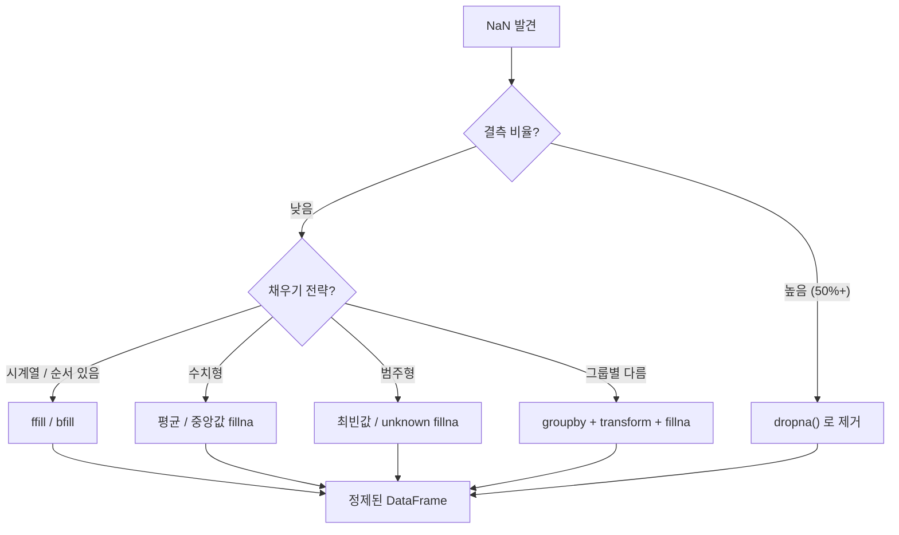

## 정의

- **`dropna()`** : NaN 이 있는 행/열 제거
- **`fillna()`** : NaN 을 특정 값으로 대체

데이터 분석의 가장 기본적인 결측치 처리.

## 사용 상황

- CSV 로드 후 빈 셀이 NaN 으로 읽혔을 때
- 시계열 데이터에서 누락된 시점을 이전/다음 값으로 채울 때
- 머신러닝 전처리에서 결측치를 평균/중앙값으로 대체할 때
- 결측치가 너무 많은 컬럼/행을 제거할 때

## NaN 처리 전략 흐름



## dropna 기본

```python
df.dropna()                     # 어느 컬럼이든 NaN 있는 행 제거
df.dropna(how='all')            # 모든 컬럼이 NaN 인 행만 제거
df.dropna(subset=['col1'])      # 특정 컬럼만 검사
df.dropna(axis=1)               # NaN 있는 열 제거
df.dropna(thresh=3)             # NaN 이 아닌 값이 3 개 이상인 행만 유지
```

<CodeWithOutput
  language="python"
  outputLanguage="text"
  code={`import pandas as pd
import numpy as np
df = pd.DataFrame({
    'a': [1, np.nan, 3, 4],
    'b': [np.nan, 2, 3, 4],
    'c': [10, 20, np.nan, 40],
})
print(df)
print('--- dropna() ---')
print(df.dropna())`}
  output={`     a    b     c
0  1.0  NaN  10.0
1  NaN  2.0  20.0
2  3.0  3.0   NaN
3  4.0  4.0  40.0
--- dropna() ---
     a    b     c
3  4.0  4.0  40.0`}
/>

### thresh 활용

```python
# NaN 이 아닌 값이 2 개 이상인 행만 유지
df.dropna(thresh=2)
# 행 0: a=1, c=10 → 2개 → 유지
# 행 1: b=2, c=20 → 2개 → 유지
# 행 2: a=3, b=3 → 2개 → 유지
# 행 3: 전부 → 유지
```

## fillna 기본

```python
df.fillna(0)                              # 모든 NaN → 0
df.fillna({'a': 0, 'b': 'unknown'})       # 컬럼별 다른 값
df['salary'].fillna(df['salary'].mean())  # 평균으로
df['salary'].fillna(df['salary'].median()) # 중앙값으로
```

> [!IMPORTANT]
> pandas 2.2+ 에서 `fillna(method='ffill')` / `fillna(method='bfill')` 는 deprecated. 새 코드는 **`df.ffill()`**, **`df.bfill()`** 직접 호출 권장.

## ffill / bfill

```python
df.ffill()          # forward fill: 이전 유효값으로 채움
df.bfill()          # backward fill: 다음 유효값으로 채움

# limit: 최대 몇 개까지 채울지
df.ffill(limit=2)   # 연속 NaN 최대 2개까지만 채움
```

<CodeWithOutput
  language="python"
  outputLanguage="text"
  code={`import pandas as pd
import numpy as np
s = pd.Series([1, np.nan, np.nan, 4, np.nan, 6])
print('original:', s.tolist())
print('ffill   :', s.ffill().tolist())
print('bfill   :', s.bfill().tolist())`}
  output={`original: [1.0, nan, nan, 4.0, nan, 6.0]
ffill   : [1.0, 1.0, 1.0, 4.0, 4.0, 6.0]
bfill   : [1.0, 4.0, 4.0, 4.0, 6.0, 6.0]`}
/>

| index | original | ffill | bfill |
|---|---|---|---|
| 0 | 1.0 | 1.0 | 1.0 |
| 1 | NaN | **1.0** | **4.0** |
| 2 | NaN | **1.0** | **4.0** |
| 3 | 4.0 | 4.0 | 4.0 |
| 4 | NaN | **4.0** | **6.0** |
| 5 | 6.0 | 6.0 | 6.0 |

## 컬럼별 다양한 전략

```python
# 수치형은 평균, 범주형은 'unknown'
fills = {
    'age':    df['age'].mean(),
    'salary': df['salary'].median(),
    'city':   'unknown',
    'note':   '',
}
df = df.fillna(fills)
```

## groupby + fillna: 그룹 평균으로 채우기

```python
# 각 부서의 평균으로 그 부서의 NaN 채우기
df['salary'] = df.groupby('dept')['salary'].transform(
    lambda s: s.fillna(s.mean())
)
```

전체 평균보다 그룹 평균이 더 의미 있는 경우에 유용하다.

```python
# 시계열: 같은 요일의 평균으로 채우기
df['sales'] = df.groupby(df['date'].dt.dayofweek)['sales'].transform(
    lambda s: s.fillna(s.mean())
)
```

## 결측치 현황 파악

```python
# 컬럼별 NaN 개수
df.isna().sum()

# 컬럼별 NaN 비율
df.isna().mean()

# 행별 NaN 개수
df.isna().sum(axis=1)

# NaN 이 있는 컬럼만
df.columns[df.isna().any()].tolist()
```

## interpolate: 보간

선형 보간으로 NaN 을 채울 수 있다.

```python
s = pd.Series([1, np.nan, np.nan, 4])
s.interpolate()
# 0    1.0
# 1    2.0
# 2    3.0
# 3    4.0
```

[[Pandas interpolate]] 참고.

## pandas 2.x 변경점

| 항목 | 1.x | 2.x |
|:---|:---|:---|
| `fillna(method='ffill')` | 작동 | deprecated, `df.ffill()` 사용 |
| `fillna(method='bfill')` | 작동 | deprecated, `df.bfill()` 사용 |
| `pd.NA` vs `np.nan` | `np.nan` 주류 | nullable dtype 에서 `pd.NA` |

```python
# 2.x 권장 패턴
df.ffill()                  # fillna(method='ffill') 대신
df.bfill()                  # fillna(method='bfill') 대신
df.ffill().bfill()          # 앞뒤 모두 채우기
```

## 성능

| 방법 | 속도 | 비고 |
|:---|:---:|:---|
| `fillna(scalar)` | 빠름 | 벡터 연산 |
| `ffill()` / `bfill()` | 빠름 | 벡터 연산 |
| `groupby + transform + fillna` | 보통 | 그룹별 처리 |
| `apply(lambda)` | 느림 | 행별 Python 루프 |

## 함정

### 1. dropna 가 너무 공격적

```python
df.dropna()           # 어느 컬럼이든 NaN 있으면 제거 → 행이 거의 안 남을 수 있음
df.dropna(subset=['중요컬럼'])   # 그 컬럼만 검사
df.dropna(thresh=len(df.columns) // 2)  # 절반 이상 NaN 인 행만 제거
```

### 2. inplace=True 의 안 좋은 습관

```python
df.dropna(inplace=True)        # 권장 안 함
df = df.dropna()               # ✓ 명시적
```

### 3. fillna 의 한계

```python
df['age'].fillna(df['age'].mean())
# NaN 비율이 높으면 평균이 의미를 잃음
# 더 정교한 imputation 은 scikit-learn 의 SimpleImputer, KNNImputer 등
```

### 4. ffill 의 첫 행 NaN

```python
s = pd.Series([np.nan, 1, 2])
s.ffill()
# 0    NaN   ← 이전 값이 없어 채워지지 않음
# 1    1.0
# 2    2.0
```

첫 행이 NaN 이면 `ffill` 로 채울 수 없다. `bfill` 또는 `fillna(0)` 을 추가로 적용한다.

### 5. NA dtype 의 처리

```python
# pandas 1.x+ 의 nullable dtype (Int64, boolean 등) 에서는
# np.nan 대신 pd.NA 가 사용됨
# fillna(0) 은 둘 다 처리하므로 일반적으로 문제없음
s = pd.array([1, pd.NA, 3], dtype='Int64')
pd.Series(s).fillna(0)
```

### 6. 체이닝 후 fillna

```python
# ❌ CoW 환경에서 체이닝 후 fillna 는 원본에 반영 안 됨
df[df['age'] > 30]['salary'].fillna(0)

# ✓ loc 로 한 번에
df.loc[df['age'] > 30, 'salary'] = df.loc[df['age'] > 30, 'salary'].fillna(0)
```

## 관련 위키

- [[Pandas isin / isna]]
- [[Pandas interpolate]]
- [[Pandas groupby]]
- [[Pandas Nullable Types]]
- [[SettingWithCopyWarning]]
