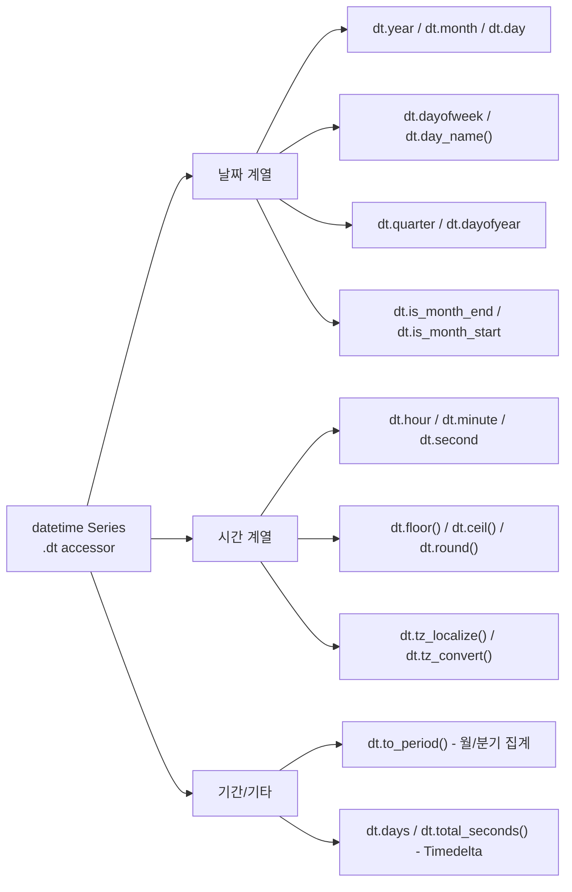

## 정의

**`Series.dt`** 는 datetime Series 의 각 구성요소 (년/월/일/시/분/요일 등) 에 벡터로 접근하는 accessor. `str` 의 datetime 버전.

```python
s.dt.year
s.dt.month
s.dt.day
s.dt.hour
s.dt.weekday
```

## 구성요소 분류 시각화



## 기본 컴포넌트

| 속성 | 의미 |
|:---|:---|
| `dt.year`, `dt.month`, `dt.day` | 년/월/일 |
| `dt.hour`, `dt.minute`, `dt.second` | 시/분/초 |
| `dt.dayofweek` / `dt.weekday` | 요일 (0=월) |
| `dt.day_name()` | 요일 이름 ('Monday') |
| `dt.month_name()` | 월 이름 ('January') |
| `dt.quarter` | 분기 (1-4) |
| `dt.dayofyear` | 그 해의 몇일째 |
| `dt.week`, `dt.isocalendar()` | 주차 |
| `dt.is_month_end`, `dt.is_month_start` | 월말/월초 boolean |
| `dt.days_in_month` | 그 달의 일 수 |

## 사용

<CodeWithOutput
  language="python"
  outputLanguage="text"
  code={`import pandas as pd
s = pd.to_datetime(['2024-01-15', '2024-03-30', '2024-12-25'])
s = pd.Series(s)
print('year :', s.dt.year.tolist())
print('month:', s.dt.month.tolist())
print('day  :', s.dt.day.tolist())
print('weekday:', s.dt.day_name().tolist())
print('quarter:', s.dt.quarter.tolist())`}
  output={`year : [2024, 2024, 2024]
month: [1, 3, 12]
day  : [15, 30, 25]
weekday: ['Monday', 'Saturday', 'Wednesday']
quarter: [1, 1, 4]`}
/>

## 포맷 변환

```python
s.dt.strftime('%Y-%m-%d')                  # 문자열로
s.dt.strftime('%Y년 %m월 %d일 (%A)')
s.dt.normalize()                           # 시간 0으로 (날짜만)
s.dt.floor('h')                            # 시간 단위 내림
s.dt.ceil('h')                             # 올림
s.dt.round('15min')                        # 반올림
```

## timezone

```python
s.dt.tz                                    # 현재 timezone
s.dt.tz_localize('Asia/Seoul')             # naive → aware
s.dt.tz_convert('UTC')                     # 다른 timezone 으로
s.dt.tz_convert('America/New_York')        # 시간대 변환
```

> [!IMPORTANT]
> `tz_localize` 와 `tz_convert` 는 전혀 다른 연산이다. `tz_localize` 는 timezone 정보 없는 naive datetime 에 timezone 을 **부여**, `tz_convert` 는 이미 timezone 이 있는 aware datetime 을 **변환**. naive 에 `tz_convert` 를 부르면 `TypeError`.

## Timedelta 의 dt

```python
td = pd.to_timedelta(['1 days 02:30:00', '2 days 05:00:00'])
td = pd.Series(td)
td.dt.days           # [1, 2]
td.dt.seconds        # 9000, 18000 (하루 안의 초)
td.dt.total_seconds()  # 전체 초
```

## Period accessor

```python
# PeriodIndex 로 변환하면 .dt.start_time, .dt.end_time 등 사용 가능
s_period = s.dt.to_period('M')           # monthly Period
s_period.dt.start_time                   # 각 월의 첫째 날 Timestamp
s_period.dt.end_time                     # 각 월의 마지막 날 Timestamp
s_period.dt.quarter                      # 분기 (Period 용)
```

## 자주 쓰는 패턴

### 월별 집계

```python
df['month'] = df['created_at'].dt.to_period('M')   # PeriodIndex (2024-01, ...)
monthly = df.groupby('month')['amount'].sum()
```

### 요일별 트렌드

```python
df['weekday'] = df['date'].dt.day_name()
df.groupby('weekday')['orders'].mean()
```

### 영업일 / 주말

```python
df['is_weekend'] = df['date'].dt.dayofweek >= 5
df['is_weekday'] = df['date'].dt.dayofweek < 5
```

### datetime 차이

```python
df['days_since_signup'] = (pd.Timestamp.today() - df['signup_date']).dt.days
df['age_years'] = (pd.Timestamp.today() - df['birth_date']).dt.days / 365.25
```

### 시간대별 분석

<CodeWithOutput
  language="python"
  outputLanguage="text"
  code={`import pandas as pd
df = pd.DataFrame({
    'ts': pd.date_range('2024-01-01', periods=6, freq='4h'),
    'val': [10, 20, 5, 30, 15, 25],
})
df['hour_bucket'] = df['ts'].dt.hour // 6 * 6  # 0,6,12,18 구간
print(df.groupby('hour_bucket')['val'].sum())`}
  output={`hour_bucket
0     30
6     35
12    40
Name: val, dtype: int64`}
/>

### 날짜 범위 필터

```python
# 특정 월만
mask = (df['date'].dt.year == 2024) & (df['date'].dt.month == 3)
df[mask]

# 특정 요일
df[df['date'].dt.dayofweek == 0]   # 월요일만

# 영업 시간 내
df[(df['ts'].dt.hour >= 9) & (df['ts'].dt.hour < 18)]
```

### resample 과 결합

```python
# 일별 집계 (dt accessor + resample)
df.set_index('date').resample('D')['amount'].sum()

# 주별 집계
df.set_index('date').resample('W')['amount'].mean()
```

자세히는 [[Pandas resample]].

## 성능 팁

```python
# dt accessor 는 벡터 연산, 루프보다 훨씬 빠름
# ❌ 느림
df['year'] = df['date'].apply(lambda x: x.year)

# ✓ 빠름
df['year'] = df['date'].dt.year

# datetime64 dtype 이면 dt 사용 가능, object 이면 to_datetime 먼저
df['date'] = pd.to_datetime(df['date_str'])
df['year'] = df['date'].dt.year
```

## 함정

### 1. dt 가 안 되는 경우

```python
s = pd.Series(['2024-01-15', '2024-02-20'])
s.dt.year      # AttributeError, str 이라서
# 먼저 변환
pd.to_datetime(s).dt.year
```

### 2. tz-aware vs naive 비교

```python
naive.tz_localize('UTC') > aware    # ✓
naive > aware                       # TypeError 가능
```

### 3. dayofweek 의 시작 (월요일 = 0)

```python
s.dt.dayofweek    # 0=Mon ... 6=Sun
s.dt.weekday      # 같음
# Python 의 datetime.weekday() 과 동일
```

ISO 표준 (1=Mon) 은 `s.dt.isocalendar().day`.

### 4. dt.week 는 deprecated

```python
s.dt.week      # DeprecationWarning (pandas 1.1+)
# 대신 사용
s.dt.isocalendar().week
```

> [!WARNING]
> `dt.week` 와 `dt.weekofyear` 는 pandas 1.1 에서 deprecated, 2.x 에서 제거됐다. `dt.isocalendar().week` 를 사용할 것.

## 관련 위키

- [[Pandas to_datetime]]
- [[Pandas resample]]
- [[Pandas date_range]]
- [[Pandas groupby]]
- [[Pandas str accessor]]
