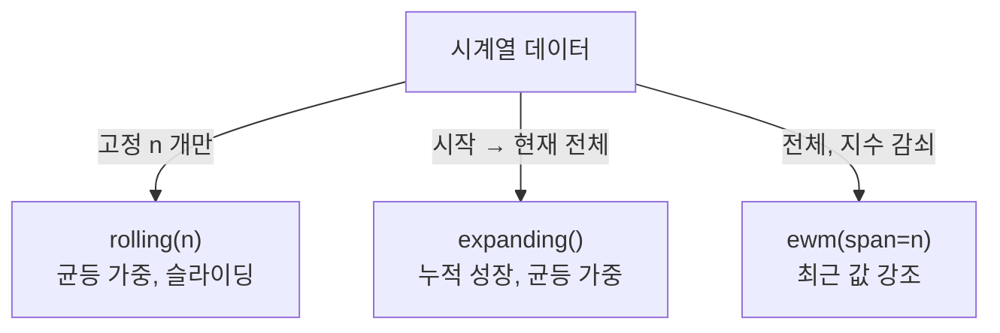

## 정의

[[Pandas rolling]] 외의 윈도우 연산.

- **`expanding()`** : 시작부터 현재까지 누적 윈도우
- **`ewm()`** : exponentially weighted (지수 가중)

## 윈도우 개념 비교



| 항목 | `rolling(n)` | `expanding()` | `ewm(span=n)` |
|:---|:---|:---|:---|
| 윈도우 크기 | 고정 n | 1 → 무한 | 사실상 무한 |
| 가중치 | 균등 | 균등 | *지수 감쇠* |
| 초기 NaN | n-1 개 | 0 개 (min_periods=1) | 0 개 |
| 노이즈 민감도 | 중간 | 낮음 | *낮음 (최근 강조)* |

## expanding

```python
s.expanding().mean()           # 시작부터 현재까지 평균
s.expanding().sum()            # = cumsum
s.expanding(min_periods=5).std()
```

<CodeWithOutput
  language="python"
  outputLanguage="text"
  code={`import pandas as pd
s = pd.Series([10, 20, 30, 40, 50])
print('mean:', s.expanding().mean().tolist())
print('std :', s.expanding().std().round(2).tolist())`}
  output={`mean: [10.0, 15.0, 20.0, 25.0, 30.0]
std : [nan, 7.07, 10.0, 12.91, 15.81]`}
/>

| index | s | expanding mean |
|---|---|---|
| 0 | 10 | 10 |
| 1 | 20 | 15 |
| 2 | 30 | 20 |
| 3 | 40 | 25 |
| 4 | 50 | 30 |

`rolling` 과 달리 윈도우 크기가 무한히 커진다.

## ewm, 지수 가중

```python
s.ewm(alpha=0.3).mean()
s.ewm(span=10).mean()
s.ewm(halflife=5).mean()
s.ewm(com=4).mean()
```

| 파라미터 | 의미 |
|:---|:---|
| `alpha` | 직접 가중치 (0 < α ≤ 1) |
| `span` | 평균적 윈도우 크기 (α = 2/(span+1)) |
| `halflife` | 가중치가 절반이 되는 거리 |
| `com` | center of mass (α = 1/(1+com)) |

> alpha 가 클수록 최근 값에 가중.

<CodeWithOutput
  language="python"
  outputLanguage="text"
  code={`import pandas as pd
s = pd.Series([1, 2, 3, 4, 5, 6, 7, 8])
print('span=3 ewm:', s.ewm(span=3).mean().round(2).tolist())
print('span=7 ewm:', s.ewm(span=7).mean().round(2).tolist())`}
  output={`span=3 ewm: [1.0, 1.67, 2.43, 3.27, 4.17, 5.12, 6.09, 7.06]
span=7 ewm: [1.0, 1.57, 2.18, 2.81, 3.45, 4.11, 4.78, 5.46]`}
/>

`span=3` 이 작아서 최근 값에 더 빨리 반응, `span=7` 은 smoother.

## ewm 의 수식

$$
y_t = \alpha \cdot x_t + (1 - \alpha) \cdot y_{t-1}
$$

지수 감쇠 가중. 모든 과거 값을 고려하지만 가중치가 지수적으로 감소.

## ewm 추가 파라미터

```python
# min_periods: 최소 관측 수 (미만이면 NaN)
s.ewm(span=5, min_periods=3).mean()

# ignore_na: NaN 을 건너뛰고 가중치 계산
s.ewm(span=5, ignore_na=True).mean()

# times: 불균등 시간 간격 지원 (pandas 1.1+)
import numpy as np
times = pd.to_datetime(['2026-01-01', '2026-01-02', '2026-01-05', '2026-01-06'])
s2 = pd.Series([1.0, 2.0, 3.0, 4.0], index=times)
s2.ewm(halflife='1D', times=s2.index).mean()
```

| 파라미터 | 기본값 | 의미 |
|:---|:---|:---|
| `min_periods` | 0 | 최소 관측 수 (미만 NaN) |
| `ignore_na` | False | NaN 위치 가중치 처리 |
| `adjust` | True | 초기 가중치 보정 여부 |
| `times` | None | 불균등 시간 간격 지원 |

> [!TIP]
> *시계열 데이터가 불규칙 간격* (주말 없음, 결측 등) 이면 `times=` + `halflife='1D'` 조합으로 *실제 시간 기반 감쇠* 적용.

## ewm var / std / cov

```python
# 분산, 표준편차
s.ewm(span=10).var()
s.ewm(span=10).std()

# 공분산, 상관계수
s1.ewm(span=10).cov(s2)
s1.ewm(span=10).corr(s2)
```

금융 리스크 모델 (GARCH 근사), 포트폴리오 변동성 추적에 활용.

## rolling vs expanding vs ewm

| 항목 | 윈도우 | 가중치 |
|:---|:---|:---|
| `rolling(n)` | 고정 n | 같음 |
| `expanding()` | 1 → ∞ | 같음 |
| `ewm(span=n)` | 사실상 무한 | 지수 감쇠 |

## 자주 쓰는 패턴

### 누적 평균 / 표준편차

```python
df['avg_so_far'] = df['x'].expanding().mean()
df['std_so_far'] = df['x'].expanding().std()
```

ML 의 online 통계, 게임 점수 누적 평균 등.

### 지수 이동 평균 (EMA)

```python
df['ema_short'] = df['close'].ewm(span=12, adjust=False).mean()
df['ema_long'] = df['close'].ewm(span=26, adjust=False).mean()
df['macd'] = df['ema_short'] - df['ema_long']
```

금융 지표 MACD.

### Bollinger Bands

```python
ma = df['close'].rolling(20).mean()
std = df['close'].rolling(20).std()
df['upper'] = ma + 2 * std
df['lower'] = ma - 2 * std
```

(rolling 기반)

### 시계열 smoothing

```python
df['smoothed'] = df['signal'].ewm(span=10).mean()
# noise 줄이기
```

### 이상 탐지 (Z-score 기반)

```python
# expanding 으로 누적 평균/표준편차 계산 후 Z-score
df['mean_so_far'] = df['value'].expanding().mean()
df['std_so_far']  = df['value'].expanding().std()
df['z_score']     = (df['value'] - df['mean_so_far']) / df['std_so_far']

# |z| > 3 이면 이상치
df['is_anomaly'] = df['z_score'].abs() > 3
```

*온라인 이상 탐지*: 과거 전체 분포를 기준으로 현재 값이 얼마나 벗어났는지 실시간 계산.

## adjust 옵션

```python
s.ewm(span=3, adjust=True).mean()    # 기본, 더 정확한 평균
s.ewm(span=3, adjust=False).mean()   # 재귀식 사용 (online 계산용)
```

- `adjust=True` : 시작 부분의 가중치도 보정
- `adjust=False` : 단순 재귀 (실시간 처리에 적합)

## Rolling vs EWM 시각 비교

<ChartJs
  client:visible
  type="line"
  title="Rolling Mean vs EWM Mean (span=3)"
  caption="EWM 이 최근 값 변화에 더 빠르게 반응한다."
  height="240px"
  data={{
    labels: ['t=0','t=1','t=2','t=3','t=4','t=5','t=6','t=7'],
    datasets: [
      {
        label: '원본 데이터',
        data: [10, 20, 10, 30, 10, 40, 10, 50],
        borderColor: '#94a3b8',
        borderDash: [4, 4],
        pointRadius: 3,
        fill: false,
      },
      {
        label: 'rolling(3).mean()',
        data: [null, null, 13.3, 20.0, 16.7, 26.7, 20.0, 33.3],
        borderColor: '#3b82f6',
        fill: false,
      },
      {
        label: 'ewm(span=3).mean()',
        data: [10.0, 15.0, 12.5, 21.3, 15.6, 27.8, 18.9, 34.5],
        borderColor: '#f59e0b',
        fill: false,
      },
    ],
  }}
  options={{
    plugins: { legend: { position: 'top' } },
    scales: { y: { title: { display: true, text: '값' } } },
  }}
/>

## 함정

### 1. expanding 의 첫 N 개

```python
s.expanding(min_periods=5).std()
# 처음 4 개는 NaN
```

표본 크기가 작으면 표준편차가 불안정.

### 2. ewm 의 가중치 합

`adjust=False` 면 초기 가중치 합이 1 미만, bias 발생 가능.

### 3. groupby 결합

```python
df['ema'] = df.groupby('user')['x'].transform(
    lambda s: s.ewm(span=10).mean()
)
```

`apply` 보다 `transform` 권장 (원본 shape 유지).

### 4. ewm + NaN 혼재

```python
# NaN 이 있으면 ignore_na=True 로 건너뜀
s_with_nan = pd.Series([1, None, 3, 4, 5])
s_with_nan.ewm(span=3, ignore_na=True).mean()
```

기본 `ignore_na=False` 는 NaN 위치에서 가중치를 0 으로 처리해 결과가 달라짐.

## 참고

- [[Pandas rolling]]
- [[Pandas cumulative]]
- [[Pandas resample]]
