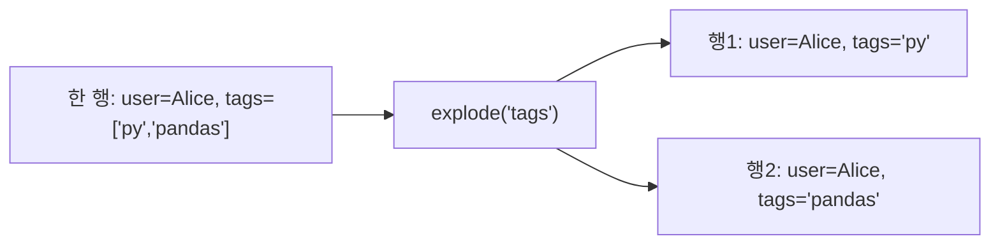

## 정의

**`explode(column)`** 는 list / set / tuple 등의 시퀀스 값을 가진 컬럼을 **각 원소가 별도 행** 이 되도록 펼친다.

JSON / 로그 / 다중 태그 데이터 처리의 핵심.

## 사용 상황

- **JSON 배열 컬럼 정규화**: `items`, `tags`, `labels` 처럼 배열 형태의 컬럼을 행 단위로 풀어야 할 때
- **로그 파싱**: 한 이벤트에 여러 속성이 list 로 저장된 구조 처리
- **집계 역연산**: `groupby + agg(list)` 로 만든 그룹 결과를 다시 원래 행 단위로 되돌릴 때
- **태그/라벨 빈도 분석**: 콤마 구분 문자열을 split 후 explode 해서 `value_counts`

## explode 흐름 시각화



## 기본

<CodeWithOutput
  language="python"
  outputLanguage="text"
  code={`import pandas as pd
df = pd.DataFrame({
    'user': ['Alice', 'Bob', 'Charlie'],
    'tags': [['py', 'pandas'], ['py'], ['go', 'rust', 'ts']],
})
print(df.explode('tags'))`}
  output={`      user    tags
0    Alice      py
0    Alice  pandas
1      Bob      py
2  Charlie      go
2  Charlie    rust
2  Charlie      ts`}
/>

같은 index 가 반복됨 (`0, 0, 1, 2, 2, 2`). `reset_index(drop=True)` 로 깨끗하게:

```python
df.explode('tags').reset_index(drop=True)
```

## 여러 컬럼 동시 explode (pandas 1.3+)

```python
df.explode(['tags', 'scores'])
# 두 컬럼이 같은 길이여야 함
```

<CodeWithOutput
  language="python"
  outputLanguage="text"
  code={`import pandas as pd
df = pd.DataFrame({
    'user':   ['Alice', 'Bob'],
    'tags':   [['py', 'pandas'], ['go']],
    'scores': [[90, 85],         [70]],
})
print(df.explode(['tags', 'scores']).reset_index(drop=True))`}
  output={`    user    tags scores
0  Alice      py     90
1  Alice  pandas     85
2    Bob      go     70`}
/>

## 빈 list / NaN 처리

```python
df = pd.DataFrame({'x': [[1, 2], [], None]})
df.explode('x')
#    x
# 0  1
# 0  2
# 1  NaN     <- 빈 list 는 NaN 한 행
# 2  NaN     <- None 도 NaN
```

빈 리스트를 아예 제거하려면:

```python
df.explode('x').dropna(subset=['x'])
```

## str.split + explode

문자열을 list 로 분리 후 explode 는 가장 흔한 패턴:

```python
df = pd.DataFrame({'tags_str': ['py,pandas', 'py', 'go,rust,ts']})
df['tags'] = df['tags_str'].str.split(',')
exploded = df.explode('tags')
```

`assign` 으로 체인:

```python
(
    df
    .assign(tag=df['tags_str'].str.split(','))
    .explode('tag')
    .drop(columns=['tags_str'])
    .reset_index(drop=True)
)
```

## groupby 의 역연산

```python
# group -> list
grouped = df.groupby('user')['tag'].apply(list).reset_index()

# list -> row (explode)
grouped.explode('tag').reset_index(drop=True)
```

## 자주 쓰는 패턴

### JSON 의 배열 펼치기

```python
import pandas as pd
data = [
    {'order': 1, 'items': ['apple', 'banana']},
    {'order': 2, 'items': ['cherry']},
]
df = pd.DataFrame(data)
df.explode('items').reset_index(drop=True)
```

### tags 빈도 분석

```python
df = pd.DataFrame({
    'post_id': [1, 2, 3],
    'tags': ['python,pandas,data', 'python', 'go,rust'],
})
tag_counts = (
    df.assign(tag=df['tags'].str.split(','))
    .explode('tag')
    ['tag']
    .value_counts()
)
```

### range 펼치기

```python
df = pd.DataFrame({
    'start': [1, 5, 10],
    'end':   [3, 6, 12],
})
df['range'] = df.apply(lambda r: list(range(r['start'], r['end'] + 1)), axis=1)
df.explode('range').reset_index(drop=True)
```

### 중첩 JSON 정규화

```python
import json

df = pd.DataFrame({
    'id': [1, 2],
    'attributes': ['[{"k":"color","v":"red"},{"k":"size","v":"M"}]', '[{"k":"color","v":"blue"}]'],
})
df['attrs_list'] = df['attributes'].apply(json.loads)
exploded = df.drop(columns=['attributes']).explode('attrs_list')
attrs = pd.json_normalize(exploded['attrs_list'])
result = pd.concat([exploded.drop(columns=['attrs_list']).reset_index(drop=True), attrs], axis=1)
```

### 이벤트 로그 파싱

```python
# 한 이벤트에 여러 액션이 기록된 경우
df = pd.DataFrame({
    'session_id': [1001, 1002],
    'actions': [['click', 'scroll', 'purchase'], ['view', 'click']],
})
(
    df.explode('actions')
    .reset_index(drop=True)
    .rename(columns={'actions': 'action'})
)
```

## 성능

`explode` 는 내부적으로 NumPy 를 활용해 효율적으로 행을 복제한다.

```python
# 피해야 할 패턴: 반복문으로 행 단위 처리
rows = []
for _, row in df.iterrows():
    for tag in row['tags']:
        rows.append({'user': row['user'], 'tag': tag})
result = pd.DataFrame(rows)   # 느림

# 권장: explode
result = df.explode('tags').reset_index(drop=True)
```

대용량 데이터에서 explode 전 불필요한 컬럼을 먼저 제거하면 메모리 절약:

```python
subset = df.loc[:, ['user', 'tags']]
subset.explode('tags').reset_index(drop=True)
```

> [!TIP]
> explode 결과의 행 수는 원본 리스트 길이의 합과 같다. 10 만 행의 DataFrame 에서 평균 list 길이가 5 라면 explode 후 50 만 행이 된다. 메모리와 후속 처리 비용을 미리 계산하고, 필터를 explode 전에 최대한 적용하라.

## 함정

### 1. index 중복

```python
df.explode('tags')
# index: 0, 0, 1, 2, 2, 2
# .loc[0] 이 첫 user 의 모든 태그를 반환
df.explode('tags').reset_index(drop=True)   # 권장
```

### 2. dtype 강등

```python
df = pd.DataFrame({'nums': [[1, 2], [3]]})
exploded = df.explode('nums')
exploded.dtypes
# nums: object 가 될 가능성
exploded['nums'] = pd.to_numeric(exploded['nums'])  # 다시 int
```

### 3. 컬럼이 list 가 아니면 그대로

```python
df = pd.DataFrame({'x': [1, 2, 3]})
df.explode('x')   # 행 수 변화 없음
```

> [!WARNING]
> 컬럼의 dtype 이 `object` 라도 원소가 list 가 아니라 str 이면 explode 는 각 문자를 분리하지 않고 그냥 그대로 둔다. `str.split` 후 explode 를 해야 문자열을 분리할 수 있다.

### 4. 여러 컬럼 동시 explode 시 길이 불일치

```python
df = pd.DataFrame({
    'tags':   [['a', 'b'], ['c']],
    'scores': [[10],        [20]],  # 첫 행이 길이 불일치
})
df.explode(['tags', 'scores'])   # ValueError 발생
# 두 컬럼의 list 길이가 반드시 일치해야 함
```

## 관련 위키

- [[Pandas str regex]]
- [[Pandas melt]]
- [[Pandas groupby]]
- [[Pandas concat]]
- [[Pandas Boolean Indexing]]
- [[Pandas value_counts]]
