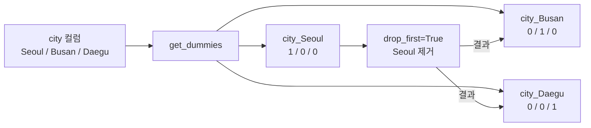
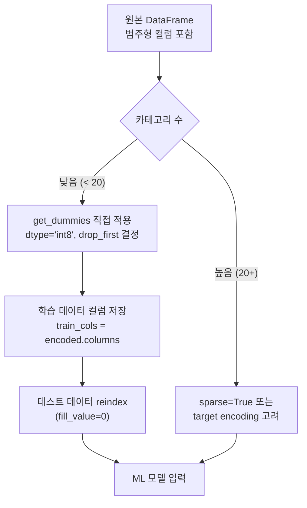

## 정의

**`pd.get_dummies(df)`** 는 범주형 컬럼을 **원-핫 인코딩** (one-hot encoding) 한다. 범주 값 하나당 새 컬럼 (0/1 또는 True/False) 이 생성된다. ML 전처리의 가장 흔한 단계.

## 인코딩 흐름 시각화



## 기본

<CodeWithOutput
  language="python"
  outputLanguage="text"
  code={`import pandas as pd
df = pd.DataFrame({'city': ['Seoul','Busan','Daegu','Seoul']})
print(pd.get_dummies(df['city']))`}
  output={`   Busan  Daegu  Seoul
0  False  False   True
1   True  False  False
2  False   True  False
3  False  False   True`}
/>

| index | Busan | Daegu | Seoul |
|---|---|---|---|
| 0 | F | F | **T** |
| 1 | **T** | F | F |
| 2 | F | **T** | F |
| 3 | F | F | **T** |

## DataFrame 전체

```python
pd.get_dummies(df)        # 모든 object/category 컬럼 자동 인코딩
pd.get_dummies(df, columns=['city', 'plan'])   # 특정 컬럼만
```

## prefix / sep

```python
pd.get_dummies(df['city'], prefix='city')
# 컬럼: city_Busan, city_Daegu, city_Seoul

pd.get_dummies(df, columns=['city', 'plan'], prefix=['c', 'p'], prefix_sep='_')
# c_Seoul, p_basic ...
```

## drop_first

```python
pd.get_dummies(df['city'], drop_first=True)
# 첫 카테고리 제거 (n-1 컬럼)
# 회귀 모델의 multicollinearity 방지
```

> [!IMPORTANT]
> 선형 회귀 / 로지스틱 회귀에서는 `drop_first=True` 가 기본 관행이다. n 개 카테고리를 n-1 개 더미 변수로 표현해야 다중공선성(multicollinearity) 을 피할 수 있다.

## dtype 지정

```python
pd.get_dummies(df, dtype='int8')        # bool 대신 int (메모리 효율)
pd.get_dummies(df, dtype='uint8')
```

pandas 2.x 기본은 bool. ML 라이브러리 호환을 위해 int 권장.

## sparse 옵션

```python
pd.get_dummies(df, sparse=True)
# 희소 행렬, 메모리 크게 절약 (특히 카테고리 多)
```

카테고리 수가 수백 이상이면 sparse 가 메모리를 대폭 절감한다.

## from_dummies (역변환, pandas 2.0+)

```python
dummies = pd.get_dummies(df['city'], prefix='city')
restored = pd.from_dummies(dummies, sep='_')
# 다시 단일 컬럼 city 로
```

## scikit-learn 의 OneHotEncoder 와 비교

| 항목 | `pd.get_dummies` | `OneHotEncoder` |
|:---|:---|:---|
| 학습/추론 일관성 | 새 데이터에 카테고리 없으면 컬럼 mismatch | `fit` 시 카테고리 기록, `transform` 시 일관 |
| 미지의 카테고리 | 에러 또는 누락 | `handle_unknown='ignore'` |
| pipeline 통합 | ✗ | ✓ (sklearn Pipeline) |
| 간편성 | ✓ | △ |
| sparse 지원 | ✓ | ✓ |

**탐색/분석** 에는 `get_dummies`, **프로덕션 ML** 에는 `OneHotEncoder`.

## 실전 패턴

### 학습 / 테스트 일관성 유지

```python
# 학습 시 카테고리 저장
train_encoded = pd.get_dummies(train_df, dtype='int8')
train_cols = train_encoded.columns

# 테스트 시 같은 컬럼으로 reindex
test_encoded = pd.get_dummies(test_df, dtype='int8').reindex(
    columns=train_cols, fill_value=0
)
```

### MultiLabel 인코딩

```python
df = pd.DataFrame({'tags': [['python', 'pandas'], ['python']]})
dummies = df['tags'].str.join('|').str.get_dummies(sep='|')
# python  pandas
#   1       1
#   1       0
```

`str.get_dummies` 가 list/multilabel 에 적합.

### Category 타입으로 메모리 절약 후 인코딩

```python
df['city'] = df['city'].astype('category')
encoded = pd.get_dummies(df, dtype='int8')
# category 타입 컬럼은 get_dummies 가 자동 인식
```

### 역변환 후 검증

<CodeWithOutput
  language="python"
  outputLanguage="text"
  code={`import pandas as pd
s = pd.Series(['Seoul', 'Busan', 'Daegu', 'Seoul'], name='city')
dummies = pd.get_dummies(s, prefix='city', dtype='int8')
print(dummies)
restored = pd.from_dummies(dummies, sep='_')
print(restored)`}
  output={`   city_Busan  city_Daegu  city_Seoul
0           0           0           1
1           1           0           0
2           0           1           0
3           0           0           1
   city
0  Seoul
1  Busan
2  Daegu
3  Seoul`}
/>

## 성능

```python
# 카테고리 수 C, 행 수 N 이라 할 때
# 메모리: N x C x dtype_bytes
# 예: 1M 행 x 100 카테고리 x int8 = 100MB

# sparse 로 절감
pd.get_dummies(df, dtype='uint8', sparse=True)
# 95% 0 인 경우 10배 이상 절약 가능
```

### Categorical dtype 선처리의 효과

```python
# category 타입으로 선처리하면 get_dummies 가 더 빠름 (카테고리 목록 사전 인식)
df['city'] = df['city'].astype('category')
df['city'].cat.categories    # Index(['Busan', 'Daegu', 'Seoul'], dtype='object')

# get_dummies 가 category 타입에서 known categories 만 사용
result = pd.get_dummies(df, dtype='int8')
```

## get_dummies 사용 흐름 요약



## 대안 인코딩 방법

| 방법 | 언제 | 패키지 |
|:---|:---|:---|
| `get_dummies` | 탐색/분석, 낮은 cardinality | pandas |
| `OneHotEncoder` | 프로덕션 ML pipeline | sklearn |
| Target Encoding | 높은 cardinality, 회귀 | category_encoders |
| Label Encoding | 순서 있는 범주형 | sklearn |
| Embedding | 매우 높은 cardinality | PyTorch/TF |

## 함정

### 1. unique 카테고리가 너무 많음

```python
pd.get_dummies(df['user_id'])   # ❌ 수만 컬럼 폭증
```

ID 같은 high-cardinality 컬럼은 인코딩하지 말 것. `target encoding` 이나 `embedding` 을 고려.

### 2. NaN 처리

```python
pd.get_dummies(df, dummy_na=True)
# NaN 도 별도 컬럼 (None 이라는 의미가 있을 때)
```

기본은 NaN 행에 모두 0 (NaN 이 특정 카테고리가 아닌 것으로 취급).

### 3. 학습/추론 컬럼 불일치

위의 reindex 패턴이 표준 해결책. sklearn pipeline 에서는 `OneHotEncoder(handle_unknown='ignore')` 가 더 안전.

> [!WARNING]
> `get_dummies` 를 학습/추론 양쪽에 따로 호출하면 카테고리 순서나 존재 여부가 달라져 **컬럼 수/순서 불일치** 가 발생한다. 프로덕션 피처 파이프라인에서는 반드시 `reindex` 또는 `OneHotEncoder` 를 사용.

### 4. pandas 2.x 기본 dtype 변경

pandas 2.0 이전은 기본 `uint8`, 2.0+ 는 `bool`. ML 라이브러리에 넘길 때 `dtype='int8'` 로 명시하는 게 안전하다.

## 관련 위키

- [[Pandas Categorical]]
- [[Pandas replace / astype]]
- [[Pandas mode / factorize]]
- [[Pandas 성능 / 메모리 최적화]]
