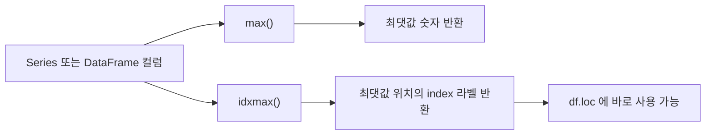
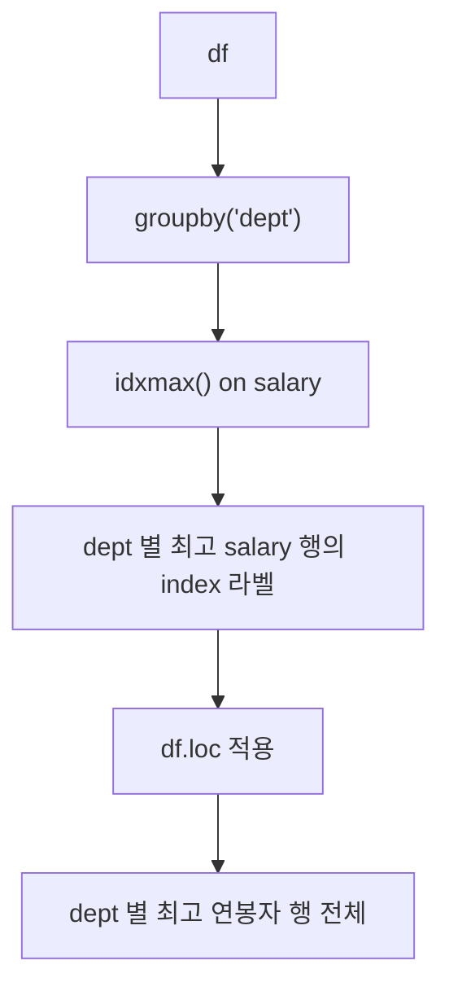

## 정의

- **`idxmax()`** : 최댓값의 **index 라벨** 반환
- **`idxmin()`** : 최솟값의 index 라벨 반환

`max()` / `min()` 이 **값** 을 반환한다면, `idxmax()` / `idxmin()` 은 그 값이 있는 **index 라벨** 을 반환한다. "MAX 인 행의 다른 컬럼도 가져오기" 가 전형적인 사용 상황.

## 사용 상황

| 상황 | 패턴 |
|:---|:---|
| 최고 점수 학생 이름 | `df.loc[df['score'].idxmax(), 'name']` |
| 부서별 최고 연봉자 전체 행 | `df.loc[df.groupby('dept')['salary'].idxmax()]` |
| 시계열 최고점 날짜 | `ts.idxmax()` (Timestamp 반환) |
| 가장 빈번한 카테고리 (단건) | `df['city'].value_counts().idxmax()` |

## 동작 원리



## Series 기본 사용

<CodeWithOutput
  language="python"
  outputLanguage="text"
  code={`import pandas as pd

s = pd.Series([10, 50, 30, 20], index=['a', 'b', 'c', 'd'])
print('max value:', s.max())
print('idxmax  :', s.idxmax())
print('min value:', s.min())
print('idxmin  :', s.idxmin())
print()
# idxmax 라벨로 바로 loc 접근
print('idxmax 위치 값:', s.loc[s.idxmax()])`}
  output={`max value: 50
idxmax  : b
min value: 10
idxmin  : a

idxmax 위치 값: 50`}
/>

index 라벨 `'b'` 가 최댓값(50) 의 위치.

## DataFrame.idxmax : axis 방향

```python
df.idxmax()         # 각 컬럼에서 최댓값을 가진 행 index (axis=0, 기본)
df.idxmax(axis=1)   # 각 행에서 최댓값을 가진 컬럼 이름 (axis=1)
df.idxmin()         # 최솟값 버전
df.idxmin(axis=1)
```

<CodeWithOutput
  language="python"
  outputLanguage="text"
  code={`import pandas as pd

df = pd.DataFrame({
    'math': [90, 80, 70],
    'eng':  [85, 95, 75],
    'sci':  [95, 70, 80],
}, index=['Alice', 'Bob', 'Charlie'])

print('--- 각 과목 최고점 학생 ---')
print(df.idxmax())

print()
print('--- 각 학생 최고 과목 ---')
print(df.idxmax(axis=1))`}
  output={`--- 각 과목 최고점 학생 ---
math      Alice
eng         Bob
sci       Alice
dtype: object

--- 각 학생 최고 과목 ---
Alice       sci
Bob         eng
Charlie     sci
dtype: object`}
/>

## 최댓값 행 전체 가져오기

```python
# salary 가 가장 높은 직원의 모든 정보
df.loc[df['salary'].idxmax()]

# salary 가 가장 낮은 직원의 모든 정보
df.loc[df['salary'].idxmin()]

# 특정 컬럼만 꺼내기
df.loc[df['salary'].idxmax(), 'name']
df.loc[df['salary'].idxmax(), ['name', 'dept']]
```

## groupby + idxmax (그룹별 최대 행)

SQL 에서 `GROUP BY + MAX` 후 해당 행 전체를 가져오는 전형적인 패턴.

```python
# 각 부서의 최고 연봉자 행 전체
df.loc[df.groupby('dept')['salary'].idxmax()]
```

<CodeWithOutput
  language="python"
  outputLanguage="text"
  code={`import pandas as pd

data = {
    'name':   ['Alice', 'Bob', 'Charlie', 'David', 'Eve'],
    'dept':   ['eng',   'eng', 'mkt',     'mkt',   'eng'],
    'salary': [9000,    7500,  6000,      8000,    8500],
}
df = pd.DataFrame(data)

idx = df.groupby('dept')['salary'].idxmax()
print('각 부서 최고 연봉자 index:')
print(idx)
print()
result = df.loc[idx]
print('각 부서 최고 연봉자 전체 정보:')
print(result)`}
  output={`각 부서 최고 연봉자 index:
dept
eng    0
mkt    3
Name: salary, dtype: int64

각 부서 최고 연봉자 전체 정보:
    name dept  salary
0  Alice  eng    9000
3  David  mkt    8000`}
/>



이 패턴은 SQL 의 아래 쿼리와 동일하다:

```sql
SELECT * FROM employees
WHERE (dept, salary) IN (
  SELECT dept, MAX(salary) FROM employees GROUP BY dept
)
```

## value_counts + idxmax

```python
# 가장 자주 등장하는 값 (한 줄)
most_common = df['city'].value_counts().idxmax()

# mode().iloc[0] 과 동일, 둘 다 유효
most_common2 = df['city'].mode().iloc[0]
```

## NaN 처리

```python
import numpy as np

s = pd.Series([1.0, np.nan, 3.0, np.nan])

s.idxmax()                  # NaN skip → 2 (값 3.0 의 위치)
s.idxmax(skipna=False)      # NaN 포함 → NaN 반환
```

| `skipna` 옵션 | 동작 |
|:---|:---|
| `True` (기본) | NaN 무시, 나머지 값 중 최대 |
| `False` | NaN 이 있으면 NaN 반환 |

모든 값이 NaN 이면 `skipna=True` 여도 `ValueError`.

## numpy argmax / argmin 과 비교

| 함수 | 반환 타입 | NaN 처리 | 짝 indexer |
|:---|:---|:---|:---|
| `np.argmax(arr)` | 정수 위치 | NaN 포함 비교 (오동작 가능) | `.iloc` |
| `s.argmax()` | 정수 위치 | NaN skip | `.iloc` |
| `s.idxmax()` | index 라벨 | NaN skip | `.loc` |

```python
s = pd.Series([10, 50, 30], index=['x', 'y', 'z'])

s.argmax()   # 1  (0-based 위치)
s.idxmax()   # 'y' (index 라벨)

s.iloc[s.argmax()]   # 50
s.loc[s.idxmax()]    # 50
```

**규칙** : `argmax()` 는 `.iloc`, `idxmax()` 는 `.loc` 와 짝.

## 정수 index 에서 주의점

정수 index 를 가진 Series 에서 `idxmax()` 는 정수 라벨을 반환한다. 위치가 아니다.

```python
s = pd.Series([5, 3, 8, 1], index=[10, 20, 30, 40])

s.idxmax()    # 30 (index 라벨, 값 8 의 위치)
s.argmax()    # 2  (0-based 위치)

df.loc[s.idxmax()]    # ✓ 라벨 30 행
df.iloc[s.idxmax()]   # ❌ 위치 30 → IndexError 또는 의도 외 행
```

## 실전 패턴

### 상위 N 개 행 (nlargest 병행)

```python
# 연봉 1 위 행
df.loc[df['salary'].idxmax()]

# 연봉 상위 3 명 행 전체 (nlargest 활용)
top3_idx = df['salary'].nlargest(3).index
df.loc[top3_idx]
```

### 컬럼별 최대 / 최소 요약

```python
summary = pd.DataFrame({
    'max_val': df.max(),
    'max_idx': df.idxmax(),
    'min_val': df.min(),
    'min_idx': df.idxmin(),
})
print(summary)
```

### 시계열 최고점 날짜

```python
ts = pd.Series(
    prices,
    index=pd.date_range('2024-01', periods=len(prices), freq='D')
)

peak_date = ts.idxmax()    # Timestamp('2024-07-...')
trough_date = ts.idxmin()
print(f'고점: {peak_date.date()}, 저점: {trough_date.date()}')
```

### 각 컬럼의 최대 행 매핑

```python
for col in df.select_dtypes('number').columns:
    idx = df[col].idxmax()
    print(f'{col}: 최대={df[col].max()}, 행={idx}, 이름={df.loc[idx, "name"]}')
```

## 함정

### 1. 모두 NaN 이면 ValueError

```python
pd.Series([None, None]).idxmax()
# ValueError: attempt to get argmax of an empty sequence

# 방어 코드
def safe_idxmax(s):
    valid = s.dropna()
    return valid.idxmax() if not valid.empty else None
```

### 2. 동률: 첫 번째만 반환

```python
pd.Series([5, 5, 5], index=['a', 'b', 'c']).idxmax()   # 'a'

# 동률 모두 찾기
s = pd.Series([5, 3, 5])
s[s == s.max()].index.tolist()   # [0, 2]
```

### 3. 빈 Series

```python
pd.Series([], dtype=float).idxmax()   # ValueError
```

### 4. groupby 결과에서 reset 주의

```python
idx = df.groupby('dept')['salary'].idxmax()
# idx 의 index 는 dept, value 는 df.index 의 값
# df.loc[idx.values] 또는 df.loc[idx] 둘 다 동작
```

### 5. axis=1 은 수치형 컬럼만

```python
df.idxmax(axis=1)   # 문자열 컬럼이 섞여 있으면 TypeError
df.select_dtypes('number').idxmax(axis=1)  # ✓
```

## 관련 위키

- [[Pandas Series]]
- [[Pandas groupby]]
- [[Pandas nlargest / rank]]
- [[Pandas .loc / .iloc]]
- [[Pandas sort_values / sort_index]]
- [[Pandas mode / factorize]]
- [[Pandas agg]]
