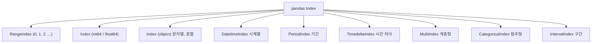

## 정의

**`pandas.Index`** 는 행 / 열 라벨을 보관하는 객체. [[Pandas Series]] / [[Pandas DataFrame]] 의 모든 라벨은 Index. 정렬, 정합성, 빠른 lookup 의 기반.

기본은 **RangeIndex (0, 1, 2, ...)** 지만 `set_index` 로 임의 열을 index 로 승격 가능.

## Index 타입 계층



## 종류

| 종류 | 용도 |
|:---|:---|
| **RangeIndex** | 기본 0-based 정수. 메모리 효율 최고 (실제 배열 미생성) |
| **Index** (int/float) | 임의 정수/실수 |
| **Index** (object) | 문자열, 혼합 타입 |
| **DatetimeIndex** | 시계열 (날짜/시간) |
| **PeriodIndex** | 기간 (`2024-Q1`) |
| **TimedeltaIndex** | 시간 차이 |
| **[[Pandas MultiIndex]]** | 계층형 (multi-level) |
| **CategoricalIndex** | 범주형 (순서 있을 수 있음) |
| **IntervalIndex** | 구간 / bin |

## set_index / reset_index

<CodeWithOutput
  language="python"
  outputLanguage="text"
  code={`import pandas as pd
df = pd.DataFrame({'name': ['A', 'B', 'C'], 'age': [10, 20, 30]})
df2 = df.set_index('name')
print(df2)
print('---')
print(df2.reset_index())`}
  output={`      age
name
A      10
B      20
C      30
---
  name  age
0    A   10
1    B   20
2    C   30`}
/>

```python
# drop=True: index 를 컬럼으로 복원하지 않고 버림
df2.reset_index(drop=True)

# 여러 컬럼을 MultiIndex 로
df.set_index(['city', 'dept'])

# 컬럼도 남기고 index 도 설정
df.set_index('name', drop=False)
```

`set_index` 후 원본 컬럼은 index 로 이동해 컬럼에서 사라진다. 원본으로 돌리려면 `reset_index()`.

## RangeIndex 특수성

기본 생성 시 사용되는 `RangeIndex` 는 실제 배열 없이 start/stop/step 만 저장해 **메모리를 거의 쓰지 않는다**.

```python
df = pd.DataFrame({'x': range(1_000_000)})
type(df.index)      # RangeIndex(start=0, stop=1000000, step=1)

# 필터 후 reset_index 를 안 하면 RangeIndex 가 깨짐
sub = df[df['x'] > 500_000]
sub.index           # Int64Index([500001, 500002, ...]) - 더 이상 Range 아님
sub = sub.reset_index(drop=True)   # 다시 0부터 RangeIndex
```

## DatetimeIndex

```python
import pandas as pd

# 시계열 생성
idx = pd.date_range('2024-01-01', periods=5, freq='D')
ts = pd.Series([1, 2, 3, 4, 5], index=idx)

# 날짜 라벨로 접근
ts['2024-01-03']                         # 3
ts.loc['2024-01-01':'2024-01-03']        # 슬라이스 (양쪽 포함)

# 연/월 단위 부분 문자열 슬라이싱
ts.loc['2024-01']                         # 2024년 1월 전체
ts.loc['2024']                            # 2024년 전체

# DatetimeIndex 속성
ts.index.year       # 연도
ts.index.month      # 월
ts.index.dayofweek  # 요일 (0=월, 6=일)
ts.index.freq       # 주기 (D, H, M 등)
```

DatetimeIndex 가 있으면 [[Pandas resample|resample]] 로 기간 집계, [[Pandas rolling]] 으로 이동 평균 등 시계열 분석이 자연스럽다.

## Index 연산

```python
idx1 = pd.Index(['a', 'b', 'c'])
idx2 = pd.Index(['b', 'c', 'd'])

idx1.union(idx2)         # Index(['a', 'b', 'c', 'd']) - 합집합
idx1.intersection(idx2)  # Index(['b', 'c']) - 교집합
idx1.difference(idx2)    # Index(['a']) - 차집합
idx1.symmetric_difference(idx2)  # Index(['a', 'd']) - 대칭 차집합

idx1.isin(idx2)          # [False, True, True] - 원소 포함 여부
```

## reindex 로 재배치 / 갱신

```python
s = pd.Series([10, 20, 30], index=['a', 'b', 'c'])

# 없는 키는 NaN
s.reindex(['a', 'c', 'e'])
# a    10.0
# c    30.0
# e     NaN

# fill_value 로 기본값 지정
s.reindex(['a', 'c', 'e'], fill_value=0)
# a    10
# c    30
# e     0

# method 로 이전 값 채우기 (시계열에 유용)
s.reindex(['a', 'b', 'c', 'd'], method='ffill')
```

## 정렬

```python
df.sort_index()                # index 기준 오름차순
df.sort_index(ascending=False) # 내림차순
df.sort_index(axis=1)          # 열 이름 기준 정렬
```

> [!WARNING]
> `.loc` 의 슬라이스는 **정렬된 Index** 를 가정한다. 정렬 안 된 문자열 index 에서 `df.loc['b':'d']` 를 쓰면 `PerformanceWarning` 이 발생하거나 예상치 못한 결과가 나올 수 있다. 항상 `df.sort_index()` 후 슬라이스.

## 이름 부여

```python
df.index.name = 'id'
df.columns.name = 'feature'

# set_axis 로 한꺼번에
df = df.set_axis(['x', 'y', 'z'], axis=0)   # 행 라벨
df = df.set_axis(['a', 'b'], axis=1)          # 열 라벨
```

## 정합성 자동 정렬

```python
a = pd.Series([1, 2, 3], index=['x', 'y', 'z'])
b = pd.Series([10, 20], index=['y', 'z'])
print(a + b)
# x     NaN
# y    22.0
# z    23.0
```

연산 시 같은 index 끼리만 매칭. 없는 곳은 NaN. `fill_value` 를 지정하면 NaN 방지:

```python
a.add(b, fill_value=0)
# x     1.0
# y    22.0
# z    23.0
```

## 고유성

기본 Index 는 **중복 허용**. 그러나 lookup 효율과 의미상 unique 권장.

```python
df.index.is_unique            # True / False
df.index.duplicated()         # 중복 위치 boolean array
df[~df.index.duplicated()]    # 첫 번째만 유지
df[~df.index.duplicated(keep='last')]  # 마지막만 유지
```

## CategoricalIndex

순서가 있는 범주형 컬럼을 index 로 쓸 때 유용.

```python
from pandas import CategoricalIndex

grades = CategoricalIndex(
    ['B', 'A', 'C', 'A', 'B'],
    categories=['A', 'B', 'C'],
    ordered=True
)
s = pd.Series([90, 95, 80, 88, 70], index=grades)
s.sort_index()   # A, A, B, B, C 순서로 정렬
```

[[Pandas Categorical]] 참고.

## MultiIndex (간단 소개)

```python
df = pd.DataFrame(
    {'sales': [100, 200, 150, 300]},
    index=pd.MultiIndex.from_tuples(
        [('Q1', 'Seoul'), ('Q1', 'Busan'),
         ('Q2', 'Seoul'), ('Q2', 'Busan')],
        names=['quarter', 'city']
    )
)
```

자세한 내용은 [[Pandas MultiIndex]] 참고.

## 자주 만나는 함정

### 1. 정수 index 의 .loc

```python
s = pd.Series([10, 20, 30], index=[5, 6, 7])
s.loc[5]      # label 5 → 10
s.iloc[5]     # IndexError (위치 5 없음)
s[5]          # label 5 → 10 (pandas 2.x 에서 deprecated 경고 가능)
```

label 과 위치를 명확히 구분하려면 항상 `.loc` / `.iloc` 를 사용. 자세히는 [[Pandas .loc / .iloc]] 참고.

### 2. set_index 후 원본 컬럼 사라짐

```python
df2 = df.set_index('name')
# df2 에는 'name' 컬럼이 없음, df2.index 가 'name'
df2.reset_index()            # 원복
```

`set_index('col', drop=False)` 를 쓰면 컬럼도 남기고 index 도 설정할 수 있다.

### 3. 필터 후 index 불연속

```python
df_filtered = df[df['age'] > 20]
# index 가 0, 2, 5, ... 처럼 불연속
df_filtered = df_filtered.reset_index(drop=True)   # 0, 1, 2, ... 로 재설정
```

`iterrows`, `iat` 등을 쓸 때 불연속 index 가 문제될 수 있으므로 `reset_index` 를 먼저.

### 4. reindex 와 sort_index 혼동

```python
# reindex: 라벨 재배치 (없으면 NaN)
df.reindex(['c', 'a', 'b'])

# sort_index: 라벨 정렬 (없애지 않음)
df.sort_index()
```

`reindex` 는 지정한 라벨만 남기고 나머지는 버린다. `sort_index` 는 모든 행을 유지하면서 순서만 바꾼다.

## 관련 위키

- [[Pandas Series]]
- [[Pandas DataFrame]]
- [[Pandas MultiIndex]]
- [[Pandas sort_values]]
- [[Pandas Categorical]]
- [[Pandas resample]]
- [[Pandas .loc / .iloc]]
