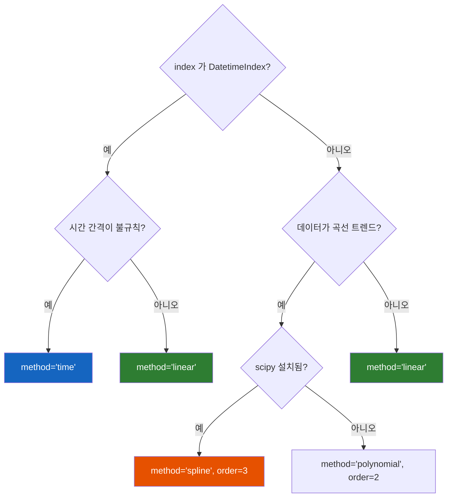

## 정의

**`interpolate()`** 는 NaN 을 **주변 값을 사용해 보간** 으로 채운다. 시계열, 센서 측정 데이터처럼 값이 연속적으로 변화하는 경우의 결측을 자연스럽게 채울 때 유용하다.

`fillna` 가 단일 고정값이나 직전/직후 값으로 채우는 반면, `interpolate` 는 주변 값들 사이의 **보간 곡선** 을 따른다.

## method 선택 흐름



## 기본

```python
s.interpolate()                           # 기본 linear
s.interpolate(method='polynomial', order=2)
s.interpolate(method='time')              # DatetimeIndex 필요
s.interpolate(method='spline', order=3)   # scipy 필요
```

## linear 보간 예

<CodeWithOutput
  language="python"
  outputLanguage="text"
  code={`import pandas as pd
import numpy as np
s = pd.Series([1, np.nan, np.nan, 4, np.nan, 6])
print('original    :', s.tolist())
print('interpolate :', s.interpolate().tolist())`}
  output={`original    : [1.0, nan, nan, 4.0, nan, 6.0]
interpolate : [1.0, 2.0, 3.0, 4.0, 5.0, 6.0]`}
/>

| index | original | interpolate |
|---|---|---|
| 0 | 1.0 | 1.0 |
| 1 | NaN | **2.0** |
| 2 | NaN | **3.0** |
| 3 | 4.0 | 4.0 |
| 4 | NaN | **5.0** |
| 5 | 6.0 | 6.0 |

`1 → 4` 사이의 NaN 2 개를 직선 보간으로 2, 3 으로 채웠다.

## 다양한 method

| method | 설명 | 요구사항 |
|:---|:---|:---|
| `linear` (기본) | 직선 보간 | - |
| `time` | 시간 간격 가중 | DatetimeIndex |
| `index` | index 값을 X축으로 | - |
| `nearest` | 가장 가까운 값 복사 | - |
| `polynomial` | 다항식 | `order` 필수 |
| `spline` | 스플라인 | `order` 필수, scipy |
| `pchip` | 단조 3차 스플라인 | scipy |
| `akima` | Akima 스플라인 | scipy |
| `from_derivatives` | 기울기 기반 | scipy |

## time-based 보간

```python
ts = pd.Series([1, np.nan, np.nan, 10],
    index=pd.date_range('2024-01-01', periods=4, freq='D'))
ts.interpolate()               # 균등 간격 가정 → [1, 4, 7, 10]
ts.interpolate(method='time')  # 같은 결과 (간격이 균일하므로)

# 불균등 시계열에서 차이가 드러남
ts2 = pd.Series([1, np.nan, 10],
    index=pd.to_datetime(['2024-01-01', '2024-01-02', '2024-01-10']))
ts2.interpolate()               # 균등 가정 → [1, 5.5, 10]
ts2.interpolate(method='time')  # 시간 거리 가중 → [1, 2.0, 10]
```

`time` method 가 실제 거리 기반이라 불규칙 시계열에 더 자연스럽다.

> [!IMPORTANT]
> `method='time'` 은 반드시 `DatetimeIndex` 가 있어야 한다. 정수 index 나 RangeIndex 에서는 `TypeError` 가 발생한다.

## spline / polynomial

```python
import numpy as np
import pandas as pd

x = pd.Series([0, np.nan, np.nan, np.nan, 16],
    index=[0, 1, 2, 3, 4])

print('linear    :', x.interpolate(method='linear').tolist())
print('polynomial:', x.interpolate(method='polynomial', order=2).tolist())
print('spline    :', x.interpolate(method='spline', order=2).tolist())
```

| index | linear | polynomial (order=2) | spline (order=2) |
|---|---|---|---|
| 0 | 0 | 0 | 0 |
| 1 | 4 | 1 | 1 |
| 2 | 8 | 4 | 4 |
| 3 | 12 | 9 | 9 |
| 4 | 16 | 16 | 16 |

제곱 트렌드 데이터에서는 `polynomial(order=2)` 가 더 정확하다.

## 양 끝의 NaN

```python
s = pd.Series([np.nan, np.nan, 1, 2, np.nan, np.nan])
s.interpolate()
# [NaN, NaN, 1.0, 2.0, NaN, NaN]  <- 양 끝은 못 채움

s.interpolate(limit_direction='both')
# [1.0, 1.0, 1.0, 2.0, 2.0, 2.0]

s.interpolate(limit_direction='backward')
# [1.0, 1.0, 1.0, 2.0, NaN, NaN]
```

`limit_direction='forward'` (기본) / `'backward'` / `'both'` 로 방향 제어.

## limit: 연속 NaN 개수 제한

```python
s = pd.Series([1, np.nan, np.nan, np.nan, np.nan, 10])

# 연속 NaN 2 개까지만 채움
s.interpolate(limit=2)
# [1.0, 4.0, 7.0, NaN, NaN, 10.0]

# backward + limit
s.interpolate(limit=2, limit_direction='backward')
# [1.0, NaN, NaN, 7.0, 8.5, 10.0]
```

## fillna vs interpolate 비교

| 방법 | 채우는 값 | 적합한 데이터 |
|:---|:---|:---|
| `fillna(0)` | 고정값 | 결측을 0으로 처리해도 되는 경우 |
| `fillna(method='ffill')` | 직전 값 반복 | 마지막 관측값 유지 (계단형) |
| `fillna(method='bfill')` | 직후 값 반복 | 다음 관측값으로 채움 |
| `fillna(mean)` | 전체 평균 | 간단한 통계 대치 |
| `interpolate('linear')` | 직선 보간 | 연속 트렌드, 센서 데이터 |
| `interpolate('time')` | 시간 거리 가중 | 불규칙 시계열 |
| `interpolate('spline')` | 곡선 보간 | 비선형 변화 |

## 실전 예시

### 센서 데이터 결측 보간

```python
import pandas as pd
import numpy as np

# 온도 센서 (10분 간격, 일부 측정 실패)
idx = pd.date_range('2024-01-01', periods=144, freq='10min')
temp = pd.Series(np.random.randn(144).cumsum() + 20, index=idx)
temp.iloc[30:33] = np.nan    # 30분 연속 결측
temp.iloc[80] = np.nan       # 단일 결측

# 시간 거리 가중 보간 (가장 자연스러움)
temp_filled = temp.interpolate(method='time', limit=6)

# 6개 이상 연속 결측은 그대로 NaN 유지
```

### 금융 데이터 (주말/공휴일 결측)

```python
# 거래일 기준 주가 데이터, 주말에 NaN
price = pd.read_csv('price.csv', index_col='date', parse_dates=True)

# 1개까지만 보간 (단기 결측), 나머지는 ffill
price['close'] = (price['close']
    .interpolate(method='time', limit=1)
    .fillna(method='ffill'))
```

### DataFrame 전체 적용

```python
# 모든 수치형 컬럼 보간
df_interp = df.interpolate(method='linear', limit=3)

# 특정 컬럼만
df['temperature'] = df['temperature'].interpolate(method='time')
df['pressure']    = df['pressure'].interpolate(method='spline', order=3)
```

## 성능

```python
import time

n = 1_000_000
s = pd.Series(np.where(np.random.rand(n) < 0.1, np.nan, np.random.randn(n)))

t = time.perf_counter()
s.interpolate(method='linear')
print(f'linear   : {time.perf_counter()-t:.4f}s')

t = time.perf_counter()
s.fillna(method='ffill')
print(f'ffill    : {time.perf_counter()-t:.4f}s')
```

`linear` 과 `ffill` 은 C 구현이라 대용량에서도 빠르다. `spline` / `polynomial` 은 scipy 를 사용하므로 상대적으로 느리다.

## 함정

### 1. 잘못된 method 선택

- **outlier 가 많은 경우**: linear 가 outlier 사이로 보간해 이상해질 수 있음
- **시계열**: 불규칙 간격이면 `time` method 가 더 자연스러움
- **곡선 트렌드**: `spline` 또는 `polynomial`

### 2. 연속 NaN 이 너무 많을 때

```python
# 연속 100개 결측을 linear 보간하면 너무 큰 가정
[1, NaN, NaN, ...(98개)..., NaN, 100]
# limit 파라미터로 최대 보간 개수를 제한하는 것이 안전
s.interpolate(method='linear', limit=5)
```

### 3. method='time' 인데 DatetimeIndex 없음

```python
s.interpolate(method='time')   # TypeError if not DatetimeIndex
# 해법: index 를 datetime 으로 변환 후 보간
s.index = pd.to_datetime(s.index)
s.interpolate(method='time')
```

### 4. inplace 미지원

```python
# interpolate 는 inplace=True 를 지원하지 않음 (pandas 2.0+)
s = s.interpolate()   # 반환값을 재대입
```

> [!WARNING]
> `interpolate` 는 **양쪽에 유효한 값이 있을 때만** NaN 을 채울 수 있다. 시작 또는 끝에 NaN 이 있으면 기본적으로 채워지지 않는다. `limit_direction='both'` 로 외삽(extrapolation) 이 필요하다면 데이터 특성을 먼저 검토하라.

## 관련 위키

- [[Pandas dropna / fillna]]
- [[Pandas to_datetime]]
- [[Pandas rolling]]
- [[Pandas resample]]
- [[Pandas shift / diff]]
- [[Pandas isin / isna]]
