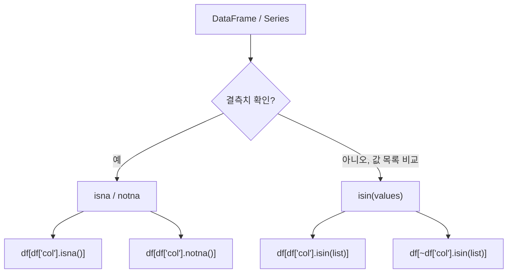

## 정의

| 메서드 | 의미 |
|:---|:---|
| `.isin(values)` | 각 원소가 values 안에 있는지 (boolean Series) |
| `.isna()` | NaN/NaT/None 여부 (`isnull` 별칭) |
| `.notna()` | 위의 반대 (`notnull` 별칭) |

## 사용 상황

- **isin**: SQL `IN (...)` 처럼 여러 값 중 하나에 해당하는 행을 걸러낼 때
- **isna / notna**: 결측치 유무 확인, 결측치가 있는/없는 행 선택 또는 집계 시
- **any / all 조합**: 특정 컬럼 조합에 하나라도 결측치가 있는 행을 찾을 때

## 필터 흐름 시각화



## isin

여러 값 중 하나에 해당하는지 검사. SQL 의 `IN (...)` 과 같음.

<CodeWithOutput
  language="python"
  outputLanguage="text"
  code={`import pandas as pd
df = pd.DataFrame({
    'name': ['Alice', 'Bob', 'Charlie', 'Dave'],
    'city': ['Seoul', 'Busan', 'Daegu', 'Seoul'],
})
mask = df['city'].isin(['Seoul', 'Busan'])
print(df[mask])`}
  output={`    name   city
0  Alice  Seoul
1    Bob  Busan
3   Dave  Seoul`}
/>

### 부정 (NOT IN)

```python
df[~df['city'].isin(['Seoul'])]    # Seoul 아닌 것
```

### dict 전달로 컬럼별 조건

```python
df.isin({'city': ['Seoul'], 'name': ['Alice']})
# city == 'Seoul' AND name == 'Alice' 각각 별도 boolean
```

### Series.isin vs DataFrame.isin

```python
# Series.isin -> boolean Series (행 필터에 바로 사용)
mask = df['city'].isin(['Seoul', 'Busan'])
df[mask]

# DataFrame.isin -> boolean DataFrame (같은 shape)
# 각 셀이 values 에 있는지 여부
df.isin(['Seoul', 'Alice'])
```

### 실전: 승인된 카테고리만 필터

```python
ALLOWED_STATUSES = {'approved', 'pending'}
valid = df[df['status'].isin(ALLOWED_STATUSES)]
invalid = df[~df['status'].isin(ALLOWED_STATUSES)]
```

### 실전: 다른 DataFrame 의 키로 필터

```python
# whitelist DataFrame 의 id 와 일치하는 행만 추출
valid_ids = whitelist_df['id'].tolist()
df[df['id'].isin(valid_ids)]
```

## isna / notna

```python
df = pd.DataFrame({'a': [1, None, 3], 'b': [None, 2, 3]})

df.isna()                # 같은 shape 의 boolean DataFrame
df['a'].isna()           # Series
df['a'].notna()          # 반대

df[df['a'].notna()]      # a 가 not null 인 행만
df.dropna()              # 어느 컬럼이든 NaN 있는 행 제거
df.dropna(subset=['a'])  # a 컬럼만 검사
```

<CodeWithOutput
  language="python"
  outputLanguage="text"
  code={`import pandas as pd
import numpy as np
df = pd.DataFrame({
    'a': [1, np.nan, 3, np.nan],
    'b': [10, 20, np.nan, 40],
})
print(df.isna())
print('---null count---')
print(df.isna().sum())`}
  output={`       a      b
0  False  False
1   True  False
2  False   True
3   True  False
---null count---
a    2
b    1
dtype: int64`}
/>

## any / all 과 결합

```python
# 어느 컬럼이든 NaN 인 행
df[df.isna().any(axis=1)]

# 모든 컬럼이 NaN 인 행
df[df.isna().all(axis=1)]

# 컬럼별로 NaN 비율
df.isna().mean()

# 전체 NaN 개수
df.isna().sum().sum()
```

## NaN, None, NaT, pd.NA 차이

| 값 | 타입 | 대응 |
|:---|:---|:---|
| `np.nan` | float | 수치형 결측 |
| `None` | NoneType | object dtype 결측, 자동 NaN 변환 |
| `pd.NaT` | NaTType | datetime 결측 |
| `pd.NA` | NAType | nullable dtype 의 결측 (pandas 1.x+) |

`.isna()` 는 위 모두를 `True` 로 판단한다.

```python
import pandas as pd
import numpy as np

s = pd.Series([1, np.nan, None, pd.NaT, pd.NA], dtype=object)
s.isna()
# 0    False
# 1     True
# 2     True
# 3     True
# 4     True
```

## 실전 패턴

### 결측치 비율 리포트

```python
null_report = pd.DataFrame({
    'count': df.isna().sum(),
    'pct': (df.isna().mean() * 100).round(2),
})
print(null_report[null_report['count'] > 0])
```

### 결측치가 있는 컬럼 목록

```python
cols_with_null = df.columns[df.isna().any()].tolist()
```

### 특정 컬럼 조합 모두 비어 있는 행 제거

```python
# name 또는 email 중 하나라도 있으면 유지
df = df.dropna(subset=['name', 'email'], how='all')
```

### 조건부 fillna (isna + where)

```python
# status 가 NaN 인 행의 status 를 'unknown' 으로
df['status'] = df['status'].where(df['status'].notna(), 'unknown')
# 또는
df['status'] = df['status'].fillna('unknown')
```

### isin + isna 동시 조건

```python
# city 가 서울/부산이고 age 가 null 이 아닌 행
mask = df['city'].isin(['Seoul', 'Busan']) & df['age'].notna()
df[mask]
```

### 그룹별 결측치 비율

```python
df.groupby('region')['sales'].apply(lambda s: s.isna().mean())
```

## 성능

```python
# isin 은 내부적으로 set lookup
# 리스트보다 set 을 직접 전달하면 약간 빠름 (중복 없을 때)
values = {'Seoul', 'Busan', 'Daegu'}
df['city'].isin(values)

# isna 는 NumPy 연산이므로 매우 빠름 (C 레벨)
# 대량 데이터에서도 병목이 되지 않음

# 주의: object dtype 컬럼에서 isin 은 값 비교가 느릴 수 있음
# category dtype 으로 변환하면 속도 개선
df['city'] = df['city'].astype('category')
df['city'].isin(['Seoul', 'Busan'])  # 더 빠름
```

> [!TIP]
> 대용량 DataFrame 에서 `isin` 을 자주 쓴다면 해당 컬럼을 `category` dtype 으로 변환하라. 메모리 절약 + 비교 속도 향상 두 가지 이점이 있다.

## 함정

### 1. `== np.nan` 안 됨

```python
df[df['a'] == np.nan]    # 항상 False
df[df['a'].isna()]        # 올바름
```

`NaN != NaN` 이라는 IEEE 754 규약 때문.

### 2. `is None` 도 권장 안 함

```python
df['a'] is None    # Series 가 None 인지 비교 (항상 False)
df['a'].isna()     # 각 원소 검사
```

### 3. isin 의 dtype 불일치

```python
df = pd.DataFrame({'id': [1, 2, 3]})  # int
df['id'].isin(['1', '2'])              # 모두 False (str vs int)
df['id'].isin([1, 2])                  # 올바름
```

> [!WARNING]
> `isin` 에 전달하는 리스트의 dtype 이 컬럼의 dtype 과 다르면 일치하는 값이 없어 모두 False 가 된다. 특히 CSV 로 읽은 데이터에서 숫자 id 가 `str` 로 파싱된 경우 자주 발생.

### 4. isna 와 dropna 의 미묘한 차이

```python
# isna().any(axis=1) 과 dropna 의 기본 동작은 동일
df[~df.isna().any(axis=1)]
df.dropna()              # 같은 결과 (how='any', axis=0)

# 하지만 subset 지정에서 차이
df.dropna(subset=['a'])
df[df['a'].notna()]      # 위와 같음
```

### 5. pd.NA vs np.nan (nullable dtype)

```python
# nullable Int64 컬럼에서 isna 는 pd.NA 도 True 로 처리
s = pd.array([1, pd.NA, 3], dtype='Int64')
pd.Series(s).isna()
# True 로 정상 처리
```

## 관련 위키

- [[Pandas Boolean Indexing]]
- [[Pandas dropna / fillna]]
- [[Pandas query]]
- [[Pandas .loc / .iloc]]
- [[Pandas value_counts]]
- [[Pandas Nullable Types]]
