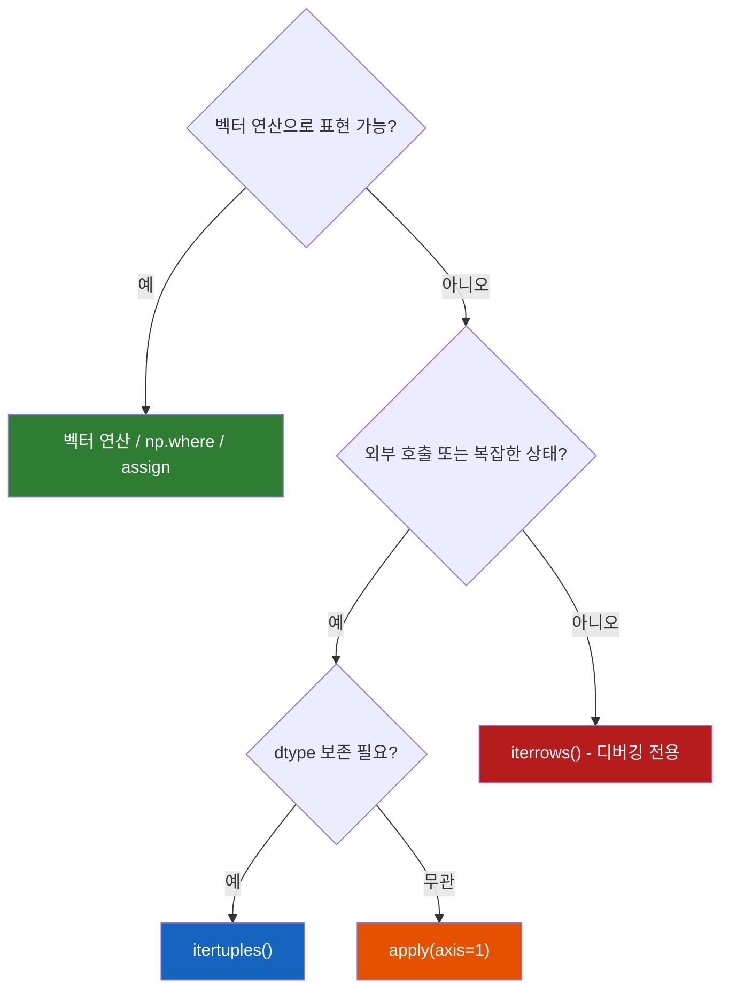
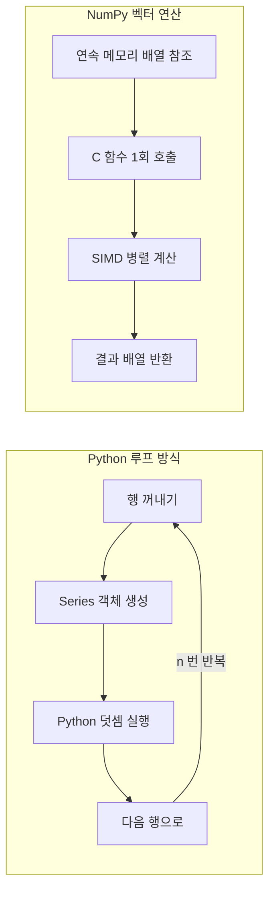

## 정의

- **`iterrows()`** : (index, Series) 순회
- **`itertuples()`** : NamedTuple 순회 (빠름, 권장)
- **`items()`** : (column_name, Series) 순회

## 사용 시점

Python 루프 기반 순회는 아래 상황에서만 정당화된다:

- 외부 API / DB 에 행 단위로 요청
- pandas 로 표현하기 어려운 복잡 상태 머신
- 소규모 데이터 디버깅

**그 외 대부분은 벡터 연산으로 대체 가능하다.**

## 순회 방식 선택



## 기본

```python
for idx, row in df.iterrows():
    print(idx, row['name'], row['age'])

for row in df.itertuples():
    print(row.Index, row.name, row.age)
```

## 성능 비교 (강한 권고: 가능하면 벡터 연산)

<CodeWithOutput
  language="python"
  outputLanguage="text"
  code={`import pandas as pd
import time
df = pd.DataFrame({'a': range(100_000), 'b': range(100_000)})

t = time.time(); total = 0
for _, r in df.iterrows(): total += r['a'] + r['b']
print(f'iterrows:   {time.time()-t:.2f}s')

t = time.time(); total = 0
for r in df.itertuples(): total += r.a + r.b
print(f'itertuples: {time.time()-t:.2f}s')

t = time.time()
total = (df['a'] + df['b']).sum()
print(f'vectorized: {time.time()-t:.4f}s')`}
  output={`iterrows:   3.85s
itertuples: 0.18s
vectorized: 0.0009s`}
/>

`itertuples` 가 `iterrows` 보다 ~20 배 빠르고, **벡터 연산은 다시 그 200 배 빠르다**.

> [!IMPORTANT]
> **거의 모든 경우 iterrows / itertuples 를 피하라.** 벡터 연산 / `apply` / `np.where` / `groupby` 로 같은 결과를 만들 수 있는지 먼저 검토. 정 필요하면 `itertuples`.

## 벡터화가 빠른 이유



핵심 차이:

- Python 루프: 인터프리터 오버헤드 + 객체 생성 비용 × n
- NumPy: C 컴파일 코드, 연속 메모리(contiguous array), CPU SIMD 활용

```python
# DataFrame 컬럼은 내부적으로 numpy ndarray
df['a'].values          # ndarray, C-contiguous 연속 메모리 블록
df['a'].values.dtype    # dtype('int64')

# pandas 오버헤드 제거하고 numpy 직접 사용 (가장 빠름)
arr_a = df['a'].values
arr_b = df['b'].values
result = arr_a + arr_b
```

## itertuples 옵션

```python
df.itertuples()                # NamedTuple with Index
df.itertuples(index=False)     # Index 제거
df.itertuples(name='Row')      # NamedTuple 이름 지정
```

## iterrows 의 함정

### 1. dtype 손실

`iterrows` 는 각 행을 Series 로 반환. 같은 컬럼이 다른 dtype 이면 모두 object 로 강등.

```python
for _, r in df.iterrows():
    type(r['age'])    # 원래 int 였어도 object 일 수 있음
```

`itertuples` 는 컬럼별 dtype 보존.

### 2. row 수정해도 원본에 반영 안 됨

```python
for _, r in df.iterrows():
    r['age'] = r['age'] + 1     # ❌ 원본 df 안 바뀜
```

### 3. 매우 느림

CPython 루프 + Series 생성 비용.

## items, 컬럼 순회

```python
for name, col in df.items():
    print(name, col.dtype, col.sum())
```

이건 보통 빠르고 의미가 명확.

## 진짜로 행 단위 처리가 필요할 때

1. **`apply(fn, axis=1)`** : iterrows 보다 빠름
2. **`itertuples()`** : 가장 빠른 Python 루프
3. **numpy / numba / cython** : 더 빠르게

```python
# apply
df['c'] = df.apply(lambda r: r['a'] + r['b'], axis=1)

# numpy 벡터화 (가장 빠름)
df['c'] = df['a'].values + df['b'].values

# np.vectorize: 코드 간결성용, 실제로는 Python 루프
@np.vectorize
def my_fn(a, b):
    return a + b
df['c'] = my_fn(df['a'], df['b'])
```

## apply() 심화

`apply(axis=1)` 은 Python 루프지만 iterrows 보다 빠른 이유: 행당 Series 생성 비용이 없다.

```python
import pandas as pd
import numpy as np

df = pd.DataFrame({
    'name': ['Alice', 'Bob', 'Charlie'],
    'score1': [80, 92, 75],
    'score2': [88, 85, 91],
})

# 복잡한 분기 로직 → apply 로 표현
def grade(row):
    avg = (row['score1'] + row['score2']) / 2
    if avg >= 90:
        return 'A'
    elif avg >= 80:
        return 'B'
    return 'C'

df['grade'] = df.apply(grade, axis=1)
```

같은 결과를 `np.select` 로 더 빠르게 처리:

```python
avg = (df['score1'] + df['score2']) / 2
conditions = [avg >= 90, avg >= 80]
choices    = ['A', 'B']
df['grade'] = np.select(conditions, choices, default='C')
```

> [!TIP]
> `apply(axis=1)` 내부 로직이 분기 없이 수식이면, `assign` + 벡터 연산으로 리팩터링을 먼저 시도하라. 10배 이상 빨라지는 경우가 많다.

## 실전 예시

### 외부 API 행 단위 호출 (itertuples 권장)

```python
import httpx

results = []
for row in df.itertuples(index=False):
    resp = httpx.get(f'https://api.example.com/user/{row.user_id}')
    results.append(resp.json())

df['api_result'] = results
```

### JSON 컬럼 파싱 (벡터화 불가 → apply)

```python
import json

df['parsed'] = df['json_col'].apply(json.loads)

# dict 컬럼 펼치기
df = pd.concat(
    [df.drop('parsed', axis=1), pd.json_normalize(df['parsed'])],
    axis=1
)
```

### 이전 행 참조 (iterrows 대신 shift)

```python
# iterrows 대신 shift + 벡터 연산
df['prev_price'] = df['price'].shift(1)
df['change']     = df['price'] - df['prev_price']

# 누적합 / 누적곱
df['cumulative_sales'] = df['daily_sales'].cumsum()
```

### 열 단위 집계 후 대입 (transform)

```python
# iterrows 로 "그룹 평균을 구해 각 행에 넣기" → transform 이 정답
df['group_avg'] = df.groupby('category')['value'].transform('mean')
```

## 성능 특성

| 방법 | 100k 행 기준 | dtype 보존 | 원본 수정 |
|:---|:---:|:---:|:---:|
| `iterrows()` | ~3.8s | ❌ | ❌ |
| `itertuples()` | ~0.18s | ✅ | ❌ |
| `apply(axis=1)` | ~0.8s | ✅ | ❌ |
| 벡터 연산 | ~0.001s | ✅ | ✅ |
| `np.vectorize` | ~0.05s | 의존 | ❌ |

> [!WARNING]
> `np.vectorize` 는 사실 Python 루프를 래핑한 것이다. 진짜 벡터화가 아니므로 성능 최적화 목적으로 쓰면 안 된다. 코드 인터페이스 통일용으로만 활용.

## 그래도 iterrows 가 필요한 경우

- API 가 dict / NamedTuple 입력을 요구
- 디버깅 / 한 번만 도는 작은 데이터
- 외부 시스템에 한 행씩 전송

## 관련 위키

- [[Pandas apply / map]]
- [[Pandas transform / apply]]
- [[Pandas 성능 / 메모리 최적화]]
- [[Pandas DataFrame]]
- [[Pandas groupby]]
