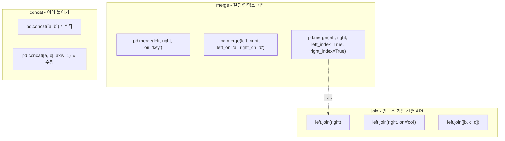
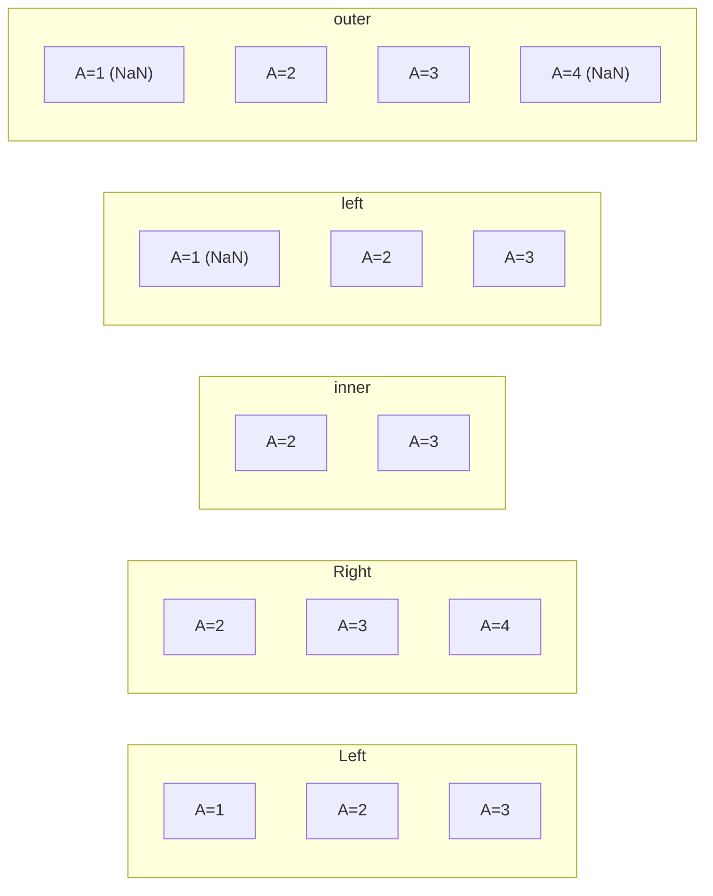

## 정의

**`DataFrame.join(other)`** 는 **index 기반 결합** 의 편의 API. 내부적으로는 `merge(left_index=True, right_index=True, ...)` 와 동등하지만 더 짧다.

pandas 에서 두 DataFrame 을 결합하는 세 가지 주요 함수:
- **`merge`** : 컬럼 / 인덱스 기반 결합. SQL JOIN 에 가장 가깝다.
- **`join`** : 인덱스 기반 결합의 간편 API. `merge` 의 subset.
- **`concat`** : 수직/수평 이어 붙이기. UNION / 열 추가에 해당.

## 세 API 비교 시각화



## join 기본

```python
left.join(right)                # left join (기본), index 기준
left.join(right, how='outer')
left.join(right, on='key')      # left 의 key 컬럼 vs right 의 index
```

## merge 와의 비교

```python
# 둘은 같음
left.join(right, how='inner')
pd.merge(left, right, left_index=True, right_index=True, how='inner')
```

`join` 은 **index 끼리 매칭** 이 기본 가정이라 코드가 짧다. 컬럼 기준 결합이면 `merge` 가 명확.

## join 사용 예

<CodeWithOutput
  language="python"
  outputLanguage="text"
  code={`import pandas as pd
users = pd.DataFrame({'name':['Alice','Bob']}, index=[1, 2])
orders = pd.DataFrame({'amount':[100, 200, 50]}, index=[1, 1, 3])

print(users.join(orders, how='outer'))`}
  output={`      name  amount
1    Alice   100.0
1    Alice   200.0
2      Bob     NaN
3      NaN    50.0`}
/>

|   | name  | amount |
|---|-------|--------|
| 1 | Alice | 100.0  |
| 1 | Alice | 200.0  |
| 2 | Bob   | NaN    |
| 3 | NaN   | 50.0   |

## merge: how 옵션별 동작



| how | 결과 행 | SQL 대응 |
|:---|:---|:---|
| `inner` | 양쪽 모두 있는 key | `INNER JOIN` |
| `left` | left 전체 + right 매칭 | `LEFT JOIN` |
| `right` | left 매칭 + right 전체 | `RIGHT JOIN` |
| `outer` | 양쪽 전체 합집합 | `FULL OUTER JOIN` |
| `cross` | 카테시안 곱 | `CROSS JOIN` |

```python
pd.merge(left, right, on='key', how='inner')
pd.merge(left, right, on='key', how='left')
pd.merge(left, right, on='key', how='right')
pd.merge(left, right, on='key', how='outer')
pd.merge(left, right, how='cross')
```

## merge: on / left_on / right_on

```python
# 같은 이름 컬럼 (on)
pd.merge(df1, df2, on='user_id')

# 이름이 다른 컬럼 (left_on / right_on)
pd.merge(orders, products, left_on='product_id', right_on='id')

# 복합 키
pd.merge(df1, df2, on=['year', 'month'])

# 인덱스 기반
pd.merge(df1, df2, left_index=True, right_index=True)
pd.merge(df1, df2, left_on='key', right_index=True)
```

## merge 실전 예시: 주문-상품-사용자

<CodeWithOutput
  language="python"
  outputLanguage="text"
  code={`import pandas as pd

users = pd.DataFrame({
    'user_id': [1, 2, 3],
    'name': ['Alice', 'Bob', 'Carol'],
})

orders = pd.DataFrame({
    'order_id': [101, 102, 103, 104],
    'user_id':  [1, 2, 1, 4],
    'amount':   [500, 200, 800, 100],
})

# 주문 기준 left join (탈퇴 사용자 포함)
result = pd.merge(orders, users, on='user_id', how='left')
print(result.to_string(index=False))`}
  output={` order_id  user_id  amount   name
      101        1     500  Alice
      102        2     200    Bob
      103        1     800  Alice
      104        4     100    NaN`}
/>

## concat 사용법

```python
# 수직 (행 이어 붙이기)
pd.concat([df1, df2])
pd.concat([df1, df2], ignore_index=True)   # 인덱스 재지정

# 수평 (열 이어 붙이기)
pd.concat([df1, df2], axis=1)

# keys 로 계층적 인덱스 생성
pd.concat([df1, df2], keys=['train', 'test'])
```

<CodeWithOutput
  language="python"
  outputLanguage="text"
  code={`import pandas as pd

q1 = pd.DataFrame({'sales': [100, 200]}, index=['Jan', 'Feb'])
q2 = pd.DataFrame({'sales': [300, 400]}, index=['Mar', 'Apr'])

annual = pd.concat([q1, q2])
print(annual)`}
  output={`     sales
Jan    100
Feb    200
Mar    300
Apr    400`}
/>

## 여러 DataFrame 동시 join

```python
a.join([b, c, d], how='outer')
```

`merge` 보다 깔끔. 단, 모두 같은 index 기준.

## 컬럼 충돌

```python
a.join(b, lsuffix='_a', rsuffix='_b')
# 양쪽 컬럼 이름 충돌 시 suffix

pd.merge(left, right, on='key', suffixes=('_l', '_r'))
```

## on 파라미터 (left 의 컬럼 vs right 의 index)

```python
orders.join(products, on='product_id')
# orders['product_id'] 와 products.index 매칭
```

SQL 의 `LEFT JOIN products ON orders.product_id = products.id` 패턴.

## merge vs join vs concat: 언제 무엇을

| 시나리오 | 권장 |
|:---|:---|
| 양쪽 모두 일반 컬럼 기준 | `merge(on='col')` |
| 양쪽 모두 index 기준 | `join()` 또는 `merge(left_index=True, right_index=True)` |
| left 컬럼 + right index | `join(on='col')` 또는 `merge(left_on='col', right_index=True)` |
| 다중 DataFrame 한 번에 | `join([b, c, d])` |
| 다대다 검증 필요 | `merge(validate='one_to_many')` |
| 행 이어 붙이기 (UNION) | `concat([df1, df2])` |
| 열 이어 붙이기 | `concat([df1, df2], axis=1)` |
| 시간 기반 근사 join | `merge_asof` |

## validate 옵션 (merge 전용)

```python
pd.merge(left, right, on='key', validate='one_to_one')
# 'one_to_one' / 'one_to_many' / 'many_to_one' / 'many_to_many'
# 기대와 다르면 MergeError 발생 → 데이터 품질 검사
```

## indicator 옵션

```python
result = pd.merge(left, right, on='key', how='outer', indicator=True)
result['_merge']
# 'left_only' / 'right_only' / 'both'

# 어느 쪽에만 있는 행 확인
result[result['_merge'] == 'left_only']
```

## 성능

### 큰 DataFrame 병합

```python
# 1. merge 전에 필요한 컬럼만 남기기
left_cols = ['key', 'col_a', 'col_b']
right_cols = ['key', 'col_c']
left_slim = left[left_cols]
right_slim = right[right_cols]
pd.merge(left_slim, right_slim, on='key')

# 2. key 컬럼에 인덱스 설정 후 join
left.set_index('key').join(right.set_index('key'))

# 3. category dtype 로 key 변환 (문자열 key 비교 속도 향상)
left['key'] = left['key'].astype('category')
```

### concat 의 루프 안 사용 금지

```python
# ❌ 매 반복마다 새 DataFrame 생성 - O(n^2) 메모리
result = pd.DataFrame()
for chunk in chunks:
    result = pd.concat([result, chunk])

# ✓ 리스트에 모은 뒤 한 번에
parts = []
for chunk in chunks:
    parts.append(chunk)
result = pd.concat(parts, ignore_index=True)
```

## 함정

### 1. 기본 how 가 다름

| | `merge` | `join` |
|:---|:---:|:---:|
| 기본 how | `inner` | `left` |

### 2. index 가 unique 가 아니면 폭증

```python
# 양쪽 index 에 중복이 있으면 곱셈 행 생성
# validate 옵션이 join 에는 없음 → merge 권장
pd.merge(left, right, on='key', validate='one_to_one')
```

### 3. 동일 이름 컬럼

`lsuffix` / `rsuffix` 둘 다 default 가 `''` 이므로 충돌하면 에러.

```python
a.join(b)               # ValueError: columns overlap
a.join(b, lsuffix='_a')    # 한 쪽만 줘도 가능
```

> [!WARNING]
> `join` 의 기본 `how='left'` 를 인지하지 못해 right-only 행이 사라지는 실수가 흔하다. 항상 `how=` 를 명시하는 습관을 들이자.

> [!CAUTION]
> `concat([df1, df2], axis=1)` 는 내부적으로 index 정렬을 하므로 index 가 다르면 NaN 이 생긴다. 행 수가 같아도 index 가 다르면 의도치 않은 결과가 발생한다. `ignore_index=True` 또는 `reset_index()` 를 먼저 적용하라.

## 관련 위키

- [[Pandas merge]]
- [[Pandas concat]]
- [[Pandas DataFrame]]
- [[Pandas .loc / .iloc]]
- [[Pandas merge_asof]]
- [[Pandas MultiIndex]]
