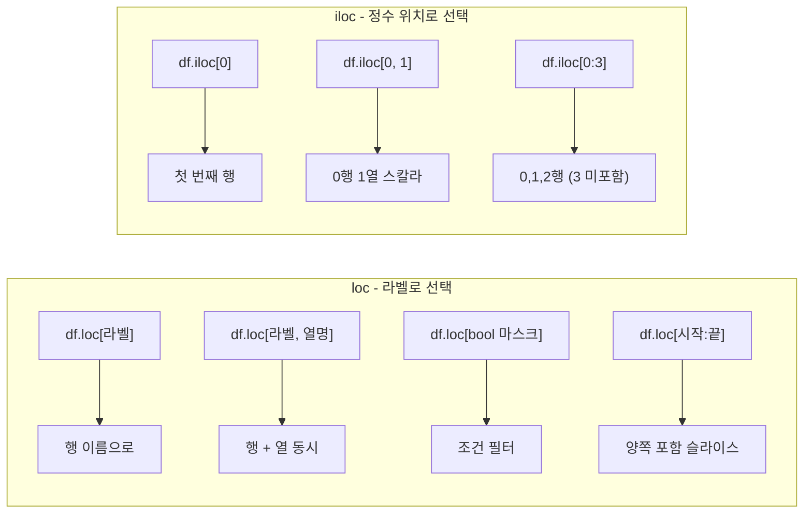

## 정의

- **`.loc[]`** : **라벨 기반** 인덱싱 (index/column 이름)
- **`.iloc[]`** : **정수 위치 기반** 인덱싱 (0-based)

이 두 indexer 가 pandas 선택의 표준. `df[]` 만으로는 헷갈리는 경우가 많아 명시적인 `.loc` / `.iloc` 권장.

## loc vs iloc 차이 시각화



## 기본 비교

```python
import pandas as pd
df = pd.DataFrame(
    {'age': [25, 30, 35], 'salary': [3000, 4500, 6000]},
    index=['Alice', 'Bob', 'Charlie']
)

df.loc['Bob']               # 라벨 → Series
df.iloc[1]                  # 위치 1 → Series

df.loc['Bob', 'age']        # 스칼라
df.iloc[1, 0]               # 스칼라

labels = ['Alice', 'Bob']
df.loc[labels]              # 여러 라벨
pos_list = [0, 1]
df.iloc[pos_list]           # 여러 위치
```

## 슬라이싱 (가장 중요한 차이)

```python
df.loc['Alice':'Bob']       # ✓ 'Bob' 포함 (양쪽 inclusive!)
df.iloc[0:2]                # ✗ 위치 2 미포함 (Python 표준)
```

> [!IMPORTANT]
> **`.loc` 의 슬라이스는 양쪽 inclusive**. `.iloc` 는 Python list 처럼 right-exclusive. 자주 헷갈리니 주의.

## 행 + 열 동시 선택

<CodeWithOutput
  language="python"
  outputLanguage="text"
  code={`import pandas as pd
df = pd.DataFrame(
    {'a': [1,2,3,4], 'b': [10,20,30,40], 'c': [100,200,300,400]},
    index=['w','x','y','z']
)

# loc: 라벨로
print(df.loc['x':'z', ['a', 'c']])
print('---')
# iloc: 위치로
print(df.iloc[1:3, [0, 2]])`}
  output={`   a    c
x  2  200
y  3  300
z  4  400
---
   a    c
x  2  200
y  3  300`}
/>

|   | a | c   |
|---|---|-----|
| x | 2 | 200 |
| y | 3 | 300 |
| z | 4 | 400 |

위 `.loc` 는 'z' 포함, 아래 `.iloc[1:3]` 은 위치 3 (z) 미포함.

## boolean mask 와 결합

```python
df.loc[df['age'] > 30]                        # 행 필터
df.loc[df['age'] > 30, 'salary']              # 행 필터 + 컬럼
df.loc[df['age'] > 30, ['name', 'salary']]    # 행 필터 + 여러 컬럼
df.loc[df['age'] > 30, 'salary'] *= 1.1       # 조건부 갱신
```

## 값 할당

```python
df.loc[df['age'] > 30, 'bonus'] = 500           # 조건부 추가
df.loc['Alice', 'salary'] = 9999                # 단일 셀
df.loc['Alice':'Bob', 'salary'] = [9999, 8888]  # 슬라이스 + 리스트
df.iloc[0, 1] = 99                              # 위치 기반
```

## label vs position: 왜 두 가지가 필요한가

pandas Index 가 항상 정수일 필요는 없다. 라벨이 문자열이거나 날짜일 때 `loc` 가 자연스럽다.

```python
# 정수 index 라도 loc 는 라벨로 해석
s = pd.Series([10, 20, 30], index=[5, 6, 7])

s.loc[5]      # 라벨 5 → 값 10
s.iloc[0]     # 위치 0 → 값 10 (같은 결과)
s.iloc[5]     # IndexError (위치 5 없음)

# RangeIndex (기본 정수 index) 에서도 구분 명확
s2 = pd.Series([100, 200, 300])
s2.loc[2]     # 라벨 2 → 300
s2.iloc[2]    # 위치 2 → 300 (같은 결과이지만 의미 다름)
```

날짜 index 에서는 차이가 극명해진다:

```python
import pandas as pd

ts = pd.Series(
    [1, 2, 3],
    index=pd.to_datetime(['2024-01-01', '2024-01-02', '2024-01-03'])
)

ts.loc['2024-01-02']   # 날짜 라벨로 선택
ts.iloc[1]              # 위치 1 로 선택 (같은 결과)
ts.loc['2024-01-01':'2024-01-02']  # 날짜 슬라이스, 양쪽 포함
```

## SettingWithCopyWarning 심화

pandas 에서 가장 흔한 경고. 체이닝 인덱싱(chained indexing) 이 원인.

```python
# ❌ 체이닝: df[...] 가 view 인지 copy 인지 불확실
df[df['age'] > 30]['salary'] = 999

# ✓ loc 로 한 번에
df.loc[df['age'] > 30, 'salary'] = 999
```

**왜 불확실한가?** `df[df['age'] > 30]` 이 copy 를 반환하면 `['salary'] = 999` 는 그 copy 에만 적용되고 원본 df 는 변경되지 않는다.

```python
# pandas 2.x Copy-on-Write (CoW) 동작
# 2.x 에서는 어떤 선택도 항상 copy 반환 → 명시적 loc 가 필수

# 수정이 필요 없을 때: copy 불필요
sub_view = df.loc[df['age'] > 30]         # 읽기 전용

# 수정이 필요할 때: 반드시 copy
sub = df.loc[df['age'] > 30].copy()
sub['bonus'] = 100                         # 원본에 영향 없음
```

> [!WARNING]
> pandas 2.0 에서 CoW(Copy-on-Write) 가 기본 활성화됐다. 체이닝 인덱싱으로 값을 바꾸려 하면 `ChainedAssignmentError` 가 발생한다. `.loc[행, 열] =` 패턴만 사용하라.

## 스칼라 접근: at / iat

단일 셀 접근에는 `.at` / `.iat` 가 `.loc` / `.iloc` 보다 빠름.

```python
df.at['Alice', 'salary']      # .loc 보다 빠름 (스칼라 전용)
df.iat[0, 1]                   # .iloc 보다 빠름 (스칼라 전용)

# 반복 루프 안에서 단일 셀 업데이트 시
for i in range(len(df)):
    df.iat[i, 1] = compute(df.iat[i, 0])  # iat 사용
```

## 실전 패턴

### 조건부 열 추가

```python
# 특정 조건인 행에만 새 컬럼 값 부여
df['bonus'] = 0
df.loc[df['performance'] == 'excellent', 'bonus'] = 1000
df.loc[df['performance'] == 'good', 'bonus'] = 500
```

### 여러 컬럼 동시 선택

```python
cols = ['name', 'age', 'salary']
df.loc[:, cols]          # 모든 행, 특정 컬럼들
df.iloc[:, [0, 2, 4]]   # 모든 행, 0,2,4 번째 컬럼
```

### 마지막 N 개 행

```python
df.iloc[-5:]     # 마지막 5행
df.iloc[-1:]     # 마지막 1행 (DataFrame 유지)
df.iloc[-1]      # 마지막 1행 (Series)
```

### 조건 + 열 변경 (loc 한 줄)

```python
# salary 가 5000 이상인 사람의 tax_rate 를 0.3 으로
df.loc[df['salary'] >= 5000, 'tax_rate'] = 0.3
```

### MultiIndex 에서 loc

```python
df.loc[('Seoul', 'A')]               # 외부 + 내부 라벨
df.loc[pd.IndexSlice[:, 'A'], :]     # 모든 외부, 내부='A'
```

## 함정

### 1. boolean mask 에 `.iloc` 사용 불가

```python
df.iloc[df['age'] > 30]     # ❌ NotImplementedError 또는 의미 다름
df.loc[df['age'] > 30]      # ✓
```

`.iloc` 은 정수 (또는 정수 array) 만. boolean array 는 라벨처럼 취급되는 `.loc` 만.

### 2. SettingWithCopyWarning

```python
df[df['age'] > 30]['salary'] = 999    # ⚠️ chained indexing
df.loc[df['age'] > 30, 'salary'] = 999  # ✓
```

**한 줄에 indexer 두 번** 쓰면 결과가 view 인지 copy 인지 모호. 항상 `.loc[행, 열]` 한 번에 처리.

### 3. 정수 index 의 모호함

```python
s = pd.Series([10, 20, 30], index=[5, 6, 7])
s.loc[5]      # label 5 → 10
s.iloc[5]     # IndexError
s[5]          # label 5 → 10 (Future 에 deprecate 예정 경고)
```

명확하려면 항상 `.loc` 또는 `.iloc`.

### 4. 단일 row 의 반환 타입

```python
df.loc['Alice']          # Series (1차원)
row_list = ['Alice']
df.loc[row_list]         # DataFrame (2차원, 한 행)
```

다중 행을 유지하려면 리스트로 감싼다.

### 5. loc 슬라이스는 sort 된 index 필요

```python
# index 가 정렬 안 된 상태에서 loc 슬라이스 → 예상치 못한 결과 가능
df = df.sort_index()       # 정렬 후 슬라이스
df.loc['Alice':'Charlie']
```

## 관련 위키

- [[Pandas DataFrame]]
- [[Pandas 컬럼 선택]]
- [[Pandas .at / .iat]]
- [[Pandas Boolean Indexing]]
- [[SettingWithCopyWarning]]
- [[Pandas MultiIndex]]
