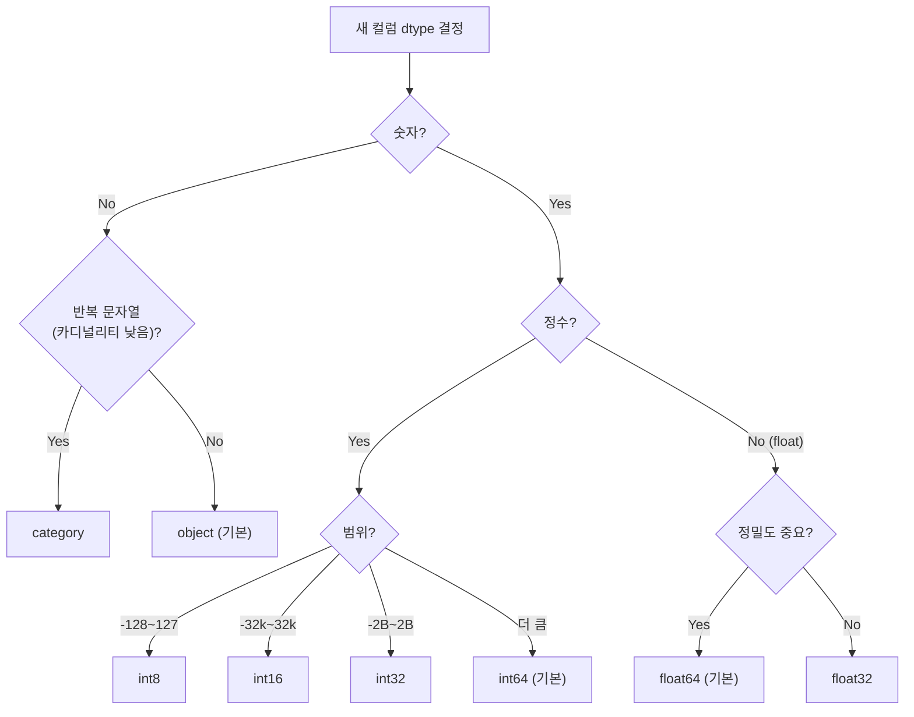
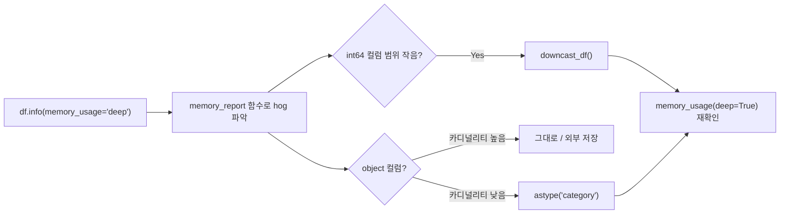

## 정의

DataFrame 의 메타데이터 / 메모리 / 통계를 빠르게 조회하는 도구.

| 메서드 | 목적 |
|:---|:---|
| `df.info()` | 컬럼별 dtype + non-null count + 메모리 |
| `df.memory_usage(deep=True)` | 컬럼별 정확한 메모리 |
| `df.describe()` | 수치형 통계 (count, mean, std, percentile) |
| `df.shape` | (rows, cols) |
| `df.dtypes` | 컬럼별 dtype |
| `df.head()`, `df.tail()` | 상/하 5 개 |
| `df.sample()` | 무작위 |
| `df.nunique()` | 컬럼별 unique 수 |

## info

```python
df.info()
df.info(memory_usage='deep')   # object 컬럼 정확히
```

<CodeWithOutput
  language="python"
  outputLanguage="text"
  code={`import pandas as pd
df = pd.DataFrame({
    'name': ['Alice','Bob','Charlie'],
    'age': [30, 25, 35],
    'city': ['Seoul','Busan','Seoul'],
})
df.info()`}
  output={`<class 'pandas.core.frame.DataFrame'>
RangeIndex: 3 entries, 0 to 2
Data columns (total 3 columns):
 #   Column  Non-Null Count  Dtype
---  ------  --------------  -----
 0   name    3 non-null      object
 1   age     3 non-null      int64
 2   city    3 non-null      object
dtypes: int64(1), object(2)
memory usage: 200.0+ bytes`}
/>

## memory_usage

```python
df.memory_usage()                # 컬럼별 (object 부정확)
df.memory_usage(deep=True)       # object 의 Python str 까지 계산
df.memory_usage(deep=True).sum()  # 전체
```

<CodeWithOutput
  language="python"
  outputLanguage="text"
  code={`import pandas as pd
import numpy as np
np.random.seed(0)
n = 100_000
df = pd.DataFrame({
    'id': np.arange(n),
    'city': np.random.choice(['Seoul','Busan','Daegu'], n),
})
print('shallow:', df.memory_usage().sum() // 1024, 'KB')
print('deep   :', df.memory_usage(deep=True).sum() // 1024, 'KB')`}
  output={`shallow: 1562 KB
deep   : 6402 KB`}
/>

`object` (string) 컬럼이 큰 차이를 만든다.

## describe

```python
df.describe()                          # 수치형만, 8 가지 통계
df.describe(include='object')          # 문자형
df.describe(include='all')             # 전체
df.describe(percentiles=[.25, .5, .75, .95, .99])
df.describe(datetime_is_numeric=True)  # 날짜
```

<CodeWithOutput
  language="python"
  outputLanguage="text"
  code={`import pandas as pd
df = pd.DataFrame({
    'age': [25, 30, 35, 40, 45],
    'salary': [3000, 4500, 6000, 7500, 9000],
})
print(df.describe())`}
  output={`             age       salary
count   5.000000     5.000000
mean   35.000000  6000.000000
std     7.905694  2371.708245
min    25.000000  3000.000000
25%    30.000000  4500.000000
50%    35.000000  6000.000000
75%    40.000000  7500.000000
max    45.000000  9000.000000`}
/>

## info 의 메모리 정보

- `200.0+ bytes` 의 `+` : object 컬럼 정확도 보장 안 됨
- `memory_usage='deep'` 시 `+` 사라짐

## 자주 쓰는 탐색 시퀀스

```python
df = pd.read_csv('data.csv')
df.shape                                    # 크기
df.head(20)                                  # 어떻게 생겼는지
df.info(memory_usage='deep')                 # dtype + 메모리
df.describe()                                # 수치형
df.describe(include='object')                # 문자형
df.isna().sum()                              # 결측 수
df.nunique()                                 # unique 수
df.duplicated().sum()                        # 중복 행
df.select_dtypes('number').corr()            # 상관관계
```

## 메모리 절약 빠른 체크

```python
def memory_report(df):
    mem = df.memory_usage(deep=True)
    pct = (mem / mem.sum() * 100).round(1)
    return pd.DataFrame({'bytes': mem, 'pct': pct, 'dtype': df.dtypes})
memory_report(df)
```

어느 컬럼이 메모리 hog 인지 즉시 파악.

## profiling

탐색을 자동화하는 라이브러리.

```python
# pip install ydata-profiling
from ydata_profiling import ProfileReport
ProfileReport(df).to_file('report.html')
```

EDA 자동화. 대규모 데이터는 sample 후 사용.

## 메모리 최적화: Downcasting

`int64` 를 실제 범위에 맞는 작은 dtype 으로 축소.

```python
def downcast_df(df):
    for col in df.select_dtypes('integer').columns:
        df[col] = pd.to_numeric(df[col], downcast='integer')
    for col in df.select_dtypes('float').columns:
        df[col] = pd.to_numeric(df[col], downcast='float')
    return df
```

| dtype | 범위 | 크기 |
|:---|:---|:---|
| `int8` | -128 ~ 127 | 1 byte |
| `int16` | -32,768 ~ 32,767 | 2 bytes |
| `int32` | -2.1B ~ 2.1B | 4 bytes |
| `int64` | 기본값 | 8 bytes |
| `float32` | 정밀도 낮음 | 4 bytes |
| `float64` | 기본값 | 8 bytes |

## 메모리 최적화: category dtype

반복 문자열 컬럼은 `category` 로 전환하면 *대폭 절약*.

<CodeWithOutput
  language="python"
  outputLanguage="text"
  code={`import pandas as pd
import numpy as np

n = 500_000
df = pd.DataFrame({
    'city': np.random.choice(['Seoul', 'Busan', 'Daegu', 'Incheon'], n),
})

before = df.memory_usage(deep=True)['city']
df['city'] = df['city'].astype('category')
after = df.memory_usage(deep=True)['city']

print(f'object : {before:>10,} bytes')
print(f'category: {after:>10,} bytes')
print(f'절약: {(1 - after/before)*100:.1f}%')`}
  output={`object :  31,000,128 bytes
category:    500,546 bytes
절약: 98.4%`}
/>

> [!TIP]
> unique 비율이 낮을수록 (카디널리티 작을수록) `category` 효과 극대화.

## dtype 선택 흐름



## 대용량 파일: chunked 읽기

```python
# 한 번에 못 올리는 파일은 chunk 로 처리
chunks = pd.read_csv('huge.csv', chunksize=100_000)

result = []
for chunk in chunks:
    # 각 chunk 에서 필요한 집계만
    agg = chunk.groupby('city')['sales'].sum()
    result.append(agg)

final = pd.concat(result).groupby(level=0).sum()
```

```python
# 열 선택으로 메모리 추가 절약
df = pd.read_csv(
    'huge.csv',
    usecols=['city', 'sales', 'date'],   # 필요한 열만
    dtype={'city': 'category', 'sales': 'float32'},
)
```

## PyArrow backend (Pandas 2.0+)

```python
df = pd.read_parquet('data.parquet', dtype_backend='pyarrow')
df.dtypes
# city      string[pyarrow]
# sales     double[pyarrow]
# id        int64[pyarrow]
```

Arrow-backed 타입은 nullable 지원 + 일부 연산 더 빠름. 자세한 건 [[Pandas 성능 / 메모리 최적화]].

## 메모리 탐색 권장 순서



## 함정

### 1. memory_usage 의 inaccuracy

object dtype 은 `deep=True` 없이는 정확하지 않다. **항상 deep=True 권장**.

### 2. describe 의 default

```python
df.describe()        # numeric 만 (기본)
df.describe(include='all')   # 모든 컬럼
```

object 컬럼이 분석 대상이면 `include` 명시.

### 3. info 의 `+` 의 의미

```python
df.info()
# memory usage: 5.0+ MB    ← + 는 deep 안 계산했다는 표시
df.info(memory_usage='deep')
# memory usage: 12.3 MB    ← 정확
```

## 참고

- [[Pandas DataFrame]]
- [[Pandas 성능 / 메모리 최적화]]
- [[Pandas value_counts]]
