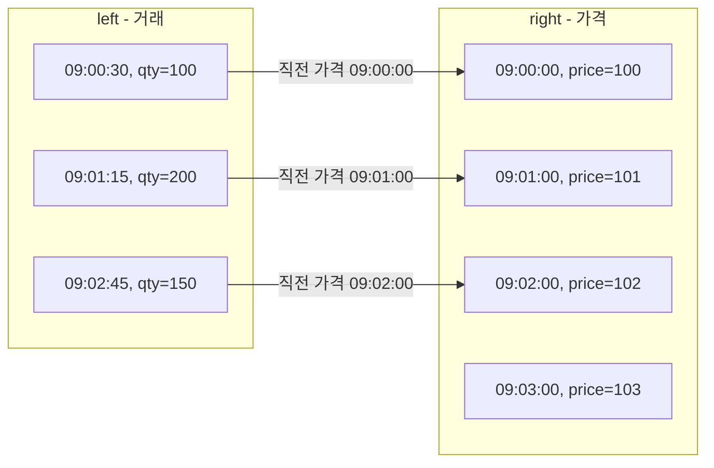

## 정의

**`pd.merge_asof(left, right, on, by=, direction=)`** 는 **가장 가까운 키** 기준 join. 일반 [[Pandas merge]] 가 정확히 일치하는 키만 매칭하는 반면, `merge_asof` 는 **이전 (또는 가장 가까운)** 키를 찾는다.

시계열 데이터 (가격, 이벤트) 와 다른 시계열 데이터 (참조 데이터, 다른 채널) 를 매칭할 때 핵심.

## 사용 상황

- **가격 + 거래 매칭**: 분 단위 가격 데이터와 초 단위 거래 데이터를 시간 기준으로 결합
- **이벤트 + 상태 매칭**: 이벤트 발생 시각 직전의 사용자 상태나 컨텍스트를 조인
- **센서 + 메타데이터**: 다른 주기로 기록된 두 센서 스트림을 가장 가까운 시각에 맞춰 결합
- **tolerance 기반 fuzzy join**: 허용 오차 이내에서만 매칭하고 그 외에는 NaN 처리

## as-of join 흐름 시각화



## 기본

```python
pd.merge_asof(left, right, on='time')
# 양쪽 모두 time 으로 정렬되어 있어야 함
# left 의 각 행에 대해 right.time <= left.time 중 가장 가까운 행 join
```

<CodeWithOutput
  language="python"
  outputLanguage="text"
  code={`import pandas as pd
trades = pd.DataFrame({
    'time': pd.to_datetime(['09:00:30','09:01:15','09:02:45']),
    'qty':  [100, 200, 150],
})
prices = pd.DataFrame({
    'time':  pd.to_datetime(['09:00:00','09:01:00','09:02:00','09:03:00']),
    'price': [100, 101, 102, 103],
})
print(pd.merge_asof(trades, prices, on='time'))`}
  output={`                 time  qty  price
0 2026-06-18 09:00:30  100    100
1 2026-06-18 09:01:15  200    101
2 2026-06-18 09:02:45  150    102`}
/>

각 trade 시각의 직전 가격이 매칭됨.

## direction

| direction | 의미 |
|:---|:---|
| `'backward'` (기본) | 이전 시각 매칭 (`<=`) |
| `'forward'` | 이후 시각 매칭 (`>=`) |
| `'nearest'` | 더 가까운 쪽 |

```python
pd.merge_asof(trades, prices, on='time', direction='nearest')
pd.merge_asof(trades, prices, on='time', direction='forward')
```

`direction='forward'` 는 이후 시각 기준 매칭, 예측 모델에서 다음 이벤트를 미리 붙일 때 사용.

## tolerance (허용 차이)

```python
pd.merge_asof(
    trades, prices,
    on='time',
    tolerance=pd.Timedelta('5min')
)
# 5 분 이상 떨어지면 매칭 안 됨 (NaN)
```

tolerance 는 numeric 키에도 사용 가능:

```python
pd.merge_asof(
    orders, catalog,
    on='price_level',
    tolerance=5,    # 가격 5 이내에서만 매칭
    direction='nearest',
)
```

## by (그룹별 매칭)

```python
pd.merge_asof(left, right, on='time', by='symbol')
# 같은 symbol 내에서만 시간 매칭
```

각 종목별로 독립적 as-of join:

<CodeWithOutput
  language="python"
  outputLanguage="text"
  code={`import pandas as pd
trades = pd.DataFrame({
    'time':   pd.to_datetime(['09:00:30', '09:00:45', '09:01:10']),
    'symbol': ['AAPL', 'MSFT', 'AAPL'],
    'qty':    [100, 200, 150],
})
prices = pd.DataFrame({
    'time':   pd.to_datetime(['09:00:00', '09:00:00', '09:01:00']),
    'symbol': ['AAPL', 'MSFT', 'AAPL'],
    'price':  [150.0, 300.0, 151.0],
})
result = pd.merge_asof(trades, prices, on='time', by='symbol')
print(result)`}
  output={`                 time symbol  qty  price
0 2026-06-18 09:00:30   AAPL  100  150.0
1 2026-06-18 09:00:45   MSFT  200  300.0
2 2026-06-18 09:01:10   AAPL  150  151.0`}
/>

## 정렬 필수

```python
left = left.sort_values('time')
right = right.sort_values('time')
pd.merge_asof(left, right, on='time')
```

정렬되지 않으면 `ValueError`. 두 DataFrame 모두 `on` 키 기준으로 오름차순 정렬해야 한다.

## left_on / right_on (키 이름이 다를 때)

```python
pd.merge_asof(
    trades.rename(columns={'trade_time': 'time'}),
    prices,
    on='time',
)
# 또는 left_on / right_on 으로 명시
pd.merge_asof(trades, prices, left_on='trade_time', right_on='quote_time')
```

## 자주 쓰는 패턴

### 가격 데이터 + 트랜잭션

```python
# 분 단위 가격 + 초 단위 거래
result = pd.merge_asof(
    trades.sort_values('timestamp'),
    prices.sort_values('timestamp'),
    on='timestamp',
    by='symbol',
)
```

### 이벤트 + 직전 컨텍스트

```python
result = pd.merge_asof(
    events.sort_values('event_time'),
    user_state.sort_values('recorded_at'),
    left_on='event_time',
    right_on='recorded_at',
    by='user_id',
    tolerance=pd.Timedelta('1h'),   # 1 시간 이내 상태만 사용
)
```

### 다중 시계열 통합

```python
df = pd.merge_asof(sales.sort_values('date'), weather.sort_values('date'), on='date')
df = pd.merge_asof(df, marketing.sort_values('date'), on='date')
df = pd.merge_asof(df, holiday_calendar.sort_values('date'), on='date')
```

### 수치 키 fuzzy join

```python
# 주문 가격과 카탈로그 가격이 정확히 일치하지 않을 때
pd.merge_asof(
    orders.sort_values('unit_price'),
    catalog.sort_values('list_price'),
    left_on='unit_price',
    right_on='list_price',
    direction='nearest',
    tolerance=1.0,   # 단가 1원 이내 매칭
)
```

## merge 와의 비교

| 메서드 | 매칭 방식 | 사용처 |
|:---|:---|:---|
| `merge` | 정확 일치 | 일반 join |
| `merge_asof` | 가장 가까운 키 | 시계열, fuzzy join |

## 성능

`merge_asof` 는 정렬된 데이터에서 이진 탐색으로 동작하므로 O(n log m) 복잡도 (n: left 행 수, m: right 행 수).

```python
# 성능 팁: 정렬을 최대한 앞에 두고 재사용
trades_sorted = trades.sort_values(['symbol', 'time'])
prices_sorted = prices.sort_values(['symbol', 'time'])

# by 를 쓰면 그룹별로 처리하므로 시간이 더 걸릴 수 있음
# 심볼 수가 많으면 groupby + merge_asof 루프가 더 빠를 때도 있음
results = []
for sym, grp in trades_sorted.groupby('symbol'):
    prc = prices_sorted[prices_sorted['symbol'] == sym]
    results.append(pd.merge_asof(grp, prc, on='time'))
result = pd.concat(results, ignore_index=True)
```

> [!TIP]
> `by` 파라미터는 편리하지만 내부적으로 그룹마다 별도 처리를 한다. 그룹 수가 매우 많다면 직접 groupby 루프를 작성하고 각 그룹에 `merge_asof` 를 적용하는 방식이 더 제어하기 쉽다.

## 함정

### 1. 정렬 안 되면 에러

```python
pd.merge_asof(unsorted_left, sorted_right, on='time')   # ValueError
```

### 2. on 컬럼의 dtype 불일치

```python
pd.merge_asof(a, b, on='date')
# date 가 한 쪽은 datetime64, 다른 쪽은 str 이면 TypeError
a['date'] = pd.to_datetime(a['date'])
b['date'] = pd.to_datetime(b['date'])
```

### 3. by 의 dtype

```python
pd.merge_asof(a, b, on='time', by='symbol')
# 양쪽 symbol 이 같은 dtype 이어야 함
# category dtype 권장 (메모리 + 속도)
```

### 4. 결과의 NaN (tolerance 초과 시)

```python
result = pd.merge_asof(trades, prices, on='time', tolerance=pd.Timedelta('1min'))
# 1 분 이상 차이나면 price 가 NaN
result['price'].isna().sum()   # 매칭 실패 수 확인
```

> [!WARNING]
> `tolerance` 를 설정하면 매칭 범위 밖의 right 행은 결과에 NaN 으로 채워진다. tolerance 기반 join 후 반드시 NaN 개수를 확인하고, 비율이 높으면 tolerance 설정이나 데이터 품질을 점검하라.

## 관련 위키

- [[Pandas merge]]
- [[Pandas resample]]
- [[Pandas to_datetime]]
- [[Pandas groupby]]
- [[Pandas isin / isna]]
