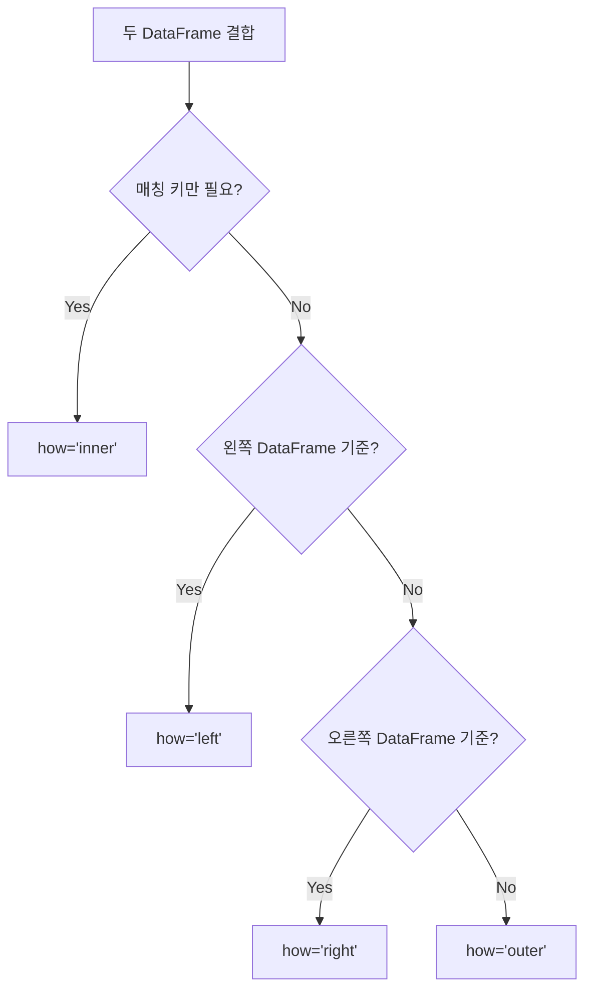

## 정의

**`pandas.merge(left, right, ...)`** 는 두 DataFrame 을 **SQL join 처럼** 결합. 4 가지 join 타입 (inner / left / right / outer) 지원.

## 사용 상황

- **두 테이블 키 기반 결합**: users + orders 테이블을 `user_id` 로 병합
- **다중 키 결합**: `['region', 'date']` 같은 복합 키로 결합
- **데이터 보강**: 기본 DataFrame 에 코드 테이블, 마스터 테이블 붙이기
- **join 타입 선택**: left (기준 유지), inner (교집합), outer (합집합)

## join 타입 선택 시각화



## 4 가지 join 타입

| how | 설명 | SQL |
|:---|:---|:---|
| `inner` (기본) | 양쪽 모두 있는 키만 | INNER JOIN |
| `left` | 왼쪽 모두 + 오른쪽 매칭 | LEFT JOIN |
| `right` | 오른쪽 모두 + 왼쪽 매칭 | RIGHT JOIN |
| `outer` | 양쪽 합집합, NaN 채움 | FULL OUTER JOIN |
| `cross` | 모든 조합 | CROSS JOIN |

## 기본

```anim:pandas-merge-types
{}
```

<CodeWithOutput
  language="python"
  outputLanguage="text"
  code={`import pandas as pd
users = pd.DataFrame({'id': [1, 2, 3], 'name': ['Alice', 'Bob', 'Charlie']})
orders = pd.DataFrame({'user_id': [1, 1, 2, 4], 'amount': [100, 200, 150, 50]})

inner = pd.merge(users, orders, left_on='id', right_on='user_id', how='inner')
print(inner)`}
  output={`   id   name  user_id  amount
0   1  Alice        1     100
1   1  Alice        1     200
2   2    Bob        2     150`}
/>

|   | id | name  | user_id | amount |
|---|----|-------|---------|--------|
| 0 | 1  | Alice | 1       | 100    |
| 1 | 1  | Alice | 1       | 200    |
| 2 | 2  | Bob   | 2       | 150    |

users 3 명 중 Alice (id=1, 주문 2개), Bob (id=2, 주문 1개) 만 매칭. Charlie 와 orders 의 user_id=4 는 제외.

## left join

```python
pd.merge(users, orders, left_on='id', right_on='user_id', how='left')
# Charlie 도 포함, amount 는 NaN
```

## outer join + indicator

```python
pd.merge(a, b, on='key', how='outer', indicator=True)
# _merge 컬럼이 추가됨: left_only, right_only, both
```

매칭 여부를 시각화하기에 유용.

## on / left_on, right_on / left_index, right_index

```python
pd.merge(a, b, on='id')                            # 양쪽 컬럼 이름 같을 때
pd.merge(a, b, left_on='id', right_on='uid')       # 다른 이름
pd.merge(a, b, left_index=True, right_index=True)  # index 기반
pd.merge(a, b, left_on='id', right_index=True)     # 혼합
```

## 다중 키

```python
pd.merge(a, b, on=['region', 'date'])
pd.merge(a, b, left_on=['region', 'date'], right_on=['reg', 'dt'])
```

## suffixes

같은 이름의 컬럼이 양쪽에 있으면 suffix 가 붙는다.

```python
pd.merge(a, b, on='id')
# 양쪽에 'name' 있으면 -> name_x, name_y
pd.merge(a, b, on='id', suffixes=('_a', '_b'))
# -> name_a, name_b
```

## validate (1:1, 1:m, m:1, m:m 검증)

```python
pd.merge(a, b, on='id', validate='one_to_one')
pd.merge(a, b, on='id', validate='many_to_one')
# 가정이 깨지면 MergeError
```

데이터 가정을 명시적으로 검증, 디버깅에 매우 유용. 실무에서 `validate` 를 항상 붙이는 습관을 들이면 데이터 품질 버그를 조기에 잡을 수 있다.

## 실전 패턴

### 코드 테이블 보강

```python
import pandas as pd

# 트랜잭션 데이터에 상품 마스터 붙이기
txn = pd.DataFrame({
    'product_code': ['P001', 'P002', 'P001', 'P003'],
    'amount': [100, 200, 150, 300],
})
products = pd.DataFrame({
    'code': ['P001', 'P002', 'P003'],
    'name': ['Widget', 'Gadget', 'Doohickey'],
    'category': ['A', 'B', 'A'],
})

enriched = pd.merge(
    txn,
    products,
    left_on='product_code',
    right_on='code',
    how='left',
    validate='many_to_one',
)
```

### outer + indicator 로 누락 탐색

```python
# 어느 쪽에만 있는 키 찾기
merged = pd.merge(
    users, orders,
    left_on='id', right_on='user_id',
    how='outer', indicator=True
)

# 주문이 없는 유저
no_orders = merged[merged['_merge'] == 'left_only']
# 유저 없는 주문 (고아 레코드)
orphan_orders = merged[merged['_merge'] == 'right_only']
```

### 날짜 범위 join (merge_asof)

```python
# 정확한 날짜가 아니라 가장 가까운 날짜로 매핑
pd.merge_asof(
    trades.sort_values('time'),
    quotes.sort_values('time'),
    on='time',
    by='ticker',
    direction='backward',  # 직전 시세
)
```

### 다중 키 + suffix 패턴

```python
# 이번 달 vs 지난 달 비교
this_month = df[df['month'] == '2025-07'].rename(columns={'sales': 'sales_cur'})
last_month = df[df['month'] == '2025-06'].rename(columns={'sales': 'sales_prev'})

comparison = pd.merge(
    this_month[['region', 'product', 'sales_cur']],
    last_month[['region', 'product', 'sales_prev']],
    on=['region', 'product'],
    how='outer',
)
comparison['growth'] = comparison['sales_cur'] / comparison['sales_prev'] - 1
```

## 성능

| 방법 | 속도 | 비고 |
|:---|:---:|:---|
| `pd.merge()` | 기준 | hash join 기반 |
| `DataFrame.join()` | 빠름 | index 기반, 내부적으로 merge 사용 |
| `pd.merge_asof()` | 빠름 | sort 된 키 필요, 시계열에 특화 |
| 중복 키 많은 outer join | 느림 | 결과 크기 폭증 주의 |

```python
# 대용량에서 dtype 맞추면 빠름
users['id'] = users['id'].astype('int32')
orders['user_id'] = orders['user_id'].astype('int32')

# sort 된 키 + merge_asof 는 매우 빠름
pd.merge_asof(a.sort_values('key'), b.sort_values('key'), on='key')
```

## 함정

### 1. 다대다 폭증

```python
# users: id 가 1, 1 (중복)
# orders: user_id 가 1, 1, 1 (중복)
pd.merge(users, orders, ...)
# 2 x 3 = 6 행 생성, 의도 아닐 가능성

# 해법: validate 로 사전 검증
pd.merge(users, orders, ..., validate='many_to_one')  # MergeError 로 경고
```

### 2. dtype 불일치

```python
users['id']        # int64
orders['user_id']  # object (문자열로 저장됨)
pd.merge(...)      # 매칭 안 됨!

# 해법
orders['user_id'] = orders['user_id'].astype('int64')
```

### 3. NaN 끼리 매칭 안 됨

```python
# 양쪽에 NaN key 가 있어도 매칭 안 됨: NaN != NaN
# 필요하면 fillna 후 merge
a['key'] = a['key'].fillna('UNKNOWN')
b['key'] = b['key'].fillna('UNKNOWN')
pd.merge(a, b, on='key')
```

### 4. 결과에 불필요한 컬럼 잔류

```python
pd.merge(a, b, left_on='id', right_on='user_id')
# 결과에 'id' 와 'user_id' 가 모두 남음
# 원하면 merge 후 drop
merged = pd.merge(...).drop(columns=['user_id'])
```

> [!CAUTION]
> `validate` 없이 merge 하면 다대다 폭증이 조용히 발생한다. 특히 ETL 파이프라인에서 중복 데이터가 대량 생성될 수 있다. 항상 `validate` 를 붙이는 습관을 들여라.

## merge vs join vs concat

| 동작 | 함수 |
|:---|:---|
| key 기반 결합 | `merge` |
| index 기반 결합 (간편 버전) | `DataFrame.join` |
| 단순 위/옆 붙이기 | `concat` |

## 관련 위키

- [[Pandas join]]
- [[Pandas concat]]
- [[Pandas DataFrame]]
- [[Pandas merge_asof]]
- [[Pandas Boolean Indexing]]
