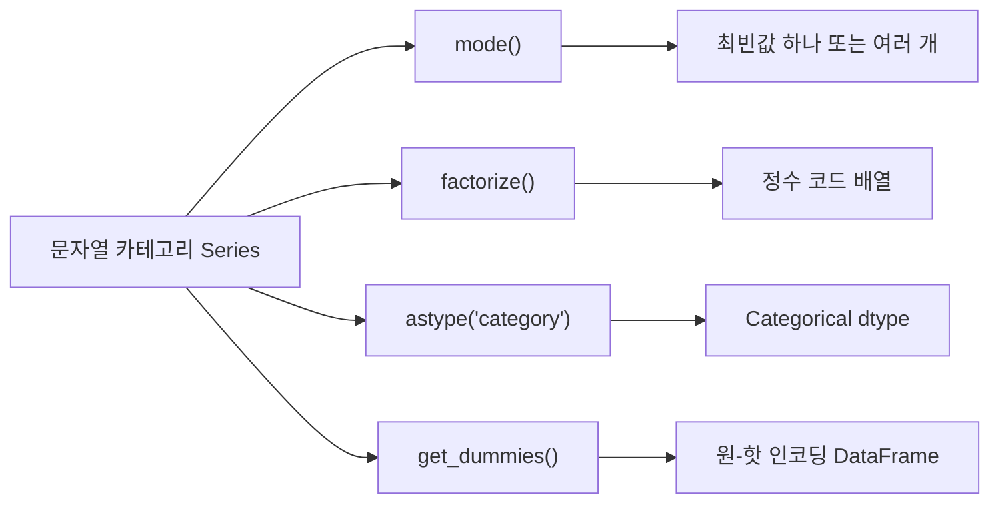
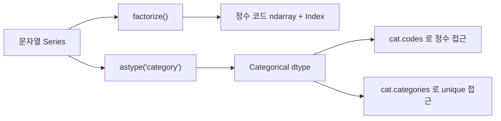

## 정의

- **`mode()`** : 가장 빈번한 값 (최빈값) 반환. 탐색, 결측치 채우기, 통계에 사용.
- **`factorize()`** : 고유값을 정수 코드로 변환. ML 전처리의 label encoding.

## 사용 상황

| 함수 | 주요 사용 | 반환 |
|:---|:---|:---|
| `Series.mode()` | 최빈값 찾기, 범주형 결측치 채우기 | `Series` (동률 시 여러 값) |
| `DataFrame.mode()` | 각 컬럼의 최빈값 | `DataFrame` |
| `pd.factorize(s)` | 문자열 카테고리 정수 인코딩 | `(codes, uniques)` 튜플 |

## 카테고리 처리 전략 비교



## mode 기본

<CodeWithOutput
  language="python"
  outputLanguage="text"
  code={`import pandas as pd

s = pd.Series(['A', 'B', 'A', 'C', 'B', 'A', 'B'])
print('mode():', s.mode().tolist())
print('첫 번째 최빈값:', s.mode().iloc[0])`}
  output={`mode(): ['A', 'B']
첫 번째 최빈값: A`}
/>

A, B 둘 다 3 번 등장 → 동률, `mode()` 가 둘 다 반환. 하나만 필요하면 `.iloc[0]`.

## mode 가 여러 값을 반환하는 이유

`mode()` 는 최빈값이 여러 개면 모두 포함한 `Series` 를 반환한다. 단 하나인 경우도 `Series`. 인덱스는 0, 1, 2 ... 순서.

```python
s.mode()             # Series (0개~여러 개)
s.mode().iloc[0]     # 첫 번째 최빈값 (가장 자주 쓰임)
s.mode().tolist()    # 리스트로
```

## DataFrame.mode (컬럼별)

<CodeWithOutput
  language="python"
  outputLanguage="text"
  code={`import pandas as pd
import numpy as np

df = pd.DataFrame({
    'city': ['Seoul', 'Busan', 'Seoul', 'Daegu'],
    'plan': ['pro', 'basic', 'pro', 'pro'],
})
print(df.mode())`}
  output={`    city plan
0  Seoul  pro`}
/>

각 컬럼별 최빈값. 동률인 컬럼은 행이 여러 개, 나머지 셀은 NaN.

```python
# 각 컬럼의 최빈값만 (동률 없을 때)
modes = df.mode().iloc[0]
```

## groupby + mode (그룹별 최빈값)

```python
# 각 도시에서 가장 흔한 플랜
df.groupby('city')['plan'].agg(lambda x: x.mode().iloc[0])
```

`agg` 에 lambda 로 `mode().iloc[0]` 를 넘기면 각 그룹의 최빈값 하나를 얻는다.

## fillna 와 mode 결합

```python
# 범주형 컬럼의 결측치를 최빈값으로 채우기
fill_value = df['city'].mode().iloc[0]
df['city'] = df['city'].fillna(fill_value)
```

수치형 결측치 처리는 `mean` / `median`, 범주형은 `mode` 가 전형적인 전략.

## factorize 기본

```python
codes, uniques = pd.factorize(s)
```

<CodeWithOutput
  language="python"
  outputLanguage="text"
  code={`import pandas as pd

s = pd.Series(['Seoul', 'Busan', 'Seoul', 'Daegu', 'Busan'])
codes, uniques = pd.factorize(s)
print('codes  :', codes)
print('uniques:', uniques.tolist())

# 역방향: 정수 코드 → 원래 값
print('복원   :', uniques[codes].tolist())`}
  output={`codes  : [0 1 0 2 1]
uniques: ['Seoul', 'Busan', 'Daegu']
복원   : ['Seoul', 'Busan', 'Seoul', 'Daegu', 'Busan']`}
/>

- `codes` : 정수 코드 배열 (numpy ndarray)
- `uniques` : 고유값 배열 (등장 순서, Index 타입)
- `uniques[codes]` 로 원래 값 복원 가능

## factorize sort 옵션

```python
# 기본: 등장 순서로 코드 할당
pd.factorize(s)                  # Seoul=0, Busan=1, Daegu=2

# sort=True: 정렬 후 코드 할당
pd.factorize(s, sort=True)       # Busan=0, Daegu=1, Seoul=2
```

## factorize 와 NaN

```python
import numpy as np

s_with_nan = pd.Series(['A', None, 'B', None, 'A'])
codes, uniques = pd.factorize(s_with_nan)

print('codes  :', codes)             # NaN → -1
print('uniques:', uniques.tolist())  # uniques 에 NaN 없음
```

```
codes  : [ 0 -1  1 -1  0]
uniques: ['A', 'B']
```

`use_na_sentinel=True` (기본): NaN → -1 코드, uniques 에 미포함.
`use_na_sentinel=False`: NaN 도 고유값으로 처리.

## Categorical 과의 관계



```python
s = pd.Series(['Seoul', 'Busan', 'Seoul'])

# factorize 방식
codes, uniques = pd.factorize(s)
print(codes)                          # [0 1 0]

# Categorical 방식
cat = s.astype('category')
print(cat.cat.codes.values)           # [1 0 1] (정렬 순 코드)
print(cat.cat.categories.tolist())    # ['Busan', 'Seoul'] (정렬됨)
```

| 특성 | `factorize()` | `astype('category')` |
|:---|:---|:---|
| 반환 | codes + uniques | Categorical dtype |
| 코드 순서 | 등장 순서 (sort=False 기본) | 알파벳 정렬 |
| 메모리 | ndarray | pandas Categorical (효율적) |
| 역방향 | `uniques[codes]` | `cat.categories[codes]` |
| ML 연동 | 직접 ndarray 전달 | `.cat.codes` 변환 필요 |

## sklearn LabelEncoder 와 비교

```python
from sklearn.preprocessing import LabelEncoder

le = LabelEncoder()
codes_sk = le.fit_transform(df['city'])    # ndarray
original = le.inverse_transform(codes_sk)  # 역변환

# pandas factorize
codes, uniques = pd.factorize(df['city'])
original = uniques[codes]   # 역변환
```

| 기준 | `pd.factorize` | `LabelEncoder` |
|:---|:---|:---|
| 역변환 | `uniques[codes]` | `inverse_transform()` |
| 새 값 처리 | 직접 처리 필요 | 훈련 데이터에 없으면 오류 |
| 경량성 | sklearn 없이 사용 | sklearn 필요 |
| 파이프라인 | pandas 계산에 자연스러움 | sklearn Pipeline 에 자연스러움 |

## 실전 패턴: 다중 컬럼 인코딩

```python
cat_cols = ['city', 'category', 'plan']
code_dict = {}

for col in cat_cols:
    df[f'{col}_code'], code_dict[col] = pd.factorize(df[col])

# 나중에 역변환
for col in cat_cols:
    df[col] = code_dict[col][df[f'{col}_code']]
```

## 실전 패턴: mode 로 EDA 요약

```python
# 각 컬럼의 최빈값 + 빈도 요약
summary = pd.DataFrame({
    'mode': df.mode().iloc[0],
    'mode_count': {col: df[col].value_counts().iloc[0] for col in df.columns},
    'unique': df.nunique(),
})
print(summary)
```

## 함정

### 1. mode 가 항상 1 개라는 착각

```python
s = pd.Series([1, 2, 1, 2])
s.mode()          # [1, 2] (두 개)
s.mode()[0]       # 1 (구식, 정수 인덱스 0)
s.mode().iloc[0]  # ✓ 위치 기반 (명확)
```

### 2. factorize codes 가 numpy ndarray

```python
codes, _ = pd.factorize(s)
type(codes)       # numpy.ndarray (pandas Series 아님)
pd.Series(codes)  # Series 로 변환해서 사용
```

### 3. factorize NaN 처리 혼동

```python
codes, uniques = pd.factorize(s)
# NaN 은 -1 코드, uniques 에는 없음
# uniques[-1] 은 마지막 원소 → 의도치 않은 역변환 오류
# 사전에 dropna 또는 use_na_sentinel=False 로 처리
```

### 4. sort=True 로 인한 코드 변경

```python
codes1, _ = pd.factorize(s)                # 등장 순 코드
codes2, _ = pd.factorize(s, sort=True)     # 알파벳 순 코드
# 두 결과가 다름 → 저장 후 복원 시 sort 옵션 일치 필요
```

### 5. DataFrame.mode 의 NaN 셀

```python
df.mode()
# 동률이 없는 컬럼은 행 0 에만 값, 나머지 행은 NaN
# 컬럼마다 행 수가 다를 수 있음
```

## 관련 위키

- [[Pandas value_counts]]
- [[Pandas Categorical]]
- [[Pandas unique / nunique]]
- [[Pandas get_dummies]]
- [[Pandas apply / map]]
- [[Pandas dropna / fillna]]
- [[Pandas replace / astype]]
